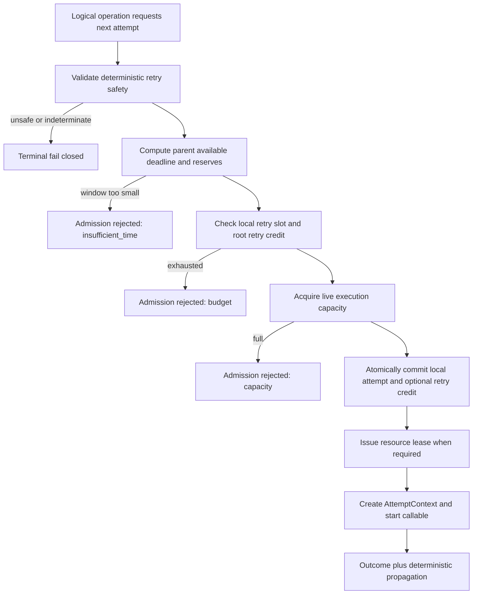

# 阶段 22：Attempt 作用域、重试预算与 Deadline Admission 收敛 PRD

> Document status: READY_FOR_OPENSPEC
>
> Implementation status: NOT_STARTED
>
> Version: v1.0
>
> Priority: P1（执行边界、预算语义与超时正确性）
>
> Scope: `framework/shared/attempts.py`、Workflow / Tool / Parallel / Worker 的 attempt 调用链及其 policy/spec
>
> Baseline OpenSpec: `attempt-execution-integrity-hardening`（`16/16`，已实现、待归档）
>
> Baseline implementation: `e6cad121 Harden nested attempt execution integrity`
>
> Proposed OpenSpec change: `attempt-scope-deadline-admission`
>
> Last updated: 2026-08-04

## 0. 一句话结论

保留父子执行共享的 **Workflow hard deadline、全局 retry 上限和 live execution capacity**，但废除“父 Step、子 Tool、Parallel branch 和 Worker 共用一个 `AttemptBudget`，并把同一个数字继续当作 attempt 序号或 fencing token”的语义。

目标模型必须拆成：

```text
root hard deadline                     全局、向下收窄、子级不可延长
root retry-credit ledger               全局保险上限，只统计 retry
local retry budget                     每个 logical operation 独立计数
logical operation identity             同一逻辑调用重试时稳定，siblings 互不相同
physical attempt identity              每次实际启动唯一，局部 attempt_no 独立
resource-issued write lease            仅由受保护资源签发，不来自预算计数
deadline admission                     明知剩余时间不足时不启动、不耗预算、不抢 lease
```

最终要实现的不是“给 Tool 完整 5 秒”或“无条件在 2 秒切断”二选一，而是：

```text
Workflow 剩余 2 秒
Tool timeout 5 秒
Tool 最小启动窗口 3 秒
取消/验证/提交预留 0.3 秒

可执行窗口 = min(2, 5) - 0.3 = 1.7 秒
1.7 < 3
=> DEADLINE_ADMISSION_REJECTED
=> Tool 不启动，由 Harness 选择 replan / fallback / halt
```

## 1. 背景与当前基线

### 1.1 已完成的安全加固

`attempt-execution-integrity-hardening` 已经关闭以下高风险缺口，本 PRD 必须把这些行为作为不可回退的基线：

1. 外部写入失败只有在明确具备 idempotency 与 reconciliation contract 时才能重试。
2. sibling ToolCall 和 parallel branch 使用不同 logical idempotency key，同一逻辑调用的重试复用同一个 key。
3. `DataBuffer` 自己签发 owner-bound、monotonic write lease，旧 owner 不能提交覆盖新 owner。
4. `AttemptExecutionCapacity` 对仍存活的 supervised thread 设置硬上限。
5. descendant `INDETERMINATE` 会向父级传播，并阻止正常 buffer commit 和 artifact publication。
6. timeout、ordinary failure、capacity exhaustion、budget exhaustion 和 stale owner 已有区分。

这些能力不是本阶段的替换对象。阶段 22 只修正剩余的作用域、计数和 deadline admission 设计。

### 1.2 当前实现中的剩余耦合

| ID | 当前实现 | 证据 | 问题 |
| --- | --- | --- | --- |
| ATT-BASE-01 | `AttemptBudget.claim()` 返回全局 one-based sequence | `framework/shared/attempts.py:70-99` | 一个全局数字同时被理解成预算使用量和 attempt 序号 |
| ATT-BASE-02 | `AttemptSupervisor.run()` 可把 `budget.claim()` 的返回值写入 `AttemptContext.fencing_token` | `framework/shared/attempts.py:320-346` | execution permit 被误命名为 resource fence；调用方容易把本地计数当作所有权证明 |
| ATT-BASE-03 | Step 第一轮可“继承父 permit”，后续 Step retry 再 claim 同一 budget | `framework/workflow/runtime/step_invoker.py:158-200` | Step 的局部 retry 次数取决于子调用是否先消耗全局 budget，局部 policy 不再自洽 |
| ATT-BASE-04 | Tool 直接复用 `parent_context.budget`，第一轮又复用 parent `fencing_token` | `framework/tool/runtime/executor.py:847-895` | Step attempt、Tool attempt 和诊断 token 混为一个轴 |
| ATT-BASE-05 | Step 通过 `step_attempt_limit + nested_limit - 1` 推导一个共享总数 | `framework/workflow/runtime/step_invoker.py:607-633` | 改变 runner 内部嵌套结构会改变外层重试语义，预算配置难以解释和审计 |
| ATT-BASE-06 | child timeout 只执行 `min(local_timeout, parent_remaining)` | `framework/tool/runtime/executor.py:1020-1031`；`framework/workflow/runtime/step_invoker.py:323-355` | 即使已知任务不可能在剩余时间内完成，仍会启动后再切断；取消、VERIFY 和 commit 也没有预留窗口 |
| ATT-BASE-07 | budget claim 可能早于 execution capacity admission 或真正启动 | `framework/shared/attempts.py:334-346,417-430` | capacity 拒绝等“未启动”结果也可能消耗预算；Step 还可能在启动前签发新 write lease |

### 1.3 为什么这是产品问题，不只是命名问题

当前逻辑虽然能保证“总次数不无限增长”，但会产生四种用户可见的不确定性：

1. Workflow author 无法仅通过 Step 的 `max_attempts` 判断 Step 实际能重试几次，因为 Tool/branch 会抢同一个计数器。
2. Tool author 看到 `max_attempts=2`，也无法判断第二次是否可用，因为父级可能已经用完共享 budget。
3. operator 看到 `fencing_token=2`，无法判断它代表 Step lease、Tool attempt、budget generation 还是外部资源 fence。
4. Harness 明知剩余窗口短于任务声明的最小可执行窗口，仍会产生一次注定超时的真实调用，增加成本和不确定副作用。

因此本阶段必须把“共享硬上限”与“局部执行语义”分离，而不是仅重命名字段。

## 2. 用户、角色与关键场景

### 2.1 目标角色

| 角色 | 需要的结果 |
| --- | --- |
| Workflow author | Step retry、Tool retry 和全局 retry ceiling 的含义可分别声明、分别审计 |
| Tool author | 能声明单次 timeout、局部 max attempts、最小启动窗口和副作用安全 contract |
| Harness maintainer | 能在不依赖 LLM 判断的情况下完成 deadline admission、retry authorization 和 halt/replan |
| Operator / reviewer | 能从 event 中区分“未启动”“执行失败”“确认超时”“未确认终止”“副作用不确定” |
| Durable adapter owner | 只接受本资源签发的 lease/fence，不接受 runtime 自增序号冒充资源所有权 |

### 2.2 核心场景

1. **时间充足**：Workflow 剩余 8 秒，Tool timeout 5 秒，最小启动窗口 3 秒，预留 0.3 秒；Tool 获得 5 秒以内的有效窗口并正常执行。
2. **时间不足**：Workflow 剩余 2 秒，Tool 最小启动窗口 3 秒；admission 在启动前拒绝，executor 调用次数、retry credit 消耗、capacity 占用和 write lease 签发次数都为 0。
3. **Tool 局部重试**：Step attempt 仍为 1，Tool 从 local attempt 1 进入 local attempt 2；只消耗 Tool local retry slot 和一个 root retry credit，不改变 Step attempt_no。
4. **Step 局部重试**：Tool 已经安全结束后 Step 进入 local attempt 2；只消耗 Step local retry slot 和一个 root retry credit，不继承 Tool attempt_no。
5. **全局 retry ceiling 先耗尽**：某个 Tool 使用最后一个 root retry credit；其他局部 budget 即使仍有余量，也不能启动新的 retry，但其 local max/used 诊断保持真实。
6. **capacity 已满**：admission 返回 capacity rejection；不得消耗 local retry slot、root retry credit或签发新的 DataBuffer lease。
7. **外部写入不确定**：即使 local/global retry 仍有余量，缺少 reconciliation contract 时仍终止为 `INDETERMINATE`，不能用“还有预算”覆盖安全规则。

## 3. 产品目标与成功指标

### 3.1 产品目标

- **G1 作用域清晰**：Workflow、Step、branch、ToolCall、Tool attempt 和 worker lease 各有独立身份与局部 attempt_no。
- **G2 双层约束**：每次 retry 必须同时满足本 logical operation 的 local retry policy 和 root retry-credit ceiling。
- **G3 Deadline 不可扩张**：child effective deadline 永远不晚于 parent 可用 deadline；任何 child 不得通过嵌套重新获得完整 timeout。
- **G4 启动前判定**：声明了最小启动窗口的 operation，在时间不足时必须不启动，而不是先调用后切断。
- **G5 身份与所有权分离**：budget sequence、attempt_no、attempt_id、idempotency key 和 resource write lease 不得互相替代。
- **G6 Fail closed**：`INDETERMINATE`、unsafe external write、capacity exhaustion、budget exhaustion 和 parent cancellation 保持不可重试优先级。
- **G7 可回放可审计**：admission、budget claim、attempt start、timeout、termination confirmation 和 commit 都有稳定 reason code 与 durable event projection。

### 3.2 可量化成功指标

| 指标 | 目标 |
| --- | --- |
| `DEADLINE_ADMISSION_REJECTED` 后实际 callable 启动次数 | `0` |
| admission/capacity rejection 后 local budget、root credit、write lease 增量 | `0` |
| child effective deadline 晚于 parent available deadline 的次数 | `0` |
| Tool retry 导致 Step local attempt_no 增长的次数 | `0` |
| Step retry 导致 Tool local attempt_no 继承 Step 序号的次数 | `0` |
| 一个 execution 中已启动 retry 数超过 root ceiling 的次数 | `0` |
| generic attempt 把 budget sequence 作为 resource fencing proof 的路径 | `0` |
| unsafe external-write failure 自动重试次数 | `0` |
| indeterminate descendant 后 normal commit/publication 次数 | `0` |

## 4. 范围与非目标

### 4.1 本阶段范围

- 重构 `framework/shared/attempts.py` 的 root execution limits、local retry budget、attempt identity 和 admission contract。
- 为 Workflow Step、Parallel branch、ToolCall、ToolBatch child 和 Worker handler 建立明确 logical-operation scope。
- 在 `TimeoutPolicySpec`、Tool definition/policy 和 outer execution metadata 中加入 typed deadline-admission 配置。
- 删除 `_step_total_attempt_limit()`、`inherits_parent_permit`、`claim_budget` 和“继承 parent fencing token”这类兼具多种语义的路径。
- 调整 `DataBuffer.begin_attempt()` 的调用顺序：只有 admission 成功且真正准备启动的 Step attempt 才能申请 write lease。
- 增加稳定的 admission/budget/capacity/outcome events、metrics 和 replay fields。
- 提供旧 durable history 的只读 schema migration；新 live execution 不继续产生旧歧义字段。

### 4.2 非目标

- 不允许 child 自动延长 Workflow hard deadline；需要更多时间必须由 Harness 发起新的受控 run/replan，并记录新 identity。
- 不使用 LLM 预测 operation 耗时或决定是否启动；`min_start_window_seconds` 必须来自 typed policy、Tool definition 或确定性统计配置。
- 不强制终止 Python thread；继续使用 cooperative cancellation 和 bounded live capacity。
- 不为任意外部 API 承诺 exactly-once；外部写入仍依赖 idempotency key、reconciliation 和资源原生 fence。
- 不替换 Harness `PLAN -> EXECUTE -> VERIFY`、TaskPlan、quality gate、side-effect authority 或 artifact integrity owner。
- 不把正常首次 ToolCall 数量交给 retry ledger 管理；首次调用数量继续由 Workflow/TaskPlan/tool-call/resource budget 约束。
- 不新增 UI、运维控制台或人工 deadline 编辑接口。

## 5. 领域模型与术语

### 5.1 `LogicalOperation`

一次业务语义稳定的操作，例如：

```text
worker task: task-123
workflow step: analyze-paper
parallel branch: fetch-source-arxiv
tool call: web.fetch / call_id=call-7
```

同一 logical operation 的 retry 必须保持同一个 hierarchical `idempotency_key`；不同 sibling 必须具有不同 key。

### 5.2 `LocalRetryBudget`

每个 logical operation 自己拥有的局部重试约束：

```text
max_attempts = 2
local_attempt_no = 1..2
```

它只回答“这个 operation 自己最多执行几次”，不回答整个 Workflow 还允许多少次 retry。

### 5.3 `RetryCreditLedger`

root execution 共享的全局 retry 保险上限：

```text
max_total_retries = N
used_retries = M
remaining_retries = N - M
```

计数规则：

- 每个 logical operation 的第一次实际执行不消耗 retry credit。
- `local_attempt_no > 1` 的每次实际启动消耗一个 retry credit。
- admission rejected、capacity rejected、policy blocked 和 parent-cancelled-before-start 不消耗 credit。
- credit 只限制 retry，不替代 Tool call、worker call、parallelism、token、cost 或 artifact budget。

### 5.4 `AttemptIdentity`

每次真正启动的 physical attempt 至少包含：

```text
operation_id           # hierarchical logical identity
idempotency_key        # logical operation 重试时稳定
attempt_id             # physical attempt 唯一 UUID
local_attempt_no       # 只在本 logical operation 内递增
parent_attempt_id      # 因果关系，可空
retry_credit_id        # 仅 retry 时存在，opaque diagnostic id
```

`retry_credit_id` 不得命名或暴露为 `fencing_token`。

### 5.5 `ResourceWriteLease`

write lease 只属于被保护的资源：

```text
resource_id
lease_generation
owner_attempt_id
```

当前 `DataBuffer.begin_attempt(step_id, owner_id=...)` 的 monotonic owner-bound 语义保留。generic `AttemptContext` 不再生成或携带可被解释为 DataBuffer / database / remote API 所有权的 `fencing_token`。

### 5.6 `DeadlineAdmissionPolicy`

每个 operation 可以声明：

```text
timeout_seconds
min_start_window_seconds
cancellation_grace_seconds
completion_reserve_seconds
```

root execution 另外声明：

```text
hard_deadline
verify_reserve_seconds
commit_reserve_seconds
```

所有 deadline 计算必须使用 monotonic clock；wall-clock timestamp 只用于 telemetry 展示。

## 6. 系统不变量

1. **先 admission，后启动**：未通过 deadline、capacity、local retry 和 root retry gate 时，不创建 attempt thread。
2. **先 admission，后 lease**：未确定启动的 Step 不得替换当前 DataBuffer owner。
3. **局部编号不跨 scope**：Step attempt 2 与 Tool attempt 2 没有共享序号含义。
4. **全局只限制 retry 总量**：root ledger 不充当 local max attempts，也不生成 resource fence。
5. **deadline 只收窄**：`child_deadline <= parent_available_deadline <= root_hard_deadline`。
6. **预留必须在 hard deadline 内**：cancellation grace、parent VERIFY 和 commit 不能作为 deadline 之后的额外赠送时间。
7. **预算不能授权不安全 retry**：idempotency/reconciliation、termination confirmation 和 side-effect class 的安全 gate 优先于预算余量。
8. **未启动不是失败 attempt**：admission rejection 有 durable decision，但没有 `AttemptContext`、attempt_id、local attempt 增量或 retry credit 消耗。
9. **不确定结果向上传播**：任何 descendant `INDETERMINATE` 继续阻止父级 normal success、buffer commit 和 artifact publication。
10. **Harness 保持控制权**：LLM、Tool、worker 只能报告候选耗时信息或 outcome，不能决定 deadline extension、retry authorization、routing 或 publication。

## 7. 目标架构

### 7.1 Context 分层

```text
ExecutionContext
├── execution_id
├── hard_deadline
├── RetryCreditLedger(max_total_retries)
├── AttemptExecutionCapacity
├── cancellation
└── descendant determinacy

OperationContext
├── operation_id
├── operation_kind
├── idempotency_key
├── LocalRetryBudget(max_attempts)
├── DeadlineAdmissionPolicy
└── parent ExecutionContext / AttemptContext

AttemptContext
├── attempt_id
├── local_attempt_no
├── effective_deadline
├── parent_attempt_id
├── cancellation
└── optional retry_credit_id

ResourceWriteLease
├── resource_id
├── lease_generation
└── owner_attempt_id
```

允许实现使用等价命名，但不得重新把这些职责合并到一个可变整数或一个 `fencing_token` 字段。

### 7.2 Admission 顺序



如果 F 或 G 失败，必须释放已经取得的 capacity，且不得留下部分 budget claim 或 stale lease。实现需要一个集中式 admission controller 或等价的事务化获取顺序，禁止各调用方自行拼接半套逻辑。

### 7.3 Deadline 计算

对于 child operation：

```text
parent_available_until = parent_effective_deadline
                       - parent_completion_reserve

requested_until = now + child.timeout_seconds
effective_until = min(parent_available_until, requested_until)

execution_window = effective_until
                 - now
                 - child.cancellation_grace_seconds

admit when execution_window >= child.min_start_window_seconds
```

root Workflow 还必须为 deterministic VERIFY 与 final commit 预留时间。没有 local timeout 时使用 parent available window，但仍必须扣除相关 reserve。

## 8. 详细功能需求

### ATT-001：Root execution limits 与 local retry policy 分离

- 新增 root-scoped `RetryCreditLedger` 或等价 primitive，替代 `AttemptBudget` 的“所有层共享 local attempt”语义。
- 每个 Step、branch、ToolCall、ToolBatch child 和 standalone worker operation 都创建自己的 `LocalRetryBudget`。
- local `max_attempts` 决定该 operation 的 attempt_no 上限；root `max_total_retries` 决定整个 execution 最多能启动多少次 retry。
- 删除第一轮 child “继承 parent permit”的特例。
- 删除 `_step_total_attempt_limit()` 对嵌套 runner 次数的隐式求和。

**验收**：Tool attempt 2 不改变 Step local attempt_no；root credit 用尽后 Step 与其他 Tool 的 retry 都被拒绝，但各自 local used/remaining 仍准确。

### ATT-002：Attempt identity 不再携带 generic fencing authority

- `AttemptContext` 使用 `local_attempt_no`、`attempt_id` 和 optional `retry_credit_id` 表达执行身份。
- 删除或停止产生 generic `fencing_token`；Tool timeout/error envelope 使用 `attempt_id`、`local_attempt_no`、`idempotency_key` 和 determinacy 字段。
- `DataBuffer` lease generation 只出现在 resource-specific write/commit telemetry 中。
- durable database、queue lease 或 external sink 如需 fence，必须由相应 adapter/store 签发并验证。

**验收**：搜索生产代码不存在 `budget.claim() -> fencing_token`、`parent_context.fencing_token -> child` 或 caller-supplied DataBuffer generation 路径。

### ATT-003：Deadline admission 在任何副作用前执行

- `AttemptSupervisor` 或集中 admission service 必须在 thread start、executor call、Tool transport、DataBuffer lease 和 artifact preparation 前完成 admission。
- admission 输入至少包含 parent remaining、local timeout、minimum start window、cancellation grace 和 parent completion reserve。
- 时间不足返回稳定 code `attempt_deadline_admission_rejected`，不得伪装成运行后 timeout。
- rejection 必须带结构化、安全、可观测的计算明细，不包含 Tool arguments、secrets 或未 redacted payload。

**验收**：2 秒剩余、3 秒 minimum window 的测试中 callable、transport、capacity、budget、lease 和 publication 均为零调用。

### ATT-004：Hard deadline 包含取消、VERIFY 与 commit

- child effective execution deadline 必须扣除 cancellation grace。
- Step 调用 child 时必须保留 Step runner completion、deterministic VERIFY 和 DataBuffer commit 所需窗口。
- Workflow root 必须保留 terminal VERIFY、durable event/outcome 和 final commit 所需窗口。
- parent cancellation 发生后不得再 admission 新 child；已经运行的 child 进入 cooperative cancellation。

**验收**：fake monotonic clock 覆盖多层嵌套；任何正常 success/commit timestamp 不晚于 root hard deadline，且 cancellation grace 不使总运行时间静默超限。

### ATT-005：Typed policy 与 fail-closed validation

- `TimeoutPolicySpec` 增加 `min_start_window_seconds`，非负且不得大于显式 `timeout_seconds`。
- ToolDefinition/ToolPolicy 提供同名 first-class typed 字段，不把核心 admission 规则长期藏在 `metadata`。
- outer Workflow/Worker execution policy 增加 `max_total_retries`、`verify_reserve_seconds`、`commit_reserve_seconds` 和默认 cancellation grace。
- 存在 nested retry policy 时，root total retry policy 必须明确或由 spec compiler 产生固定、可审计值；运行中不得扩张。
- 非数字、负数、NaN、infinity、互相冲突或超出 hard deadline 的配置在执行前 fail closed。

**验收**：invalid policy 不产生 event stream 之外的 runtime side effect；序列化/反序列化 round-trip 保持字段和值。

### ATT-006：Admission claim 必须原子且不产生幽灵消耗

- capacity rejection 不消耗 local attempt slot 或 root retry credit。
- budget rejection 不占用 live execution capacity。
- lease 签发失败必须释放 capacity 并回滚尚未开始的 budget reservation。
- 同一个 logical operation 的并发 admission 必须保证 local attempt_no 唯一、有序且不超过 max attempts。
- root retry credit 的并发 claim 必须保证总成功数不超过 ceiling。

**验收**：barrier-based concurrency tests 在高并发下无重复 local attempt_no、无超发 credit、无 semaphore leak、无未启动 lease 覆盖。

### ATT-007：Workflow / Parallel / Tool / Worker 集成一致

- `StepInvoker` 为 Step 建立 local retry scope，并在 admission 后申请 `DataBuffer` lease。
- Parallel branch 每个 branch 有独立 operation key 和 local budget；branch retry 只消耗本 branch slot 与 root retry credit。
- ToolCall 每个 `call_id` 有独立 operation scope；ToolBatch siblings 不共享 local attempt_no 或 idempotency key。
- Worker lease/fencing identity 继续来自 queue/storage owner，不得被 execution retry credit 替代。
- standalone Tool/timeout runner 没有 parent 时，可以从其 local policy 建立 root execution limits；不得依赖隐式无限 budget。

**验收**：同一测试矩阵覆盖 direct Tool、Workflow Tool、ToolBatch、parallel branch、Worker nested Tool 和 standalone timeout helper。

### ATT-008：Retry safety 与 determinacy 优先于预算

- 保留 `NONE` / `READ_ONLY`、idempotent write、external write reconciliation 和 `no_effect_error_types` 的现有安全判定。
- `INDETERMINATE`、unconfirmed termination 或 unsafe external write 即使还有 local/global budget，也不得 admission retry。
- 对明确 pre-effect failure，可以保留原 error type；是否 retry 仍需同时满足 local policy、root credit、deadline 和 capacity。
- parent success path 必须在 commit/publication 前再次检查 descendant determinacy。

**验收**：现有 adversarial side-effect、late write、parallel publication 和 non-cooperative timeout tests 全部保持绿色。

### ATT-009：稳定 outcome 与 telemetry

admission 与 execution 必须分开记录：

| 类型 | 稳定 code / state | 是否真正启动 | 是否消耗 retry credit |
| --- | --- | --- | --- |
| parent 已取消 | `attempt_parent_cancelled_before_start` | 否 | 否 |
| 时间窗口不足 | `attempt_deadline_admission_rejected` | 否 | 否 |
| local budget 用尽 | `attempt_local_retry_exhausted` | 否 | 否 |
| root credit 用尽 | `attempt_global_retry_exhausted` | 否 | 否 |
| capacity 已满 | `attempt_capacity_exhausted` | 否 | 否 |
| 执行失败且确认无副作用 | `FAILED` | 是 | 仅 retry attempt 消耗 |
| 超时且确认停止 | `TIMED_OUT` + `termination_confirmed=true` | 是 | 仅 retry attempt 消耗 |
| 终止或副作用未知 | `INDETERMINATE` | 是 | 仅 retry attempt 消耗 |
| 成功 | `SUCCEEDED` | 是 | 仅 retry attempt 消耗 |

事件至少包含：`execution_id`、`operation_id`、`operation_kind`、`attempt_id`（仅已启动）、`local_attempt_no`（仅已启动）、`idempotency_key`、deadline calculation、local/root budget snapshot、reason code、termination confirmation 和 determinacy。

### ATT-010：Replay 与 schema migration

- 先归档 `attempt-execution-integrity-hardening`，把已实现安全不变量提升到 main spec。
- 新 change 必须修改原 `attempt-execution-integrity` capability 中“所有层共享一个 `AttemptBudget`”的 requirement，而不是并列保留两套冲突规范。
- 新增 `attempt-deadline-admission` capability 或在同一 capability 中增加 admission requirements；不得把 admission 只写在 design 而无可测试 scenario。
- 历史 event/error 中的 `fencing_token` 只允许通过 versioned read-only decoder 解释；新 live event 不再为 generic attempt 产生该字段。
- legacy `max_total_attempts` 不得静默映射为新语义。迁移工具或 spec compiler 必须显式生成 `max_total_retries`；历史 replay 只读旧值，不据此重新执行 live side effect。
- 兼容读取期限与删除条件必须写入 OpenSpec tasks，不能形成永久 dual-write。

**验收**：old history replay 不调用 live worker/Tool/effect；new history 不含歧义 generic fence；strict OpenSpec 不存在相互冲突的 budget requirements。

## 9. 配置合同

目标配置示例：

```yaml
execution_policy:
  max_total_retries: 2
  cancellation_grace_seconds: 0.1
  verify_reserve_seconds: 0.15
  commit_reserve_seconds: 0.15

steps:
  - step_id: analyze
    retry_policy:
      max_attempts: 2
    timeout_policy:
      timeout_seconds: 5
      min_start_window_seconds: 3
      on_timeout: retry
```

Tool contract 示例：

```python
ToolDefinition(
    name="research.fetch",
    timeout_seconds=5.0,
    min_start_window_seconds=3.0,
    max_attempts=2,
    side_effect="read_only",
)
```

对于 external write：

```python
ToolDefinition(
    name="artifact.publish",
    timeout_seconds=5.0,
    min_start_window_seconds=1.0,
    max_attempts=2,
    side_effect="external_write",
    metadata={
        "idempotent": True,
        "reconciliation_supported": True,
    },
)
```

后续实现可以把 idempotency/reconciliation 也提升为 typed fields，但不得在本阶段削弱既有 fail-closed 行为。

## 10. 迁移策略

### Phase 0：冻结并归档基线

1. 对 `attempt-execution-integrity-hardening` 运行 strict validation 和目标测试。
2. 归档该 completed change，将 capability 同步到 `openspec/specs/`。
3. 锁定当前 side-effect、idempotency、fencing、capacity 和 publication regression tests，作为不得回退的基线。

### Phase 1：OpenSpec proposal

创建 `attempt-scope-deadline-admission`：

- proposal：说明共享 local budget 与 deadline admission 缺失的业务风险。
- design：确定 context 分层、retry credit 计数规则、admission 原子顺序和 schema migration。
- specs：修改 `attempt-execution-integrity`，新增 deadline admission scenarios。
- tasks：按 shared primitives -> Workflow -> Tool -> Parallel/Batch -> Worker -> migration -> broad verification 排序。

### Phase 2：Shared primitives

- 引入 root retry ledger、local retry budget、operation identity、deadline planner 和 admission result。
- 保留 bounded capacity 与 determinacy propagation。
- 先用 unit tests 固定无幽灵 budget、无 capacity leak 和 deadline arithmetic。

### Phase 3：调用链迁移

- 迁移 `StepInvoker`，删除 implicit total-attempt calculation 和 inherited permit。
- 迁移 Tool executor/timeout/MCP adapter、ToolBatch、Parallel branch。
- 迁移 Worker context，保持 queue lease/fence owner 不变。
- admission 成功前不得申请 DataBuffer lease或创建 child thread。

### Phase 4：Schema 与 replay

- 新 event schema 写入 scope-aware identity 和 admission details。
- 提供旧 event 的只读 decoder 和 migration fixtures。
- 禁止 live dual-write；达到删除门后移除旧 runtime field/adapter。

### Phase 5：发布与清理

- 删除 `AttemptBudget` 的旧共享 local-retry语义、`claim_budget`、parent permit inheritance 和 generic fence 传播。
- 更新模块卡与 attempt runtime 图，但学习资料不得先于实现宣称新机制已经落地。
- 完成 focused、framework、compile、smoke 和 strict OpenSpec gate 后提交。

## 11. 测试与验收矩阵

### 11.1 Shared primitives

- root credit 与两个 local budgets 并发 claim，不串号、不超发。
- admission rejection 不创建 `AttemptContext`，不消耗 counter，不占 capacity。
- capacity acquire 后后续 claim 失败会完整释放。
- monotonic clock 前进、parent deadline 收窄、reserve 扣除和边界等于场景。
- NaN、infinity、负数和互相冲突 policy 全部 fail closed。

### 11.2 Workflow / Tool

- Step max attempts 2、Tool max attempts 2、root max retries 1：Tool retry 后 Step retry被全局 gate 阻止，但两个 local counters 独立。
- Tool 不重试时，Step 可以使用 root credit 进入 Step attempt 2。
- 2 秒剩余、3 秒 minimum window：Tool callable 为 0 次。
- 时间窗口足够：child timeout 为收窄后的值，且为 parent VERIFY/commit 留出空间。
- admission rejected 不替换当前 DataBuffer owner；旧合法 owner 仍可按既有规则完成或被明确取消。

### 11.3 Parallel / Batch / Worker

- sibling branch 与 ToolBatch child 拥有独立 local attempt_no 和 idempotency key。
- 任一 sibling 使用 root retry credit 后，其他 sibling 只能依据剩余 credit admission。
- Worker queue fencing token 不进入 child execution identity；child 也不能伪造 queue lease owner。
- parent cancellation 后不启动新 branch/Tool child。

### 11.4 不确定结果与副作用

- external write ordinary failure 无 contract：一次调用后 `INDETERMINATE`，即使预算充足也不重试。
- idempotent + reconcilable write：允许在 local/root/deadline/capacity 全部通过时重试，idempotency key 保持稳定。
- non-cooperative timeout 占用 capacity 直到真实退出；新 admission fail closed 且不消耗 retry credit。
- indeterminate branch/Tool 后 buffer、artifact 和 normal success 全部为 0。

### 11.5 目标命令

```powershell
.\.venv\Scripts\python.exe -m pytest `
  tests\framework\shared\test_attempt_execution_integrity.py `
  tests\framework\workflow\runtime\test_attempt_isolation.py `
  tests\framework\tool\runtime\test_tool_attempt_safety.py -q

python -m scripts.dev compile
python -m scripts.dev smoke
openspec validate attempt-scope-deadline-admission --strict
```

在 implementation change 提交前，还必须运行 `git diff --check`，并复核所有 `AttemptBudget`、`fencing_token`、`max_total_attempts` 和 `_bounded_timeout` live caller。

## 12. 风险与取舍

| 风险 | 取舍与缓解 |
| --- | --- |
| 配置项增加，Workflow author 认知成本上升 | 使用 typed defaults、schema validation 和清晰的 local/global 命名；禁止隐式嵌套求和 |
| `min_start_window_seconds` 配置过大导致过早拒绝 | 允许按 Tool/Step 通过确定性运行数据调整，但不得由单次 LLM 猜测动态放宽 |
| 配置过小仍会在执行中 timeout | timeout + cooperative cancellation + determinacy 规则继续兜底；admission 不是成功保证 |
| root retry credit 被一个 child 用尽 | 这是显式全局 policy 的预期结果；events 必须显示哪个 operation 消耗了 credit |
| 移除 generic `fencing_token` 影响历史诊断 | 使用 versioned read-only decoder；resource-specific lease fields 保留真实含义 |
| admission 原子顺序增加并发实现复杂度 | 集中到一个 controller/helper，不允许 Step/Tool/Parallel 各自复制 claim 顺序 |
| hard deadline 预留降低可用于 worker 的时间 | 这是确保 VERIFY、commit 和 cancellation 也受总 deadline 约束的必要成本 |

## 13. 发布、回滚与兼容

### 13.1 发布门

只有同时满足以下条件才能启用新 runtime：

1. strict OpenSpec 通过，且旧 shared-budget requirement 已被明确替换。
2. 所有旧 attempt integrity adversarial tests 通过。
3. 新 admission、scope isolation、root credit 和 migration tests 通过。
4. compile、smoke 和目标 framework tests 通过。
5. 新 event schema 可以 replay 旧 fixture，但 offline replay 不产生 live side effect。
6. 搜索确认没有 generic budget sequence 冒充 resource fence 的生产路径。

### 13.2 回滚

- 代码回滚必须与 spec/event writer 一起回滚，禁止只回滚一半造成同名字段双重语义。
- 已写入的新 schema event 保持可读；旧版本不得据此重新执行 live attempt。
- 如果 admission 误拒绝率异常，可回滚 typed policy/default，但不得恢复 child deadline 扩张或 unsafe retry。

### 13.3 兼容边界

- 公共 Tool/Workflow 业务输出结构保持不变；新增的是 runtime diagnostics 与 policy fields。
- 历史 `fencing_token` 只作 legacy diagnostic，不再被解释为有效 resource lease。
- 当前 `DataBuffer` owner-bound lease contract 保持兼容并继续作为唯一 local write ownership source。
- 不保留永久 `AttemptBudget` compatibility facade；迁移完成后删除旧写路径和 live fallback。

## 14. 实施任务建议

1. Archive baseline OpenSpec and lock regression matrix.
2. Add `LocalRetryBudget`, `RetryCreditLedger`, `OperationContext` and typed admission outcome.
3. Add deadline planner with monotonic-clock injection and reserve arithmetic.
4. Refactor `AttemptSupervisor` to use centralized admission and no generic fence.
5. Migrate Workflow Step and move DataBuffer lease acquisition after admission.
6. Migrate Tool, Tool timeout helper and MCP adapter.
7. Migrate Parallel, ToolBatch and Worker contexts.
8. Add event schema/versioned replay migration and remove legacy live fields.
9. Run adversarial, concurrency, fake-clock, replay and broad runtime tests.
10. Update `framework-shared.md` and attempt runtime diagram only after implementation is verified.

## 15. Definition of Done

阶段 22 只有在以下条件全部成立时才算完成：

- [ ] completed baseline change 已归档，main spec 成为旧安全不变量的权威来源。
- [ ] 新 OpenSpec change 通过 strict validation，且没有互相冲突的 budget requirement。
- [ ] local retry、root retry credit、deadline、capacity、attempt identity 和 resource lease 六类语义彼此独立。
- [ ] 所有 child timeout 只收窄，不扩张 parent deadline。
- [ ] 时间不足的 operation 在启动前拒绝，且零 callable、零 budget、零 capacity、零 lease、零 publication。
- [ ] unsafe/indeterminate outcome 不因预算剩余而重试。
- [ ] DataBuffer stale-owner、Tool idempotency、parallel publication 和 live-thread capacity 基线无回退。
- [ ] old history 可只读 replay，new runtime 不再写 generic `fencing_token`。
- [ ] focused tests、compile、smoke、strict OpenSpec 和 diff review 全部通过。
- [ ] 实现、spec、PRD、模块卡和运行图对同一套语义使用同一组术语。
