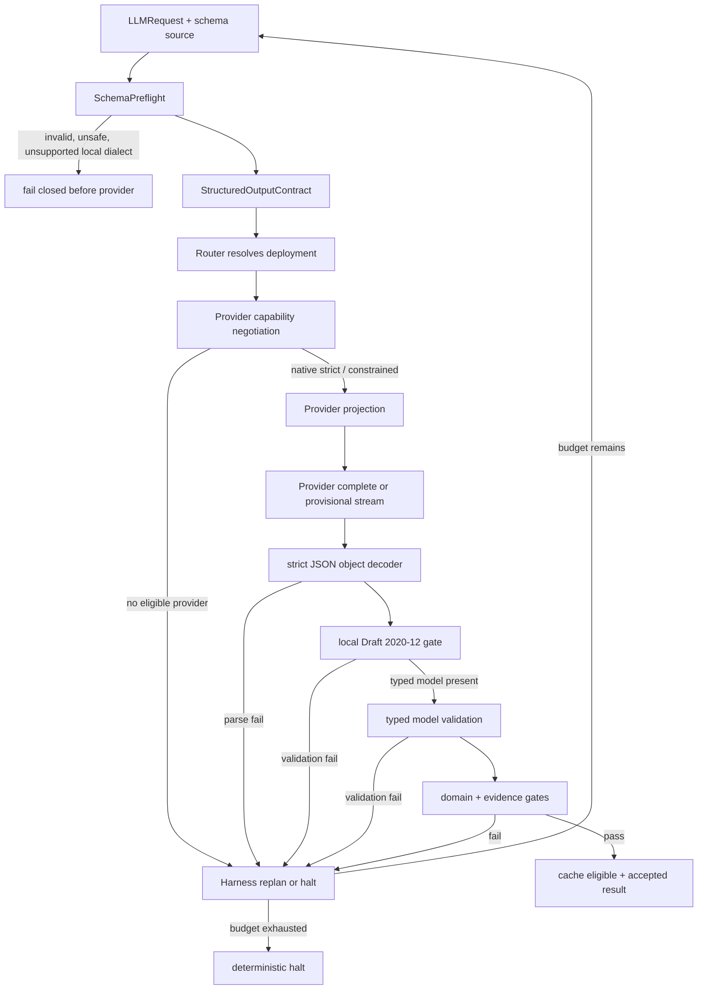

# 阶段 25：Structured Output Contract Hardening PRD

> Document status: READY_FOR_OPENSPEC
>
> Implementation status: NOT_STARTED
>
> Version: v1.0
>
> Priority: P0（LLM 输出契约正确性、Harness 决策安全与可回放性）
>
> Scope: `framework/llm/structured_output`、`framework/llm/clients`、`framework/llm/routing`、`framework/llm/cache`、`framework/agent/loop`，以及直接消费 `LLMResponse.structured_output` 的 production caller
>
> Baseline: 已完成的 `llm-structured-output`、`llm-structured-output-validation`；阶段 23 `LLM cache` 与阶段 24 `model-aware context` 的接口约束
>
> Proposed umbrella change: `structured-output-contract-hardening`
>
> Last updated: 2026-08-11

## 0. 一句话结论

NewsRoom 当前已经拥有“要求 JSON 对象、解析一次、跑一个轻量 schema 检查”的起点，但它不是生产级 schema gate：默认 JSON 解码会接受 `NaN` / `Infinity`，手写 validator 会静默忽略未知关键字，Pydantic 嵌套 schema 的 `$ref` 没有闭合，并且部分已声明关键字与 JSON Schema 语义不一致。

本阶段将 structured output 收敛成一个不可绕过的、双层的确定性契约：

```text
schema author / Pydantic model
        |
        v
SchemaPreflight
  local dialect check + canonical digest + provider capability negotiation
        |
        +-------------------- provider native strict JSON schema / optional constrained decoding
        |                                      |
        v                                      v
strict JSON object decoder  <----------- provider response
        |
        v
local Draft 2020-12 validation + optional typed model validation
        |
        v
domain / evidence / quality gates
        |
        v
Harness bounded repair, replan, or halt
```

Provider 的 `strict` 或 constrained decoding 只降低“生成不合格形状”的概率；本地 schema gate 才是最终结构真相。LLM 只能生成或修复候选 JSON，不能决定 schema 是否通过、是否重试、是否写 cache、是否接受输出或发布结果。

## 1. 背景与问题定义

### 1.1 现有基础应保留

已完成的 `llm-structured-output` 与 `llm-structured-output-validation` 建立了正确的最小骨架：

1. `LLMRequest` 可表达 `response_format`、`output_schema` 和 `output_schema_name`。
2. `OpenAICompatibleClient` 能向兼容 Provider 发送 `json_object` 或 `json_schema` response format。
3. `LLMResponse.structured_output` 与现有 caller 以 JSON object 为边界。
4. `framework/llm/structured_output/validator.py` 已覆盖常见的 `type`、`required`、`properties`、`items`、`enum`、数组/字符串/数字边界等规则。
5. `framework/agent/loop/judge.py` 与 `infrastructure/research/candidate_worker.py` 已在调用方接入 schema 验证；Research worker 还额外拒绝非标准 JSON number。
6. `pyproject.toml` 已声明 `jsonschema>=4.0` 与 `pydantic>=2.6`，无需再维护第二套 JSON Schema 解释器。

这些资产将被迁移和收敛，不重写 request/response 业务模型，也不把 Research 领域规则放进通用 LLM 层。

### 1.2 现有缺口与可复现风险

| ID | 当前行为 | 风险 | 本阶段结果 |
| --- | --- | --- | --- |
| SO-BASE-01 | `OpenAICompatibleClient` 以默认 `json.loads()` 解析结构化内容 | `NaN`、`Infinity`、`-Infinity` 可进入 generic LLM path；只有 Research caller 额外拒绝 | 所有 structured output 经同一个 strict decoder，禁止非 JSON 常量与重复对象键 |
| SO-BASE-02 | 手写 validator 仅认识部分关键字；未知关键字不报错 | `oneOf`、`$ref`、`dependentRequired` 等可被静默跳过，形成假通过 | preflight 明确接受或拒绝本地 dialect；本地验证使用 `Draft202012Validator` |
| SO-BASE-03 | 对 Pydantic type 调用 `model_json_schema()` 后直接递归 | 嵌套 model 生成的 `$defs` / `$ref` 未解析，嵌套字段可 fail-open | 保留 Pydantic source type，并使用 local `$defs` / `$ref` validator；可选 typed re-validation |
| SO-BASE-04 | `integer` 使用 Python `isinstance(value, int)`；`enum` / `const` 使用 Python equality | `1.0` 被错拒为 integer；`True == 1` 可被错接受；`uniqueItems` 依赖 `repr()` 产生错误差异 | 采用 JSON Schema 规定的实例语义，纳入回归 corpus |
| SO-BASE-05 | Provider payload 中已有 `strict: true`，但没有 provider keyword capability model | 不支持的 schema 可能被 Provider 拒绝、降级或错误解释 | 在发起调用前选择 native strict、local-only fallback、其他 deployment 或 fail closed，并留下 projection record |
| SO-BASE-06 | parse/validation 错误在 client 中压成宽泛 `schema_error` | Harness 和 operator 无法稳定区分无效 JSON、schema 不合法、实例不合法、Provider capability 不足 | 使用稳定 reason code、受限 issue list 与 redacted diagnostics |
| SO-BASE-07 | 当前 `tests/framework/llm` 没有迁移原 structured-output focused suite | 手写 validator 的语义和 client 协议缺少回归护栏 | 恢复 unit/integration/adversarial/architecture/evaluation 测试层 |

`complete()` 与 `stream()` 当前方法边界正常；本 PRD 不把临时工作树错误当作 HEAD 基线缺陷。后续实现仍必须把二者收敛到相同的 contract、schema digest 与终态校验语义。

### 1.3 为什么这不是“让模型返回 JSON”

JSON 可解析只代表语法正确，不能说明结构、类型、分支、约束或领域质量正确。即使 schema 通过，输出仍可能没有被证据支持、违反业务 policy 或不适合发布。因此验收链必须保持：

```text
strict JSON syntax
-> deterministic schema validity
-> domain/evidence/numeric quality gates
-> Harness decision
```

schema gate 不替代 Research evidence gate、artifact integrity gate、tool authorization 或 publication gate；这些 gate 也不得反过来依赖 LLM 自评。

## 2. 外部实践与采用结论

### 2.1 项目实践

| 项目 | 已验证做法 | NewsRoom 采用方式 |
| --- | --- | --- |
| [python-jsonschema](https://python-jsonschema.readthedocs.io/en/v4.21.1/validate/) | 通过 Draft validator 校验 schema 与 instance，并暴露 `iter_errors()` | 复用现有依赖做 canonical local gate；聚合、排序并裁剪错误，不再扩张手写解释器 |
| [Pydantic](https://docs.pydantic.dev/latest/concepts/json_schema/) | 从 typed model 导出 JSON Schema；可再执行 typed validation | Pydantic class 同时提供 provider schema 与 post-schema typed validation；不能只消费导出的 `$ref` 文本 |
| [Instructor](https://github.com/567-labs/instructor) | typed validation 失败后把错误交给上层受控重试 | 借鉴“验证与 repair 分离”；transport retry 保持关闭，Harness 决定有限 regeneration |
| [Outlines](https://github.com/dottxt-ai/outlines) | FSM/token mask 约束生成，使 token 层更早满足结构 | 作为 Provider adapter 的可选 capability；不替代本地验证、领域 gate 或 Harness 决策 |
| [Guidance](https://github.com/guidance-ai/guidance) | regex/CFG/JSON 约束解码 | 仅在有真实 adapter、性能评估和 fallback policy 后接入，不在 framework core 手写解码器 |
| [JSONSchemaBench](https://github.com/guidance-ai/jsonschemabench) | 用真实 schema 衡量覆盖率、效率与任务质量 | 使用许可允许、版本锁定的 curated corpus 验证 preflight/projection，不把 benchmark score 当作生产 acceptance 本身 |

### 2.2 论文带来的约束

| 资料 | 结论 | 对本 PRD 的约束 |
| --- | --- | --- |
| [Generating Structured Outputs from Language Models](https://arxiv.org/abs/2501.10868) | structured generation 的实现方式在 schema 覆盖和任务质量上差异明显 | Provider strict 成功率不是唯一指标；必须同时验证本地 schema 语义和业务任务结果 |
| [Efficient Guided Generation for Large Language Models](https://arxiv.org/abs/2307.09702) | guided decoding 需要高效约束编译与 token-level execution | 约束解码必须是 provider/engine adapter 能力，不能污染 Harness policy 或用 Python 解析器替代 |
| [Grammar-Constrained Decoding for Structured NLP Tasks without Finetuning](https://aclanthology.org/2023.emnlp-main.674/) | grammar constraint 可提升结构合规，但受 grammar 覆盖限制 | schema projection 必须显式记录 coverage；不能把降级后的 provider grammar 伪称为完整 schema enforcement |
| [The Hidden Cost of Structure](https://aclanthology.org/2025.ranlp-1.124/) | 更强格式约束可能影响内容任务表现 | 上线 native strict 或 constrained decoding 前，必须在 held-out Research 场景同时测 schema pass、grounding、答案质量、时延与成本 |

### 2.3 本项目的明确取舍

采用：本地 Draft 2020-12 gate、schema preflight、Pydantic typed re-validation、严格 JSON 解码、Provider capability negotiation、结构化 diagnostics、Harness 有界 repair、版本化 corpus 和 durable evidence。

不采用：继续扩张手写 validator、把 Provider `strict` 当最终真相、静默删改不支持的关键字、remote `$ref` 解析、无界自修复、由 LLM 判定 pass/fail，或将 constrained decoding 直接设为全局默认。

## 3. 目标、范围与非目标

### 3.1 产品目标

- **G1 本地真相**：每个带 `output_schema` 的 production response 在交给 caller 前通过本地 deterministic gate。
- **G2 语义正确**：采用明确的 Draft 2020-12 local dialect，正确处理 local `$ref`、组合关键字、数值/布尔语义和 nested Pydantic schema。
- **G3 Provider 诚实性**：每次 schema 发送前都确定记录 Provider 能强制的范围；不支持时 route、降级或拒绝，绝不静默伪造全覆盖。
- **G4 Harness 控制**：repair/replan/halt 的权力属于 Harness，并受 `max_judge_retries`、`max_replans`、`max_turns` 与 cost/call budget 共同约束。
- **G5 可诊断、可回放**：operator 能看见 schema revision、projection、错误路径、处理结果与最终 accepted output fingerprint，而不泄露原始敏感 payload。
- **G6 一致性**：complete、stream、router、cache、agent loop 与 Research worker 使用同一 compiled contract。

### 3.2 量化成功指标

| 指标 | 上线门槛 |
| --- | --- |
| 带 `output_schema` 的 production response 未经 local validation 即被 consumer 使用 | `0` |
| `NaN` / `Infinity` / duplicate key 被接受为 verified structured output | `0` |
| unsupported Provider keyword 被静默投影或静默丢弃 | `0` |
| remote `$ref` 触发网络访问 | `0` |
| Pydantic nested `$ref` 的 adversarial case false pass | `0` |
| schema validation failure 触发 client-level transport retry | `0` |
| Harness 的 structure repair 超过配置预算 | `0` |
| cache hit 返回的 structured output 绕过当前 schema digest 验证 | `0` |
| official/curated JSON Schema 回归 corpus 的批准用例通过率 | `100%` |
| held-out Research 场景的 schema pass、grounding、citation、answer quality | 均不低于批准阈值 |

### 3.3 本阶段范围

- 把 JSON Schema schema source 编译为 versioned、可审计的 `StructuredOutputContract`。
- 建立受限的、本地 Draft 2020-12 dialect：支持 local `$defs` / `$ref` 与 Draft validator 能处理的标准关键字；禁止 network / filesystem reference resolution。
- 严格解析 JSON object，拒绝非 JSON 常量、重复键、超出 size/depth/complexity limit 的 payload。
- 用 `jsonschema` 执行本地 instance validation，按稳定顺序返回受限 diagnostics。
- 对 Pydantic type 保留 model adapter，并在 JSON Schema 后执行可选的 typed validation。
- 为 Provider 添加 schema capability profile、projection 和 policy，含 native strict / constrained decoding / json object / reject 路径。
- 把 complete、stream terminal result、router fallback、cache read/write、agent loop judge 与 Research candidate 统一到 compiled contract。
- 把结构问题交给 Harness 的 bounded repair path，并写 durable transcript/event。
- 恢复 focused tests，并加入 official schema cases、Pydantic、Provider protocol、stream、cache、fuzz/adversarial 和 held-out evaluation。

### 3.4 非目标

- 不改变 `LLMResponse.structured_output: dict[str, Any] | None` 的根对象 API。本阶段拒绝根数组和标量；若未来需要，必须另立版本化 response contract。
- 不在 framework core 手写 grammar/FSM constrained decoder；只能通过 Provider adapter 引入并度量。
- 不默认允许 external `$ref`、schema URL、动态代码、任意 Python callable 或网络 format checker。
- 不让 JSON Schema 取代领域类型、证据、数值范围、citation、policy 或发布质量 gate。
- 不把 Pydantic custom validator 反编译进 JSON Schema；typed validation 由明确 adapter 执行。
- 不自动修复任意 schema，也不对同一未变 payload 做盲目 Provider retry。
- 不替换阶段 19 的 canonical durable event owner、阶段 23 的 cache owner 或阶段 24 的 context/token accounting owner。

## 4. 所有权与架构不变量

### 4.1 所有权矩阵

| Owner | 负责 | 明确不负责 |
| --- | --- | --- |
| `framework/llm/structured_output` | schema preflight、contract compile、strict decode、本地验证、diagnostic、provider projection 纯函数 | workflow routing、业务质量、memory write、publication |
| `framework/llm/clients/*` | 将已选 projection 映射为真实 Provider payload；回传原始 response/stream terminal data | schema pass/fail 的最终决定、repair 策略 |
| `framework/llm/routing` | 基于 resolved deployment capability 选择 projection/fallback；把 compiled contract 传入 client | 绕过本地 gate 或把 provider warning 当 pass |
| `framework/llm/cache` | 以 contract digest/revision 为 identity 一部分；读写前 revalidate | 复用过期 schema 的结果、决定业务接受 |
| `framework/agent/loop` / Harness | 将诊断转为 bounded retry/replan/halt；记录 phase transition | 解析 JSON、实现 JSON Schema 算法 |
| `business/research` | 提供领域 schema、typed model、evidence/quality gate | 修改通用 validator 或 Provider projection |
| Provider / constrained decoder adapter | 尽量在生成时限制结构，说明 capability 与实际覆盖 | 决定 schema 最终有效、绕过 local validation |

### 4.2 强制不变量

1. 每个 `output_schema` request 在 Provider call 前必须有一个 immutable compiled contract；无效 schema 不得触网。
2. 每个 structured response 必须经过 strict decode 和 local validation，才可赋给 `LLMResponse.structured_output`、进入 cache 或交给 caller。
3. Provider projection 不得修改 canonical local schema；它是单独、可审计、带 coverage 的派生物。
4. 不支持的 Provider capability 只能触发 route、明确 local-only policy 或拒绝；不能静默省略 schema keyword。
5. parse/schema error 是 deterministic content failure，不得使用 HTTP/transport retry policy。Harness 可发起新的、带错误摘要的 worker attempt。
6. `schema valid` 不是 `domain accepted`；结构、证据、质量和 publication 仍是独立 deterministic gate。
7. complete 与 stream 的**终态**必须使用同一 decoder、contract digest、validator 与 result metadata。stream fragment 永远是 unverified，不能触发副作用。
8. schema、diagnostic、events、cache key 与 transcript 只记录 canonical digest、revision、路径和受限 reason code；不得把原输出或敏感 schema 字段作为 metric label。

## 5. 目标运行流程



### 5.1 处理顺序

1. caller 提供 dict JSON Schema 或 Pydantic model class；schema name、policy、tenant/workflow scope 与 optional repair policy 进入 request metadata 的 typed field，不以自由字符串散落传递。
2. `SchemaPreflight` canonicalize schema、计算 digest、执行 `Draft202012Validator.check_schema()`、检查本地安全 policy 与 resource limits；失败时返回 `schema_preflight_error`，Provider call count 必须为 `0`。
3. 对 Pydantic model 保存 original model adapter；其 `model_json_schema()` 仅是 Provider/local schema source，不能丢失 model-level validation 能力。
4. router 解析最终 deployment 后，用 capability profile 选择 `NATIVE_STRICT`、`CONSTRAINED`、`JSON_OBJECT_LOCAL_GATE` 或 `REJECTED`。
5. provider adapter 只能接收 `ProviderSchemaProjection`，并把 projection revision、mode、keyword coverage 写入 request metadata/event。
6. response content 在 bounded byte limit 内由 strict decoder 解析；非有限 number、duplicate key、非 object root、过深 JSON 一律拒绝。
7. local Draft validator 用 `iter_errors()` 取最多 `max_validation_issues` 个排序后的错误；若有 Pydantic model adapter，再执行 `model_validate`，并把异常转为同一 diagnostic envelope。
8. 通过结构 gate 后，才产生 immutable `ValidatedStructuredOutput` 并写入 `LLMResponse.structured_output`；再由 caller 的 evidence/domain gate 决定是否接受。
9. 结构失败时，client 不进行 transport retry；Harness 依据 workflow policy、剩余 retry/replan/turn/cost budget，选择带受限错误摘要的新 candidate attempt 或 halt。

### 5.2 Stream contract

- 对带 `output_schema` 的 `stream()`，中间 `LLMStreamEvent` 只能标记为 `provisional=True`，不得被下游作为 parsed/verified object 消费。
- stream completion 必须经由与 `complete()` 相同的 accumulator -> strict decoder -> local validator pipeline，只有 terminal event 可携带 `ValidatedStructuredOutput`。
- 连接中断、JSON 不完整、terminal validation failed 时，不得缓存、不发布、不写 accepted event；Harness 只得到结构化 failure。
- 如某个 Provider 无法在现有 streaming API 上安全提供终态 gate，该 deployment 对 `output_schema + stream` 为 ineligible，router 必须选择其他 deployment 或拒绝。

## 6. 核心契约与 schema policy

### 6.1 `StructuredOutputContract`

```python
@dataclass(frozen=True)
class StructuredOutputContract:
    schema_name: str
    schema_revision: str
    canonical_schema: Mapping[str, Any]
    schema_digest: str
    dialect: str  # "draft2020-12-local-v1"
    root_kind: Literal["object"]
    local_reference_policy: Literal["local_defs_only"]
    typed_adapter: StructuredOutputTypedAdapter | None
    limits: StructuredOutputLimits
    repair_policy: StructuredOutputRepairPolicy
```

`schema_revision` 由 caller 的显式版本或 canonical schema digest 派生；schema name 不是 cache identity 的唯一来源。canonical JSON 使用稳定 key order、UTF-8 与无歧义 number encoding，digest 使用项目统一 hash helper。

### 6.2 本地 dialect 与安全 preflight

本地 dialect 名为 `draft2020-12-local-v1`，并按如下规则运行：

| 项目 | 规则 |
| --- | --- |
| Schema validity | 必须先执行 `Draft202012Validator.check_schema()`；无效 schema fail closed |
| `$ref` / `$defs` | 允许同一 canonical document 内的 JSON Pointer；禁止 HTTP(S)、file、package、relative path 及任何 remote retrieval |
| 根类型 | 必须声明或推导为 object；否则 `unsupported_structured_output_root` |
| `format` | 默认 annotation-only；只有列入明确 allowlist 且设置 `enforce_formats=True` 时才用固定 `FormatChecker` 强制验证 |
| `pattern` | 只接受项目定义的 portable ECMA-262 子集；复杂度/长度超过上限或不可移植 pattern 在 preflight 拒绝，而不让 Python `re` 成为隐式语义 |
| custom keyword | 任何未注册 keyword 必须显式分类为标准 annotation、项目 approved extension 或 reject；不能被手写递归静默忽略 |
| resource limits | schema bytes、node count、depth、`$ref` chain、enum items、regex length、validation issue count 与 response bytes/depth 都有配置上限 |

本地 validator 的实现必须复用 `jsonschema` 库；项目只拥有 dialect/preflight/resource policy、Pydantic adapter、diagnostic normalization 和 Provider projection，而不再拥有第二套 JSON Schema evaluator。

### 6.3 `ProviderStructuredOutputCapability`

```python
@dataclass(frozen=True)
class ProviderStructuredOutputCapability:
    provider: str
    deployment: str
    mode: Literal["native_strict", "constrained", "json_object", "none"]
    supported_dialect: str | None
    supported_keywords: frozenset[str]
    supports_local_refs: bool
    max_schema_bytes: int | None
    max_schema_depth: int | None
    supports_stream_terminal_validation: bool
    revision: str
```

capability 必须来自 deployment configuration 或 adapter discovery 的 versioned record，不能由 prompt wording 或一次 API 失败推断。adapter 只能声明经过 contract test 验证的能力。

### 6.4 `ProviderSchemaProjection`

```python
@dataclass(frozen=True)
class ProviderSchemaProjection:
    contract_digest: str
    provider_capability_revision: str
    mode: Literal["native_strict", "constrained", "json_object_local_gate"]
    provider_schema: Mapping[str, Any] | None
    enforced_keywords: frozenset[str]
    omitted_keywords: frozenset[str]
    projection_digest: str
```

projection 不是 schema rewrite 的隐藏通道：

- `native_strict` 只在 Provider coverage 覆盖 canonical contract 的 required enforcement profile 时可用。
- 若 policy 允许 `json_object_local_gate`，provider 只能获得 JSON object instruction；**canonical local schema 不会被削弱**，所有关键字仍在 response 后本地验证。
- 不允许“删掉不认识的 `oneOf` / `$ref` 后仍标为 strict”。若生成 reduced provider projection，`omitted_keywords` 必须非空可见，并由 policy 显式允许。
- `require_native_enforcement=True` 的 workflow 在没有 fully eligible deployment 时 fail closed 或 route 到兼容 deployment，不能降级。

### 6.5 `StructuredOutputDiagnostic`

```python
@dataclass(frozen=True)
class StructuredOutputDiagnostic:
    code: Literal[
        "schema_preflight_error",
        "schema_reference_forbidden",
        "provider_schema_ineligible",
        "structured_output_parse_error",
        "structured_output_non_finite_number",
        "structured_output_duplicate_key",
        "structured_output_root_type_error",
        "structured_output_validation_error",
        "structured_output_typed_validation_error",
        "structured_output_limit_exceeded",
    ]
    instance_path: tuple[str | int, ...]
    schema_path: tuple[str | int, ...]
    validator: str | None
    message: str
    schema_digest: str
    attempt_id: str | None
```

每次 response 最多保留 `N` 条 issue，稳定排序为 `(instance_path, schema_path, validator, message)`；对模型可见的 repair summary 仅含 JSON Pointer、expected/observed category 和 compact message，不回显敏感值、完整 schema、API key、tool output 或 evidence 原文。

## 7. Strict JSON decoder

### 7.1 解码规则

`StrictStructuredOutputDecoder` 是唯一可创建 `ValidatedStructuredOutput` 的入口，至少要求：

1. 先校验 encoded response size；超过上限不调用 `json.loads()`。
2. 使用 `parse_constant` 拒绝 `NaN`、`Infinity`、`-Infinity`。
3. 使用 `object_pairs_hook` 检测并拒绝 duplicate object key，避免“最后一个键获胜”的歧义。
4. 在 parse 后检查 tree depth、node count、string/array/object limits，以及所有 number 的有限性。
5. root 必须为 dict；任何数组/标量 root 都返回明确 root type diagnostic。
6. 解析错误不进入 cache、LLM response、durable accepted event 或任何业务 consumer。

本 decoder 不擅自修剪、不从 Markdown code fence 提取 JSON、不接受前后自然语言，也不执行模型生成的 JSON Patch。需要 extractor 的业务场景必须在 schema contract 之前拥有独立、可审计的 normalizer，默认 production output contract 不启用该逃生路径。

### 7.2 错误分类

| Failure | Client transport retry | Harness repair candidate | Cache / publication |
| --- | --- | --- | --- |
| malformed JSON、non-finite number、duplicate key、root type | 否 | 允许，受 budget 控制 | 禁止 |
| invalid schema / forbidden `$ref` / limit preflight | 否 | 否，除非上游 workflow 换 schema revision | 禁止 |
| Provider capability ineligible | 否 | 可 route to eligible deployment；不可让 LLM 改 schema | 禁止 |
| JSON Schema / typed validation failure | 否 | 允许，附最小错误摘要 | 禁止 |
| domain/evidence gate failure | 否 | 按 workflow policy repair/replan/halt | 禁止，直到全部 required gate 通过 |

## 8. Validation、Pydantic 与业务 gate

### 8.1 Local schema validation

`CompiledStructuredOutputContract.validate(instance)` 必须：

1. 以不访问网络的 resolver registry 运行 `Draft202012Validator`；
2. 使用 `iter_errors()` 聚合错误而非 first-error-only；
3. 输出稳定、有限、redacted 的 `StructuredOutputDiagnostic`；
4. 对通过的 instance 返回 deep-frozen/copy-on-write value，防止 caller 在 cache/diagnostic 后篡改；
5. 不把 `jsonschema.ValidationError` 或完整 instance 原样跨层抛出。

### 8.2 Pydantic typed adapter

当 caller 传入 Pydantic `BaseModel` class 时：

```text
model_json_schema()
-> SchemaPreflight / Provider projection
-> strict JSON object decoder
-> Draft 2020-12 validation
-> model_validate()
-> validated dict / typed value adapter
```

`model_validate()` 用于捕获 JSON Schema 未表达的 model validator、跨字段规则和 type coercion policy。任何 coercion 必须由 model configuration 显式允许，且返回的 canonical dict 重新检查为 JSON-safe finite object；禁止把 Pydantic 的便利 coercion 变成隐式 schema pass。

### 8.3 与领域质量 gate 的关系

举例：一篇 Research report 即使包含全部 required 字段，也可能引用不存在、数值合计错误、结论不被 evidence 支持。schema pass 后仍必须由领域纯函数完成：

```text
schema gate
-> source/evidence traceability gate
-> numeric/domain invariants
-> report quality gate
-> Harness accept / repair / halt
```

`framework/agent/loop/judge.py` 应只消费标准 contract result/diagnostic；它不复制 JSON Schema 遍历逻辑。`infrastructure/research/candidate_worker.py` 的 `allow_nan=False` 防御在本阶段完成后应删除为重复逻辑，改为断言它只会收到已 strict-decoded 的 output。

## 9. Routing、cache 与 callsite 收敛

### 9.1 Router capability negotiation

router 在选定 deployment 后、发起 Provider call 前执行：

```text
compiled contract
-> deployment capability resolution
-> provider schema projection
-> model-aware context/token preflight (stage 24 contract)
-> provider call
```

其中 output schema/response format payload 必须进入阶段 24 的 token accounting；大 schema 导致的 context overflow 不能通过删用户请求或静默缩小本地 contract 解决。

fallback deployment 必须重新运行 capability、schema projection、context/cost/tenant policy。不能把 primary 的 projection 复用给语义不同的 Provider。

### 9.2 Cache contract

阶段 23 的 exact response cache 实现时，key/entry eligibility 至少包含：

```text
schema_digest
schema_revision
local_dialect_revision
typed_adapter_revision (if any)
provider_projection_digest
response_format mode
```

cache write 只允许发生在 strict decode、local schema validation 和所需 typed validation 通过后。cache read 必须检查 request contract identity，并重新走轻量 local validation；失配或损坏 entry 当 miss 处理并记录诊断。cache hit 不能跳过后续 domain/evidence gate，也不能改变 Harness retry/halt 语义。

### 9.3 Production callsite closure

所有 production `.complete()` / `.stream()` 入口必须接收 compiled contract，或通过 managed router 获取它。test fake 可提供轻量构造器，但不得成为 production composition bypass。

架构测试至少禁止：

- direct `json.loads(response.content)` 后直接把 dict 写入 domain result；
- direct `validate_structured_output()` 被业务 caller 用作唯一 gate；
- client/cache/stream 分别实现不同的 structured parser；
- 以 `response_format="json_object"` 宣称已经通过 schema gate；
- 在 Provider error retry loop 内重试 deterministic schema failure。

## 10. Harness repair、事件与可观测性

### 10.1 Bounded repair state machine

```text
PLAN: Harness reads workflow policy, last diagnostic, budgets, schema revision
  -> EXECUTE: worker receives task + compact validation issue summary
  -> VERIFY: strict decoder + local schema gate + typed/domain/evidence gates
  -> ACCEPT | RETRY | REPLAN | HALT
```

repair prompt 只能携带必要 diagnostic，不能让 LLM 改写 schema、降低 constraint、选 Provider、增加 budget 或发布结果。相同 invalid candidate 不得被无变化地重复提交；attempt fingerprint 相同且无新 context 时应 deterministically halt/replan。

默认 budget 需与现有 `AgentLoopPolicy.max_judge_retries` 对齐，但每个 workflow 可收窄，不能扩大全局上限：

```yaml
structured_output:
  max_validation_issues: 20
  max_output_bytes: 262144
  max_json_depth: 64
  max_schema_nodes: 4096
  max_schema_ref_depth: 32
  max_schema_repair_attempts: 2
  provider_policy: prefer_native_strict
  allow_json_object_local_gate: true
  require_native_enforcement: false
```

所有值必须在 composition/config load 阶段验证。limit 触发必须以结构化 reason code halt/replan，不能转为临时异常重试。

### 10.2 Durable events

复用阶段 19 canonical event owner，至少投影：

```text
structured_output_contract_compiled
structured_output_provider_projection_selected
structured_output_provider_projection_rejected
structured_output_decode_rejected
structured_output_local_validation_failed
structured_output_typed_validation_failed
structured_output_repair_requested
structured_output_validation_accepted
```

事件至少包含：run/attempt ref、schema digest/revision、dialect、provider/deployment/capability revision、projection digest/mode、issue code/path、issue count、response fingerprint、budget disposition 和 timestamp。不得记录 raw output、完整 schema、secret、tool payload 或 evidence body。

### 10.3 Metrics

```text
structured_output_requests_total{mode,outcome}
structured_output_schema_preflight_failures_total{code}
structured_output_provider_projection_total{mode,outcome}
structured_output_validation_failures_total{code,validator}
structured_output_repair_total{outcome}
structured_output_repair_budget_exhausted_total
structured_output_cache_validation_total{outcome}
structured_output_schema_bytes
structured_output_validation_duration_seconds
structured_output_provider_vs_local_failure_total{provider,mode}
```

`schema_digest`、instance path、schema name、tenant、prompt、schema text 与 output text 禁止作为 label。高基数字段仅可进入受采样、redacted event/log。

## 11. 功能需求

### FR-SO-001：Schema preflight

每个 `output_schema` 必须在 Provider 调用前编译为 immutable `StructuredOutputContract`；preflight 包含 canonicalization、Draft 2020-12 schema validity、root object、local-ref-only、安全与资源限制检查。失败时 Provider call count 为 `0`。

### FR-SO-002：Canonical local validation

本地 instance validation 必须基于 `jsonschema.Draft202012Validator` 的批准 local dialect，而非扩张手写递归 validator。`$defs` / local `$ref`、组合/条件关键字、`additionalProperties` schema、数值与 unique semantics 必须由此路径处理。

### FR-SO-003：Strict JSON object decoding

所有 structured response 必须拒绝 malformed JSON、`NaN`/`Infinity`、duplicate key、非 object root、过大或过深 payload；不得依赖某个业务 caller 的额外 `json.dumps(..., allow_nan=False)` 补洞。

### FR-SO-004：Pydantic typed validation

Pydantic model class 作为 schema source 时，系统必须保留 typed adapter 并在 JSON Schema 通过后执行 `model_validate()`；nested model `$ref` 与跨字段 validator 的失败必须可诊断。

### FR-SO-005：Provider capability negotiation

router 必须按 resolved deployment 的 versioned capability 选择 native strict、constrained、JSON-object-plus-local-gate 或 reject；没有 eligible capability 时不得发起未声明的 schema call。

### FR-SO-006：Projection integrity

Provider projection 必须带 digest、enforced/omitted keyword coverage 和 mode。所有 omitted keyword 需要显式 policy；local canonical schema 在任何情况下都不被 projection 弱化。

### FR-SO-007：Complete / stream parity

complete 与 stream terminal output 必须使用同一 compiler、decoder、validator、diagnostic 和 result metadata。stream fragment 不得作为 verified output 或副作用输入。

### FR-SO-008：Cache integrity

structured output cache entry 必须以 contract identity 隔离，写前/读后 revalidate。cache hit 不得跳过领域质量 gate 或复用不同 schema revision 的结果。

### FR-SO-009：Deterministic repair policy

parse/schema/typed failure 不得触发 client transport retry；Harness 只能在剩余 budget 内创建新的 worker attempt，传递受限 diagnostic，并在耗尽时 deterministic halt/replan。

### FR-SO-010：Diagnostic contract

跨层错误必须映射为稳定 `StructuredOutputDiagnostic`，包含 JSON Pointer 和 schema path，按固定顺序、数量上限和 redaction policy 返回；不得暴露 raw sensitive value。

### FR-SO-011：Durable replay

accepted/rejected structured output path 必须在 transcript 中关联 schema/capability/projection/revision、attempt、diagnostic 摘要与 response fingerprint，足以 review 为什么某个 candidate 未被接受。

### FR-SO-012：Architecture closure

production caller 不得绕过 managed contract 直接解析或验证 structured output。重复手写 parser/validator 应删除或降为 test-only fixture。

### FR-SO-013：Security and resource bounds

schema 和 instance 均必须执行 size/depth/node/ref/regex 限制；remote reference resolution、未审批 custom keyword 和不可审计 dynamic validator 一律 fail closed。

### FR-SO-014：Evaluation gate

Provider native strict、constrained decoding 或 projection 策略进入默认 production 前，必须在 held-out Research 场景通过 schema correctness、answer quality、evidence grounding、citation completeness、latency 与 cost 多指标 gate。

## 12. 代码影响面

| 路径 | 目标变更 |
| --- | --- |
| `framework/llm/structured_output/validator.py` | 收敛 public API 到 compiled contract/local Draft validator；删除或隔离手写 JSON Schema interpreter |
| `framework/llm/structured_output/contracts.py` | 新增 typed contract、limit、diagnostic、validation result 模型 |
| `framework/llm/structured_output/preflight.py` | 新增 canonicalization、local dialect、安全/资源检查、Pydantic adapter 构造 |
| `framework/llm/structured_output/decoder.py` | 新增 strict JSON object decoder 与 duplicate/non-finite/limit 检查 |
| `framework/llm/structured_output/projection.py` | 新增 Provider capability policy 与 immutable projection；不持有 HTTP 调用 |
| `framework/llm/models/request.py`、`response.py` | 引入 versioned contract reference/result metadata，保持 object root compatibility |
| `framework/llm/clients/openai_compatible.py` | 只消费 projection，使用 strict decoder，正确区分 error code；complete/stream 共享 terminal gate |
| `framework/llm/routing/router.py`、`deployment.py`、`capabilities.py` | 按 deployment capability negotiated projection、fallback 与 context preflight 顺序收敛 |
| `framework/llm/cache/*` | key/entry 加入 contract identity；cache read/write local revalidation |
| `framework/agent/loop/judge.py`、`loop.py` | 使用 diagnostic envelope 进行 bounded repair disposition，不复制 schema logic |
| `infrastructure/research/candidate_worker.py` | 删除局部 non-finite workaround；改为只消费 verified output 并继续领域/evidence gate |
| `tests/framework/llm/*`、`tests/framework/agent/*`、`tests/infrastructure/research/*` | 恢复 focused suite，新增 contract/protocol/stream/cache/repair/architecture/evaluation coverage |

实际 implementation 前必须执行 production callsite inventory。以上是 owner map，不允许以“文档未列出”保留新的 direct parser bypass。

## 13. OpenSpec 拆分与实施顺序

本 PRD 是 umbrella 文档。禁止以单一 change 同时迁移 validator、Provider、stream、cache、Harness 与所有 business caller；按以下顺序拆分：

### Change 1：`structured-output-contract-local-gate`

交付：

- `StructuredOutputContract`、preflight、local dialect、resource policy、canonical digest；
- strict JSON object decoder；
- Draft 2020-12 validator 与 Pydantic typed adapter；
- 统一 diagnostic/error contract；
- official/curated schema regression corpus；
- 替换 `validator.py` 的手写解释器，保留兼容 public import 仅在有明确迁移期时存在。

验收后，任何 schema 无效、local `$ref` 不闭合、non-finite JSON 或嵌套 Pydantic 输出都不能到达 business caller。

### Change 2：`structured-output-provider-capability-routing`

交付：

- deployment capability/revision、provider projection 和 coverage policy；
- OpenAI-compatible payload mapping 与 native strict/json object/reject selection；
- complete/stream terminal parity；
- stage 24 context schema accounting 预留接口；
- Provider protocol and fallback tests。

验收后，Provider 不支持的 schema 不能被静默投影；native strict 和 local-only gate 的差异可审计。

### Change 3：`structured-output-harness-cache-convergence`

交付：

- cache key/entry revalidation 与 schema identity；
- agent loop bounded repair/replan/halt integration；
- Research candidate worker convergence；
- durable event/metrics/replay projection；
- architecture test 和 production callsite migration。

验收后，唯一的 production structured output path 为 managed contract；失败不会被 cache/publish，retries 受 Harness budget 约束。

### Change 4：`structured-output-provider-evaluation-release`

交付：

- versioned Provider/schema corpus、JSONSchemaBench-derived capability corpus 与 held-out Research evaluation；
- native strict/constrained decoding release flags、shadow mode、metrics baseline；
- approved capability revision、rollout and rollback record。

验收后，Provider-specific enforcement 的启用有可重复 evidence，不再凭单一 demo 或“strict=true”声明上线。

依赖关系：

```text
Change 1
  -> Change 2
  -> Change 3
  -> Change 4

Stage 24 context contract: Change 2 integration dependency
Stage 23 cache contract:   Change 3 integration dependency
Stage 19 durable events:   Change 3 projection dependency
```

每个 change 必须通过：

```powershell
openspec validate <change> --strict
```

OpenSpec requirement 迁移规则：

- Change 1 必须以 `MODIFIED Requirements` supersede `llm-structured-output-validation` 的“小型 subset validator”语义，并保留 `llm-structured-output` 的 JSON object root 与 deterministic non-transport-retry 基线；不得新建一个平行 capability 后让旧 requirement 继续描述 production 真相。
- Change 2 必须修改 `llm-structured-output` 的 Provider translation requirement，补入 capability negotiation、projection coverage、complete/stream terminal parity 和 local gate 不可替代规则。
- Change 3 必须修改 `agent-loop-p0-output-contract-artifacts` 的 output judge requirement，把标准 diagnostic、bounded repair、durable attempt record 与 domain/evidence gate 分层写入规范；不能用实现代码暗含 Harness policy。
- 若上述 capability 已在实施前归档或合并到 canonical spec，新 change 必须修改归档后的 canonical capability 名称，并在 proposal 中记录 superseded requirement 的来源；禁止复制同名 SHALL 形成双真相。

## 14. 测试与评估计划

### 14.1 Unit tests

- invalid schema、root array/scalar、remote `$ref`、broken local `$ref`、over-depth/ref cycle、oversized enum/regex；
- nested Pydantic model 的 `$defs` / `$ref`、cross-field `model_validate()` failure、strict/forbid extra policy；
- `oneOf`、`anyOf`、`allOf`、`not`、`if/then/else`、`dependentRequired`、`additionalProperties` schema；
- `1.0` integer、`True` vs `1` enum/const、`[1, 1.0]` `uniqueItems`、number bounds；
- `NaN` / `Infinity` / `-Infinity`、duplicate key、malformed UTF-8/content、deep JSON、oversized response；
- stable canonical digest、projection coverage、sorted/capped/redacted diagnostic；
- Pydantic/model JSON Schema dialect/version drift。

### 14.2 Client、router 与 stream integration tests

- `json_object`、native strict schema、constrained、local-only projection 和 unsupported reject 的 HTTP payload contract；
- provider returns valid JSON but invalid full local schema；
- Provider rejects native schema，router 遵循 capability policy route/reject，不静默降级；
- complete 与 stream terminal 相同 JSON 给出相同 contract digest、diagnostic 和 validated object；
- interrupted stream / incomplete JSON / terminal validation failure 不能进入 cache 或 publication；
- fallback deployment 重新 projection，不能复用 primary Provider schema；
- 大 output schema 进入阶段 24 request preflight accounting。

### 14.3 Harness、cache 与 business integration tests

- schema failure 的 client transport call count 为 `1`，Harness candidate attempts 不超过 policy；
- 相同 invalid candidate fingerprint 不做无变化 retry；
- budget 耗尽进入 deterministic halt，phase transition 有 durable transcript；
- cache write 只接受 validated object；schema digest/revision 改变后 cache miss；cache corruption 变 miss；
- Research candidate worker 接收到 invalid/non-finite data 时不会写 report/artifact；
- schema pass 但 evidence gate fail 时仍不 publish；
- architecture tests 拒绝 direct `json.loads(response.content)` 和 un-managed client callsite。

### 14.4 Corpus、fuzz 与评估

1. 引入版本锁定且许可审查通过的 [JSON Schema Test Suite](https://github.com/json-schema-org/JSON-Schema-Test-Suite) curated cases，覆盖本 dialect 的规范语义。
2. 从 [JSONSchemaBench](https://github.com/guidance-ai/jsonschemabench) 提取不含敏感内容的 schema corpus，测试 preflight、projection coverage、Provider 失败模式与复杂度边界。
3. 使用 property/fuzz tests 生成 nested object、numeric equality、duplicate key、large enum、local ref graph、regex edge case 与 error sort 输入。
4. 在 held-out Research 场景按 Provider/mode 同时记录：

```text
schema validity rate
first-pass validity rate
repair success rate
answer quality
evidence grounding
citation completeness
provider rejection rate
latency
token and monetary cost
```

不得以“schema pass 提升”抵消 grounding、citation 或答案质量下降。

## 15. 验收标准

### AC-SO-001：无效 schema 在调用前失败

给定 broken local `$ref`、remote `$ref`、未知未批准 keyword 或超过 schema limit 的 request，`SchemaPreflight` 返回明确 diagnostic，Provider transport 调用次数为 `0`。

### AC-SO-002：非标准 JSON 不可越过通用路径

Provider 返回 `{"score": NaN}`、`{"score": Infinity}` 或 `{"x": 1, "x": 2}` 时，generic client、router、cache 与 Research path 全部拒绝；accepted event 与 cache write 数均为 `0`。

### AC-SO-003：Draft 语义正确

curated suite 证明 `1.0` 对 `integer` 合法、`True` 不等于 JSON number `1`、`[1, 1.0]` 违反 `uniqueItems`、`oneOf` / local `$ref` / `additionalProperties` schema 不会 fail-open。

### AC-SO-004：Pydantic 嵌套模型闭合

嵌套 Pydantic model 生成 `$defs` / `$ref` 时，内层 required/type/cross-field validation 的反例被拒绝；错误包含 instance/schema path 且不泄露值。

### AC-SO-005：Provider 投影诚实

当 primary deployment 不支持 canonical contract 的 required enforcement profile 时，router 只允许 route 到 eligible deployment、使用 policy 明示的 `json_object_local_gate` 或 reject。事件含 projection digest 和 omitted keyword；不存在静默 drop。

### AC-SO-006：Complete / stream 一致

同一终态 JSON 在 complete 与 stream 产生相同 validated object、contract/projection digest 与 diagnostic；stream fragment 不能触发 cache、artifact、memory 或 publication。

### AC-SO-007：有限 repair

一次 schema invalid response 不触发 HTTP/transport retry；Harness 最多创建 policy 允许的 repair attempts。超限后进入 `halted` 或 workflow 明确 `replan`，且 transcript 完整记录每次 PLAN/EXECUTE/VERIFY。

### AC-SO-008：Cache 不跨 schema 污染

相同 prompt 但 schema digest/revision/typed adapter revision 不同，不能命中同一 structured response；cache entry 在 read/write 均通过 local gate。

### AC-SO-009：领域 gate 不被结构 gate 替代

构造“schema valid、但 citation 缺失或 evidence 不支持”的 Research report，schema gate 可通过但 publication gate 必须拒绝；LLM 不参与该 pass/fail 决策。

### AC-SO-010：生产调用面闭合

architecture inventory/test 证明所有 production structured output consumer 只接收 `ValidatedStructuredOutput` 或 managed `LLMResponse`；不存在 direct parser/validator bypass。

## 16. 风险、发布与回滚

### 16.1 主要风险与缓解

| 风险 | 缓解 |
| --- | --- |
| JSON Schema 实现复杂度或版本漂移 | 固定 `jsonschema` major/minor policy、dialect revision、curated official suite 与 contract test；不手写标准解释器 |
| Provider 声称 strict 但实际子集不同 | versioned capability、projection corpus、shadow evaluation、provider-specific reject/route policy |
| Pydantic schema 与 typed validator 结果不同 | 双层测试、typed adapter revision、禁止隐式 coercion、记录 mismatch diagnostic |
| 严格 decoder 破坏旧的“夹杂文本 JSON”调用者 | 明确迁移 inventory；业务 extractor 是单独预处理 contract，不能隐式混入 generic client |
| schema/instance 触发 CPU、memory、regex 资源消耗 | bytes/depth/node/ref/regex limit、bounded issues、时间观测；超限 fail closed |
| 更强 Provider 约束降低内容质量或增加时延 | shadow rollout、held-out answer/grounding/citation/cost gate、按 deployment rollback |
| schema 信息进入 logs/events/cache key 泄露 | 只存 canonical digest/revision/fingerprint，采用既有 redaction，禁止 raw value labels |
| 与阶段 23/24 并行开发产生接口漂移 | 先冻结 compiled contract/public projection；通过 OpenSpec dependency 和 cross-change contract test 收敛 |

### 16.2 发布策略

1. **Observe-only preflight**：编译/验证 schema 并记录结果，不改变 Provider payload；发现 invalid schema 即告警。
2. **Strict decode shadow**：记录非标准 JSON 与 duplicate key，不将其自动接受为 verified result；完成 caller inventory。
3. **Local gate enforce**：对 selected workflows 强制 local schema gate 和 typed adapter，仍使用当前 Provider response format。
4. **Capability routing shadow**：计算 projection/fallback 推荐与真实调用差异，建立 Provider capability baseline。
5. **Native strict / constrained opt-in**：只为通过 held-out evaluation 的 deployment/workflow 开启，保留 `json_object_local_gate` 或 route rollback。
6. **Architecture closure**：拒绝新的 unmanaged parser/callsite，删除迁移期重复 validator。

每步必须有 feature flag、tenant/workflow scope、owner、metrics、rollback 条件与版本化 capability/config revision。

### 16.3 回滚策略

- Provider native strict 或 constrained decoder 可回滚到 `json_object_local_gate`，但本地 strict decoder 与 local schema gate 不回滚为“只 parse”。
- capability revision 可回滚到上一个已批准版本；不得临时把 unsupported keyword 标为 supported。
- typed adapter 出现兼容问题可对指定 workflow 降级为 dict contract，但必须新建 schema revision 和 migration record，不能静默跳过。
- cache 发现 contract identity 污染时立即 disable structured cache read/write，继续走 local validation；不删除 durable transcript。
- remote ref、resource limit 或 validation security failure 始终 fail closed，不提供 production bypass flag。

### 16.4 Definition of Done

- 四个 OpenSpec change 均有 proposal/design/spec/tasks，全部 `openspec validate <change> --strict`，并按流程归档；
- 本地 hand-written JSON Schema interpreter 已删除或只保留有时限的 compatibility facade，canonical path 使用批准版本的 `jsonschema`；
- strict decoder、Pydantic typed adapter、Provider projection、complete/stream/cache/Harness convergence 已完成；
- 现有 Research `allow_nan=False` 业务补丁被通用边界替代；
- official/curated schema corpus、Provider protocol、fuzz/adversarial、cache/stream/Harness/architecture tests 和 held-out Research evaluation 均通过；
- 所有 FR/AC 在 evidence ledger 中映射到 implementation、test、event 与 rollout proof；
- 生产 structured output 无 direct parser bypass；每次 accept/reject 可从 durable transcript 解释；
- compile、targeted/broad tests、smoke 与 strict OpenSpec validation 全部通过；
- 文档、capability profile、schema dialect 与 config revision 已由 owner 审核并可回滚。

完成这些条件后，NewsRoom 才能把 structured output 描述为：

> LLM 只产生候选 JSON object；SchemaPreflight、strict decode、本地 Draft validation、Provider capability 选择、领域质量判断以及 repair/halt 都由可审计、可回放、有限且确定性的控制面执行。
