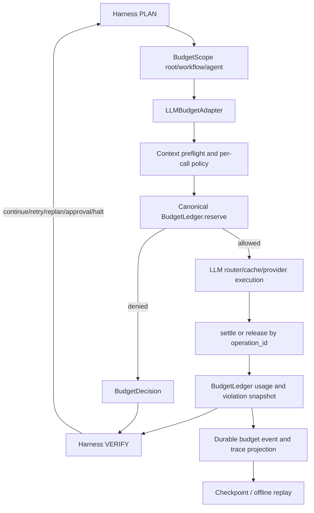

# 阶段 26：Unified Budget Governance PRD

> Document status: `READY_FOR_OPENSPEC`
> Implementation status: `NOT_STARTED`
> Version: `v1.0`
> Priority: `P0`（Harness 资源控制、并发正确性与 durable replay）
> Scope: `framework/governance/budget`、`framework/llm/budget`、`framework/agent/runtime/llm.py`、`framework/workflow/governance/budget.py` 及其 production callsites/tests
> Baseline: 阶段 20 的 `WF-002/U10`、阶段 22 的 retry-credit 边界、阶段 23 的 cache 语义、阶段 24 的 model-aware context preflight
> Proposed OpenSpec change: `framework-budget-contract-convergence`
> Last updated: `2026-08-12`

## 0. 一句话结论

本 PRD 不是把所有“限制”都改名为 `Budget`。它只把**跨调用累计的 LLM 资源账本**（`llm_calls`、token usage、estimated cost）收敛到一个独立的 `framework/governance/budget` owner；单次 LLM 调用预算、上下文容量、AgentLoop 行为上限、retry credits、tool calls、wall-time、诊断和脱敏继续由各自领域拥有。

目标边界是：

```text
LLM 生成候选
  -> LLM adapter 申请一次资源 reservation
  -> provider/cache/fallback 执行
  -> adapter 用真实 usage settlement
  -> canonical budget ledger 更新累计余额
  -> Harness 根据 deterministic decision 选择继续、retry、replan、approval 或 halt
```

`BudgetLedger` 只回答“这次资源是否被准入、已经消耗多少、还剩多少”；它不回答“下一步应该走哪个 workflow route”，也不允许 LLM 修改额度或绕过 gate。

## 1. 背景与现状

### 1.1 当前预算层次

当前代码已经存在多个有价值的预算能力，但它们的职责没有完全分开：

| 语义 | 当前 owner/位置 | 本阶段处理 |
| --- | --- | --- |
| 单次 provider 调用的 token/cost 上限 | `framework/llm/budget/policy.py:LLMBudgetPolicy` | 保留在 `framework/llm/budget` |
| 跨调用累计的 LLM calls/tokens/cost | `framework/llm/budget/tracker.py:GlobalBudgetTracker` | 收敛到 canonical ledger |
| Agent loop 的 iterations、tool/parser/judge/stall | `framework/agent/models/policy.py:AgentLoopPolicy` | 保留在 Agent owner |
| Agent 最终输出大小 | `framework/agent/loop/budget.py:AgentOutputBudget` | 保留在 Agent owner |
| resolved deployment 的 context window 与 output reserve | `framework/llm/context` | 由阶段 24 收敛，本阶段只定义接入点 |
| retry credits、deadline、attempt capacity | `framework/shared/attempts`、Workflow runtime | 由阶段 22/既有 owner 负责，不并入 LLM ledger |
| tool calls、wall-time | `framework/workflow/governance/budget.py:WorkflowBudgetPolicy` | 保留 Workflow adapter |
| stall/diagnostics/redaction | Agent loop、runtime diagnostics、security owners | 保留；只消费 budget decision |

因此，用户提出的“单次调用预算”和“总体 Agent 预算”不是同一个对象：前者是 per-call admission，后者通常是 run/workflow/agent scope 对同一累计账本的 view。`runtime/diagnostics` 的限制也不应因为包含 `budget` 字段就被当成资源账本。

### 1.2 已发现的重复实现

| 位置 | 重复内容 | 主要差异/风险 |
| --- | --- | --- |
| `framework/llm/budget/policy.py` + `tracker.py` | canonical 候选 `GlobalBudgetPolicy`、`GlobalBudgetUsage`、`GlobalBudgetCheck`、`GlobalBudgetTracker` | 支持 prompt reservation、cost estimator、pricing、`replace_reserved_prompt_tokens` 和 `count_request` |
| `framework/agent/runtime/llm.py` | 第二套 `GlobalBudget*` model/tracker/error | `record_llm_call` 语义较弱，忽略 reservation replacement/pricing，可能与 router 重复计数 |
| `framework/workflow/governance/budget.py` | 第三套 `GlobalBudget*`，外加 tool/wall-time tracker | 没有完整 preflight contract；resume helper 直接写 tracker 的私有 `_usage` |
| `framework/llm/routing/router.py`、`framework/agent/loop/loop.py` | reservation 与 settlement 由多个层次触发 | 缺少稳定 reservation identity 时，cache、fallback、stream 和异常路径容易 double count 或漏计 |

当前 `GlobalBudget` 名称还没有明确表示它是哪个 run、workflow、agent 或 subagent 的预算。并行 workflow 和 subagent 共享 tracker 时，普通可变对象也不足以提供原子 admission。

### 1.3 现有 Harness 边界

本阶段必须继续遵守：

- LLM 只生成 candidate action/content；不能决定 workflow routing、quality pass/fail、memory write、tool authorization 或 publication。
- Harness 执行遵循有界 `PLAN -> EXECUTE -> VERIFY` 状态机。
- budget exhaustion 必须生成 durable decision/transcript，并由 Harness 选择 `retry`、`replan`、`wait_for_approval`、`halted` 或 `failed`。
- `Trace` 和 diagnostics 是事实与解释投影，不能反向成为权限或路由依据。

## 2. 产品问题与使用者

### 2.1 要解决的问题

1. 同一个 provider call 可能先经过 router，再由 AgentLoop 或 Workflow tracker 记账，缺乏 exactly-once contract。
2. Agent 与 Workflow 的同名 `GlobalBudget` 并不保证相同的 preflight、cost rounding、reservation 和 restore 语义。
3. 并发 branch/subagent 竞争最后一个 call/token/cost slot 时，非原子 check-then-record 可能超额。
4. checkpoint/resume 目前可以传递 `budget_usage`，但恢复路径不应依赖写入另一个 tracker 的私有字段。
5. cache hit、fallback attempt、stream terminal、provider error 对“请求次数”和“真实成本”的计数规则没有一个跨层 contract。
6. 运营诊断同时包含 budget、stall、redaction 等不同类别，若共用一个可变预算对象，会让解释层越权改变执行。

### 2.2 目标使用者

| 使用者 | 需要什么 |
| --- | --- |
| Harness/Scheduler | 在启动 worker 前得到确定性的 admission decision，并在耗尽时做受控 routing |
| LLM router/adapter | 为每个真实 provider/cache/fallback operation 建立 reservation，终态只 settlement 一次 |
| AgentLoop/Workflow runtime | 通过 scope view 读取累计 usage，不复制账本算法 |
| Checkpoint/replay runtime | 以公开、版本化 schema 保存和恢复预算事实，不调用 LLM |
| Operator/diagnostics | 获得受限、可聚合的 reason code 和 usage snapshot，不读取 secret/raw prompt |

## 3. 目标、成功指标与非目标

### 3.1 产品目标

| ID | 目标 |
| --- | --- |
| BG-Goal-1 | 建立一个 framework-level canonical cumulative LLM budget contract |
| BG-Goal-2 | 统一 reservation -> execute -> settlement 生命周期与 exactly-once accounting |
| BG-Goal-3 | 支持 run/workflow/agent/subagent scope 的显式继承、上限和查询视图 |
| BG-Goal-4 | 支持并发 admission、checkpoint、resume 和 offline replay |
| BG-Goal-5 | 让领域 owner 保留自己的行为预算，避免“万能 budget”抽象污染模块边界 |

### 3.2 成功指标

- production code 中只存在一个累计 LLM ledger implementation；Agent/Workflow 不再定义第二套 `GlobalBudgetPolicy/Usage/Tracker`。
- 同一 `operation_id` 重复 settlement 的累计 calls、tokens、cost 与第一次完全相同；不会因为 retry delivery 增长。
- 并发压力测试在 `limit-1`、`limit`、`limit+1` 边界下，成功 reservation 数不超过 policy limit。
- router、AgentLoop、Workflow、subagent、cache、fallback、stream 的 conformance matrix 对所有 `merge` case 得到相同 usage、violation 和 cost rounding。
- snapshot -> restore -> replay 后，usage、open reservations、ledger revision 和 Harness terminal decision 一致；replay 的 LLM/provider call 数为 `0`。
- canonical budget 事件全部带 `run_id`、scope ref、policy digest、reservation/operation identity 和 stable reason code；日志不含 raw prompt、secret 或完整 tool payload。

### 3.3 非目标

- 不把 `AgentLoopPolicy` 的 `max_iterations`、`max_tool_calls`、`stall_detector` 改成通用维度。
- 不把 `WorkflowBudgetPolicy.max_tool_calls`、`max_wall_time_seconds` 或 workflow state machine 移到 LLM owner。
- 不替换阶段 22 的 retry-credit ledger、hard deadline、lease、reconciliation 或 indeterminate fail-closed 语义。
- 不替换阶段 24 的 context selection、compaction、model tokenizer 或 context window owner。
- 不让 budget module 选择 provider、fallback route、quality verdict、publication 或 memory write。
- 不在本阶段做业务层 Research、Paper、RAG 的预算规则重写。
- 不为了兼容旧 import 永久保留三套可变 tracker；兼容期只允许薄的、可删除的 re-export/mapper。

## 4. 目标架构与职责边界

### 4.1 Owner matrix

阶段 20 在 U10 尚未完成时，将 `framework/llm/budget` 标记为候选 owner。本 PRD 基于 live tree 的职责进一步细化该候选：LLM 专有的 per-call policy、pricing 和 provider usage normalization 仍归 `framework/llm/budget`；只有被 Agent、Workflow 和 Harness 共同消费、且经 U10 证明语义重叠的累计账本上移到 `framework/governance/budget`。如果 U10 证据不能证明这种跨领域 parity，OpenSpec proposal 必须回退到 `framework/llm/budget` owner 或保留显式变体，不能为了符合本 PRD 的目录建议而伪造统一。

| 能力 | Canonical owner | 允许的 consumer/adapter | 明确禁止 |
| --- | --- | --- | --- |
| 累计 LLM calls/tokens/cost ledger | `framework/governance/budget` | LLM、Agent、Workflow、Harness adapters | 业务模块复制计数或直接改内部 usage |
| per-call token/cost policy | `framework/llm/budget` | LLM router/client | 由累计 ledger 代替单次 provider limit |
| pricing/cost estimation/usage normalization | `framework/llm/budget` | `LLMBudgetAdapter` | workflow 自己解释 provider pricing |
| tool/wall-time budget | `framework/workflow/governance` | Workflow runtime | 写入 LLM ledger 的 tool/wall-time 维度 |
| loop iterations/parser/judge/stall/output | `framework/agent` | AgentLoop/AgentSkillRuntime | LLM 输出直接改变上限 |
| retry/deadline/attempt capacity | `framework/shared/attempts` + Harness | Scheduler/step invoker | 用 LLM token budget 替代 retry credits |
| admission result -> route/halt | Harness | Scheduler/controller | budget ledger 直接执行 retry/replan/publish |
| diagnostics/redaction | runtime diagnostics/security owners | Operator projection | 诊断函数修改预算或授权副作用 |

### 4.2 运行流程



关键约束：

1. `BudgetLedger` 返回结构化 decision，不包含可执行 route。
2. 一个真实 operation 只能有一个 `operation_id` 和一个有效 reservation；router、AgentLoop、Workflow 只传递同一 identity。
3. reservation 属于 scope，但所有 child scope 必须受 root run ceiling 约束，不能通过 `inherit_budget=False` 绕过 root cap。
4. `settle` 是终态操作；重复消息必须返回既有 settlement，而不是再次累加。
5. durable event 记录事实；Harness 根据事实和 policy 生成下一状态。

## 5. Canonical contract

### 5.1 核心模型

实现可以采用 dataclass 或等价的不可变 value model，但字段语义必须稳定、可序列化、可测试。

```text
BudgetDimension
  LLM_CALLS
  INPUT_TOKENS
  OUTPUT_TOKENS
  REASONING_TOKENS
  CACHED_INPUT_TOKENS
  ESTIMATED_COST_USD

BudgetScopeRef
  run_id: str
  scope_id: str
  scope_type: run | workflow | agent_loop | subagent | operation
  parent_scope_id: str | None
  policy_revision: str

BudgetPolicy
  schema_version: str
  policy_revision: str
  limits: explicit limits for the six canonical dimensions
  reservation_ttl_seconds: non-negative bounded value

BudgetUsage
  committed: per-dimension totals
  reserved: per-dimension totals
  available: derived totals, never caller-supplied
  ledger_revision: monotonic integer

BudgetReservation
  reservation_id: str
  operation_id: str
  scope: BudgetScopeRef
  requested: BudgetUsage delta
  status: reserved | settled | released | expired
  created_event_id: str

BudgetSettlement
  reservation_id: str
  operation_id: str
  actual: normalized usage delta
  request_dispatched: bool
  cache_hit: bool
  outcome: succeeded | failed | cancelled | indeterminate
  settled_event_id: str

BudgetDecision
  allowed: bool
  violations: sorted reason codes
  projected_usage: BudgetUsage
  reservation_id: str | None
  ledger_revision: int

BudgetSnapshot
  schema_version: str
  policy_digest: str
  scope: BudgetScopeRef
  usage: BudgetUsage
  open_reservations: bounded list
  last_event_id: str | None
  ledger_revision: int
```

`limits` 只能声明本阶段的六个 canonical dimensions。不得用任意字符串 map 把 retry、tool、wall-time、stall 和 token cost 混成一个没有 owner 的“万能账本”。以后新增维度必须有新的 owner matrix、parity evidence 和 OpenSpec requirement。

### 5.2 对外操作

canonical module 至少提供以下语义接口；具体类名可在 OpenSpec design 阶段微调，但不能改变生命周期：

```text
ledger.preflight(scope, request, policy) -> BudgetDecision
ledger.reserve(scope, request, operation_id, idempotency_key) -> BudgetReservation | BudgetDecision
ledger.settle(reservation_id, settlement) -> BudgetSettlement
ledger.release(reservation_id, reason) -> BudgetSettlement
ledger.snapshot(scope) -> BudgetSnapshot
ledger.restore(snapshot) -> RestoredLedger
ledger.view(scope) -> BudgetView
```

接口要求：

- `reserve` 必须在同一临界区完成“读取余额、检查上限、写 reservation”；不能暴露 check-then-act 的非原子组合。
- `settle` 必须校验 reservation、scope、operation identity 和状态；非法或不匹配请求 fail-closed。
- `release` 只能释放未派发或可证明未消耗的 reservation；provider 已经收到请求时必须用 `indeterminate` 或实际 usage settlement，不能静默归还额度。
- `restore` 只接受版本化、校验过的 snapshot；不得要求 consumer 写入 `_usage` 等私有字段。
- `BudgetView` 只能提供只读 usage、remaining 和 decision；不能暴露内部可变引用。

### 5.3 金额、整数与序列化

- token/count 使用非负整数；所有外部输入都在边界处校验，负数、布尔值、非有限数和溢出值 fail-closed。
- cost 内部使用无二进制漂移的 `Decimal` 或固定精度整数；JSON 中使用 canonical decimal string。旧 `float` 配置只在 adapter 边界解析一次。
- snapshot/event 必须带 `schema_version`、`policy_digest`、`ledger_revision`；字段排序、reason code 排序和金额精度固定。
- `to_dict()` 只能输出 JSON-safe primitive；禁止把 `TokenUsage`、exception 或 provider response 原对象塞进 durable payload。

## 6. 预算语义

### 6.1 Admission、reservation 与 settlement

一次 LLM operation 的生命周期如下：

| 阶段 | 记录内容 | 是否计入 committed usage |
| --- | --- | --- |
| context preflight | resolved deployment 下的 prompt/input estimate、output reserve、schema/tool payload estimate | 否，作为 projected/reserved |
| reserve | `LLM_CALLS` 和必要的 input/output/cost ceiling reservation | 否，进入 `reserved` |
| provider/cache execution | operation identity、route/deployment、dispatch status | 否，事实写入 operation metadata |
| settle | provider 返回的真实 usage、实际 cost、cache/failure outcome | 是，reservation 转为 committed |
| release | 请求未派发且没有消耗 | 否，reserved 归零 |
| indeterminate | 无法确认 provider 是否消耗 | 不得乐观归还；由 Harness 进入受控 reconciliation/halt |

默认的 token 结算规则：

- input 使用真实 provider usage 替换 preflight 的 prompt reservation，而不是再次相加。
- output、reasoning、cached input 按 provider-normalized usage 累加；缺失值按明确的零值处理，不能从 raw text 猜成本。
- request count 只由 `request_dispatched` 和 policy-defined cache rule 决定。
- cost 优先使用 provider/adapter 提供的 canonical cost；否则由 `ModelPricing` 估算，并记录 `estimated=true`。

### 6.2 Cache、fallback、stream 与错误

| 情况 | request count | token/cost | 说明 |
| --- | --- | --- | --- |
| exact cache hit | 由 cache policy 明确，默认 `request_counted=true`、`cost_counted=false` | replayed usage 可记录为 observed，但不重复 provider cost | 必须使用既有 cache metadata，不得绕过 reserve/admission |
| primary provider success | `1` | settle primary 的真实 usage/cost | 一个 operation 一次结算 |
| primary fail，fallback dispatch | 每个真实 provider dispatch 各 `1` | 各自 reservation/settlement，或同一 parent operation 下的 child attempt；总量不重复 | route/fallback 由 Harness/router policy 决定，不由 ledger 决定 |
| stream | `1` | 只在 terminal event settle；中途 fragment 不结算 | terminal 丢失则 `indeterminate`，不能自动 release |
| transport fail before dispatch | `0` | release 未使用 reservation | 必须有可靠 dispatch boundary |
| provider accepted but response lost | `1` | `indeterminate` 或 reconciled actual usage | 默认 fail-closed，防止重试造成隐性超支 |

阶段 23 的 cache 规则是本阶段的输入，不重新定义 cache key、TTL、single-flight 或 publication；本阶段只要求 cache adapter 提供明确的 `request_counted/cost_counted/operation_id` metadata。

### 6.3 Scope 与继承

建议提供以下只读 scope view：

```text
run scope       root ceiling，所有 live child operation 最终受它约束
workflow scope  workflow-local projection，可额外收窄 limits
agent_loop      一个 AgentLoop 的累计 view
subagent        child view，必须带 parent scope 和 handoff identity
operation       单次 reservation/settlement 的局部 view
```

- child scope 的有效上限是 `min(parent remaining, child policy limit)`。
- `inherit_budget=False` 只表示 child 有独立的本地 accounting view；不表示它可以逃离 root run ceiling。
- sibling scope 不得读取彼此的 private history 或 reservation payload；只能通过 Harness-approved summary/view 交互。
- scope identity 必须进入 event、snapshot、cache/attempt correlation 和 diagnostics projection。

### 6.4 Exceeded 与 Harness 决策

canonical ledger 只生成：

```text
allowed
denied
violations = sorted stable reason codes
projected_usage / remaining
```

它不直接执行 `fallback`、`ask_approval`、`retry` 或 `halt`。现有 `BudgetMode` 可保留在 LLM/Workflow policy adapter，用于把 canonical decision 映射成 Harness 可消费的 candidate disposition。最终 route 必须由 Harness policy/state machine 决定并写入 durable transcript。

### 6.5 Budget 与 diagnostics 的边界

| 项目 | 资源预算 | diagnostics/stall/redaction |
| --- | --- | --- |
| 保护对象 | provider calls、tokens、cost 等可计量资源 | 解释运行状态、发现停滞、限制日志敏感度 |
| 是否影响 admission | 是，返回 projected/denied | 只能提供 signal，不能自行放行或拒绝 LLM call |
| 是否累计消耗 | 进入 canonical ledger | diagnostics 数量可有独立 sampling/size cap，但不写入 LLM usage |
| 决策 owner | Harness 根据 policy 和 deterministic gate | runtime diagnostics/security owner，最终 route 仍由 Harness |
| 典型例子 | `max_llm_calls`、`max_total_tokens` | `stall_detector`、`max_diagnostic_items`、redaction rule |

## 7. Functional Requirements

| ID | Requirement |
| --- | --- |
| FR-BUD-001 | `framework/governance/budget` 必须是累计 LLM calls/tokens/cost 的唯一 canonical owner；其余模块不得定义同名可变 ledger。 |
| FR-BUD-002 | canonical policy 必须显式声明六个 LLM dimensions、revision、schema version 和非负边界；未知 dimension、负值、NaN、Infinity 和整数溢出 fail-closed。 |
| FR-BUD-003 | `reserve` 必须原子地执行 admission + reservation，并返回稳定的 `reservation_id`、`operation_id`、scope 和 ledger revision。 |
| FR-BUD-004 | 相同 `operation_id`/idempotency key 的重复 reserve 必须返回同一 reservation 或确定性冲突，不得新增累计 usage。 |
| FR-BUD-005 | `settle` 必须 exactly once；重复、跨 scope、跨 policy 或状态不匹配的 settlement 必须返回 typed diagnostic 并保持账本不变。 |
| FR-BUD-006 | settlement 必须以真实 normalized usage 替换 prompt reservation，并正确累计 output/reasoning/cached input 与 cost；不得 double count。 |
| FR-BUD-007 | 未派发 operation 的 reservation 可以 release；dispatch 状态不确定时必须进入 `indeterminate`，由 Harness 控制 reconciliation 或 halt。 |
| FR-BUD-008 | cache hit、fallback、stream terminal、provider failure 的计数规则必须由 adapter 以结构化 metadata 提供，并纳入 conformance suite。 |
| FR-BUD-009 | concurrent branches/subagents 对同一 root ledger 的 reserve 必须线性化；任何时刻 committed + reserved 不得突破 root ceiling。 |
| FR-BUD-010 | child scope 的 effective limit 不得大于 parent remaining；scope inheritance 必须可审计且不可通过空值/旧 API 绕过。 |
| FR-BUD-011 | snapshot/restore 必须是公开 versioned contract，包含 open reservations、policy digest、scope、revision 和最后事件 ref；禁止 private-field mutation。 |
| FR-BUD-012 | budget lifecycle event 必须使用阶段 19 的 canonical durable event owner；至少支持 created、settled、released/expired、denied、indeterminate 五类事实。 |
| FR-BUD-013 | offline replay 只能读取 event/snapshot 并重建 usage/decision，LLM/provider/tool call 必须为 `0`；缺失、重复或乱序事件 fail-closed。 |
| FR-BUD-014 | canonical module 不得选择 route、provider、fallback、retry、replan、approval、publication 或 memory write；Harness 是唯一流程决策 owner。 |
| FR-BUD-015 | `framework/llm/budget` 必须提供 per-call policy、pricing、usage normalization 的 adapter，并把旧 API 迁移为薄 facade；Agent/Workflow 只能消费 canonical view。 |
| FR-BUD-016 | usage、events 和 diagnostics projection 必须 bounded、JSON-safe、去敏；不得写入 raw prompt、secret、完整 provider response 或未授权 tool payload。 |
| FR-BUD-017 | 迁移必须先完成 U10 parity matrix；每个 case 标记 `merge`、`retain` 或 `adapt`，未分类差异不得进入 production cutover。 |
| FR-BUD-018 | 删除旧 `GlobalBudget*` symbol 前，必须完成仓内 import、public export、dynamic entry、checkpoint/replay 和 persisted payload 五类证据；兼容 facade 最长保留一个 release。 |

## 8. 迁移方案与代码影响

### 8.1 Proposed change 与执行阶段

本 PRD 对应一个聚焦 OpenSpec change：`framework-budget-contract-convergence`。它承接阶段 20 的 `WF-002`，但不把阶段 20 的 conversation、memory、graph semantics 或 legacy retirement 混入同一实现。

| 阶段 | 交付 | 退出条件 |
| --- | --- | --- |
| 0. U10 parity | router、Agent、Workflow 的 logical input/output、reserve/record、cost rounding、exception、cache/fallback/stream、resume matrix | 每个 case 有 `merge|retain|adapt` 与 owner/理由；无 prose-only conclusion |
| 1. Contract | `framework/governance/budget` models、policy、ledger、serialization、reason codes | 单元、schema、property 和 invalid-input tests 通过 |
| 2. LLM adapter | `LLMBudgetAdapter` 接入 router/client；per-call policy/pricing 保留 | reserve/settle exactly once；旧 tracker 只剩薄 facade |
| 3. Agent/Workflow migration | AgentLoop、subagent、Workflow runner/outcome/checkpoint 改为 canonical view/restore | 全部 production callsites 迁移；tool/wall-time/loop/retry 仍由原 owner 负责 |
| 4. Durable/concurrency | event/checkpoint/replay、atomic reservation、idempotency、crash recovery | 并发、重复投递、断点恢复和 offline replay 通过 |
| 5. Closure | 删除重复定义、修正 exports/imports、更新 docs/evidence | 仓内无旧实现运行路径；compatibility window 到期可删除 |

### 8.2 文件策略

| 路径 | 策略 | 说明 |
| --- | --- | --- |
| `framework/governance/budget/` | `NEW` | canonical models、ledger、scope/view、serialization、reason codes；不依赖 Agent/Workflow/Business |
| `framework/llm/budget/policy.py` | `MIGRATE` | 保留 `LLMBudgetPolicy`、pricing 和 per-call adapter；累计 policy 改为 canonical projection |
| `framework/llm/budget/tracker.py` | `MIGRATE` | 变为 LLM adapter/facade；移除第二份 ledger algorithm，保留必要的 public migration shim |
| `framework/agent/runtime/llm.py` | `DELETE DUPLICATE / RETAIN LLM EXPORTS` | 删除 `GlobalBudget*` 定义；LLM model/structured-output exports 按职责保留或迁移到既有 owner |
| `framework/workflow/governance/budget.py` | `ADAPT` | 保留 `WorkflowBudgetPolicy`、tool/wall-time usage、summary；累计 LLM 由 canonical view 提供；恢复走 public `restore` |
| `framework/llm/routing/router.py` | `MIGRATE CALLSITE` | 生成 operation identity，调用 reserve/settle；不自行维护全局累计变量 |
| `framework/agent/loop/loop.py` | `MIGRATE CALLSITE` | 读取 view、传递 reservation metadata；loop/stall/judge budgets 仍由 Agent policy 判断 |
| `framework/workflow/runtime/{runner,executor,outcome_finalizer}.py` | `MIGRATE CALLSITE` | 注入 root/workflow scope，使用 public snapshot/restore/summary |
| `framework/events` / checkpoint owner | `ADAPT` | 复用 canonical durable event，不创建第二套 budget event envelope |
| `tests/framework/{governance,llm,agent,workflow}` | `NEW/UPDATE` | canonical contract、adapter parity、integration、concurrency、replay 和 architecture tests |

### 8.3 兼容与删除规则

- 第一阶段允许旧 import 通过显式 re-export 指向 canonical types，但 facade 不得拥有状态、算法或独立序列化格式。
- 新代码禁止从 `framework.agent.runtime.llm` 或旧 `framework.workflow.governance.budget.GlobalBudget*` 导入累计类型。
- 兼容 facade 必须有 expiry release 标记、consumer inventory 和删除测试；不能因为“可能有外部用户”无限期保留。
- legacy snapshot 只读 decode 到 canonical `BudgetSnapshot`；不能继续写回旧私有字段或产生第三种格式。

## 9. 测试与证据计划

### 9.1 Unit/contract tests

- policy boundary：`None`、`0`、`limit-1`、`limit`、`limit+1`、负数、NaN、Infinity、超大整数。
- reservation lifecycle：reserve、settle、release、expired、indeterminate、重复 operation、错误 scope。
- accounting：prompt replacement、output/reasoning/cached input、Decimal cost rounding、estimated vs observed cost。
- property tests：任何合法事件序列下 `committed + reserved` 非负且不超过 root cap；settlement 重放不改变结果。
- serialization：schema version、canonical ordering、JSON-safe、unknown field/version fail-closed。

### 9.2 U10 parity matrix

至少覆盖以下 production paths：

| Case | Router | AgentLoop | Workflow | 预期决策 |
| --- | --- | --- | --- | --- |
| prompt estimate + reserve | 有 | 有/消费 router result | 有 | 同一 projected input/call |
| actual usage settlement | 有 | 有 | 有 | 同一 committed tokens/cost |
| `replace_reserved_prompt_tokens` | 有 | 可能绕过 | adapter | merge 后全部一致 |
| cache hit | 有 | 消费 metadata | 消费 summary | request/cost 规则一致 |
| primary/fallback | 有 | loop retry | workflow retry | 每个 dispatch identity 唯一 |
| stream terminal | 有 | loop stream | workflow output | terminal 只 settle 一次 |
| provider error/indeterminate | 有 | loop result | workflow outcome | fail-closed/reconcile 一致 |
| checkpoint/resume | router snapshot | agent trace | workflow resume | usage/revision 相同 |

每一行必须在 `evidence.md` 标明 `merge`、`retain` 或 `adapt`。`retain` 不代表失败，而是记录为什么语义不同、由谁拥有、如何防止跨层误用。

### 9.3 Integration/adversarial tests

- router + AgentLoop：同一 tracker 下验证没有 reserve/record double count。
- parallel workflow + subagent：用 barrier 同时抢最后一个 call/token/cost slot，确认只有合法数量成功。
- cache/fallback/stream：模拟 hit、primary failure、fallback success、terminal loss 和 duplicate terminal event。
- checkpoint crash：在 reserve、dispatch、provider return、settle 各边界中断，恢复后只允许明确的 settled/released/indeterminate 状态。
- offline replay：读取 durable transcript/checkpoint，不注入 live LLM client，断言 provider invocation 为 `0`。
- security/diagnostics：raw prompt、secret、tool payload、provider response 不出现在 snapshot/event/metrics label。
- architecture/import：AST 检查 canonical owner 不依赖 `framework/agent`、`framework/workflow`、`business`；production import 不再命中重复 `GlobalBudget*` 定义。

### 9.4 建议验证命令

变更实现后运行与范围匹配的检查：

```powershell
openspec validate framework-budget-contract-convergence --strict
python -m scripts.dev compile
./.venv/Scripts/python.exe -m pytest tests/framework/governance/budget tests/framework/llm/budget tests/framework/agent tests/framework/workflow
python -m scripts.dev smoke
git diff --check
```

如果 OpenSpec change 尚未创建，PRD 阶段不执行第一条；创建 proposal 后必须在 implementation 前补齐 strict validation、tasks 和 evidence ledger。

## 10. 验收标准

### 10.1 Functional acceptance

- `framework/governance/budget` 能在不导入 Agent/Workflow/Business 的情况下完成 canonical policy、scope、reservation、settlement、snapshot/restore。
- 同一真实 provider operation 在 router、AgentLoop、Workflow 任意组合下只产生一次 committed settlement。
- `limit-1/limit/limit+1` 与并发边界下没有超额 admission；超额仅产生 deterministic decision，不会静默继续调用 provider。
- cache hit、fallback、stream terminal、provider error 的 request/token/cost 结果和 U10 golden fixture 一致。
- child scope 不能突破 root run ceiling；`inherit_budget=False` 不成为绕过 root budget 的路径。
- resume/replay 不调用 LLM/provider，并且能重建相同 usage、revision、open reservation 和 terminal budget decision。

### 10.2 Architecture acceptance

- 只有一个累计 LLM ledger owner；旧 Agent/Workflow `GlobalBudget*` 实现删除或变成有 expiry 的薄 facade。
- tool、wall-time、retry、context、loop、diagnostics 的 owner matrix 在代码 import 和测试中可验证。
- budget module 不拥有 route、approval、publication、memory write 或 quality verdict API。
- 所有 phase transition/budget decision 通过阶段 19 canonical event/transcript 可 review。

### 10.3 Release acceptance

- focused contract、integration、concurrency、replay、architecture tests 全部通过。
- 旧 snapshot golden fixtures 能读，新 snapshot 能被 offline replay reader 读取。
- migration diff ledger 中不存在未分类差异；所有 intentional change 有 owner、理由和回滚策略。
- 文档、OpenSpec、README index、evidence ledger 和 implementation commit 相互引用且路径有效。

## 11. 风险、回滚与运行保护

| 风险 | 保护措施 | 回滚方式 |
| --- | --- | --- |
| router 与 AgentLoop 双计数 | operation/reservation id、exactly-once conformance test、拒绝无 identity 的 settlement | 保留旧 facade 只读现有 snapshot，禁用新 adapter 注入 |
| 并发 reservation 超额 | 原子 compare-and-reserve、root scope shared ledger、压力测试 | 暂停并发切换，恢复单 owner tracker；不得放宽 limit |
| cache/fallback 计费变化 | 阶段 23 metadata golden fixtures、`estimated/observed` 分离 | 回退 adapter projection，不回写已提交事实 |
| checkpoint 版本不兼容 | schema version、dual reader、legacy read-only decoder、fail-closed unknown version | 使用旧 reader 恢复为新 scope，不修改历史 bytes |
| cost 浮点漂移 | Decimal/fixed precision、canonical decimal serialization | 使用旧 adapter 仅做展示，账本仍以 canonical amount 为准 |
| scope 绕过 root ceiling | parent ref 校验、effective min limit、AST/import boundary tests | 禁止 child run 继续 dispatch，进入 reconciliation/halt |
| diagnostics 泄露敏感内容 | bounded reason code、集中 redaction、payload allowlist | 丢弃不合规 projection，保留安全的 typed diagnostic |

任何无法确认 provider dispatch 状态的 crash/retry 都必须 fail-closed。系统可以少执行一次，但不能为了“看起来可恢复”而无证据地释放或重复消费预算。

## 12. Definition of Done

1. `framework-budget-contract-convergence` proposal/design/specs/tasks/evidence 已创建并通过 `openspec validate --strict`。
2. U10 parity matrix 完成，所有 case 有 `merge|retain|adapt` 决策和 golden fixture。
3. canonical `framework/governance/budget` 与 LLM/Agent/Workflow adapters 完成 production cutover。
4. concurrency、idempotency、cache/fallback/stream、checkpoint/replay 和 security/diagnostics 回归全部通过。
5. 重复 `GlobalBudget*` 的 production import、public export、dynamic entry、snapshot/replay 路径完成审计并删除或按 expiry 收敛。
6. 文档索引、OpenSpec、测试证据和提交记录同步；无未分类行为差异、无私有字段恢复捷径、无第二个 durable budget event owner。
7. Harness 仍是所有 route/retry/replan/approval/halt/publication 决策的唯一 owner，LLM 仍只生成 candidate。
