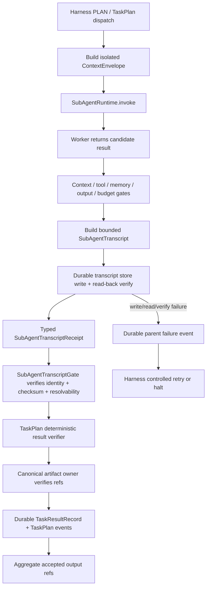

# 阶段 27：Agent Session Retirement 与 SubAgent Transcript Durability PRD

> Document status: `COMPLETE`
> Implementation status: `COMPLETE`
> Version: `v1.1`
> Priority: `P0`（Harness replay/audit 完整性）+ `P1`（obsolete runtime retirement）
> Scope: `framework/harness/subagents`、`framework/harness/task_plan`、Harness artifact verification、Research production composition、obsolete agent-session retirement、operations/docs 及相关 tests/exports/OpenSpec history
> Baseline: 阶段 3C、阶段 4、阶段 20；OpenSpec `harness-runtime`、`harness-dynamic-task-planning`、`harness-taskplan-integrity-hardening`、`harness-context-compaction-verification`；2026-08-12 framework audit
> Delivered OpenSpec changes: `harness-durable-subagent-transcript`、`remove-obsolete-agent-session-runtime`、`close-subagent-artifact-evidence-and-retirement-docs`
> Last updated: `2026-08-13`

## 0. 一句话结论

NewsRoom 仍然需要 subagent isolation、structured handoff、access boundary、lifecycle、compaction、memory authority 和 durable replay，但这些能力已经属于 Harness control plane，不应继续补齐无人使用的 `framework/agent/session` mutable blackboard。

本阶段按不可颠倒的顺序完成两项核心交付，并在交付后审计中追加一次 corrective closure：

```text
Phase A: 先让 production SubAgent transcript 真正 durable、可解析、可校验、可 replay
  -> replacement acceptance gate
Phase B: 再删除 obsolete agent session runtime、AgentLoop hook 和专用 tests
```

不得在 Phase A 未通过前删除旧代码以制造“已经收敛”的假象，也不得为了保留旧代码而给 `AgentRunner` 新增 session store/workspace 参数。

### 0.1 最终交付结果

本 PRD 已按三个有序变更完成。第三个变更来自交付后审计：Phase A 虽已让 transcript/output durable，但 `artifact_refs` 仍只做字符串相等比较；Phase B 虽已删除旧 runtime，但历史 SQLite 文件缺少 operator 处置说明。两处均已在最终验收前补齐，未恢复第二套 session 状态面。

| 阶段 | OpenSpec / 结果 | 关键提交 | 状态 |
| --- | --- | --- | --- |
| Canonical baseline | 归档 `harness-dynamic-task-planning`、`harness-taskplan-integrity-hardening` | `149e5180`、`47a7c201` | 完成 |
| Phase A | durable subagent context/output/transcript bundle、typed receipt、TaskPlan result/event/replay lineage、Research production injection | implementation `db3fda0c`；evidence `06ea9da1`；archive `cf1deec5` | 完成并归档 |
| Phase B | 删除 obsolete agent session packages、AgentLoop hook、AgentSpec policy 和专用传播；保留独立 session owners | implementation `ba874567`；evidence `155722aa`；archive `f8bca8a9` | 完成并归档 |
| Corrective closure | canonical artifact-ref verifier、acceptance/replay 二次校验、durable parent halt、historical SQLite operations boundary | proposal `561020b5`；implementation `3968fc17` | 完成，随本 PRD 收口归档 |

最终边界保持不变：`LLM/subagent as worker, Harness as control plane`。AgentLoop/AgentRunner 不拥有 shared-session 状态，MemoryRuntime 不承载 operational transcript，artifact publication 仍由 Research terminal authority 决定。

## 1. 背景与已确认事实

### 1.1 全框架审查基线

2026-08-12 审查对 `framework/` 下 758 个 Python 文件完成了 AST、定义和内部依赖扫描，约 193,644 行，0 个解析错误，并深读以下生产链路。下表是实施前基线，用于解释缺口来源，不代表 2026-08-13 的 live state：

```text
framework/agent/session
  -> framework/agent/loop
  -> framework/agent/subagents
  -> framework/harness/subagents
  -> framework/harness/task_plan
  -> framework/harness/context
  -> framework/harness/memory
  -> interfaces/composition/research.py
  -> infrastructure/research/context_runtime.py
```

审查确认：

| 事实 | 当前证据 | 结论 |
| --- | --- | --- |
| `AgentSharedWorkspace` 及 session stores 无生产构造点 | 非测试 construction/import scan | 旧 runtime 当前不可达 |
| `AgentLoop` 支持 optional session injection | `framework/agent/loop/loop.py` | hook 只有专用测试使用 |
| `AgentRunner` 不接受 session workspace | `framework/agent/loop/runner.py` | 不应补接第二套状态面 |
| Research dynamic analysis 使用 Harness TaskPlan + SubAgentRuntime | `interfaces/composition/research.py` | 这是现役生产路径 |
| `SubAgentRuntime` 默认构造 `FakeSubAgentTranscriptStore` | `framework/harness/subagents/runtime.py` | production transcript 正文随进程消失 |
| production composition 未注入 durable transcript store | `interfaces/composition/research.py` | restart 后 ref 不可解析 |
| `TaskResultRecord` 持久化 result checksum/ref、output refs 和 gate evidence | `framework/harness/task_plan/store.py` | 没有持久化 subagent transcript lineage |
| `SubAgentTranscriptGate` 只检查 ref 非空 | `framework/harness/subagents/gates.py` | fabricated/unresolvable ref 也能通过 |

### 1.2 旧 shared-session OpenSpec 为什么显示完成

旧 change `paper-agent-shared-session-analysis` 的完成状态不能作为继续维护 `framework/agent/session` 的依据：

1. `tasks.md` 的 `2.1` 用一个 checkbox 同时覆盖 models、workspace、sanitization、access policy、compaction 和 lifecycle，只证明对象存在，没有分别验证生产不变量。
2. 旧 spec 对 lifecycle 只要求写 terminal event，对 compaction 只要求创建 snapshot，对 MemoryRuntime 只要求 append 时写 `MemoryRecord`；没有要求 terminal write rejection、source replacement 或 update/close/clear 一致性。
3. `AgentRunner` integration 从未出现在旧 tasks/spec 中。把它标为“未完成”是后续推导，不是漏做的 requirement。
4. shared-session 代码于 2026-06-02 引入；原 `business/boards/paper_radar` 消费者于 2026-06-05 被 Harness + Research cleanup 删除；该 change 到 2026-07-04 才以全勾选状态进入版本库。
5. package tests 验证了 self-consistency，但没有 production composition、restart、replay 或 crash-boundary acceptance gate。

因此，旧 change 是需要保留的历史记录，不是应合并进 canonical specs 的现役能力定义。

### 1.3 旧 runtime 的已复现缺陷

如果旧 runtime 被重新接入，以下问题会立即成为生产风险：

| 缺陷 | 位置 | 已复现结果 |
| --- | --- | --- |
| private access 依赖 caller-supplied `*-orchestrator` suffix | `framework/agent/session/access_policy.py` | 非可信名称可读 private item |
| 未声明 role 默认可写 | `framework/agent/session/access_policy.py` | access policy 不是 deny-by-default |
| `summary` 绕过 sanitization | `framework/agent/session/workspace.py` | secret-like summary 原样持久化并进入 assembler/snapshot |
| terminal session 不拒绝新 item | `lifecycle.py`、stores | completed session 仍可 append |
| snapshot 不替换 source items/events | `compaction.py`、`workspace.py` | snapshot 存在但 active data 未减少 |
| MemoryRuntime projection 不完整 | `memory_store.py` | update/close/clear 不同步，产生 stale recall |
| context injection 捕获所有异常 | `framework/agent/loop/loop.py` | workspace failure 静默退化为无 shared context |
| SQLite 锁仅限单 store instance | `sqlite_store.py` | 不能成为跨实例/跨进程 coordination authority |

本 PRD 不修补上述缺陷，因为修补会把 obsolete package 提升成第二个控制面。Phase B 直接退休整个能力面。

### 1.4 原始清单逐项处置决策

“需要”指产品仍需要该语义，不代表继续维护旧 `framework/agent/session` 实现：

| 原始范围 | 是否需要 | 本阶段处置 | Canonical owner / replacement |
| --- | --- | --- | --- |
| models 和基本 contract | 需要语义，不需要旧模型 | 不扩展旧 `AgentSession*` contract；有价值的不变量迁入 Harness typed contracts 后删除旧模型 | `framework/harness/subagents`、`framework/harness/task_plan` |
| InMemory/SQLite store 基本 CRUD | production 需要 durability，旧 CRUD 不需要 | test fake 只允许显式注入；删除旧 session InMemory/SQLite stores，不把它们包装成 production adapter | `SubAgentTranscriptStorePort` + `infrastructure/storage/harness` |
| workspace 结构化读写 | 需要隔离输入与可审计输出，不需要 shared mutable workspace | 以 immutable `ContextEnvelope`、structured handoff、durable transcript/result refs 替代 | `framework/harness/context`、`framework/harness/subagents` |
| sanitization（含 summary 缺口） | 需要 | 在 context/transcript allowlist、recursive redaction 和 secret adversarial gate 中闭合；不修旧 workspace summary path | Harness context + transcript gates |
| access policy | 需要 | 使用可信 run/tenant/identity scope 和 capability binding，deny/fail closed；删除 caller-supplied role suffix 规则 | Harness/application inspection boundary |
| lifecycle | 需要 | 由 bounded `PLAN -> EXECUTE -> VERIFY`、TaskPlan transition 和 durable event 约束 terminal/retry/halt；不保留第二套 session lifecycle | Harness + TaskPlan + durable events |
| compaction | 需要 | 使用 Harness context compaction，并验证 source replacement、budget 和 post-compaction VERIFY；旧 snapshot-only compactor 删除 | `framework/harness/context` |
| AgentLoop 直接集成 | 不需要 | 删除 `session_workspace`、hidden input 和 shared context prompt injection | Harness 在 AgentLoop 外部控制上下文 |
| AgentRunner 标准集成 | 不需要，且禁止新增 | 保持 runner 无 session store/workspace 参数，用测试锁定该边界 | AgentRunner 只执行 bounded agent turn |
| MemoryRuntime 一致性 | 需要 memory authority，不需要旧 session projection | 不修旧 append-only projection；memory proposal/commit/recall 继续由 Harness memory contract 负责 | `framework/harness/memory` |

因此，原清单不是十项待补功能：其中七项是必须保留但应由 Harness 闭合的产品语义，两项 AgentLoop/AgentRunner integration 应明确删除或禁止，一项旧 store CRUD 只保留 test fake 价值并由新的 durable transcript port 取代。

## 2. 产品问题与使用者

### 2.1 要解决的问题

1. production `SubAgentRuntime` 返回 `subagent-transcript://...`，但正文只在当前进程的 dict 中，ref 在重启后失效。
2. 当前 transcript gate 只验证字符串存在，不验证 durable commit、checksum、identity binding 或 read-back。
3. TaskPlan accepted/rejected result 和 durable events 没有 typed transcript ref/checksum，operator 不能从 parent run 可靠追到 child invocation evidence。
4. 当前 `output_ref=f"subagent-output://..."` 也是逻辑 URI，未证明能解析到 durable worker result/artifact；durable transcript 不能继续引用虚构资源。
5. 旧 `framework/agent/session` 与 Harness 同时表达 access、lifecycle、context、compaction、memory 和 transcript，形成所有权冲突。
6. 旧 change 若按普通方式 archive，会把已经过期的 shared-session requirements 合并进 canonical specs，制造新的双真相。

### 2.2 目标使用者

| 使用者 | 需要什么 |
| --- | --- |
| Harness/Scheduler | 只有 transcript 已 durable commit 且可验证时，才接受 subagent result |
| TaskPlan runtime | accepted/rejected result、attempt 和 transcript 使用同一 identity/checksum lineage |
| Research production composition | 显式注入真实 durable adapter，启动时拒绝 fake/default fallback |
| Operator/Reviewer | 按 parent run、child run、task instance 或 transcript ref 读取可校验记录 |
| Replay/Recovery runtime | 不重新调用 worker，即可解析当时的 context/output/gate/budget refs |
| Framework maintainer | 删除无调用方的 shared-session runtime，避免维护第二套控制语义 |

### 2.3 核心场景

1. Research dynamic TaskPlan 调用 structure subagent，worker 成功，transcript durable commit 后 result 才能进入 deterministic VERIFY 和 TaskPlan store。
2. 进程在 transcript commit 后、TaskResult commit 前崩溃；恢复使用同一 invocation/attempt identity 读取已有 receipt，不制造冲突 transcript 或重复 side effect。
3. transcript store 不可写、read-back 失败或 checksum 不匹配；TaskPlan 不得接受 worker result，父 Harness 必须写 stable failure reason 并受控 retry/halt。
4. operator 从 `TASK_RESULT_ACCEPTED` event 找到 transcript ref，读取正文并验证 parent/child/task/attempt、gate evidence 和 checksum。
5. offline replay 从 durable result/event/transcript 重建事实，真实 subagent worker 调用数为 `0`。
6. replacement acceptance 通过后，删除旧 session package；Research RAG session、reading session、auth session 等独立领域概念不受影响。

## 3. 目标、成功指标与非目标

### 3.1 产品目标

| ID | 目标 |
| --- | --- |
| AST-Goal-1 | 建立 framework-owned `SubAgentTranscriptStorePort` 和 typed durable receipt |
| AST-Goal-2 | 让 transcript body、receipt、TaskPlan result/event lineage 可持久解析并校验 identity/checksum |
| AST-Goal-3 | 让 persistence failure、tampering 和 missing ref fail closed |
| AST-Goal-4 | 保持 transcript 只保存审计事实、refs 和 bounded summaries，不泄漏 raw/private context |
| AST-Goal-5 | 让每个非空 subagent artifact ref 在 acceptance/replay 时由 canonical owner 绑定 parent run 并校验 manifest/checksum/size/bytes |
| ASR-Goal-1 | 删除没有生产消费者的 `framework/agent/session` 与 `framework/memory/session` |
| ASR-Goal-2 | 删除 AgentLoop shared-session hook，明确禁止 AgentRunner session integration |
| ASR-Goal-3 | 以 OpenSpec supersession/skip-specs 方式保留历史，不污染 canonical specs |

### 3.2 可量化成功指标

| 指标 | 验收阈值 |
| --- | --- |
| production `SubAgentRuntime` 使用 implicit fake store | `0` |
| production subagent attempt 缺少 durable transcript receipt | `0` |
| accepted/rejected TaskPlan result 无法追到 transcript | `0` |
| restart 后 transcript read/verify 成功率 | `100%`（合法 fixture） |
| tampered/missing/mismatched transcript 被接受 | `0` |
| fabricated、cross-run、missing 或 tampered subagent artifact ref 被接受 | `0` |
| duplicate same-identity/same-checksum write | 幂等，新增记录数 `0` |
| duplicate same-identity/different-checksum write | `100%` fail closed |
| replay 期间真实 worker/tool/memory write 调用 | `0` |
| transcript 中 forbidden raw/private keys 或 secret fixture | `0` |
| `AgentSharedWorkspace`、session stores/lifecycle/compactor 的非测试引用 | `0`，随后 symbols/files 删除 |
| `AgentRunner` 新增 session 参数 | `0` |
| retirement 后 mandatory smoke | `0 failed` |

### 3.3 非目标

- 不实现新的 mutable blackboard、shared scratchpad 或通用 agent session database。
- 不把 `AgentRunner`、`AgentLoop` 或 LLM worker变成 workflow/memory/context authority。
- 不删除所有名为 `session_id` 的字段。Research RAG、reading session、project lab、auth session 等独立领域概念不在范围内。
- 不删除 `SubAgentExecutor` 的通用 `run_id`、`workflow_id`、`step_id`、trace 或 checkpoint correlation。
- 不把 transcript 存入 MemoryRuntime；memory 是 recall/experience authority，不是 operational transcript store。
- 不复用 `FilesystemHarnessArtifactPort` 的 Research publication/latest/quarantine 语义来决定 transcript 是否可读。
- 不把大 worker output、raw messages、hidden prompt、sibling history 或 private notes直接嵌入 transcript。
- 不重写 canonical event runtime、TaskPlan scheduler、context compaction 或 Research workflow。
- 不为旧 package 保留永久 compatibility re-export、no-op store 或 feature flag fallback。

## 4. 所有权与系统不变量

### 4.1 Owner matrix

| 能力 | Canonical owner | Production adapter/consumer | 明确禁止 |
| --- | --- | --- | --- |
| SubAgent transcript model/receipt/port | `framework/harness/subagents` | infrastructure durable adapter | business/interface 定义第二套 transcript model |
| transcript physical persistence | `infrastructure/storage/harness` | Research composition 与未来 Harness composition | 默认内存 dict、MemoryRuntime、public Research artifact index |
| invocation/context/handoff gates | `framework/harness/subagents` | `SubAgentRuntime` | AgentLoop shared workspace policy |
| TaskPlan result/event lineage | `framework/harness/task_plan` | durable TaskPlan store/replay | diagnostics dict 成为唯一 durable owner |
| subagent artifact ref integrity | `framework/harness/artifacts` verifier port；具体 artifact adapter 为 physical owner | Research `FilesystemHarnessArtifactPort` | TaskPlan 自建 artifact index、字符串自证、通过 verifier 读取 payload/发布 |
| run event/replay事实 | `framework/events` + Harness transition/event ports | inspection/replay | transcript store决定 workflow route |
| context selection/redaction/compaction | `framework/harness/context` | production ContextAssembler/runtime | `framework/agent/session` assembler/compactor |
| memory proposal/commit | `framework/harness/memory` | approved memory adapter | session store直接写 operational memory |
| workflow/lifecycle decision | Harness control plane | Scheduler/gates | LLM、SubAgentRuntime、transcript store |

### 4.2 强制不变量

1. Harness 是唯一流程控制者；transcript store 只持久化事实，不返回 route、quality verdict、approval 或 publication decision。
2. 每个 `SubAgentInvocation` 对应一个稳定的 transcript identity；identity 必须绑定 parent run、child run、workflow、stage/step、task instance、attempt 和 subagent。
3. transcript write/read/verify 成功发生在 TaskPlan result acceptance 之前。
4. successful/failed/halted subagent 都必须尝试写 transcript；若 transcript 无法 durable commit，父 Harness 记录 persistence failure，原 worker result 不得被接受。
5. 同 identity + 同 checksum 为幂等；同 identity + 不同 checksum 为 conflict/corruption。
6. transcript ref 必须可解析；仅有非空字符串不构成 gate pass。
7. transcript 中的 `context_envelope_ref`、`output_ref`、artifact/tool/memory/gate refs 必须指向真实 owner 可解析或可验证的 durable evidence，不得制造逻辑 URI 冒充已持久化资源。
8. transcript 不保存 raw parent messages、sibling transcript/private notes、hidden prompt、secret、完整大输出或未授权 memory/tool payload。
9. offline replay 只读 durable facts，不重新执行 subagent、LLM、tool、retrieval、memory write 或 publication。
10. Phase B 删除前必须有 production replacement acceptance；删除后不得保留隐式 fallback。
11. 非空 subagent artifact refs 必须由显式 `ArtifactReferenceVerifierPort` 在 acceptance/recovery/replay 重新校验；无 verifier、跨 parent run、missing 或 tamper 全部 fail closed。
12. artifact verification 只证明 ownership/integrity，不返回 payload、不授予 publication visibility；失败在写入 TaskResult 前产生 durable parent `TASK_PLAN_HALTED`。

## 5. 目标运行流程



关键顺序：

```text
worker candidate
  -> deterministic subagent gates
  -> durable transcript body
  -> verified receipt
  -> TaskPlan result verification
  -> canonical artifact-ref verification（仅非空 refs）
  -> durable result/event
  -> next scheduler decision
```

不得先 commit `TASK_RESULT_ACCEPTED`，再异步“尽力写” transcript。

## 6. Durable transcript contract

### 6.1 `SubAgentTranscript`

`SubAgentTranscript` 继续是 framework value model，但必须升级为版本化、可校验、可 roundtrip 的 immutable document。最少字段：

```text
schema_version
transcript_id
invocation_id
parent_run_id
child_run_id
workflow_id
step_id / stage_id
task_id
task_instance_id
attempt
subagent_id
context_envelope_ref
input_refs
tool_call_refs
memory_context_refs
output_ref
artifact_refs
gate_results
budget_snapshot
redaction_report
warnings
errors
events
observed_at
transcript_checksum
```

约束：

- 当前 transcript schema 为 `newsroom.subagent-transcript/v1`；context、output、receipt 和 atomic bundle 使用各自独立的 versioned schema。
- `transcript_id` 由 invocation/attempt identity 稳定生成，不使用随机 suffix。
- `observed_at` 来自 accepted invocation/attempt observation，不在 retry 序列化时重新取当前时间。
- checksum 覆盖除 checksum 自身外的 canonical JSON；map key、tuple/list、reason code 和 gate 顺序必须确定。
- `gate_results` 必须记录 gate id/version、input/evidence ref、pass/fail 和 stable reason code；不得只保存可读 message。
- `events` 是 invocation 内 bounded facts，不复制父 run 完整 event stream。
- payload 大小必须有 production upper bound，默认不超过 `1 MiB`；超限必须改用 durable artifact/result ref，不能截断后假装完整。

### 6.2 `SubAgentTranscriptReceipt`

store write 成功后返回 typed receipt，而不是裸字符串：

```text
SubAgentTranscriptReceipt
  schema_version
  transcript_ref
  transcript_checksum
  transcript_id
  invocation_id
  parent_run_id
  child_run_id
  task_instance_id
  attempt
  storage_revision
  committed_at
```

receipt 必须能与 invocation、transcript body、TaskPlan result 和 event 逐字段核对。`SubAgentResult` 可以直接持有 receipt，或持有等价 typed evidence；不得继续让 `diagnostics["transcript_ref"]` 成为唯一关联渠道。

### 6.3 `SubAgentTranscriptStorePort`

framework port 至少提供以下语义：

```text
write(context, output, transcript) -> SubAgentTranscriptReceipt
read(transcript_ref) -> SubAgentTranscript
read_context(context_ref) -> SubAgentContextEvidence
read_output(output_ref) -> SubAgentOutputDocument
verify(receipt) -> SubAgentTranscriptReceipt
refs_for_parent(parent_run_id) -> tuple[str, ...]
find_by_identity(identity) -> SubAgentTranscriptReceipt | None
```

如实现需要按 child/task 查询，可增加 typed query object，但不提供无边界全库 scan。

port contract：

- `write` 是 immutable/idempotent commit。
- `read` 必须校验 schema、path/ref、size 和 checksum后返回。
- `verify` 必须同时校验 receipt identity、body checksum 和 storage revision；不能只做 existence check。
- parent index 与 body 必须在同一 durability boundary 内提交，或有明确可恢复的 journal/outbox；不得留下 parent ref 指向缺失 body。
- multi-thread、multi-instance 和 multi-process 并发遵循相同 duplicate/conflict 语义。
- storage error 使用 stable typed reason，例如 unavailable、conflict、corrupt、not_found、size_exceeded、identity_mismatch。

### 6.4 Production adapter

production adapter 放在 `infrastructure/storage/harness`，复用现有原子写、path validation、checksum 和 run-scoped storage primitives。具体底层可以是 filesystem 或既有 durable document substrate，但必须满足：

- 不依赖 `business/research`。
- 不借用 Research artifact publication/latest/disposition 语义。
- transcript 跟随 parent run storage root/retention scope，不建立第二个全局 run index。
- 写临时文件、flush/fsync、atomic replace 和 parent index 更新顺序必须有 Windows/Linux contract tests。
- production composition 必须显式构造并注入；`SubAgentRuntime(workers=...)` 不得隐式创建 fake store。
- `FakeSubAgentTranscriptStore` 只允许 tests/fake runtime 显式使用。若框架保留 test-only escape hatch，必须命名为 `allow_test_store=True` 并在 production composition fail closed。

### 6.5 Output/result ref closure

实施结果采用第一种：bounded worker output 作为 durable `SubAgentOutputDocument` 与 transcript bundle 一起原子持久化，`TaskResultRecord` 持有其 canonical ref/checksum。对于 output document 中额外声明的 `artifact_refs`，由各 artifact canonical owner 通过 framework port 校验，不复制 payload。

1. 已采用：worker candidate output 作为 bounded durable result document 保存，transcript/TaskResult/event 共同引用其 canonical ref/checksum。
2. 扩展 artifact refs：`ArtifactReferenceVerifierPort.verify_artifact_ref(ref, expected_run_id=...)` 必须由 canonical owner 实现；Research adapter 校验 ref syntax、parent-run binding、manifest identity、size、checksum 和 bytes，返回 `None` 且不触发 publication resolver。

禁止：

- 使用无法通过 owner reader 解析的 `subagent-output://...`。
- 把完整大 output复制进 transcript 和 TaskPlan store 两份。
- 只持久化 output hash，却把它描述为可读取的 payload ref。

如果某个 subagent output 没有 durable owner，`SubAgentTranscriptGate` 必须拒绝 acceptance，不能降级为 warning。

### 6.6 Artifact reference verification

- 空 `artifact_refs` 合法，保持现有 artifact-free subagent 行为。
- 非空 refs 且未注入 verifier 时，stable reason 为 `task_plan_subagent_artifact_verifier_required`。
- owner 无法验证 malformed、missing、cross-run、stale 或 corrupt ref 时，stable reason 为 `task_plan_subagent_artifact_unverified`，不得泄漏 backend exception/path。
- acceptance 与 offline replay 都必须校验；replay 不得调用 live worker/tool/memory/publication。
- transcript 和 output document 的 artifact tuple 必须完全一致；success `TaskResultRecord.output_refs` 也必须一致。failed TaskResult 不携带 accepted outputs，但 replay 仍从 durable output document 校验失败尝试的 refs。

## 7. TaskPlan 与 event lineage

### 7.1 `TaskResultRecord`

TaskPlan 的 durable result schema 必须显式携带 subagent evidence。可采用 `transcript_ref + transcript_checksum` 或 typed `evidence_refs`，但必须满足：

- 对 `HarnessWorkerType.SUBAGENT` 的成功、失败和 halted attempt 为 required。
- 对非 subagent worker 为 optional，不要求伪造 transcript。
- checksum projection 包含 transcript identity。
- `from_dict()` roundtrip 和旧 schema 处理规则明确。
- verifier 能从 resolved capability binding 判断当前 task 是否必须提供 transcript。

### 7.2 TaskPlan events

以下 durable events 至少携带 transcript ref/checksum 或 evidence ref：

```text
TASK_RESULT_ACCEPTED
TASK_RESULT_REJECTED
TASK_COMPLETED
TASK_FAILED
```

parent Harness event/trace 必须能回答：

- 哪个 invocation/attempt 产生该 result？
- transcript 存在哪里、checksum 是什么？
- 哪些 gate pass/fail？
- output/artifact ref 是否可解析？
- 为什么 retry、halt 或进入下一个 task？

### 7.3 Crash consistency

至少覆盖以下 crash points：

| Crash point | 恢复要求 |
| --- | --- |
| worker 返回后、transcript write 前 | 无 accepted result；按 bounded policy retry/halt |
| transcript body write 后、parent index/receipt 前 | recovery 清理或补齐，不返回 dangling ref |
| receipt commit 后、TaskResult append 前 | 重用同一 receipt；不重复 worker side effect，不写冲突 body |
| TaskResult document 后、result event 前 | durable store reconciliation 补齐同 checksum event/projection |
| result event 后、terminal event 前 | replay/recovery 补齐 terminal transition，不重跑 worker |

若当前 TaskPlan recovery 无法在 receipt commit 后避免重新执行 worker，OpenSpec 必须把 typed invocation outcome/activity result durability作为 Phase A 的阻断任务，而不是通过放宽 duplicate check 绕过。

## 8. Security、privacy 与可观测性

### 8.1 内容边界

transcript allowlist 只包含：

- identity、timestamps、schema/checksum；
- context/input/output/artifact/tool/memory refs；
- gate result、budget snapshot、stable warnings/errors；
- bounded redaction report 和 invocation lifecycle facts。

必须递归拒绝或脱敏：

```text
parent_raw_messages
sibling_raw_history
sibling_private_notes
hidden_prompt
raw_payload
full_text
authorization
cookie
api_key
access_token
refresh_token
password
secret
```

字段名 allowlist 和 secret-value adversarial detector 都要有测试；只过滤固定字段名不算闭合。

### 8.2 Access 与 inspection

- transcript 是 run-scoped diagnostic evidence，不是公开 artifact。
- reader 必须携带可信 parent run/tenant/identity scope，由现有 inspection/application service 做授权；interface 不得直接访问 store。
- sibling subagent 不得通过 `refs_for_parent()` 读取别人的 transcript。
- normal worker context assembly 不得自动注入 full transcript；只能注入 Harness-approved refs/handoff projection。

### 8.3 Events、metrics 与 diagnostics

至少提供以下 stable events/metrics：

```text
subagent_transcript_commit_succeeded
subagent_transcript_commit_failed
subagent_transcript_verify_failed
subagent_transcript_conflict
subagent_transcript_corrupt
subagent_transcript_bytes
subagent_transcript_commit_latency_ms
subagent_transcript_recovery_reused_total
```

event payload 只含 refs、checksum、identity 和 stable reason，不含 transcript 正文或 secret。

## 9. Agent session retirement 范围

### 9.1 删除对象

Phase B 在 replacement acceptance 后删除：

```text
framework/agent/session/**
framework/memory/session/**
tests/framework/agent/session/**
```

并删除以下专属 surface：

- `AgentSessionContextPolicy` 及 `AgentSpec.session_context_policy` serialization/export。
- `AgentLoop(..., session_workspace=...)`。
- `_agent_session_workspace` hidden input path。
- `shared_session_context` prompt injection 和 broad exception fallback。
- `SubAgentExecutor._child_inputs()` 中仅服务旧 shared-session 的 `session_id` metadata propagation；保留通用 `run_id/workflow_id` correlation。
- package `__init__` exports、文档引用、fixture、config 和 architecture allowlist 中的旧 session symbols。

### 9.2 明确保留

下列能力名称相似，但不属于旧 shared-agent-session：

```text
framework/harness/subagents/**
framework/harness/context/**
framework/harness/memory/**
framework/harness/rag/**
business/research/reading_session/**
business/research/application/bounded_document_rag.py
interfaces/services/paper_rag_service.py
auth session / project lab session
AgentRunner conversation cursor/compaction/checkpoint
SubAgentExecutor run_id/workflow_id/step_id/trace propagation
```

不得以 `session_id` 名称相同为理由批量删除。

### 9.3 删除门

删除前必须同时满足：

1. Phase A production composition、restart/replay、tamper 和 failure tests 全绿。
2. `rg`、AST import、package export、entry point、config、fixture/replay audit 证明旧 package 无生产消费者。
3. 没有 SQLite session schema 被当前 production settings/bootstrap 创建。
4. 本地可能存在的 `.newsroom/paper-agent-sessions.sqlite3` 或同类历史数据不得自动删除；release note 标注为 orphaned historical data，由 operator 决定归档。
5. architecture tests 改为断言 obsolete symbols/imports 不存在，而不是删除所有边界保护。

## 10. Functional Requirements

| ID | Requirement |
| --- | --- |
| AST-FR-001 | 系统 SHALL 提供 versioned、immutable、checksum-bound `SubAgentTranscript` 和 typed receipt。 |
| AST-FR-002 | `SubAgentRuntime` SHALL 通过显式 `SubAgentTranscriptStorePort` 写入 transcript；production 不得隐式使用 fake。 |
| AST-FR-003 | Transcript gate SHALL 验证 durable receipt、identity、checksum 和 read-back，不得只检查 ref 非空。 |
| AST-FR-004 | Transcript SHALL 绑定 parent/child/workflow/stage/task/attempt/subagent identity。 |
| AST-FR-005 | TaskPlan result 和 accepted/rejected/terminal events SHALL 保存可追踪的 transcript evidence。 |
| AST-FR-006 | Transcript/output/artifact refs SHALL 可由各自 canonical owner 解析或校验；fabricated ref MUST be rejected。 |
| AST-FR-007 | Transcript persistence/verification failure MUST fail closed，并产生 durable parent failure evidence。 |
| AST-FR-008 | Same identity/same checksum retry SHALL 幂等；same identity/different checksum MUST fail conflict。 |
| AST-FR-009 | Offline replay SHALL 使用 durable facts，真实 worker/tool/memory/publication 调用为零。 |
| AST-FR-010 | Transcript content SHALL 使用 allowlist、redaction、size bound，禁止 raw/private/secret payload。 |
| AST-FR-011 | Production store SHALL 支持 restart、multi-instance concurrency、tamper detection 和 bounded scoped query。 |
| AST-FR-012 | Pre-v1 in-memory transcript SHALL 返回 typed legacy-unavailable diagnostic，不得制造可解析假象。 |
| AST-FR-013 | 每个非空 subagent artifact ref SHALL 在 acceptance 与 replay 时由显式 canonical verifier 按 parent run、manifest、size、checksum 和 bytes 重新校验；无 verifier 或校验失败 MUST 在写入 TaskResult 前 fail closed，且不得读取 payload 或授予 publication visibility。 |
| ASR-FR-001 | Replacement acceptance 后系统 SHALL 删除 `framework/agent/session` 与 `framework/memory/session`。 |
| ASR-FR-002 | 系统 SHALL 删除 AgentLoop shared-session policy/workspace/prompt injection surface。 |
| ASR-FR-003 | 系统 MUST NOT 向 AgentRunner 添加 session store/workspace integration。 |
| ASR-FR-004 | Retirement SHALL 保留 Harness context/memory/RAG、conversation 和独立业务 session 能力。 |
| ASR-FR-005 | 旧 `paper-agent-shared-session-analysis` SHALL 以 historical superseded 方式归档，且不得把旧 specs merge 到 canonical specs。 |
| ASR-FR-006 | Retirement SHALL 不保留 compatibility layer、feature fallback 或 no-op session implementation。 |
| ASR-FR-007 | 遗留 `.newsroom/paper-agent-sessions.sqlite3` SHALL 被视为 operator-owned orphaned historical data；production runtime 不得自动创建、读取、迁移、归档或删除，并必须提供 operations note。 |

## 11. OpenSpec 拆分与实施顺序

### 11.0 Canonical baseline precondition

创建 Change A 前，必须先把它要修改的 capability 变成 canonical truth：

1. 重新核验 `harness-dynamic-task-planning` 与 `harness-taskplan-integrity-hardening` 的 live tasks、strict validation、implementation commits 和 regression evidence。
2. 若二者仍为完成态 active changes，按依赖顺序先正常归档 `harness-dynamic-task-planning`，再归档 `harness-taskplan-integrity-hardening`，确认 `openspec/specs/harness-task-plan`、`harness-taskplan-integrity` 和修改后的 `harness-runtime` 成为 main specs。
3. 若任一 change 不能安全归档，必须先解决其真实阻断并暂停本阶段；不得让 Change A 修改另一个未归档 active change 的 private delta，也不得复制一个平行 capability 绕过阻断。
4. 归档前后都必须运行 `openspec validate --all --strict`，并检查 main spec diff 没有丢失 TaskPlan authority、durability 或 replay requirements。

### 11.1 Change A：`harness-durable-subagent-transcript`

Change A 负责：

1. transcript model/receipt/port/schema/checksum。
2. durable infrastructure adapter 与 explicit production composition。
3. transcript gate 从 truthy ref 升级为 durable verification。
4. output/result ref closure。
5. TaskPlan result/event/replay lineage。
6. crash/restart/concurrency/tamper/security tests。

Change A 的 delta spec 必须修改 canonical `harness-runtime` 中“isolated subagents”和“durable transcript/replay” requirements，并修改 canonical `harness-task-plan` 的 result/event/replay requirements；不得另建平行的 `subagent-transcript` 或 TaskPlan capability。若第 11.0 节尚未完成，Change A 不得开始。

Change A 不删除旧 session package。完成后运行 strict validation、targeted/broad tests 和 mandatory smoke，单独提交并正常归档，使 durable replacement contract 成为 canonical spec。

### 11.2 Replacement acceptance gate

只有以下全部成立才可开始 Change B：

- production Research dynamic TaskPlan 使用真实 transcript adapter。
- successful/failed/halted attempt 都有可读取 receipt。
- crash matrix、offline replay、tamper 和 secret tests 通过。
- TaskPlan result/event schema migration和旧 reader行为明确。
- Change A 已正常归档，canonical `harness-runtime` 与 `harness-task-plan` 已包含 durable replacement requirements。
- full smoke 通过。

### 11.3 Change B：`remove-obsolete-agent-session-runtime`

Change B 负责：

1. 再次执行 production/export/dynamic-entry/config/replay inventory。
2. 删除第 9.1 节对象。
3. 更新 architecture/import tests 和 docs。
4. 验证 retained sessions/RAG/conversation contracts 不受影响。
5. 在 Change B implementation 和 replacement evidence 完成后、Change B 正常归档前，将旧 `paper-agent-shared-session-analysis` 使用 `openspec archive paper-agent-shared-session-analysis --skip-specs` 归档。

Change B 应修改 canonical `legacy-runtime-cleanup` requirement，记录旧 shared-agent-session runtime 的 replacement evidence 和删除边界；不得新建一个永久的 `agent-session-retirement` capability。

`--skip-specs` 是强制要求：旧 change 从未成为当前 canonical capability，普通 archive 会把过期 shared-session SHALL 合入 main specs。归档动作必须保留 proposal/design/tasks/specs 作为历史证据，并在 Change B evidence 中记录 superseded reason 和 replacement refs。旧 change 归档及 canonical diff 验证完成后，Change B 才能正常归档到 `legacy-runtime-cleanup`。

### 11.4 Corrective closure：`close-subagent-artifact-evidence-and-retirement-docs`

Phase A/B 交付后执行 requirement-by-requirement 审计，并以第三个独立 change 闭合两项未被原 acceptance oracle 捕获的缺口：

1. 在 `framework/harness/artifacts` 定义 read-only `ArtifactReferenceVerifierPort`，由 artifact canonical owner 实现。
2. TaskPlan acceptance 与 replay 对非空 subagent `artifact_refs` 重新校验；无 verifier 或 owner 校验失败时使用 stable reason fail closed，并在 parent stage 记录 durable `TASK_PLAN_HALTED`。
3. Research production composition 注入其 `FilesystemHarnessArtifactPort`，验证只证明 ownership/integrity，不调用 publication resolver，也不返回 payload。
4. 发布 `docs/operations/agent-session-retirement.md`，明确历史 SQLite 文件是 operator-owned orphaned data，NewsRoom 不自动访问或删除。

该 change 正常归档到 canonical `harness-runtime`、`harness-task-plan` 和 `legacy-runtime-cleanup`，不创建新的平行 capability。

## 12. 代码影响面

| 位置 | 处理 |
| --- | --- |
| `framework/harness/subagents/transcript.py` | 升级 model，新增 receipt/port 或拆分为清晰 modules |
| `framework/harness/subagents/runtime.py` | 强制显式 store，调整 durable write/failure ordering |
| `framework/harness/subagents/gates.py` | transcript gate 做 identity/checksum/read-back validation |
| `framework/harness/subagents/models.py` | `SubAgentResult` 使用 typed transcript evidence |
| `framework/harness/task_plan/capability.py` | invocation 注入完整 task/attempt identity |
| `framework/harness/task_plan/verification.py` | 验证 subagent transcript requirement 与 lineage |
| `framework/harness/task_plan/store.py` | versioned `TaskResultRecord`/event evidence fields |
| `framework/harness/task_plan/durable_store.py` | durable roundtrip、migration、recovery/reconciliation |
| `framework/harness/task_plan/replay.py` | replay 校验 transcript evidence，不调用 worker |
| `framework/harness/artifacts/ports.py` | 定义 canonical artifact-ref read-only verification port |
| `infrastructure/research/artifact_port.py` | 实现 run-bound manifest/checksum/size/bytes 校验，不授予 publication visibility |
| `infrastructure/storage/harness/` | 新增 production durable transcript adapter |
| `interfaces/composition/research.py` | 显式构造/注入 adapter，移除 diagnostics-only ref wiring |
| `framework/agent/session/**` | Change B 删除 |
| `framework/memory/session/**` | Change B 删除 |
| `framework/agent/models/spec.py` | Change B 删除 session policy 字段/serialization |
| `framework/agent/loop/loop.py` | Change B 删除 session workspace/context hook |
| `framework/agent/subagents/executor.py` | Change B 仅删除 obsolete `session_id` metadata propagation |
| `tests/framework/agent/session/**` | Change B 删除；有价值的不变量迁到 Harness tests |
| `docs/operations/agent-session-retirement.md` | 记录历史 SQLite 数据的 operator ownership 与显式处置边界 |

如果 OpenSpec design 发现 canonical event/activity store 已能无重复地承载 transcript body，可调整 infrastructure 文件名，但不得改变 owner matrix、durability gate 或不使用 Research publication semantics 的要求。

## 13. 测试与证据计划

### 13.1 Unit/contract tests

- transcript canonical serialization/checksum roundtrip。
- required identity 和 schema version validation。
- forbidden nested keys、secret fixture、size boundary。
- receipt/body identity mismatch。
- same/same idempotency 和 same/different conflict。
- transcript gate 对 missing、fabricated、corrupt、stale receipt 的拒绝。
- successful/failed/halted transcript content。
- fake store 只能显式注入。

### 13.2 Durable adapter tests

- close/reopen 后 read/verify。
- temp write/atomic replace failure 不产生 dangling index。
- checksum/path/schema/size tamper fail closed。
- two instances/processes 并发写同 identity 的 deterministic outcome。
- parent refs 顺序、去重和 scoped lookup。
- Windows 文件占用/replace 语义和 Linux 等价 contract。

### 13.3 TaskPlan/Research integration tests

- production-like Research composition 注入非 fake store。
- structure/contribution/experiments 每个 attempt 都产生 durable receipt。
- `TASK_RESULT_ACCEPTED/REJECTED` 和 terminal events 携带 transcript evidence。
- restart 后从 event -> result -> transcript -> output/artifact refs 全链可解析。
- transcript store unavailable 时 accepted result 数为零。
- transcript commit 后 crash 的 recovery 不重复 worker side effect。
- offline replay worker/tool/memory/publication calls 均为零。

### 13.4 Retirement tests

- obsolete packages/symbols/exports/config/docs references 为零。
- `AgentSpec` roundtrip 不再接受/输出 `session_context_policy`。
- `AgentLoop` 不接受 `session_workspace` 或 `_agent_session_workspace`。
- `AgentRunner` signature 没有 session store/workspace。
- `SubAgentExecutor` 保留 `run_id/workflow_id/step_id`，不再特殊传播 shared-session `session_id`。
- Harness RAG、Research reading session、auth/project lab session、conversation cursor/compaction tests 继续通过。
- production source 不得重新创建、访问或自动删除 retired SQLite path，operations note 不得丢失。

### 13.5 Artifact evidence closure tests

- fabricated ref 即使同时出现在 worker result、output document 和 transcript 中也必须拒绝。
- missing verifier、malformed/missing/cross-run/tampered ref 返回固定 reason，不泄漏 backend path/exception。
- valid ref 在 acceptance 与 replay 均由 canonical owner 验证；replay live worker/tool/memory/publication 调用为零。
- artifact verification failure 在 durable parent store 中形成 `TASK_PLAN_HALTED`，且不追加 TaskResult。
- production Research composition 注入真实 artifact owner，不使用 fake 或 string-only verifier。

### 13.6 已执行验证命令

Change A：

```powershell
openspec validate harness-durable-subagent-transcript --strict
python -m scripts.dev compile
python -m pytest tests/framework/harness/subagents tests/framework/harness/task_plan -q
python -m pytest tests/business/research/integration/test_dynamic_paper_analysis_task_plan.py tests/interfaces/composition -q
python -m scripts.dev smoke
```

Change B：

```powershell
openspec validate remove-obsolete-agent-session-runtime --strict
python -m scripts.dev compile
python -m pytest tests/framework/agent tests/framework/harness tests/business/research tests/architecture -q
python -m scripts.dev smoke
openspec validate --all --strict
```

Corrective closure：

```powershell
openspec validate close-subagent-artifact-evidence-and-retirement-docs --strict
python -m pytest tests/framework/harness/task_plan tests/framework/harness/subagents tests/framework/harness/workers -q
python -m pytest tests/infrastructure/research/test_artifact_port.py tests/interfaces/composition tests/architecture/test_obsolete_agent_session_retirement.py -q
python -m scripts.dev compile
python -m scripts.dev smoke
openspec validate --all --strict
```

必须使用 `./.venv/Scripts/python.exe` 对应的项目解释器执行 Python checks；上面的 `python` 表示该解释器，不表示系统 Python。

## 14. 需求、任务与测试映射

OpenSpec `tasks.md` 和 `evidence.md` 必须维护以下映射，不能用一个总 checkbox 表示全部完成：

| Requirement group | Accountable tasks | Required evidence |
| --- | --- | --- |
| AST-FR-001..004 | model/receipt/port/identity tasks | unit roundtrip、schema/checksum、invocation binding tests |
| AST-FR-005..006 | TaskPlan lineage + output ref closure tasks | durable result/event/ref resolution integration tests |
| AST-FR-007..009 | failure/recovery/replay tasks | crash matrix、zero-live-call replay、stable reason evidence |
| AST-FR-010..012 | security/store/legacy tasks | adversarial redaction、restart/concurrency/tamper、legacy diagnostic tests |
| AST-FR-013 | canonical artifact verifier + TaskPlan acceptance/replay tasks | fabricated/missing/cross-run/tamper、valid owner、durable halt、zero-live-call replay tests |
| ASR-FR-001..003 | package/hook/API deletion tasks | import/export/signature inventory + focused tests |
| ASR-FR-004 | retained capability regression task | RAG/reading/auth/conversation suites |
| ASR-FR-005 | OpenSpec historical archive task | `--skip-specs` command/result + canonical spec diff |
| ASR-FR-006 | compatibility absence task | zero shim/fallback/no-op scan + architecture test |
| ASR-FR-007 | historical data operations boundary task | protected operations note + production path recreation/access/deletion scan |

每项 requirement 必须映射到一个 accountable task、一个 passing test/evidence 和一个 implementation commit。三个 changes 不得共用“全部 smoke 通过”替代各自的局部 oracle。

## 15. 验收标准

### 15.1 Phase A functional acceptance

- production composition 不再构造 implicit `FakeSubAgentTranscriptStore`。
- 每个 production subagent attempt 都有 typed、可读取、checksum-valid receipt。
- transcript/output/evidence refs 可解析且 identity 一致。
- persistence failure、tamper、missing ref、conflict 全部 fail closed。
- accepted/rejected TaskPlan result 和 terminal event 可追到同一 transcript。
- restart/recovery/offline replay 满足第 7.3、13.3 节要求。

### 15.2 Phase B architecture acceptance

- `framework/agent/session`、`framework/memory/session` 和专用 tests 已删除。
- AgentLoop/AgentSpec/AgentRunner 不再暴露 shared-session state plane。
- Harness context/memory/subagent/TaskPlan 是唯一对应 owner。
- 不存在 compatibility re-export、feature fallback、no-op implementation 或 production fake。
- 同名但独立的 RAG/reading/auth/project/conversation session 能力全部保留。

### 15.3 Release acceptance

- 三个 OpenSpec changes 分别 strict-valid，并按 Phase A、Phase B、corrective closure 的依赖顺序交付。
- 每个 change 的实现和 evidence 分别提交；Change A commit 在 Change B 之前，corrective closure 在交付后审计之后。
- `python -m scripts.dev smoke` 三次验收均为 `0 failed`。
- `openspec validate --all --strict` 通过。
- 旧 change 使用 `--skip-specs` 归档后，canonical specs 没有新增 `agent-shared-session`、paper agent orchestrator 或 SQLite session default requirements。
- worktree 只包含本阶段预期文件，不混入其他 active changes。

### 15.4 最终验收证据

| 范围 | Evidence / commit | 验证结果 |
| --- | --- | --- |
| Canonical baseline | `149e5180`、`47a7c201` | 两个 TaskPlan baseline changes 按依赖归档，strict-valid |
| Phase A | implementation `db3fda0c`；evidence `06ea9da1`；archive `cf1deec5` | focused `160 passed`；smoke `2090 passed, 23 deselected`；OpenSpec all-strict `525 passed, 0 failed` |
| Phase B | implementation `ba874567`；evidence `155722aa`；archive `f8bca8a9` | main regression `2128 passed, 23 deselected`；smoke `2096 passed, 23 deselected`；OpenSpec all-strict `524 passed, 0 failed` |
| Corrective closure | proposal `561020b5`；implementation `3968fc17`；本 change `evidence.md` | Harness focused `94 passed`；Research/composition/architecture focused `52 passed, 2 skipped`；compile PASS；smoke `2100 passed, 23 deselected`；source validation `0 errors, 0 warnings`；change strict 与 all-strict PASS |

Phase A/B 的 requirement-level evidence 位于各自 2026-08-13 archive 的 `evidence.md`；corrective evidence 随本 PRD 收口后进入对应 archive。以上通过项均为 live tree 实测，不以 tasks checkbox 代替。

## 16. 风险、回滚与运行保护

| 风险 | 保护措施 |
| --- | --- |
| transcript 与 TaskResult 跨 store 部分提交 | transcript-first、deterministic identity、idempotent receipt、TaskPlan reconciliation |
| transcript 写失败导致可用性下降 | fail closed + bounded retry/halt；禁止回退 fake，先修 storage/root cause |
| transcript 泄漏 private context | allowlist model、recursive forbidden-key/secret tests、refs-only large payload policy |
| filesystem 多进程竞争 | atomic write/lock/conflict contract；无证明时不得声明 multi-process ready |
| schema 升级破坏 replay | versioned reader、checksum projection、fixture replay；旧 in-memory ref 返回 typed unavailable |
| 删除误伤其他 session 概念 | 精确路径/symbol inventory，禁止按 `session_id` 文本批量删除 |
| 旧 OpenSpec 污染 main specs | 只用 `archive --skip-specs`，并验证 canonical spec diff |
| rollback 把 production 恢复到 fake | Change A 与 B 独立提交；回滚 B 可恢复旧代码，绝不以 fake 作为 A 的运行 fallback |

发布顺序：

1. Change A schema/reader + durable adapter。
2. production composition 切换并观察 transcript commit/read/verify metrics。
3. restart/replay acceptance 和 soak window 通过。
4. Change B 删除旧 runtime。
5. 归档旧 change，验证 canonical specs 未变化。
6. requirement-by-requirement audit 发现 artifact owner 和 historical-data documentation 缺口后，以 corrective change 补齐并重新执行全量 gates。

若 Change A 上线后 durable store 持续失败，应暂停 dynamic subagent admission或让 Harness 受控 halted；不得切回进程内 fake 后继续对外宣称可 replay。

## 17. Definition of Done

- [x] TaskPlan 两个完成态 baseline changes 已按依赖归档；不存在跨 active change 的平行 spec。
- [x] `harness-durable-subagent-transcript` 已正确修改 canonical `harness-runtime` 与 `harness-task-plan`，strict-valid、完成、单独提交并归档。
- [x] production transcript body、receipt、TaskPlan result/event lineage durable 且可解析。
- [x] transcript gate 验证 identity/checksum/read-back，不再只看 truthy ref。
- [x] transcript/output refs 有 canonical durable owner；非空 artifact refs 由 canonical artifact verifier 在 acceptance/replay 校验。
- [x] artifact verifier 缺失或 malformed/missing/cross-run/tampered ref 会在 TaskResult 前 fail closed，并留下 durable parent halt evidence。
- [x] crash/restart/concurrency/tamper/security/offline replay tests 通过。
- [x] replacement acceptance gate 全部通过。
- [x] `remove-obsolete-agent-session-runtime` 已 strict-valid、完成、单独提交并归档。
- [x] obsolete packages、AgentLoop hook、AgentSpec policy、专用 `session_id` propagation 和 tests 已删除。
- [x] 无 AgentRunner session integration、compatibility layer、production fake 或 stale config。
- [x] retained RAG/reading/auth/project/conversation session suites 通过。
- [x] 旧 `paper-agent-shared-session-analysis` 已使用 `--skip-specs` 归档，历史保留且 canonical specs 未被污染。
- [x] historical SQLite 数据已明确为 operator-owned orphaned data；production 不自动访问或删除，operations note 有 architecture guard。
- [x] 三个 changes 的 focused tests、compile、mandatory smoke、change strict 与最终 `openspec validate --all --strict` 全部通过。

## 18. 后续维护护栏

```text
- Harness 是唯一控制面，LLM/subagent 只生成 candidate。
- production SubAgentRuntime 必须显式注入 durable transcript store，禁止 implicit fake。
- transcript 必须 versioned、checksum-bound，并绑定 parent/child/workflow/stage/task/attempt identity。
- transcript gate 必须验证 durable receipt、identity、checksum 和 read-back，不能只检查 ref 非空。
- TaskPlan result/events 必须保存 transcript lineage；非空 artifact refs 必须由 canonical owner 在 acceptance/replay 校验。
- persistence failure、tamper、missing/conflicting ref 必须 fail closed。
- offline replay 不得调用真实 worker/tool/memory/publication。
- 不得恢复 framework/agent/session、framework/memory/session、AgentSessionContextPolicy 或 AgentLoop shared-session hook。
- 不给 AgentRunner 增加 session 参数，不保留 compatibility layer，也不建立第二套 transcript/artifact owner。
- 不删除 Harness RAG、Research reading session、auth/project lab session、conversation cursor/compaction 或通用 run/workflow correlation。
- 不自动读取、迁移或删除 .newsroom/paper-agent-sessions.sqlite3；历史数据处置必须由 operator 显式决定。
- 后续修改这些边界必须通过新的 OpenSpec change、范围匹配 tests、mandatory smoke 和 strict validation。
```
