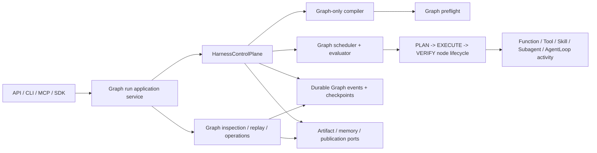

## Context

截至 2026-08-14，NewsRoom 的 Research 主运行路径已经不是传统线性 Workflow：`business/research/workflows/paper_analysis_workflow.py` 构造显式 `HarnessGraphSpec`，`ResearchSinglePaperRuntime` 通过 `HarnessControlPlane` 执行，真正的调度状态由 `NormalizedHarnessGraph`、Graph evaluator、Graph scheduler 和 durable Graph state 决定。

但“Graph 已经执行”不等于“Workflow 已经退役”。当前树仍有四层遗留：

1. `framework/harness/graph` 已接管 DSL、condition、canonical serialization、activity model、normalized Graph model、validation、preflight、runtime binding authority、runtime resolution、Graph-native version constants 和不可变 `HarnessGraphDefinition`；`framework.harness` root 已不再 re-export legacy declaration/compiler/reader/registry/routing names，但 `framework/harness/workflow` package facade 仍保存 compiler 和 legacy reader、仍公开 `HarnessWorkflowSpec`，并允许 legacy declaration 编译成 Graph。Graph-owned `HarnessGraphRuntimeResolver` 与 `HarnessGraphPreflight` 都只消费 checksum-bound exact-schema `NormalizedHarnessGraph`，旧 Workflow resolver/preflight 模块均已删除且没有 shim；但当前 control-plane composition 仍会从 legacy Workflow declaration 构造 Graph 与 live binding authority。已迁入的 `NormalizedHarnessGraph` 仍携带 task 2.5 才会删除的 legacy Workflow identity fields。
2. 通用 `framework/workflow` 仍有 92 个 tracked files，覆盖 buffer、checkpoint、compiler、governance、inspection、operations、routing、runners、runtime、scheduling 和 specs。
3. `framework/__init__.py`、artifact、event、inspection、operation、storage、Research composition 和 `scripts/dev.py` 仍存在旧 package、旧类型或旧 identity 的直接依赖；canonical OpenSpec 也有多项要求明确要求保留 `WorkflowRunner`、`WorkflowExecutor`、`AgentLoopStepRunner`、`DataBuffer` fencing、`buffer_updates` 或 import compatibility。
4. 已归档的 `graph-artifact-cost-retention` 已经落地 `framework/harness/artifacts/{catalog,governance,reporting,runtime}`、`SQLiteGraphResultStore` governance ledger、`FilesystemGraphArtifactLifecycle` 和 operator surface，但该 change 明确没有删除 legacy Workflow artifact writer。旧 `ArtifactManager`、Research publisher、artifact inspection caller 仍依赖 `framework.workflow`，新 lifecycle 也仍从 `framework.workflow.runtime.manifest` 导入 `manifest_hash`。

这不是把一个目录改名即可完成的工作。如果先删 `framework/workflow`，artifact/replay/approval 等真实职责会一起丢失；如果只把类名改成 Graph，legacy compiler 和 persisted Workflow identity 仍会保留第二套权威。因此采用“冻结新增依赖 -> 迁出可复用职责 -> 切换 Graph-only contract -> 离线迁移历史 -> 切换所有调用方 -> 删除 runtime -> 删除迁移窗口”的顺序。

当前 worktree 已完成多项 replacement owner contract，并开始把 Graph compiler、run admission、Research composition、durable state/event/checkpoint、TaskPlan、Context、Artifact、operation/inspection 和 storage caller 接入唯一 live Graph path。早期 Gate A/B/C 术语只描述对应提交当时的分片状态；它们不再限制 writer/reader、public schema、dispatcher 或 legacy deletion。未完成项全部属于本 change 的直接实现范围，按 replacement contract、caller migration、focused tests 和 zero-reference evidence 推进。Artifact 能力被保留并迁到独立 owner，不是被删除；Graph manifest/integrity failure 在 artifact inspection application boundary 继续映射到 canonical `ArtifactChecksumMismatchError`、`ArtifactStoreMetadataError` 和 `ArtifactNotFoundError`，legacy Workflow manifest 只返回 typed quarantine/history diagnostic。

Task 2.8 的 Gate A definition contract 已由 commit `13a207daa45334c11a5b80cab3721831df5281b3` 落地：strict `HarnessGraphDefinition` v4 以独立 `HarnessGraphRepairBinding` 固定 source node、独立 repair node、repair activity 和 `worker_failure_after_retry_exhaustion`/`verification_failure` triggers，并拒绝任何 leaf-owned `repair_step_id`；exact source、binding target、root/control node identity 与 `(source, trigger)` 均 fail closed 且参与 canonical checksum。现有 legacy compiler、normalized repair contract、scheduler/replay 和 production composition 仍读取过渡 `repair_step_id`，所以 task 2.8 保持开放；当前 contract slice 不切换 production Graph schema、writer 或 runtime composition，证据见 `evidence/graph-definition-repair-binding-contract.json`。

上述 v4 记录是历史提交事实；commit `2462b2e5f316755d989ba4f943990589bcdae7c2`（tree `4d5b22ad35244a0f16345092254b6e09c0e29fd7`）将当前 strict `HarnessGraphDefinition` 升级为 v5，在不改变 repair authority 的前提下新增 `HarnessGraphCommittedNodeOutputBinding`。binding 固定 exact producer/consumer activity、两端 root node、producer output key 与独立 receipt input key，并要求 producer 在所有合法路径上确定性先于 consumer；同一 `BoundedLoop` 内的 iteration identity 尚无 selection lineage，因此直接 fail closed。`HarnessCommittedNodeOutputReceipt` 进一步绑定 v5 definition checksum、exact producer activity contract、Graph/node-instance resource、完整 immutable commit/candidate 与 output ref；inactive resolver 只从 `HarnessNodeOutputResourcePort` 读取当前 commit、重算 payload checksum，并对任何 identity、binding、commit 或 payload mismatch fail closed。该 slice 仍未提供 definition-to-normalized compiler lineage，也未接管 live physical executor；Reader Repair v1 刻意保持空 binding，故 task 2.4、2.10、3.6、4.13、5.5、5.7 均保持开放。Artifact owner/runtime/storage/publication authority 未改变，证据见 `evidence/harness-committed-node-output-binding-contract.json`。

commit `107fa2e8eee999da3cd9428967c90fcadbb4d246`（tree `561edd064f5dd2c7eb971ba8a0c09ac396f2d3e1`）进一步把 inactive Reader Repair declaration 升级为 `research.reader_repair.graph@2`。v2 不使用 `BoundedLoop` 承载 repair，因为 committed-output contract 尚无 loop iteration lineage；它保持唯一 10-step success sequence，并用 4 条独立 `HarnessGraphRepairBinding` 把 proposer/application/observation/verification node 的 exhausted worker failure 或 deterministic verification failure 回送到 proposer，后续 scheduler 只能在 run-level `max_replans`/`max_turns` 和 local retry budget 内执行该 topology。application Function 的 exact committed binding 跨越 observation/verification，最终 consumer 只能从 Harness receipt 获得该 producer output identity。业务 `ReaderRepairCommittedOutputProof` 只投影 definition、resource、commit、node-instance、output、receipt 与 after-payload checksums；`ReaderRepairCommittedResultGate@1` 仍读取完整 receipt、重算全部 deterministic verification 和 expected result，任何 substitution 或 checksum mismatch 都 fail closed。

该设计 slice 没有把 inactive receipt resolver 安装到 production executor，也没有把 v2 gate/worker registry 注入 `single_paper_runtime.py` 或 `interfaces/composition/research.py`。Graph-only compiler lineage、live resource current-commit verification、run admission、legacy service removal 和 separate failed-repair terminal policy 仍是后续 activation 工作；在这些完成前，v2 definition 不具备 production authority。Reader Repair 不声明 Artifact handler/publication policy，Artifact owner/runtime/storage/publication 完全保留。证据见 `evidence/research-reader-repair-graph-v2-contract.json`。

commit `f61fcf8f3655d17813a82b15a8abe40139befb31`（tree `e03b48c78578fb1775661224703b1ed4499192b7`）在不激活 production 的前提下补齐了 definition-level registration shape。`ReaderRepairRuntimeBindingBundle` 只包含 immutable Graph v2 definition 与 composition candidate `HarnessRuntimeBindingAuthority`；builder 从 definition 的 10 条 leaf binding 构造 exact worker/activity/leaf registrations，只注册 Graph 实际声明的 gate，并仅绑定 `research.reader_repair.memory.commit@1`。implementation map 必须零缺失、零多余，worker identity/version/type、leaf kind、activity identity 和 gate ref 继续由现有 authority fail closed；memory handler 必须实现 worker-origin `prepare()` 与 controller-terminal `commit()`，避免 worker 阶段直接落库。manifest 的 `installs_runtime_authority=false` 描述 builder 行为，不是 feature flag，也不能由业务 run 翻转。

该 bundle 没有被 `single_paper_runtime.py` 或 `interfaces/composition/research.py` 导入或调用，测试 implementation 也不属于 production registry。因此不能把“bundle 可构造”误报为 task 5.5/5.7 完成：仍需 Graph-only compiler 与 final admission、live committed-output receipt injection、composition-owned authority installation、legacy direct-write removal 和 failure terminal policy。Reader Repair registration 不包含 Artifact handler；若 repaired payload 将来需要公开 publication，仍必须走独立 Artifact-owned terminal contract。

后续 inactive Function implementation slice 为 Graph v2 的 8 个 `Function` leaf 补齐 exact worker：detect/context/apply/verify/result/case/strategy/memory 均由普通函数或 service 完成，LLM/SubAgent 仍只负责 patch 与 observation candidate。`ReaderRepairMemoryRecallPort` 将 context worker 限制在只读 recall；composition-owned `ReaderRepairRunAuthorityResolver` 提供 stable run timestamp 与 scope；composition-owned `ReaderRepairCommittedOutputResolver` 从 durable node-output owner 解析当前 receipt，worker 不接受 caller receipt。为允许 committed result 重算 verification，`build_repair_result` 的显式 business input 增加 `reader_payload`，Graph checksum 更新为 `sha256:d14a1951a8493de4366e83e28c417cf9a5c68d6bdbbe60d67fc4d411f8544560`；receipt key 继续与普通 input keys 分离。case/strategy timestamp 绑定 admitted run/issue timestamp，重试输出保持 canonical；memory leaf 仅返回 candidate 和 worker-origin intent，prepare/commit authority 仍归 Harness。该 factory 未从 Graph package facade 或 production composition 导出，故仍需真实 SubAgent/activity adapter、live executor/resolver wiring、Graph-only admission 和 production authority installation。Artifact owner/runtime/storage/publication 没有变化。

该 Function worker slice 由 commit `ce95db5ce9127aac9ad4eb151acc4d204823debd`（tree `7268a0ca7fe3b5b283a01635701aa81daea7ed97`）固化。focused Function/Graph/runtime tests 为 `19 passed`，Reader Repair full surface 为 `125 passed`，architecture 为 `196 passed, 4 warnings`，mandatory smoke 为 `2632 passed, 23 deselected, 22 warnings` 且 source validation `true/0/0`，OpenSpec 全量严格校验为 `533 passed, 0 failed`；证据见 `evidence/research-reader-repair-function-worker-contract.json`。验证不改变 inactive/production activation 边界。

后续 inactive SubAgent implementation slice 为 Graph v2 的两个 `SubAgent` leaf 补齐 exact worker：`propose_repair_candidate` 和 `collect_repair_application_observation` 仅经 `ResearchCandidateWorkerPort` 请求 patch/observation candidate，不消费 `workflow_id`，也不拥有 routing、gate、memory、skill promotion 或 publication authority。LLM 不得提供 `candidate_id`、operation id、expected-before checksum、input bindings、application identity 或 observation source projection；这些字段由普通函数基于 canonical proposal、verified inputs 和当前 typed payload component 生成。worker 只做 exact task/model boundary 与 deterministic enrichment，最终 patch/source scope、application fidelity 和 observation verdict 仍由既有 deterministic gates 决定。factory 未从 Graph facade 或 production composition 导出；在该 SubAgent 提交时，structured provider adapter 也尚未注册两个 Reader Repair candidate task，因此该 slice 不激活 production。

该 SubAgent worker slice 由 commit `c9f4b3f6f7e9fc3b36cac28f9b24412fa073e53b`（tree `fb44a8192161a250fa8363367c1ff771d5460630`）固化。focused SubAgent/Function/runtime tests 为 `20 passed`，Reader Repair/Research Graph surface 为 `131 passed`，architecture 为 `196 passed, 4 warnings`，mandatory smoke 为 `2640 passed, 23 deselected, 22 warnings` 且 source validation `true/0/0`，OpenSpec 全量严格校验为 `533 passed, 0 failed`；证据见 `evidence/research-reader-repair-subagent-worker-contract.json`。在该提交时，真实 activity implementation、provider-backed structured candidate adapter、live executor/receipt injection、Graph-only admission、production authority installation、legacy cleanup 与 failure-terminal policy 仍保持开放，故 task 3.6、5.5 和 5.7 均不勾选。

后续 inactive structured candidate slice 将两个 Reader Repair candidate task 的 provider contract 收敛到 `business/research/ports/reader_repair_candidate.py`：domain-derived schema 递归删除 metadata 以及 candidate/operation/application/input-binding 等 controller-owned fields，所有 object boundary 使用 strict `additionalProperties=false`，所有数组和字符串受界；`ResearchTable.rows`、`ResearchAnalysis.quality` 与 `ResearchEvidencePack.coverage` 的动态 map 使用显式 entries 数组，coverage value 限定在 `[0,1]`，由 SubAgent worker 在 provider validation 后确定性还原并拒绝重复 key。`infrastructure/research/candidate_worker.py` 只导入这个 exact business port contract，不直接导入 business domain。

Reader Repair prompt projection 只暴露 bounded/redacted payload/context/candidate/application 内容；metadata、Artifact refs、credential-bearing URL query/userinfo，以及 workflow routing、quality verdict、memory write、skill promotion 和 publication control fields 均被移除。allowed source scope 从实际 prompt projection 派生，provider 返回 scope 外或已被预算截断的 ref 会 fail closed。commit `9e41c7e714254bf3119e9a918ffc748763088eb3`（tree `7216849e974b3cc88d1fb9d735f21c34eae2f4ea`）只让既有 `StructuredResearchCandidateWorker` 理解这两个 task，没有把 Reader Repair factory 注入 `single_paper_runtime.py` 或 `interfaces/composition/research.py`，也没有安装 Graph runtime authority。Artifact subsystem 与其 owner/runtime/storage/publication authority 继续保留，Reader Repair 仍没有 Artifact handler 或 terminal publication policy。验证为 focused `50 passed`、Reader Repair/Research surface `380 passed, 3 skipped`、architecture `196 passed, 4 warnings`、mandatory smoke `2643 passed, 23 deselected, 22 warnings`、source validation `true/0/0` 和 OpenSpec strict-all `533 passed, 0 failed`；证据见 `evidence/research-reader-repair-structured-candidate-contract.json`。真实 activity implementation、live executor/receipt injection、Graph-only admission、production installation、legacy cleanup 与 failure-terminal policy 继续阻止 3.6、5.5 和 5.7 完成。

后续 failure-terminal Gate A slice 将成功 completion 与失败 diagnostic 分成两条不可复用的 authority。GraphDefinition strict schema v6 增加可选 `HarnessTerminalFailureSideEffectPolicy`，并拒绝与成功 policy 或 handler 共用 identity；failure policy 只能声明 exact versioned failure-record schema、封闭 terminal reason codes、继承 run budget 和 `quarantine` disposition。通用 `HarnessGraphTerminalFailureRecord` 只从相邻 durable decision/projection commit 构造，绑定失败 `COMPLETE_RUN` 或 `HALT_RUN`、Graph/run identity、sequence、failed node projection、attempt/replan 与 gate evidence；Reader Repair domain candidate 再锁定真实的 `COMPLETE_RUN(graph_terminal_failure)` / `HALT_RUN(verification_failed_replans_exhausted)` 组合以及完整 issue/candidate/application/observation/verification lineage。完整 lineage 是 domain diagnostic 的 eligibility boundary：更早的基础设施/admission/worker failure 只能保留 Graph terminal evidence，不得伪造业务 case。

`ReaderRepairFailureDiagnosticSideEffectHandler` 只接受 exact controller-terminal causation 和 `quarantine` authorization，逐项验证 terminal projection/record/candidate/gate refs、scope、idempotency、approval 与 budget evidence；独立 commit port 使用既有 Postgres atomic ledger 写一条 `successful=false`、无 `payload_after_ref` 的 `harness_failure_diagnostic` case，禁止 strategy/skill/Artifact/public ref，并返回不同于普通成功 memory receipt 的 checksummed receipt。Reader Repair runtime bundle 同时要求 success preparation/commit handler 与不同的 failure commit-only handler，但仍不安装 authority。commit `faec9fa7d4be80a05df5428452c3ac0791fbb663`（tree `ee6ee83d86cc1d40eaababf99a03a6b2dc42a397`）将 current Graph checksum 更新为 `sha256:fadbddd1dfb4e0880745f23e0be136a449ae23cd92d2b855c43be17f1a5d9307`；production controller emission、Graph-native executor/receipt wiring、composition installation、legacy direct-write cleanup 与 Graph-only admission 仍开放，所以 task 3.7、5.5 和 5.7 不勾选。Artifact subsystem 保留，Reader Repair 仍无 Artifact publication handler/policy。证据见 `evidence/research-reader-repair-failure-diagnostic-contract.json`。

后续 Gate A physical-executor slice 在 `framework/harness/runtime/activity_executor.py` 建立 `HarnessGraphPhysicalActivityExecutor`、strict `HarnessGraphActivityExecutionInput`、input resolver port 与 idempotent result commit port。executor 从 durable descriptor 和 exact runtime authority 解析 worker/activity pair、leaf kind 与 required capabilities；输入 resolver 的 activity/input checksum、reserved Harness context、worker output key closure 与 recovered commit resource/output identity 都会重新验证。`HarnessAdmittedGraphActivityOutputAdapter` 仍是 admission/lease/stage/commit owner，不被改造成 dispatcher；executor 只在 admission 后组合它，并只向 worker 注入完整 `harness_graph_activity`。正常 result 绑定 node-output commit/candidate，result-store 中断后的 redispatch 从 existing exact commit 恢复且不重跑 worker；rejection 无 lease/result，superseded attempt 无 output/result，indeterminate attempt 无正常 output。Reader Repair Function memory worker 同步删除 legacy `harness_activity` key。该 contract 未进入 `single_paper_runtime.py`、`interfaces/composition/research.py` 或 infrastructure factory，也不包含 Artifact import/handler/policy，所以 task 4.13、3.6、5.5 和 5.7 仍不勾选；Gate B 仍需 live dispatcher、durable input/result/resource、receipt injection、cancellation/reconciliation 与 production authority installation。证据见 `evidence/harness-graph-physical-activity-executor-contract.json`。

commit `b0756dd8b9683c3eb0d0b19b4dc9e283a71ebde8`（tree `a0b46eece9ab8cd48f25308c77f8e74c7f00a900`）已落地该 slice；验证为 focused `15 passed`、broader `258 passed`、mandatory smoke `2662 passed, 23 deselected, 22 warnings`、source validation `true/0/0` 与 OpenSpec strict-all `533/533`。这些结果不改变 Artifact owner/runtime/storage/publication authority，也不把未安装 executor 视为 production dispatcher。

后续 AgentLoop Artifact Gate A slice 在 `framework/harness/agent_loop/artifacts.py` 建立 Graph-bound LLM call persistence contract。`AgentLoopGraphArtifactContext` checksum 绑定 Graph run/version/schema/compiler/checksum、node/node-instance、activity attempt、Graph checkpoint、agent/conversation 与 scope；artifact recorder 只经 artifact-owned `RunBoundArtifactPort` 写入稳定 call artifact key，对 AgentLoop 已脱敏的 request/response/metadata 再次执行 deterministic redaction，并要求 ref identity、metadata、checksum 与 exact read-back 全部匹配。batch receipt 以 strict round-trip contract 返回 candidate refs 和 `HarnessWorkerEvidence`，不调用 terminal manifest、publication、routing、gate、approval 或 memory authority。该 integration owner 不进入 `framework/agent`，从而保持 Agent core 不反向依赖 Harness；production layers 也被 architecture test 禁止激活该 adapter。

该 slice 只关闭 task 6.2 的 owner/receipt/replacement-test 准备缺口，不能据此勾选 6.1-6.4。commit `4a5a4ce57d0e601dbff6879af106215f1dc93de1` 捕获时，`HarnessGraphActivityExecutionInput` 尚未注入 Graph checkpoint；这一项已由下一段的 checkpoint-context slice 补齐，但 production resolver 尚未实现或安装。当时 `AgentRunner`/conversation cursor/iteration checkpoint 仍使用 legacy outer identity，AgentLoop waiting candidate 尚未绑定 durable Graph Wait，worker refs 尚未进入 node outcome/terminal manifest acceptance，且 `AgentLoopStepRunner` 仍是 production legacy runner；后续状态由下方增量设计记录覆盖。Artifact owner/runtime/storage/publication 保留且未被替换。该 commit 的验证为 focused `10 passed`、扩大回归 `105 passed`、mandatory smoke `2672 passed, 23 deselected, 22 warnings`、source validation `true/0/0` 与 OpenSpec strict-all `533/533`；证据见 `evidence/agent-loop-graph-artifact-contract.json`。

后续 checkpoint-context Gate A slice 将上游 authority 固定在 physical execution input resolver，而不是 AgentLoop、Reader Repair 或 Artifact recorder。`HarnessGraphActivityExecutionInput` v2 要求 resolver 提供非空 `graph_checkpoint_ref` 并将其纳入 canonical `binding_checksum`；executor 在验证 activity/input checksum 后构造 `HarnessGraphActivityTaskContext` v1，把完整 strict-hydrated `HarnessGraphActivity`、checkpoint ref 与 context checksum 注入保留键 `harness_graph_activity`。旧的扁平 activity mapping 不被兼容读取。`HarnessGraphActivity.from_dict()` 由 Graph runtime owner 持有，durable event reader 复用同一实现并把 contract/integrity 失败投影为 event-store corruption；Reader Repair 只解析 typed context 并验证其 run/graph/node 与外层 task 一致。AgentLoop Artifact context 从该 typed context 派生，不新增 Artifact publication authority。该提交捕获时仍是 inactive contract：仓库中没有 production execution-input resolver 或 live physical-executor composition，conversation cursor、iteration checkpoint、Wait、node outcome/manifest 和 `AgentRunner` binding 尚未切换；后续状态由下一段覆盖。commit `273e9fe87886651abd7c130785d63cf7aca47a38`（tree `52d3e79911c5941e152211074c1e39731262be0f`）固化该 contract；验证为 focused `24 passed`、durable/replay `65 passed`、runtime/AgentLoop `137 passed`、architecture `200 passed`、mandatory smoke `2674 passed, 23 deselected, 22 warnings`、source validation `true/0/0` 与 OpenSpec strict-all `533/533`，证据见 `evidence/harness-graph-activity-task-context-contract.json`。当时 task 4.13 与 6.1-6.4 继续开放。

commit `1307e76e9e3a20c598f222a1a08f5e1d9e9d31fb` 将 AgentLoop conversation state 的 live boundary 切换到 Graph identity。`ConversationCursor` 与 `AgentIterationCheckpoint` 分别采用 strict v2 schema，outer identity 固定为 all-or-none 的 `run_id`、`node_instance_id`、`graph_checkpoint_ref`；live parser 要求 exact fields，拒绝 unversioned legacy、history-only migration v1、metadata identity aliases、跨 Graph resume 和 cursor/checkpoint identity drift。`AgentRunner` 仅在 caller 显式请求且 stored state 与 caller Graph identity exact match 时注入 resume context；subagent adapter 同步传播 Graph identity。Local JSON 与 PostgreSQL state JSON adapter 复用同一 schema/redaction contract，offline migration 保留 frozen legacy `workflow_checkpoint_id` 读取但只输出不可被 live reader 接受的 history-only v1 record。task 6.3 因而完成。该 design 不激活 production Graph AgentLoop worker，不注册 durable Wait，不接受 worker refs 为 node outcome/publication authority，也不完成 PostgreSQL conversation parent-table Graph cutover；这些边界继续阻塞 6.1、6.2、6.4 与 Gate B/C。Artifact subsystem 保留，AgentLoop recorder 仍无 manifest/publication API。证据见 `evidence/agent-loop-graph-conversation-state-contract.json`。

Task 2.7 同样不能把 Gate A contract hardening 与 Gate B production activation 混为一谈。`condition_from_dict()` 的隐式 legacy fallback 与 `HarnessGraphCompileResult`/normalized Graph compiler-version mismatch 已由 commit `ea4690321cea75d6f2e6b3226d39d0e2852b365f` fail closed；其当时尚在 Workflow namespace 的 runtime resolution 也已由后续 commit `44e223dbfb49b66e106b85fbef9c1cdbf62b4dd4` 迁入 Graph owner。现有 legacy compiler 仍会推断 step、worker、gate 和 activity version，因此在 Graph-only compiler 激活并关闭该 inference 前，task 2.7 保持开放。Gate A replacement tests 证明的是 strict reader、compile-result 和 resolver owner boundary，不代表 production run 已记录完整 version manifest。

Task 2.10 的测试迁移同样分两层。commit `153de505796057a225c7f7d774d5e914772d5033` 已在 Graph owner 内补齐 `HarnessGraphDefinitionReader` 对 missing root、unknown construct、legacy Workflow fields 与显式 Graph 并存的 strict rejection，并复用现有 definition round-trip/checksum 和 active preflight-before-worker 行为证据。最终 run-admission 的 missing `graph`、dual declaration reason code 与 no-worker/no-`RUN_CREATED` assertions 只能在 `HarnessRunSpec.graph` 和 Graph-only compiler 激活后成立；当前 production `HarnessRunSpec.workflow` 不能被测试伪装成最终输入 contract，所以 task 2.10 仍开放。证据见 `evidence/graph-contract-admission-test-coverage.json`。

Task 2.1 的 preflight owner 迁移已由 commit `d31fef488f72bdf7aeeba6918fa8fc0bbeda78cc` 完成。Graph-owned `HarnessGraphPreflight` 只接收 `NormalizedHarnessGraph`，执行 exact schema admission 以及 structural、semantic、dataflow、registry 和 policy validation；它不再拥有 compiler、`prepare(workflow)` 或任何 `framework.harness.workflow` import。当前 legacy compiler 在 Gate A 后仍由 control plane 作为显式、可删除的过渡依赖调用，并在 live preflight 与 replay 中复用同一 instance；这不会激活 `HarnessGraphDefinition` 或改变 production declaration。旧 `framework/harness/workflow/validation` implementation/package、Workflow re-export 与无调用者的 `HarnessPreparedGraph` 已删除，不保留 shim。验证结果为 Graph owner `122 passed`、preflight boundary `9 passed`、architecture `187 passed`、全量 Harness `1466 passed`、mandatory smoke `2545 passed, 23 deselected, 22 warnings`，source validation 为 `true/0/0`；证据见 `evidence/graph-preflight-owner-contract.json`。task 2.1、2.4、2.6 只有在最终 Graph compiler/run admission 切换后才能完成。

Task 2.9 的 Gate A root-facade slice 已由 commit `13477267b145a7ad83123bb6bc4209f883ca8e86` 完成。`framework.harness` root 删除了零生产 caller 的 legacy Workflow spec/compiler/reader/routing/compile-result/schema-registry imports 和 `__all__` entries，legacy contract tests 改为直接导入具体过渡 owner；architecture test 同时禁止这些 root attributes 恢复，并要求 Artifact-facing ports 继续存在。freeze generation 9 只增加 17 个 retired rows，没有新增 legacy edge。`framework.harness.workflow` package facade 和两个 production callers 尚未迁移，因此 2.9 保持开放，且该 slice 不激活 GraphDefinition、不改变 production execution/persistence/publication authority。证据见 `evidence/harness-root-facade-contract.json`。

GraphDefinition activity topology closure 已由 commit `83d8c8c99a5228e2a79716cc163f0a930d76e854` 安装。definition admission 现在复用 root DSL traversal 校验所有 root `StepRef`、compensation activity 和 repair activity 都解析到声明 activity，且声明 activity 不得在三类 topology 中全部未使用；repair-only 和 compensation-only activity 仍是合法的显式路径。checksum-valid 恶意 payload 也不能绕过这项语义校验。该 Gate A contract 为后续 Research GraphDefinition builder 和 Graph-only compiler 提供自包含输入，但当前 normalized schema 仍含 Workflow identity，production compiler/composition 未切换，因此 task 2.1、2.4、2.10 保持开放。证据见 `evidence/graph-definition-activity-topology-contract.json`。

Task 3.8 的 adversarial authority matrix 已完成：worker route suggestion 与 LLM self-score 在 ingress 重新验证，TaskPlan ready decision 必须先形成 durable `READY/DISPATCHED/STARTED` transitions 才能调用 worker，queue projection 只承载 accepted identity，且 `business/research` 不得导入 scheduler/evaluator/decision authority。该矩阵是 replacement evidence；其余 Graph-only production contract 由本 change 继续直接接入，不受外部 Gate 阻止。

Task 3.3 当前也存在明确的 contract/activation 分界。live `_record_graph_phase()` 会把 `PLAN` / `EXECUTE` / `VERIFY` 等边界写成 `newsroom.harness-event/v1` 的 `phase_recorded`，并在 payload metadata 中保存 `node_instance_id` 与 attempt；但它不写 checksum-bound `GraphRunIdentity` / `GraphEventContext`，因此不能把“durable 且 node-bound”表述成“完整 Graph-bound”。Gate A 的 inactive `newsroom.harness-graph-phase-transition/v1` record 已由 commit `a368baee4d13108a27705ebc3134a5e563550a0d` 在 `framework/events` 落地：它复用 exact-version `GraphRunIdentity` 与 node-required `GraphEventContext`，并 checksum-bind phase、boundary、attempt、event sequence、canonical gate evidence refs 和 UTC occurrence time；严格 reader 拒绝未知字段、moving version、Workflow alias、sequence/checksum tamper。replacement test 明确锁定旧 writer 不导入或构造新 record。Gate B task 4.11 才允许把 Harness writer、recovery/replay reader 与 external projection 切到这个 schema，并要求 record sequence 与 durable envelope sequence 一致，因此 task 3.3 仍保持开放。证据见 `evidence/graph-phase-transition-contract.json`。

Task 3.7 复用已完成的 canonical `framework/harness/side_effects` commit protocol，而不是创建 Graph 专用副本。当前 Research Artifact worker/terminal publication 已真实接入 exact handler、durable authorization/outcome 与 artifact-owned port；Artifact owner/runtime/storage 保留。generic memory contract 没有 production writer，Research RAG adapter 是 recall/candidate-only；legacy MCP policy 也没有 production composition，但 `MemoryPort.commit_write(candidate)` 与 caller-supplied `MCPToolRequest.approved` 曾是可表达绕过的错误接口。commit `a07a35d0ed9e5a673251e3a427da32f6a3cf69fa` 已 subtract-only 地移除 generic direct memory commit 与 decision-like candidate statuses，并使 legacy MCP side-effect/unknown Tool call 固定 fail closed；任何后续 memory、Tool 或 external-effect production binding 都必须声明 exact `HarnessSideEffectHandler` 并由 Harness durable decision 驱动。最终 Tool leaf、Graph-only dispatch receipt 与 production composition 尚未激活，所以该 hardening 不等于 task 3.7 完成。证据见 `evidence/harness-side-effect-port-boundary.json`。

## Normative Direct-Cutover Override (2026-08-18)

当前 owner 已明确授权一次性直接替换，并明确不考虑 rollback。本节覆盖本文所有更早的 Gate A/B/C、managed-environment qualification、prerequisite archive、migration window、pointer rollback、rollback point、rollback drill 和 observation-period 要求。历史章节仍保留用于解释已完成提交，但不再构成 implementation 或 deletion blocker。

从本节起，production run admission、Graph compiler、Research composition、durable writer/reader、public Graph contract 和 legacy runtime deletion 都按 repository-local replacement evidence 推进。legacy persisted input 不迁移到 live Graph authority，只能返回 typed quarantine；Graph runtime 不得保留 legacy compiler、reader、executor、feature flag、dual mode 或 fallback。`framework/harness/artifacts` 及其 manifest、integrity、catalog、governance、GC、inspection、storage 与 publication authority必须完整保留。

## Goals / Non-Goals

### Goals

- Graph 是唯一外层 orchestration declaration、runtime cursor、routing authority、checkpoint/replay identity 和 inspection model。
- `HarnessControlPlane` 是唯一流程控制者；LLM、Tool、Skill、Subagent、AgentLoop 和业务 worker 只产生候选结果。
- 所有生产调用方停止导入、实例化或反射查找 `framework.workflow` 及 legacy Harness Workflow contract。
- 有用的 artifact、event、inspection、operation、checkpoint 和 storage 能力先迁到清晰 owner，再删除旧 runtime。
- 历史 Workflow record 只由隔离工具分类并 quarantine；不转换为可恢复的 live Graph authority，绝不触发旧执行路径或 live worker。
- canonical OpenSpec、测试和架构规则不再要求旧兼容层存在。
- 删除动作具备机器可验证的 replacement/caller/test 前置条件和最终零引用证明；不要求 rollback point、rollback drill 或外部 sign-off。

### Non-Goals

- 不把 `AgentLoop` 改造成外层 orchestration engine。
- 不让 LLM 生成或修改运行中的 outer Graph；dynamic TaskPlan 只能在冻结 Graph 的已注册 stage 内工作。
- 不重新实现一个名为 Graph、内部仍是线性 WorkflowRunner 的 compatibility layer。
- 不为了删目录而删除 domain-neutral 的 artifact integrity、event replay、approval、budget 或 observability 能力。
- 不对 archived OpenSpec、Git 历史或一次性 migration fixture 做无意义的全仓字符串改写。
- 不承诺无 breaking change；这是一次显式 major contract cutover。

## Terminology Boundary

本变更退役的是作为技术执行模型的 Workflow，而不是盲目删除英语单词 `workflow`。最终门槛如下：

- active production source 中不得存在旧 package、runner、executor、spec、routing、checkpoint 或 persisted Workflow authority。
- canonical specs 和 active change 中不得要求旧 runtime 或 compatibility import。
- public API/schema 不再新增 Workflow identity；发生 breaking rename 的 surface 必须使用新 major version。
- migration utility 和 migration fixtures 在限定窗口内可读取明确版本的 legacy schema，但不得被 runtime import；窗口关闭后 utility 从 active source 删除。
- archived OpenSpec、迁移报告和不可变审计证据可以保留原始名称，因为它们是历史事实，不是执行入口。

## Target Architecture



### Graph declaration contract

目标公开契约为：

```python
@dataclass(frozen=True)
class HarnessGraphDefinition:
    graph_id: str
    graph_version: str
    root: HarnessGraphSpec
    activities: tuple[HarnessStepSpec, ...]
    leaf_activity_bindings: tuple[HarnessGraphLeafBinding, ...]
    task_plan_stage_bindings: tuple[HarnessGraphTaskPlanStageBinding, ...]
    repair_bindings: tuple[HarnessGraphRepairBinding, ...]
    terminal_side_effect_policy: HarnessTerminalSideEffectPolicy

@dataclass(frozen=True)
class HarnessRunSpec:
    run_id: str
    graph: HarnessGraphDefinition
    # inputs, budgets, bindings, trace context ...
```

这里的 `HarnessStepSpec` 最终只描述 executable leaf 的 `PLAN -> EXECUTE -> VERIFY` 生命周期和 worker/gate contract；其 metadata 已不得嵌套 outer routing、node readiness 或 publication decision，GraphDefinition activity 也不得携带 `repair_step_id`。repair route 由 definition-owned `HarnessGraphRepairBinding` 显式固定 source node、独立 repair node、repair activity 与 deterministic trigger，并由未来 compiler/scheduler 生成和读取 Graph-owned repair contract。`activities` 的序列只用于 canonical serialization，不代表执行顺序；顺序、分支、并行、循环、等待、join、repair 和 compensation 全部来自 Graph definition。`HarnessGraphDefinition` 以 checksum-bound leaf/stage/repair bindings 固定相应 owner contract；这些记录只选择 composition-owned registration 或控制 topology，不创建 runtime trust。

明确删除以下 contract：

- `HarnessWorkflowSpec`
- `HarnessRunSpec.workflow`
- `entry_step_id`
- `routing_rules`
- `declaration_mode`
- `LEGACY_WORKFLOW_SCHEMA`
- `HarnessWorkflowGraphCompiler.compile_legacy()`
- legacy Workflow contract reader/upcaster 的 active runtime 路径

`HarnessGraphCompiler` 只接受 `HarnessGraphDefinition`，输出带 `graph_id`、`graph_version`、compiler version 和 checksum 的 `NormalizedHarnessGraph`。缺少 Graph、未知 schema、unknown construct、未绑定 activity/gate 或不兼容历史必须在 `RUN_CREATED` 和任何 worker call 之前 fail closed。

### Module ownership

| 当前能力 | 最终 owner | 处理方式 |
|---|---|---|
| `framework/harness/workflow/{dsl,graph,compiler,validation,...}` | `framework/harness/graph` | 移动并 Graph 命名化；不得保留旧 import re-export |
| `framework/workflow/compiler`、`routing`、`scheduling` | `framework/harness/graph` + `framework/harness/control_plane` | 用现有 Graph compiler/evaluator/scheduler 覆盖后删除 |
| `framework/workflow/runners` | 各 activity owner + Harness binding registry | Function/Tool/Skill/Subagent/AgentLoop 迁为 leaf activity binding；控制结构不做 runner |
| `framework/workflow/runtime` | Harness control plane、artifact/event owner | 拆出真实职责后删除 generic executor/runtime |
| `framework/workflow/checkpoint` | `framework/harness/control_plane` Graph checkpoint/event replay | 迁移 schema 与调用方后删除 |
| `framework/workflow/buffer` | immutable Graph state、node-instance outputs、artifact refs | 不迁移共享 mutable `DataBuffer` 模型；用已有隔离输出替代 |
| `framework/workflow/governance` | Harness budgets、gate、side-effect authority | 合并重复策略；保留单一权威 |
| `framework/workflow/operations` | Harness-owned run application service | cancel/signal/approval/resume 走 control plane，不直接访问 executor/store |
| `framework/workflow/inspection` | Graph inspection/replay application service + artifact reader | 组合 owner ports，不复制旧 inspector facade |
| `framework/workflow/specs`、`framework/specs/workflow.py` | `framework/harness/graph` 或真实 domain owner | 迁移仍有调用者的 leaf/domain-neutral contract；删除 Workflow aggregate 和 registry |
| `framework/harness/artifacts/{catalog,governance,reporting,runtime}` | `framework/harness/artifacts` | 保留并复用已落地的 Graph catalog、quota、usage、GC、cost report、alert 和 lifecycle authority；不得迁回 legacy runtime |
| `framework/agent/artifacts` manager/publisher 与 Research artifact publication | artifact-owned Graph terminal manifest service + infrastructure adapter | 迁移仍有用的 integrity/path/strict-reader 行为；删除对 `framework.workflow.runtime.manifest` 和 Workflow inspector 的 live 依赖 |
| `infrastructure/research/graph_artifact_lifecycle.py` | `framework.harness.artifacts` manifest/hash contract + Research filesystem adapter | 保留 physical lifecycle/GC 行为，改用 artifact-owned Graph terminal manifest/hash；不得继续导入 legacy Workflow manifest |
| event projection/migration | `framework/events` | Graph event projection 为唯一 live path；legacy converter 仅存在于离线迁移窗口 |
| artifact/event indexes | storage owner | 接受已校验 Graph run/event contracts，不反向依赖 orchestration implementation |

### Framework-wide identity and authority cutover

Graph-only 的 identity 迁移必须覆盖所有 framework 横切 owner，而不是只改 run declaration。以下契约在 live runtime 中只能有一套 Graph authority：

| 横切契约 | 直接替换要求 | 禁止残留 |
|---|---|---|
| control-plane state/result/gate/wait | `HarnessGraphState`、`GraphRunIdentity`、node-instance 和 typed Wait cause 直接贯穿 result、gate、approval、side-effect、inspection/replay | `_graph_compat_state()`、flat `HarnessState` projection、`LEGACY_UNBOUND`、synthetic legacy approval identity |
| SubAgent invocation/transcript/receipt/bundle | production writer/reader/store 固定 Graph-only major（当前 v3）；历史 v1/v2 只在离线隔离路径读取 | v1/v2 live default、`workflow_id` authority、`is_graph_only` dual branch、legacy schema fallback |
| Event/Trace/propagation/metrics | `BusinessContext`、`TraceContext`、carrier、tool metrics、schema catalog 和 projection 统一使用 Graph identity/version/checksum | Workflow event/operation current registration、旧 `Event`/`EventEnvelope` facade、production-importable migration service |
| Memory/Governance/Worker/Skill/LLM | scope、run id、task/result metadata、skill context、structured-output policy 和 observability 统一使用 Graph run/node/stage identity | `MemoryScope.WORKFLOW`、`workflow_run_id`、workflow-scoped budget/skill/LLM metadata |
| RAG/Context | RAG session/spec、ContextEnvelope、snapshot/cache/materializer 与 Research caller 统一绑定 exact Graph identity | nullable Workflow/session identity fallback、RAG session 充当 outer orchestration authority |
| checkpoint/replay runtime | 只保留 control-plane Graph checkpoint/replay owner，并由 Graph event history 重建 | flat `HarnessCheckpoint`/`DurableState`/legacy replay exports 和无 caller 的旧 ports |
| Artifact bridge | 删除 Workflow publisher/ref bridge，保留 Artifact owner、raw storage/integrity/path-safety primitives 和 terminal publication handler | `WorkflowArtifactRef`、`WorkflowArtifactPublisher`、`LocalArtifactPublisher` live exports |
| Graph versioning | production registry 只注册 live Graph schemas，历史 constants/legacy condition reader 仅限离线工具 | `newsroom.harness-workflow-graph/v1` current registration、`condition_from_legacy_dict`、flat metadata fallback |

所有这些替换必须在 Graph run admission、durable writer/reader、Research composition 和 zero-reference scan 中共同验收。单独删除 `framework/workflow` 目录，或仅让 `HarnessRunSpec.graph` 通过，不能证明 framework 已 Graph-only。

### Worker and control construct boundary

Graph control nodes和 worker activities 必须分离：

| 类型 | 执行 owner | 是否调用 LLM/业务 worker |
|---|---|---|
| `Sequence`、`Choice`、`Parallel-*`、`Join`、`BoundedLoop` | Graph evaluator/scheduler | 否 |
| `Wait`、approval、timer、signal | Harness control plane | 否 |
| deterministic gate、budget、retry/replan/halt | Harness control plane | 否 |
| Function、Tool、Skill、Subagent、AgentLoop | registered activity binding | 可以，但只返回候选 observation/output |
| artifact publication、memory write、external side effect | Harness-authorized port/handler | 只有 Harness 决策后允许 |

`AgentLoop` 继续负责一个 agent 内部的 LLM request、tool observation、parsing、judge 和有界迭代。它可以返回 waiting candidate 或 diagnostic，但 approval wait 注册、Graph checkpoint、resume routing 和最终 quality verdict 都由 Harness 处理。

Harness side-effect authority 只有一个 canonical commit protocol。candidate-only memory/RAG/MCP port 不得暴露可由 caller 直接触发的 commit 方法，也不得把 boolean 或 metadata 中的 `approved` 当作授权证据；未绑定 exact Harness handler 的 legacy side-effect Tool call 必须 fail closed。Tool allowlist、risk classification 和 durable approval 可以由 Tool owner 提供为 deterministic evidence，但只有 Harness 可以把这些 evidence 与 frozen Graph binding、gate、budget、scope 和 attempt 绑定成最终 authorization。

Control/activity boundary tests 必须同时验证结构与 runtime resolution：所有 `HarnessControlNode` 都不得携带 executable binding 字段，signal/timer/approval 必须降低为 Wait control node，binding resolution 只能为 `HarnessExecutableNode` 建立 worker/activity/gate 映射。Compensation route selection 和 stack progression 是 deterministic control-plane policy；被选中的 compensation handler 通过 exact-version executable activity leaf 执行，不能反向取得 compensation routing authority。

每个 executable node 的 phase transition 必须是独立 durable fact，而不是仅存在于可变 metadata 的日志提示。目标 `GraphPhaseTransitionRecord` 绑定 exact Graph run、normalized Graph checksum、node/node-instance、attempt 和 event sequence；`PLAN` / `EXECUTE` / `VERIFY` / `REPLAN` / `HALT` 与 `ENTRY` / `EXIT` 使用封闭枚举，gate evidence 只保存 canonical SHA-256 refs。Harness 仍是 phase 和 resulting decision 的唯一 authority，record contract 不能接收 worker verdict、route suggestion 或 Workflow identity alias。

Dynamic TaskPlan 不得以 `dynamic_stage_declared=True` 之类的 caller boolean 证明自己属于 outer Graph。GraphDefinition v3 必须以独立、checksum-bound 的 `HarnessGraphTaskPlanStageBinding` 一一覆盖 `TASK_PLAN` activities，固定 exact worker/activity refs、policy、executable schema、required output roles 和完整 exact support refs；该 binding 不是第六类 leaf。`step_ref` 由 exact Graph identity/version 与 activity id 确定性生成，不从 metadata 或 registry default 推断。Harness 编译后仍从 immutable `NormalizedHarnessGraph` 中解析唯一的 `TASK_PLAN` executable node，验证 `dynamic_stage` marker、上述声明、Graph checksum 和无 side-effect binding，再生成 runtime `TaskPlanStageBinding`。binding schema 由 normalized Graph schema 判定：v1 只派生 legacy Workflow identity，v2 只派生 exact Graph identity、compiler/condition version 与 checksum，禁止在 v2 中输出或访问 `workflow_id` / `workflow_ref` alias。`PlanBuildRequest`、`TaskPlanValidationContext`、`TaskPlanStageRequest` 和 production Research composition 必须消费与自身 schema 一致的 binding；TaskPlan candidate 只能声明 capability，worker ref 只能由 pinned capability registry 解析，candidate metadata 和 plan patch 均不得表达 outer Graph definition、node/edge patch 或 routing authority。当前 durable candidate/plan/event/checkpoint/store/replay 的 legacy `workflow_id` 迁移仍属于 task 5.4 与 Gate B activation，不能由 stage-binding v2 单独关闭。

Leaf activity kind 与 worker implementation type 是两个不同 contract。Graph binding owner 定义 `function`、`tool`、`skill`、`subagent`、`agent_loop` 五类 `HarnessLeafActivityKind`，composition 必须显式注册 exact `(worker_ref, activity_ref, leaf_activity_kind)` pair；runtime resolution 必须校验 expected kind、canonical worker type 和 activity safety capability，不能把 `SCRIPT` 静默当作 Function，或把 MCP transport 当作 Tool kind。GraphDefinition v3 要求五类 canonical activity 由 `HarnessGraphLeafBinding` 完整覆盖且 kind/type 一致，内部 `TASK_PLAN` activities 则由独立 `HarnessGraphTaskPlanStageBinding` 完整覆盖；两个集合互斥，不能用 leaf alias 代替 dynamic-stage declaration。`SCRIPT`、`MCP`、`ARTIFACT` 和 `QUALITY_GATE` 不得作为最终 GraphDefinition leaf。Artifact owner、manifest、catalog、lifecycle 与 storage 必须保留；只有旧 Workflow container/writer 依赖被迁除。Artifact publication 继续由 terminal side-effect policy 与 artifact-owned port 执行，不属于 leaf worker。Gate A 先建立这些 owner contract 与 strict snapshot/reader，不自动从 legacy registry 生成 binding；当前 Graph-owned resolver 已从 frozen Graph 校验 exact refs 和 checksum-bound worker type，但最终 Graph compiler、normalized typed-leaf declaration、durable dispatch receipt 和 live composition 接线完成前，仍不能据此宣称五类 typed leaf 或 task 3.6 已完成迁移。

所有 worker ingress 和 durable activity-result reader 必须用同一个 strict `HarnessWorkerResult` hydration contract。该 reader只接受 versioned candidate channels，完整保留 typed `evidence` 与 candidate artifact refs，拒绝未知顶层字段和任何 routing、gate verdict、authorization、publication、memory-write 或 persistence authority；adapter 不得通过选择性复制字段把 evidence 丢失或把控制字段静默删除。

## Key Decisions

### 1. 采用一次性、单向 hard cutover

不会保留 `GraphDefinition | WorkflowSpec` union、`graph=None` fallback、旧 import re-export、feature flag、dual writer/reader 或 rollback path。迁移开发可以分多个 commit，但每个 commit 都直接把生产 caller 接到 Graph owner；replacement coverage 到位后立即删除对应旧实现。

当前 owner 明确选择不考虑 rollback。若历史 Workflow record 仍存在，live reader 只返回 typed quarantine；不恢复旧 writer、不做 Workflow-to-Graph live conversion，也不以旧 release 作为执行回退。

### 2. 先迁职责，再删 package

删除顺序按依赖图决定，不按目录名决定。artifact manifest、event projection、approval resume 等能力先由目标 owner 提供同等或更严格的 contract，调用方完成切换并通过测试后，旧实现才成为可删除代码。

这不构成 compatibility layer：目标模块使用 Graph/domain-neutral contract，调用方在同一迁移 slice 中改到新 API；旧 facade 不转发到新实现。

### 3. 外部 contract 使用显式 major version

内部 Python contract 直接 hard rename；API/CLI/MCP/SDK 和 durable schema 使用新 major identity，例如：

- `workflow_id` -> `graph_id`
- `workflow_version` -> `graph_version`
- `workflow_ref` -> `graph_ref`
- `workflow_checkpoint_id` -> `graph_checkpoint_id`
- Workflow manifest/event projection -> Graph run manifest/event projection schema
- approval `resume-workflow` / `resume_workflow` -> Graph approval-decision / typed Wait-cause surface

旧字段不在新 schema 中静默 alias，也不同时写入两个字段。接口迁移必须提供发布说明和调用方清单；旧 endpoint/command/tool 在约定 major cutover 后删除。

### 4. 历史 Workflow record 只做隔离诊断

本 change 不执行受管环境数据迁移、staging pointer 切换或 rollback drill。历史工具如仍保留，只能读取冻结的 legacy schema，生成 source checksum、record identity 和稳定 quarantine reason；它们不得写 Graph store、不得创建可恢复 checkpoint、不得调用旧 executor、worker、LLM、Tool、retrieval、memory write 或 publication。active migration reader 在本 change 内移出 production import，最终只保留明确标记的审计 fixture/report。

live Graph reader、resume、replay execution 和 publication 对所有 Workflow schema、identity alias、缺失 Graph identity 或证据不足的 record 统一 fail closed。历史 raw record 可以作为审计 fixture 保留，但不能被 production composition import。

### 5. Approval resume 归 Graph wait authority

Graph approval node 在 durable event 中记录 `graph_ref`、node instance、wait registration、approval id 和 correlation/scope。批准后 application service 从当前 durable Graph state 解析 Wait scope，验证 approval evidence、actor identity 和 authorization，并向 Harness 提交 typed approval cause。cause durable commit 后由 Harness 自动 resume，reducer 决定激活哪个 node；interface 不提交 checkpoint override、`node_updates`、`resume_metadata` 或独立 routing decision，不选择 route，也不直接恢复 runner。checkpoint checksum 仍由 Harness recovery/replay owner 校验，而不是 caller mutation authority。

旧 `WorkflowRunner.resume(...)`、shared `buffer_updates` resume 和 `resume-workflow` surface 在 typed Graph approval-decision/Wait-cause 版本覆盖后直接删除；Graph 版本不得提供 caller-supplied state patch compatibility。

### 6. OpenSpec 记录一次性直接替换

本变更不设置 Gate A/B/C 外部资格链。owner contract、production wiring、public major contract、persisted Graph authority 和 legacy deletion 都属于同一 repository-local cutover，按职责边界分 commit，但不等待前置 change archive、managed-environment inventory、backup、drain、pointer switch、rollback evidence 或观察期。

`harness-workflow-graph-runtime` 和其他旧 change 的历史 delta 不得成为本 change 的 live compiler、reader 或 compatibility facade。canonical spec 同步时直接采用 Graph-only contract；仍有价值的 domain-neutral behavior 迁到真实 owner，legacy orchestration requirement 删除或标记为历史。

任何切片只要引入 dual mode、fallback、feature flag、旧 writer/reader 或 Workflow-to-Graph live conversion，就违反本设计。删除旧 runtime 的唯一前置是 replacement owner、caller inventory、focused tests 和 zero production reference。

### 7. 规范同步与代码删除同等重要

任何 canonical requirement 若仍要求 `WorkflowRunner`、`WorkflowExecutor`、`AgentLoopStepRunner` 或 import compatibility，都视为删除未完成。apply 阶段必须同步 proposal 中列出的 capability；对仅以普通业务语言使用“workflow”的规范，按是否表达执行权威分类，不做机械替换。

## Migration Plan

Phase 只描述 repository-local 交付顺序，不代表外部发布门禁：

| Phase | 交付 | 必须禁止 | 核心证据 |
|---|---|---|---|
| 1 | owner/caller/contract/runtime 直接迁移 | legacy fallback、dual writer/reader、旧 import | inventory、replacement tests、focused verification |
| 2 | Graph-only admission、Research composition 和 public contract | Workflow declaration/compiler 进入 live path | Graph identity/checksum、typed binding、no-side-effect rejection |
| 3 | legacy runtime、reader、writer、exports 和 tests 删除 | compatibility facade、feature flag、rollback-specific code | zero production references、architecture scan、smoke |
| 4 | history-only quarantine 与文档/spec 收口 | legacy record resume/replay/publication | stable reason code、isolated fixture、strict OpenSpec validation |

### Phase 0: 锁定基线和冻结

- 生成机器可读 inventory：生产 imports、public exports、constructors、reflection/registry names、CLI/API/MCP/SDK surface、schema ids、persisted stores、tests、docs 和 OpenSpec requirements。
- 优先增加 subtract-only architecture freeze gate，以机器可读基线阻止新增 `framework.workflow`、`framework.harness.workflow` 和 legacy runtime symbol；迁移完成的基线项只能删除，不能重新加入。
- 捕获当前显式 Research Graph 的 golden definition、normalized checksum、run outcome、gate evidence 和 replay fixture。
- 记录 direct-cutover authority、legacy history disposition 和 Artifact retention invariant；不建立前置归档、managed environment 或 rollback blocker。

退出门槛：inventory 有 owner、replacement、phase、test action 和 data disposition，subtract-only freeze gate 通过 focused verification。

### Phase 1: 抽离 domain-neutral 能力并直接接管

本阶段同时完成 owner contract、caller migration、writer/reader/runtime wiring 和 replacement tests。inactive adapter 只存在于测试或历史诊断边界，不得作为 live fallback；Artifact owner/runtime/storage/publication 始终保留。

- 以已落地的 `framework/harness/artifacts/{catalog,governance,reporting,runtime}` 为目标 owner，保留 catalog、quota、usage ledger、GC、cost report、alert、lifecycle authority 和现有 production composition。
- 将 Graph terminal manifest/hash、integrity、path-boundary 和 strict-reader contract 收敛到 artifact owner，并迁移 `framework/agent/artifacts/runtime/manager.py`、Research publisher、`infrastructure/research/graph_artifact_lifecycle.py` 和 inspection caller；删除它们对 `framework.workflow.runtime.manifest`/Workflow inspector 的 live 依赖。
- 将 Graph event projection、read model、migration primitives 和 application ports 移到 `framework/events`，直接切换 writer/reader 和 Graph schema；legacy reader 只保留 history-only quarantine boundary。
- 先建立 Graph node-instance output resource owner、原子 lease 和 staged commit contract，并直接接入 live executor；admission rejection 不发 lease，superseded/indeterminate attempt 不能提交正常输出。不得把 shared Workflow buffer 迁成 Graph model。
- 建立 Harness run application service，承接 cancel、signal、approval、resume、inspection 和 replay orchestration。
- 为 storage indexer 建立消费 Graph event/artifact contract 的 Graph writer/reader、read-back 和 replay tests；不实现 pointer rollback 或 dual index authority。
- 为每个新 owner 建立 focused contract tests，再迁移调用方；不得通过旧 facade 转发。

退出门槛：owner 不反向导入 `framework.workflow`，replacement tests 通过，production caller 已切到 Graph owner，旧 writer/reader/fallback 已删除或只剩 history-only quarantine。

### Phase 2: 收敛 Graph namespace 和 declaration

Graph owner namespace、versioned contract、production admission 和 replacement tests 在本阶段直接完成；legacy compiler/reader/routing schema 和 compatibility export 在调用方清零后直接删除。

- 创建 `framework/harness/graph` 最终 package，移动 Graph DSL、model、compiler、reader、versioning、validation、binding authority 和 resolution。
- 引入 `HarnessGraphDefinition`、`HarnessGraphCompiler` 和 `HarnessRunSpec.graph`。
- 迁移 Harness control plane、TaskPlan、waits、Graph services 和 root exports 到新 namespace。
- 删除 `compile_legacy()`、legacy routing model、dual declaration reader 和 Workflow schema constants。
- 保留 `HarnessStepSpec` 仅作为 leaf lifecycle contract，并通过架构测试禁止它表达 outer routing。

退出门槛：所有 Harness run 都通过显式 Graph preflight；缺 Graph 或 legacy declaration 在任何 durable side effect/worker call 前失败，且没有 legacy compiler 入口。

### Phase 3: 迁移业务与外部入口

- `business/research/workflows` -> `business/research/graphs`，builder、module、fixture 和 test 命名同步更新。
- Research static Graph 与 dynamic TaskPlan stage 都绑定同一 frozen Graph contract。
- API、CLI、MCP、SDK 切换到 Graph identity 和 application service；approval resume 使用 Graph signal/checkpoint。
- 迁移 `scripts/dev.py` 的 run/inspect/cancel/resume 命令。
- 更新 conversation cursor、AgentLoop iteration checkpoint、artifact and event payload 中的 Graph refs。

退出门槛：所有 production entrypoint 只构造/读取 Graph run；interface 层不访问 executor/store；Research 真实组合没有 Workflow import。

### Phase 4: 历史记录隔离

- live Graph reader 对 Workflow schema、identity alias 和 legacy routing 统一返回 typed quarantine。
- 将 raw record、source checksum 和 reason code 放到非 production import 的 history-only fixture/report。
- 验证重复输入、unknown schema、checksum tamper、unsafe path、identity mismatch 和 live worker/side-effect call count 为零。
- 删除 active migration writer、dual-store pointer 和任何 rollback-specific code。

退出门槛：所有 legacy record 都不能进入 live resume/replay/publication，history-only 资料不提供执行权威。

### Phase 5: 删除旧 runtime 和 compatibility surface

- 删除 `framework/workflow` 全部模块和其专属 tests/fixtures；先有 Graph replacement test 才能删行为测试。
- 删除 `framework/specs/workflow.py`、Workflow registry 和只服务旧 aggregate 的 models。
- 删除 `framework/harness/workflow`、`HarnessWorkflowSpec`、legacy compiler/reader、旧 root exports 和 compatibility imports。
- 删除 `WorkflowRunner`、`WorkflowExecutor`、`AgentLoopStepRunner` 及 runner registry 中的旧绑定。
- 删除旧 API/CLI/MCP/SDK approval resume surface 和旧 schema writer/reader。
- 同步 canonical OpenSpec，退役 `workflow-runtime-target-closure` 和 `workflow-storage-indexing` 旧 capability 名称。

退出门槛：production source/public exports/canonical active specs 中的旧 runtime symbol/import 为零；不存在 facade、fallback、feature flag、no-op implementation 或 alternate executor。

### Phase 6: 完成单向 cutover

- 完成 Graph run、approval wait/resume、crash recovery、offline replay 和 Research production smoke。
- 删除 active legacy migrator/reader、Workflow runtime 和 compatibility surface；只保留明确标记的 history-only fixture/report。
- 更新架构文档和学习材料，明确 `Graph outer orchestration + AgentLoop inner worker loop`。

退出门槛：active source/public exports/canonical specs 无 legacy runtime reference，Graph-only mandatory smoke 全部通过，Artifact owner 仍可用。

## Deletion Gates

每个旧模块只有同时满足以下条件才允许删除：

1. `replacement_owner` 已确定且不依赖旧模块。
2. 所有 production callers 已迁移，source scan 为零。
3. 外部 contract 已完成版本迁移或被明确废弃。
4. persisted data 已迁移、quarantine 或确认不存在。
5. replacement focused tests、boundary tests 和至少一个端到端路径通过。
6. canonical OpenSpec 不再要求旧行为。
7. 不存在 fallback、dual writer/reader 或 rollback-specific runtime path。

最终 repository gate 至少检查：

```powershell
rg -n "framework\.workflow|framework\.harness\.workflow|HarnessWorkflowSpec|WorkflowRunner|WorkflowExecutor|AgentLoopStepRunner|compile_legacy|LEGACY_WORKFLOW_SCHEMA" framework business interfaces infrastructure scripts
rg -n "WorkflowRunner|WorkflowExecutor|AgentLoopStepRunner|framework\.workflow" openspec/specs openspec/changes
python -m scripts.dev compile
python -m scripts.dev test
python -m scripts.dev smoke
openspec validate graph-only-orchestration --strict
openspec validate --all --strict
```

第一条在 final state 必须零命中。第二条只允许当前 change 的 REMOVED/migration 说明或 archived history；allowlist 必须是具体文件和具体原因，不能是整目录通配来隐藏 active debt。

## Verification Strategy

- **Contract tests**：Graph definition serialization、missing Graph rejection、unknown schema、binding/gate preflight、no dual declaration。
- **Architecture tests**：禁止旧 imports/exports/symbols，禁止 interface -> executor/store，禁止 worker 控制 routing。
- **Behavior parity tests**：Research static Graph、dynamic TaskPlan、quality gate、publication、failure/retry/replan/halt。
- **Control-node tests**：Choice、Parallel-All/Any、BoundedLoop、Wait、approval signal、compensation、crash recovery。
- **History rejection tests**：checksum tamper、unsafe path、unknown version、partial record、identity mismatch、quarantine 和 zero live LLM/Tool/worker/side-effect call。
- **Replay tests**：Graph history 在零 live LLM/Tool/worker/side-effect call 下重建同一 deterministic decision；Workflow history 直接 fail closed。
- **External surface tests**：API、CLI、MCP、SDK 的 Graph identity、typed error、approval resume 和 inspection。
- **Deletion proof**：tracked file inventory、import graph、public `__all__`、registry/reflection scan、canonical spec scan 全部满足 gate。

## No-Rollback Policy

本 change 明确不设计、不实现也不验证 rollback。Graph-only writer/reader/runtime 切换后，旧 Workflow writer、reader、executor、pointer 和 compatibility import 均不可恢复；删除 commit/tag 只属于 Git 历史，不是 live fallback。

实现失败必须在当前 Graph contract 内修复并重新运行范围匹配的测试。历史 Workflow record 不尝试回放或转换，统一进入 history-only quarantine；任何需要重新执行的业务必须创建新的 Graph run。

## Risks / Trade-offs

- **Breaking surface 较大**：Graph identity 会影响接口和存储。通过显式 major version、调用方 inventory 和单次 cutover控制，而不是隐藏 alias。
- **历史记录不可执行**：旧 record 不做 live conversion，缺 Graph ref、checksum 或 terminal evidence 的记录统一 typed quarantine；需要重新执行时新建 Graph run。
- **大规模 rename 容易掩盖行为变化**：namespace move、contract change、data migration、caller cutover 和 deletion 分 commit 完成，每个 commit 有独立 gate。
- **active OpenSpec 可能持续漂移**：apply 前必须重新 inventory 和 rebase；本设计中的 92 files/9 imports 仅是规划基线。
- **误把 control construct 做成 runner**：架构测试必须检查 binding registry 只注册 executable activities，Sequence/Choice/Wait 等没有 worker binding。

## Apply Commit Boundaries

后续实现建议按以下原子边界提交，每个 commit 都必须先运行对应检查：

1. `test(architecture)`: freeze new Workflow dependencies and capture inventory.
2. `refactor(artifacts-events)`: move domain-neutral contracts and migrate callers.
3. `refactor(harness)`: introduce Graph-only namespace and declaration contract.
4. `refactor(research)`: migrate Research composition and activity bindings.
5. `feat(graph-interfaces)`: migrate operations, approval resume and public Graph identities.
6. `refactor(graph-only)`: delete old runtimes, exports, readers and compatibility tests.
7. `test(graph-only)`: prove legacy input quarantine and zero side effects without conversion or rollback.
8. `docs(openspec)`: synchronize canonical specs and final deletion evidence.

不能把“新增目标实现”和“删除全部旧实现”压成一个不可审查的大 commit；也不能在中间 commit 对主分支留下可发布的双执行权威。

## Resolved Cutover Decisions

- 不盘点或迁移受管环境数据；legacy persisted input 只返回 typed quarantine。
- API/CLI/MCP/SDK 直接发布 Graph major contract并删除旧 Workflow surface，不提供兼容窗口。
- 不要求 rollback point、rollback drill、观察期或外部 owner sign-off。
- `HarnessStepSpec` 在本 change 内可继续作为 leaf lifecycle 名称，但不得拥有 outer routing；纯术语重命名不阻塞 cutover。

## Current AgentLoop Gate A Evidence

> 本节及后续以 `Current ... Gate A Evidence` 命名的段落是各历史提交的 append-only 证据说明。段落中的 Gate B/C、inactive、不得激活和旧任务计数只描述提交当时的状态，均被本设计前部的 `Normative Direct-Cutover Override` 覆盖，不构成当前实现或删除前置。

commit `afc25cc2b8d737b375e9c95b98c9ab6a1c0768b8` 将 AgentLoop Graph activity 固化为 inactive exact binding bundle。composition 必须用 exact worker/activity refs 构造一个绑定单个 `AgentSpec` 的 `AgentLoopGraphWorker`；worker ingress 只接受 strict business task 与 `harness_graph_activity` 保留 context，任何 caller-supplied run/node/checkpoint alias、unknown field、worker substitution 或 activity substitution 都 fail closed。Graph identity 从 typed context 传给 `AgentRunner`，`framework.agent` 不导入 Harness；real offline test 贯通 `FakeLLMClient`、真实 `AgentRunner`/`AgentLoop`、Artifact owner 和 Graph cursor/checkpoint store。result adapter 在 Artifact 写入前用 `HarnessWorkerResult` 拒绝 publication/routing/approval-decision-shaped output，并通过统一 redactor 形成 bounded candidate projection；raw LLM events、stream payload、trace、trajectory 与 tool calls 不复制到 node output。Artifact receipt 作为 typed evidence，artifact refs 同时进入 candidate output 和 worker artifact channel，但只有后续 Harness VERIFY/terminal policy 可以接受它们进入 manifest。

commit `ae977438a8c4711ebba39045a4c3dae57a89356d`（tree `be7f1622c929a25ba76f7b69450c197ac2ea0329`）在上述 inactive activity binding 上补齐 approval Wait 的 Gate A contract。`AgentLoopGraphWaitCandidate` v2 现在额外绑定 exact `graph_version`、Graph checksum、tenant scope 与 identity scope；`AgentLoopGraphApprovalWaitFact` v1 只接受一个 canonical approval request，并把 candidate、request、checkpoint 与 scope 固化成 checksum-bound control fact。waiting AgentLoop result 被解释为“activity 成功地产生候选”，因此 physical executor 可以提交 `HarnessWorkerStatus.SUCCEEDED` 的 node candidate；只有 `agent_loop_wait_candidate@1` deterministic gate 校验 output/evidence checksum、run、Graph id/version/checksum、node/node-instance、attempt、agent/conversation 和 authoritative Graph input scopes，并保持 checkpoint/task-context checksum lineage 内部一致后，`waiting=true` 才能进入显式 `Choice` 分支。worker 不能直接返回 `WAITING_APPROVAL` 来改变 outer state。

`AgentLoopGraphApprovalWaitBinding` 只声明 verified output 到 `Wait(kind=approval)` 的 exact correlation/scope/signal contract，不创建 registration，也不恢复 Graph。Graph evaluator 继续是唯一 `REGISTER_WAIT` decision owner，Graph application/reducer 负责 durable registration；typed `HarnessWaitApprovalEvidenceRecord` durable commit 后，仍只由 Harness 自动 resume。single-output verified projection 同时兼容 physical worker 的 exact output-key mapping 与过渡 direct-value shape，但不会复制 output key；dataflow validation 只接受声明过的 control fact path。真实 `Choice -> Wait -> registration -> approval cause -> resume` 集成测试证明了 waiting 分支，legacy `approval_required=true` metadata 与缺失 gate 均 fail closed。bundle 仍固定 `installs_runtime_authority=false`、serial-only、`registers_graph_wait=false`、`publishes_terminal_manifest=false`；production execution-input resolver/dispatcher composition、durable node outcome/terminal manifest acceptance、跨 conversation/Artifact store 恢复边界、PostgreSQL parent identity 与 Gate C 删除仍开放，因此 task 6.1、6.2、6.4-6.7 保持未完成。Artifact subsystem 完整保留，证据见 `evidence/agent-loop-graph-wait-contract.json`。

task 6.5/6.6 的 dev-only Graph smoke 在不安装 production authority 的前提下，精确允许 `interfaces/services/agent_loop_smoke_service.py` 组合既有 inactive `HarnessGraphPhysicalActivityExecutor` 和 AgentLoop binding。CLI 只调用 composition/application service；service 负责 preflight、activity input、node-instance、physical attempt、deterministic VERIFY、Artifact acceptance 与 terminal manifest，AgentLoop worker 仍只产生 candidate。`requested_tools` 从 action/tool record/diagnostic issue 投影到 bounded worker diagnostics，外层 Harness gate 才能做 allowlist verdict；budget 和 managed structured-output authority 继续由既有 Harness/LLM contracts验证。VERIFY 会把缺失 output 或畸形 `requested_tools` 转成确定性失败证据，不允许异常绕过 gate。

Artifact owner 是这条 smoke 的真实持久化边界，不是待删除组件。AgentLoop call artifact 使用 `graph-result-<identity checksum>` internal type 与 matching metadata，经 `FilesystemHarnessArtifactPort` exact read-back 后才成为 staged ref；application service 在 VERIFY 通过后把三个 call refs 和一个 smoke outcome ref 写入 `GraphTerminalManifest(publication=None)`。architecture allowlist 只接受上述 dev smoke service，其他 production caller 仍为零。该设计由 commit `b857688633e30e259fd4950ae77a20087906a378`（tree `54764bee9c5ab94c520c7412fd62c935a24d9a94`）落地，关闭 6.5/6.6，但不关闭 production AgentLoop binding、跨 store recovery、approval production composition 或 Gate C runner deletion，证据见 `evidence/agent-loop-graph-smoke-contract.json`。

## Current Graph-only Compiler Gate A Evidence

commit `1f9e20e938fe92fac78e90c8ea2e774f390697fe`（tree `130fc388b9f26c0ce0aed72cdd6209c6ca3720d4`）建立 target `HarnessGraphCompiler` 与 normalized v2 contract，但不切换 production authority。compiler 的输入边界是单一 `HarnessGraphDefinition`，输出以 exact Graph/definition checksum lineage 绑定 leaf、TaskPlan、committed output、repair、success terminal 与 failure-terminal contract；wire payload 不携带 Workflow identity 或 `declaration_mode`。全部 control constructs 仍降低为 deterministic control nodes，只有 definition-bound activities 产生 executable nodes。

normalized v2 validation 以 schema version 选择 Graph-owned repair/dataflow semantics，绝不因 `repair_refs` 为空而回落到 legacy leaf routing；committed output 和 repair reference 的 node/activity/key/namespace/uniqueness 约束在 static preflight 中 fail closed。runtime resolver 的 identity source 改为 normalized invariant `graph_ref or legacy ref`，并能为 v2 解析独立 failure-terminal handler；这只是共享 resolver 在迁移期对两个已版本化 schema 的确定性读取，不是 `GraphDefinition | WorkflowSpec` declaration union、compiler fallback 或 production dual execution。

production control plane、run admission、AgentLoop smoke 和 persisted authority 仍使用 v1；2.3-2.6、Gate B runtime composition、durable recovery/replay 和 Gate C legacy deletion 没有被本 slice 宣称完成。Artifact owner 继续完整保留。任务状态保持 `28/102`，证据和验证数字见 `evidence/graph-only-compiler-contract.json`。

## Current Graph-only Recovery and Replay Gate A Evidence

commit `621a9198f762754e870250a822a4ac7cdef1fe91`（tree `df11818350767708795969638bfe090785e70fe4`）将 normalized v2 identity 接入现有 Graph state/checkpoint/replay owner，但不激活 production authority。`HarnessGraphReference` 以 normalized schema 为 discriminator：v1 只接受/输出 `workflow_ref`，v2 只接受/输出 Graph-kind `graph_ref`；schema/compiler/condition version 的未知值、双 identity 或错配均 fail closed。Graph-only state、decision 和 checkpoint 分别固定 `newsroom.harness-graph-state/v2`、`newsroom.harness-graph-decision/v2` 和 `newsroom.harness-graph-checkpoint/v2`，legacy v1 wire shape 保持不变。

Graph-only recovery test 直接消费 `HarnessGraphCompiler` 的 normalized v2 输出，在 decision sequence 2 已 durable commit、projection 尚未写入时重建 runtime；新 runtime 只读取 pinned Graph、run-spec checksum 和 durable history，将 projection 恢复到 sequence 3。checkpoint 绑定 verified history prefix，`HarnessGraphHistoryReducer` 与 compiler-v2 `HarnessPinnedDecisionKernel` 离线重算 decision，测试不注入 worker、legacy executor 或 live gate。Step decision 的 exact `gate:0000` 从 `AnalysisGate@1` 篡改为 `AnalysisGate@2` 后 replay 必须 mismatch；Graph-only successful `COMPLETE_RUN` 缺 terminal evidence 时直接拒绝，并由 replay diagnostic 归一为 `graph_history_evidence_missing`。

该 contract 关闭 task 3.9，但不关闭 task 2.7：production durable event schema/writer、manifest、run admission 和 compiler/runtime composition 仍未切换，Gate B/C blocker 保持不变。mandatory smoke 继续报告 production normalized v1，证明本 slice 没有切换生产执行权威。Artifact subsystem、`framework/harness/artifacts` owner、Graph terminal manifest、storage/lifecycle 和 publication authority 均保持不变。任务状态为 `29/102`，证据见 `evidence/graph-only-recovery-replay-contract.json`。

## Current Graph-only TaskPlan Stage Binding Gate A Evidence

commit `335723910dc96e8c50a53945d6b86499474305cf`（tree `64706cefa20b623d5dcde401f22e743bc07444bc`）增加 Graph-only stage binding `newsroom.harness-task-plan-stage-binding/v2`，并以 normalized Graph schema 作为唯一 discriminator。v2 projection 固定 `graph_ref`、Graph id/version/checksum、Graph compiler、condition policy、node/stage、exact step/worker/activity/policy refs、TaskPlan schema、required roles 和完整 support refs；它不输出 `workflow_id` 或 `workflow_ref`，访问 legacy identity 会 fail closed。v1 writer projection 与 checksum oracle 保持不变，v1/v2 schema 交叉构造、mixed alias、binding checksum 篡改、跨冻结 Graph 恢复和非 `graph_definition` authority 均被严格拒绝。

该 slice 直接编译真实 Research dynamic `HarnessGraphDefinition` 并 round-trip v2 binding，但没有切换 production `HarnessRunSpec`、Research composition 或 durable TaskPlan candidate/plan/event/checkpoint/store/replay schema。后者仍使用 legacy `workflow_id`，因此 task 5.4、2.7 及 Gate B activation 保持开放，任务计数仍为 `29/102`。Artifact owner/runtime/storage/publication authority 没有改动，证据见 `evidence/graph-only-task-plan-stage-binding-contract.json`。

## Current Graph Reference Owner Gate A Evidence

commit `0b3c873945c32e12c199d77846ec692f1ae2b2a2`（tree `09869149f74e96fbf475d88d8daf2c1725590aab`）将 `HarnessGraphReference` 迁入 `framework/harness/graph/reference.py` 并建立唯一 concrete definition。Graph package 是具体 public owner，root `framework.harness` 只保留同一 class 的稳定 facade；旧 `control_plane` package 和 `graph_state` module 均不再 re-export 或暴露该 class。所有已知 production/test caller 都从 Graph namespace 导入，architecture test 同时锁定 module identity、public `__all__` 和旧 namespace 零暴露。该 owner 迁移没有 shim，也没有复制第二份 model。

owner 改变不等于 wire 或 authority cutover：normalized v1/v2 的 schema discriminator、identity shape、compiler/condition pinning、checksum 校验和既有 diagnostic code 保持不变；v1 固定 legacy `workflow_ref`，v2 固定 Graph-kind `graph_ref`。production smoke 仍证明 active path 使用 normalized v1。scheduler/evaluator/state/checkpoint/durable events 等 module 尚未整体迁入 Graph package，`HarnessRunSpec.graph`、Graph-only production admission、TaskPlan durable identity、Gate B writer/reader 与 Gate C compiler deletion 仍未完成，因此 task 2.1、2.7、3.1 不勾选，任务计数保持 `29/102`。

Artifact owner/runtime/storage/publication authority 不在本 slice 的修改面。`framework/harness/artifacts` 及其真实 manifest、integrity、catalog、governance、GC、inspection 和 publication 能力继续保留；机器证据见 `evidence/graph-reference-owner-contract.json`。

## Current TaskPlan Stage Identity Gate A Evidence

commit `0ece8f00438ec472d57d10611f00e2ec832c75c4`（tree `319a9c927a2335e3b5c21229d5db2c81d7118836`）建立 `TaskPlanStageIdentity`，作为 durable TaskPlan Graph identity 迁移的共同 ingress contract，而不是 Graph-to-Workflow alias。它只接受一个 immutable `TaskPlanStageBinding` 和 `run_id`：v1 投影固定 legacy Workflow ref，v2 投影固定 exact Graph ref、normalized schema、compiler/condition version、Graph id/version/checksum、stage 与 stage-binding checksum。schema registry 保持 v1 writer 并显式注册 v2 readable/executable identity；strict reader 以 supplied frozen binding 重建 expected projection，拒绝额外字段、mixed schema、checksum tamper 和跨 Graph restore。

`PlanBuildRequest`、`TaskPlanValidationContext` 与 `TaskPlanStageRequest` 共享该 identity。v1 plan-builder projection 保持既有 wire；v2 projection 不包含 `workflow_id` / `workflow_ref`，并完整暴露 stage identity checksum 与 Graph lineage。该提交捕获时，legacy `PlanCandidate` 进入 v2 request/context 会以 `task_plan_candidate_identity_schema_mismatch` fail closed，不能靠把 `graph_id` 填入 `workflow_id` 继续执行；candidate/validated plan 的后续状态由下一节覆盖。

本 slice 不激活 Graph-only TaskPlan runtime，不改变 production normalized v1 smoke，也不改变 Artifact owner/runtime/storage/publication authority。task 2.7 与 5.4 保持开放，任务进度仍为 `29/102`；机器证据见 `evidence/graph-only-task-plan-stage-identity-contract.json`。

## Current Graph-only TaskPlan Candidate and Validated Plan Gate A Evidence

commit `6412fb1107515dd7a2f923aab0ceac1158dfd26c`（tree `4432245c032fc535276a08e3d38208b7836d0def`）在 stage identity 上建立 PLAN phase v2 contract。candidate `/v2` 与 validated plan `/v2` 都只携带 checksum-bound Graph/stage identity，v1 writer/wire/checksum 不变；Graph-only payload 不含 Workflow alias，strict reader 与 request/validator scope check 会拒绝 mixed schema、tamper 和 cross-Graph substitution。Research GraphDefinition 固定 plan `/v2`，stage binding 同时强制 normalized v1 -> plan v1、normalized v2 -> plan v2；builder、validator、accept 与 patch materialization 都从同一 frozen identity 派生，不允许 caller 自填 Graph 字段。

event/result/checkpoint/store/replay major schema 尚未迁移，因此 Graph-only store write 在 mutation 前以 `graph_task_plan_event_schema_unavailable` fail closed，production TaskPlan runtime 与 Research composition 不激活。当前 Research dynamic Graph checksum 为 `sha256:1ac0a5604271d9e58a90aec14221ee2ce27afd3ea208d1608f11ee6642d4f546`；更早 evidence checksum 只代表历史提交。task 2.7/5.4 仍开放，任务计数保持 `29/102`。Artifact owner/runtime/storage/publication 不变，证据见 `evidence/graph-only-task-plan-candidate-plan-contract.json`。

## Current Graph-only TaskPlan Event and Candidate/Plan Store Gate A Evidence

commit `7c7f648eca28b2af4989ecd8414279fcf49b9197`（tree `18ffdf7ac460f37533beb85639f736bdf17ec06d`）以 event schema discriminator 延续同一 stage identity：legacy v1 保持默认 writer、wire 与 checksum，Graph-only v2 去除 Workflow alias并固定完整 Graph/stage lineage。Research Graph-only binding 必须 pin event `/v2`，legacy binding 必须 pin `/v1`。durable envelope 复用 canonical `graph_context`，Graph event 的 `BusinessContext` 不含 `workflow_id` / `step_id`；strict reader 对 domain payload、extension、stream/correlation/run 与 immutable Artifact document 做一致性校验，支持 candidate/accepted-plan reopen，并拒绝 alias、tamper 与 cross-Graph substitution。

该 store slice 不等于 Graph-only TaskPlan runtime 已激活：result、task lifecycle、checkpoint、queue、recovery/replay 与 production composition 仍开放，2.7/5.4 不勾选，任务计数保持 `29/102`。Artifact subsystem 完整保留；candidate/plan/projection 仍经既有 `TaskPlanArtifactStorePort` 持久化，event 只保存 checksum-bound refs，publication authority 没有迁入 TaskPlan。当前 Research dynamic Graph checksum 为 `sha256:aec8944f7ecca55b23d566a334b21c800164e0074e3ea33c77bac3e0dd5deee0`，证据与验证见 `evidence/graph-only-task-plan-event-store-contract.json`。

## Current Graph-only TaskPlan Result Contract Gate A Evidence

commit `e7ec9d9c00ec63cd76883d31719a64415d39d215`（tree `85c581dc66edaf2ca67af15fdd9a859cef3d6e4a`）新增 strict `newsroom.harness-task-plan-result/v3`。`TaskResultRecord.for_plan()` 只接受 accepted plan 内的 task，并确定性复制 exact Graph/stage、plan、worker、task-definition 与 capability-binding identity；Graph-only wire 不含 Workflow alias，reader 对 exact field set、stage identity checksum、canonical result checksum 和 cross-Graph identity fail closed。v1 schema-less 与 v2 Workflow result 的 wire/checksum oracle 未改变。

设计上不能在这一提交中启用 v3 store：`TaskPlanResultVerifier` 与 SubAgent transcript identity 仍是 Workflow contract。两个 store 因此在任何 event/artifact/projection mutation 前返回 `graph_task_plan_result_runtime_unavailable`。下一 slice 必须共同迁移 verifier request 与 transcript identity，避免 LLM/worker evidence 通过 Workflow alias 获得 Graph 执行权威；task lifecycle/store activation 只能在该共同边界完成后进行。checkpoint、queue、recovery/replay、Research production composition、Gate B/C 与 2.7/5.4 均保持开放。

Artifact owner 不在本 slice 的修改面。result contract 只持有 refs 和 checksum，不具备 manifest/publication API；既有 `TaskPlanArtifactStorePort`、`framework/harness/artifacts` storage/lifecycle/inspection/publication owner 均保留。验证与机器证据见 `evidence/graph-only-task-plan-result-contract.json`。

## Current Graph-only TaskPlan Verifier and Durable Transcript Gate A Evidence

commit `2497774265449566f3ef9fe482f9835e04892033`（tree `0dd80ac90eb0fd028f7df291e277a92ca42dcfe6`）把 result verification 与 durable SubAgent transcript 统一到 accepted-plan identity boundary。`SubAgentAttemptIdentity` 现在以 version discriminator 严格区分 v1 Workflow 与 v2 Graph-only wire；v2 从 accepted plan 的 immutable stage identity、exact task 和确定性 attempt instance 派生，不允许 caller 用 `workflow_id=graph_id` 形成 alias。context、output、transcript、receipt 与 bundle 同步版本化，receipt 绑定完整 identity checksum，bundle 要求 outer/embedded schema 一致；v1 wire/ref/checksum oracle 不变，v2 对 mixed schema、unknown field、tamper、cross-Graph substitution 与 durable reopen mismatch fail closed。

`TaskPlanResultVerifier` 的输入边界改为 accepted `ValidatedTaskPlan` + exact task + deterministic `TaskInstance` + worker result。verifier 必须重建 plan-owned attempt identity、校验 transcript 的 Graph/stage/plan/task/attempt/SubAgent lineage，并通过 `TaskResultRecord.for_plan()` 同时生成 legacy v2 或 Graph-only v3 result；成功和失败都不能脱离 accepted plan。Research materializer 与 TaskPlan stage 只构造这一 typed request，因此 worker transcript 是 evidence，不是 Graph authority。

这是 Gate A contract，不是 production activation。当前 `SubAgentInvocation`、`ResolvedSubAgentTaskAdapter` 和 runtime result adapter 仍是 v1/Workflow contract；Graph-only task lifecycle event/store、checkpoint、queue、projection、recovery/replay、Research production composition 与 run admission 仍开放，store 继续 fail closed。下一提交边界是 versioned invocation/runtime adapter，之后才允许 lifecycle/store activation。task 2.7/5.4 不勾选，任务计数保持 `29/102`。

Artifact 仍是独立 owner。transcript/result 只保存 checksum-bound refs，不拥有 manifest、publication、content storage 或 lifecycle API；`framework/harness/artifacts` 与既有 `TaskPlanArtifactStorePort` 职责保持不变。验证与机器证据见 `evidence/graph-only-task-plan-verifier-transcript-contract.json`。

## Current Graph-only SubAgent Invocation and Runtime Adapter Gate A Evidence

commit `b0bff64ac38601304865aee05b0e48b8518acbe7`（tree `9093198c0eda21da4457aeef587b99e81189d6a6`）把 accepted-plan identity 继续贯通到 EXECUTE ingress。`ResolvedSubAgentTaskAdapter` 不再接收分散的 run/workflow/stage/attempt/timestamp 参数，而是要求 accepted `ValidatedTaskPlan`、其中 exact resolved task、pinned binding 和 deterministic `TaskInstance`；它验证 context run scope、legacy Workflow scope与 capability binding 后，确定性派生 child/invocation id，并通过 `task_plan_subagent_attempt_identity()` 生成 identity。legacy plan 仍构造 schema-less v1 invocation；Graph-only plan 构造 `newsroom.subagent-invocation/v2`，top-level wire 与 attempt identity 不携带 Workflow alias，非空 context `workflow_id` 被拒绝。通用 `ContextEnvelope` 的 nullable `workflow_id: null` projection 尚未升级 major schema，因此这里只关闭 authority alias，不把 context migration 误报为完成。

runtime 以 attempt identity 选择 exact evidence schema/ref。Graph-only invocation 写入 v2 context/output/transcript/receipt/bundle，receipt 绑定 identity checksum；相同 invocation recovery 只读 durable transcript，不重跑 worker。common result adapter 以同一 discriminator 选择 node-result `@1/@2`、materialized-bundle `@1/@2` 和 producer revision `@1/@2`，output schema digest 同时绑定 context/output/transcript/receipt/bundle schema 与 SubAgent output schema。bundle reader 要求 outer schema 与 identity/embedded documents 配对，mixed major 直接 fail closed。

Research materializer 的 Graph-only binding 只能来自 request 中 accepted plan 的 exact Graph identity；legacy graph parameters 对 Graph-only plan 为 forbidden，legacy plan 则继续显式要求这对参数。production composition 只迁移到新的 accepted-plan API，仍消费 legacy v1 plan/compiler，所以本设计没有激活 Gate B。task lifecycle event/result-store activation、checkpoint、queue、projection、recovery/replay、Research Graph-only production composition 与 run admission 继续开放；store 仍返回 `graph_task_plan_result_runtime_unavailable`，2.7/5.4 保持未勾选且任务计数为 `29/102`。

Artifact owner 没有迁入 SubAgent 或 TaskPlan。runtime adapter 将 verified transcript bundle 作为 common materializer 的 Artifact candidate，并通过 Artifact port/materialized ref read-back 证明既有 physical storage path 仍工作；terminal manifest、catalog、governance、GC、inspection 与 publication 继续由 `framework/harness/artifacts` 负责。验证与机器证据见 `evidence/graph-only-task-plan-invocation-runtime-contract.json`。

## Current Graph-only TaskPlan Lifecycle and Result Store Gate A Evidence

commit `c933d67f5e50082cdd184fdd8b284a09b249be9f`（tree `6d7847981d4c6902666e2c138254b29b182fb8f3`）覆盖上一节中“lifecycle/result store 尚未启用”的历史结论。Task instance、task projection 与 TaskPlan projection 分别新增 strict `/v2` Graph-only schema；它们只从 accepted plan 的 frozen stage identity 与 exact task 派生，不接受 Workflow alias。legacy v1 writer/wire/checksum 保持不变，strict reader 拒绝 unknown/mixed schema、nested v1/v2 projection、tamper 与 cross-Graph substitution。

所有 lifecycle transition 现在通过 `TaskPlanEvent.for_plan()` 绑定 accepted plan identity。in-memory 与 durable store 在合法 READY/DISPATCHED/STARTED reservation 后可以接受 v3 Graph result，持久化 `TASK_RESULT_ACCEPTED` 与 `TASK_COMPLETED`，并在 reopen 时验证 `event -> projection -> accepted plan -> result document` 的 exact Graph/stage/plan/task identity；旧的 `graph_task_plan_result_runtime_unavailable` 已不再是当前 runtime blocker。Graph pre-plan halt 同样从 exact stage identity 写入 v2 event，mixed legacy event 在任何 projection mutation 前 fail closed。

该 activation 仅覆盖 Gate A lifecycle/result-store contract。queue、checkpoint、replay 仍分别通过 `graph_task_plan_queue_contract_unavailable`、`graph_task_plan_checkpoint_contract_unavailable`、`graph_task_plan_replay_contract_unavailable` 显式关闭；recovery、offline replay、Graph-only context major schema、Research production composition、run admission 与 Gate B/C 仍开放。production smoke 继续使用 normalized Graph/compiler v1，所以 2.7/5.4 不勾选，任务计数保持 `29/102`。

Artifact subsystem 完整保留：candidate、plan、projection 与 result document 继续通过既有 `TaskPlanArtifactStorePort` 持久化，但 terminal manifest、catalog、governance、GC、inspection、storage 与 publication authority 仍只属于 `framework/harness/artifacts`。退役 legacy Workflow Artifact bridge/writer/reader 与 `ARTIFACT` leaf classification 不得解释为删除 Artifact 能力。验证与机器证据见 `evidence/graph-only-task-plan-lifecycle-result-store-contract.json`。

## Current Graph-only TaskPlan Checkpoint, Replay and Replan Gate A Evidence

commit `026ae84f21d061b6ca32ec7152bfc43b2addf70d`（tree `e204af705528768336f59f10d42ce28c4cd3486c`）把 checkpoint/replay 扩展为严格的双 schema contract：legacy v1 writer/wire/checksum 不变，Graph-only checkpoint/reducer 使用 `/v2`，完整绑定 Graph/stage/plan/projection、active attempt、pending result、budget 与 event-history identity，不携带 Workflow alias。offline replay 逐版本校验 plan/event/result/SubAgent transcript lineage，缺少 terminal event 时不得根据 result 合成成功，也不得调用 worker 或执行 publication、memory、tool、external side effect。

Graph replan 不能继续把 v2 plan/event 与 identity-free patch 混用，因此本 slice 同时引入 `PlanPatch /v2`。patch 必须由 accepted base plan 派生并把 exact Graph/stage identity 纳入 checksum；validator、两个 store 与 replay 都要求 `patch.matches_plan_identity(base_plan)`，新 plan 还必须与 current plan 共享 frozen stage identity 与 policy。v1 patch 的字段集和 checksum oracle 保持不变，Graph plan 配 v1 patch、Workflow alias、tamper、cross-Graph patch 或 cross-Graph new plan 均 fail closed。

replay/checkpoint 可用不等于 recovery 已激活。queue projection、durable read-back、stale lease reclaim 与 continuation 尚未完成，因此 Graph-only `TaskPlanRecoveryService` 对 PENDING、READY、DISPATCHED、RUNNING、pending-result 和 terminal history 都统一返回 `graph_task_plan_recovery_contract_unavailable`；queue 自身继续返回 `graph_task_plan_queue_contract_unavailable`。production composition/run admission 仍为 normalized Graph/compiler v1，2.7/5.4 与 Gate B/C 均保持开放。Artifact owner、Artifact port 与 terminal publication authority 没有改变；证据见 `evidence/graph-only-task-plan-replay-checkpoint-contract.json`。

## Current Graph-only TaskPlan Queue and Recovery Gate A Evidence

commit `0ae73855bf647c4f37c36cec958b85e06931ad03`（tree `1ea90ef6ddcaa5b883fd1202fe136b5530a3d4ce`）关闭了上述 queue/recovery contract 前置 blocker，但不安装 production authority。`TaskPlanQueueProjection /v2` 把 exact Graph-only `TaskInstance` 作为 generic queue task 的唯一业务 authority：task type 固定为 `harness_task_plan`，payload 固定为空，max attempts 固定为 1，metadata 只允许 checksum-bound projection。queue wire 把会被递归 redactor 命中的 `fencing_token` / `max_output_tokens` 转为 `attempt_fence_ref` / `max_output_units`，strict read-back 再反向重建原 instance；Workflow alias、额外 metadata、payload、attempt、lease 或 transport-field mismatch 均 fail closed。

Graph-only recovery 只能依赖构造时注入的 `TaskPlanQueueReadPort`。无 port 时 `graph_task_plan_queue_read_port_unavailable` fail closed，调用方提供 bare queue ids 时 `graph_task_plan_queue_readback_required` fail closed；service 只把 replay 后 active READY identities 传给 port，并只采信 port 返回的 exact durable readback。缺失 durable record 返回待 enqueue projection，readback 只 suppress 同一 READY attempt；DISPATCHED/RUNNING 仅产生 checksum-bound `await_stale_reclaim` continuation。continuation 是 observation/handoff，不是可执行 reclaim command，不能作为 Redis message、idle threshold、lease owner 或 fencing proof。

Redis read adapter 使用单一只读 Lua snapshot 同时观察 group cursor、PEL 与 stream entries；undelivered、pending、acknowledged 三种状态在同一快照内区分。pending 或 acknowledged expected attempt 会拒绝 recovery 的补投递，超过 bounded scan 也 fail closed。adapter 没有 enqueue、lease、reclaim、worker registration 或 composition caller；Gate B 才能由 queue owner 把该 observer 接入真实 worker path，并在 reclaim 时独立验证 PEL idle、lease state、fencing 与 retry budget。Artifact owner/runtime/storage/publication authority 未改变，2.7/5.4 和 Gate B/C 均保持开放；证据见 `evidence/graph-only-task-plan-queue-recovery-contract.json`。
