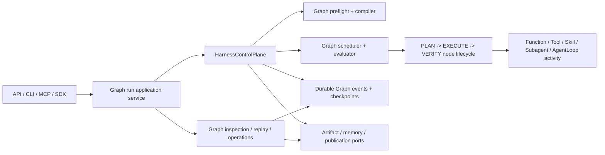

## Context

截至 2026-08-13，NewsRoom 的 Research 主运行路径已经不是传统线性 Workflow：`business/research/workflows/paper_analysis_workflow.py` 构造显式 `HarnessGraphSpec`，`ResearchSinglePaperRuntime` 通过 `HarnessControlPlane` 执行，真正的调度状态由 `NormalizedHarnessGraph`、Graph evaluator、Graph scheduler 和 durable Graph state 决定。

但“Graph 已经执行”不等于“Workflow 已经退役”。当前树仍有三层遗留：

1. `framework/harness/workflow` 保存 Graph DSL、compiler、validation 和 runtime resolution，公开入口仍是 `HarnessWorkflowSpec`，并允许 legacy declaration 编译成 Graph。
2. 通用 `framework/workflow` 仍有 92 个 tracked files，覆盖 buffer、checkpoint、compiler、governance、inspection、operations、routing、runners、runtime、scheduling 和 specs。
3. `framework/__init__.py`、artifact、event、inspection、operation、storage、Research composition 和 `scripts/dev.py` 仍存在旧 package、旧类型或旧 identity 的直接依赖；canonical OpenSpec 也有多项要求明确要求保留 `WorkflowRunner`、`WorkflowExecutor`、`AgentLoopStepRunner`、`DataBuffer` fencing、`buffer_updates` 或 import compatibility。

这不是把一个目录改名即可完成的工作。如果先删 `framework/workflow`，artifact/replay/approval 等真实职责会一起丢失；如果只把类名改成 Graph，legacy compiler 和 persisted Workflow identity 仍会保留第二套权威。因此采用“冻结新增依赖 -> 迁出可复用职责 -> 切换 Graph-only contract -> 离线迁移历史 -> 切换所有调用方 -> 删除 runtime -> 删除迁移窗口”的顺序。

本设计只定义后续 apply phase。当前 change 不修改运行时代码，也不执行生产数据迁移。

## Goals / Non-Goals

### Goals

- Graph 是唯一外层 orchestration declaration、runtime cursor、routing authority、checkpoint/replay identity 和 inspection model。
- `HarnessControlPlane` 是唯一流程控制者；LLM、Tool、Skill、Subagent、AgentLoop 和业务 worker 只产生候选结果。
- 所有生产调用方停止导入、实例化或反射查找 `framework.workflow` 及 legacy Harness Workflow contract。
- 有用的 artifact、event、inspection、operation、checkpoint 和 storage 能力先迁到清晰 owner，再删除旧 runtime。
- 可转换历史被确定性迁为 Graph schema；不可转换历史被只读隔离，绝不触发旧执行路径或 live worker。
- canonical OpenSpec、测试和架构规则不再要求旧兼容层存在。
- 删除动作具备机器可验证的前置条件、迁移报告、回滚点和最终零引用证明。

### Non-Goals

- 不把 `AgentLoop` 改造成外层 orchestration engine。
- 不让 LLM 生成或修改运行中的 outer Graph；dynamic TaskPlan 只能在冻结 Graph 的已注册 stage 内工作。
- 不重新实现一个名为 Graph、内部仍是线性 WorkflowRunner 的 compatibility layer。
- 不为了删目录而删除 domain-neutral 的 artifact integrity、event replay、approval、budget 或 observability 能力。
- 不对 archived OpenSpec、Git 历史或一次性 migration fixture 做无意义的全仓字符串改写。
- 不承诺无 breaking change；这是一次显式 major contract cutover。

## Terminology Boundary

本变更退役的是作为技术执行模型的 Workflow，而不是盲目删除英语单词 `workflow`。最终门槛如下：

- active production source 中不得存在旧 package、runner、executor、spec、routing、checkpoint 或 persisted Workflow authority。
- canonical specs 和 active change 中不得要求旧 runtime 或 compatibility import。
- public API/schema 不再新增 Workflow identity；发生 breaking rename 的 surface 必须使用新 major version。
- migration utility 和 migration fixtures 在限定窗口内可读取明确版本的 legacy schema，但不得被 runtime import；窗口关闭后 utility 从 active source 删除。
- archived OpenSpec、迁移报告和不可变审计证据可以保留原始名称，因为它们是历史事实，不是执行入口。

## Target Architecture



### Graph declaration contract

目标公开契约为：

```python
@dataclass(frozen=True)
class HarnessGraphDefinition:
    graph_id: str
    graph_version: str
    root: HarnessGraphSpec
    activities: tuple[HarnessStepSpec, ...]
    terminal_side_effect_policy: HarnessTerminalSideEffectPolicy

@dataclass(frozen=True)
class HarnessRunSpec:
    run_id: str
    graph: HarnessGraphDefinition
    # inputs, budgets, bindings, trace context ...
```

这里的 `HarnessStepSpec` 只描述 executable leaf 的 `PLAN -> EXECUTE -> VERIFY` 生命周期和 worker/gate contract，不再携带外层 routing。`activities` 的序列只用于 canonical serialization，不代表执行顺序；顺序、分支、并行、循环、等待、join 和 compensation 全部来自 `root` Graph DSL。

明确删除以下 contract：

- `HarnessWorkflowSpec`
- `HarnessRunSpec.workflow`
- `entry_step_id`
- `routing_rules`
- `declaration_mode`
- `LEGACY_WORKFLOW_SCHEMA`
- `HarnessWorkflowGraphCompiler.compile_legacy()`
- legacy Workflow contract reader/upcaster 的 active runtime 路径

`HarnessGraphCompiler` 只接受 `HarnessGraphDefinition`，输出带 `graph_id`、`graph_version`、compiler version 和 checksum 的 `NormalizedHarnessGraph`。缺少 Graph、未知 schema、unknown construct、未绑定 activity/gate 或不兼容历史必须在 `RUN_CREATED` 和任何 worker call 之前 fail closed。

### Module ownership

| 当前能力 | 最终 owner | 处理方式 |
|---|---|---|
| `framework/harness/workflow/{dsl,graph,compiler,validation,...}` | `framework/harness/graph` | 移动并 Graph 命名化；不得保留旧 import re-export |
| `framework/workflow/compiler`、`routing`、`scheduling` | `framework/harness/graph` + `framework/harness/control_plane` | 用现有 Graph compiler/evaluator/scheduler 覆盖后删除 |
| `framework/workflow/runners` | 各 activity owner + Harness binding registry | Function/Tool/Skill/Subagent/AgentLoop 迁为 leaf activity binding；控制结构不做 runner |
| `framework/workflow/runtime` | Harness control plane、artifact/event owner | 拆出真实职责后删除 generic executor/runtime |
| `framework/workflow/checkpoint` | `framework/harness/control_plane` Graph checkpoint/event replay | 迁移 schema 与调用方后删除 |
| `framework/workflow/buffer` | immutable Graph state、node-instance outputs、artifact refs | 不迁移共享 mutable `DataBuffer` 模型；用已有隔离输出替代 |
| `framework/workflow/governance` | Harness budgets、gate、side-effect authority | 合并重复策略；保留单一权威 |
| `framework/workflow/operations` | Harness-owned run application service | cancel/signal/approval/resume 走 control plane，不直接访问 executor/store |
| `framework/workflow/inspection` | Graph inspection/replay application service + artifact reader | 组合 owner ports，不复制旧 inspector facade |
| `framework/workflow/specs`、`framework/specs/workflow.py` | `framework/harness/graph` 或真实 domain owner | 迁移仍有调用者的 leaf/domain-neutral contract；删除 Workflow aggregate 和 registry |
| run manifest/integrity helpers | artifact owner | manifest 以 Graph run 为 identity，publication adapter 只依赖 artifact port |
| event projection/migration | `framework/events` | Graph event projection 为唯一 live path；legacy converter 仅存在于离线迁移窗口 |
| artifact/event indexes | storage owner | 接受已校验 Graph run/event contracts，不反向依赖 orchestration implementation |

### Worker and control construct boundary

Graph control nodes和 worker activities 必须分离：

| 类型 | 执行 owner | 是否调用 LLM/业务 worker |
|---|---|---|
| `Sequence`、`Choice`、`Parallel-*`、`Join`、`BoundedLoop` | Graph evaluator/scheduler | 否 |
| `Wait`、approval、timer、signal | Harness control plane | 否 |
| deterministic gate、budget、retry/replan/halt | Harness control plane | 否 |
| Function、Tool、Skill、Subagent、AgentLoop | registered activity binding | 可以，但只返回候选 observation/output |
| artifact publication、memory write、external side effect | Harness-authorized port/handler | 只有 Harness 决策后允许 |

`AgentLoop` 继续负责一个 agent 内部的 LLM request、tool observation、parsing、judge 和有界迭代。它可以返回 waiting candidate 或 diagnostic，但 approval wait 注册、Graph checkpoint、resume routing 和最终 quality verdict 都由 Harness 处理。

## Key Decisions

### 1. 采用 hard cutover，不做长期 dual mode

不会保留 `GraphDefinition | WorkflowSpec` union、`graph=None` fallback、旧 import re-export 或 feature flag。迁移开发可以分多个 commit，但发布切换点只有一个：切换前旧 writer 被停止，切换后只允许 Graph writer/executor。

原因是 dual mode 会让 routing、checkpoint 和 replay 重新出现两个真相源，无法证明旧 runtime 已被剔除。

### 2. 先迁职责，再删 package

删除顺序按依赖图决定，不按目录名决定。artifact manifest、event projection、approval resume 等能力先由目标 owner 提供同等或更严格的 contract，调用方完成切换并通过测试后，旧实现才成为可删除代码。

这不构成 compatibility layer：目标模块使用 Graph/domain-neutral contract，调用方在同一迁移 slice 中改到新 API；旧 facade 不转发到新实现。

### 3. 外部 contract 使用显式 major version

内部 Python contract 直接 hard rename；API/CLI/MCP/SDK 和 durable schema 使用新 major identity，例如：

- `workflow_id` -> `graph_id`
- `workflow_version` -> `graph_version`
- `workflow_ref` -> `graph_ref`
- `workflow_checkpoint_id` -> `graph_checkpoint_id`
- Workflow manifest/event projection -> Graph run manifest/event projection schema
- approval `resume-workflow` / `resume_workflow` -> Graph resume surface

旧字段不在新 schema 中静默 alias，也不同时写入两个字段。接口迁移必须提供发布说明和调用方清单；旧 endpoint/command/tool 在约定 major cutover 后删除。

### 4. 历史迁移是离线 release step，不是 live fallback

一次性 migration utility 采用结构化 reader 和纯 transformer，流程为：

1. 扫描所有受管 artifact roots、event stores、checkpoint stores、indexes 和数据库记录。
2. 生成只读 inventory，记录 source schema、run id、数量、checksum、可转换性和 reason code。
3. 对完整 snapshot/backup 执行 dry run，并输出 deterministic migration plan checksum。
4. 进入 maintenance/read-only window，停止旧 writer 并确认 in-flight run 为零。
5. 将可转换记录写入独立 staging target，校验 identity、序列、checksum、manifest containment、Graph compatibility 和 replay evidence。
6. 原子切换 target pointer/index；源数据保持只读，直到验收和回滚窗口结束。
7. 不可转换记录移动到 quarantine manifest，只允许 raw/audit inspection，禁止 resume/replay execution。
8. 生成签名/校验和绑定的 completion report；所有受管环境完成后删除 active migrator。

迁移器绝不调用旧 executor、worker、LLM、Tool、retrieval、memory write 或 publication。迁移后 replay 只消费已记录的确定性 evidence。

### 5. Approval resume 归 Graph wait authority

Graph approval node在 durable event 中记录 `graph_ref`、node instance、wait registration、approval id、correlation/scope 和 checkpoint ref。批准后 application service 验证 identity、decision、authorization、allowed node-scoped update keys 和 checkpoint checksum，向 Harness 提交 signal/resume intent。Harness reducer 决定激活哪个 node；interface 不选择 route，也不直接恢复 runner。

旧 `WorkflowRunner.resume(...)`、shared `buffer_updates` resume 和 `resume-workflow` surface 只有在 Graph node-scoped 版本已覆盖并完成外部调用方迁移后才删除。

### 6. OpenSpec 迁移必须先解除规范冲突

`harness-workflow-graph-runtime` 是本变更的硬前置。它当前有意保留 `Legacy Workflow Graph Compilation` 作为有界过渡，因此本变更 apply 前必须：

1. 完成并严格验证该前置 change。
2. 将其归档，使 `harness-workflow-graph` 成为 canonical capability。
3. 基于归档后的 canonical spec rebase 本 change，并应用对 `Legacy Workflow Graph Compilation` 的显式 `REMOVED` delta。
4. 确认不存在其他 active change 正在新增 `framework.workflow` 或 Workflow public contract。

当前树仍保留多个已经 complete 但尚未 archive 的 `workflow-*` change。Phase 0 必须逐个检查其 delta：仍代表受支持行为的 requirement 迁到 Graph capability；只记录已被替代历史的 change 使用明确的 superseded/`--skip-specs` 归档策略。不能在本 change 完成后再把旧 delta 同步回 canonical specs。

如果前置 change 尚未归档，本 change 可以完成规划和 strict validation，但不得进入代码 apply。

### 7. 规范同步与代码删除同等重要

任何 canonical requirement 若仍要求 `WorkflowRunner`、`WorkflowExecutor`、`AgentLoopStepRunner` 或 import compatibility，都视为删除未完成。apply 阶段必须同步 proposal 中列出的 capability；对仅以普通业务语言使用“workflow”的规范，按是否表达执行权威分类，不做机械替换。

## Migration Plan

### Phase 0: 锁定基线和前置条件

- 完成/归档 `harness-workflow-graph-runtime`，并将本 change rebase 到新的 canonical specs。
- 生成机器可读 inventory：生产 imports、public exports、constructors、reflection/registry names、CLI/API/MCP/SDK surface、schema ids、persisted stores、tests、docs 和 OpenSpec requirements。
- 增加 temporary architecture freeze gate，阻止新增 `framework.workflow` 和 `framework.harness.workflow` imports。
- 捕获当前显式 Research Graph 的 golden definition、normalized checksum、run outcome、gate evidence 和 replay fixture。
- 建立数据 owner/环境 owner 清单；未纳入 inventory 的 store 不能进入 cutover。

退出门槛：inventory 有 owner、replacement、phase、test action 和 data disposition；前置 change 已归档；所有受管数据位置可枚举。

### Phase 1: 抽离 domain-neutral 能力

- 将 artifact manifest/integrity/path-boundary contract 移到 artifact owner，并迁移 publisher、manager、inspection caller。
- 将 Graph event projection、read model 和 migration primitives 移到 `framework/events`。
- 将 `DataBuffer` fencing/overlay contract 改为 Graph node-instance output resource lease；保留 resource-owned fencing，不保留 shared Workflow buffer。
- 建立 Harness run application service，承接 cancel、signal、approval、resume、inspection 和 replay orchestration。
- 将 storage indexer 改为消费 Graph event/artifact contract。
- 为每个新 owner 建立 focused contract tests，再迁移调用方；不得通过旧 facade 转发。

退出门槛：除旧 runtime 自身外，没有 production caller 因 artifact/event/operation/inspection 职责而必须导入 `framework.workflow`。

### Phase 2: 收敛 Graph namespace 和 declaration

- 创建 `framework/harness/graph` 最终 package，移动 Graph DSL、model、compiler、reader、versioning、validation、binding authority 和 resolution。
- 引入 `HarnessGraphDefinition`、`HarnessGraphCompiler` 和 `HarnessRunSpec.graph`。
- 迁移 Harness control plane、TaskPlan、waits、Graph services 和 root exports 到新 namespace。
- 删除 `compile_legacy()`、legacy routing model、dual declaration reader 和 Workflow schema constants。
- 保留 `HarnessStepSpec` 仅作为 leaf lifecycle contract，并通过架构测试禁止它表达 outer routing。

退出门槛：所有 Harness run 都通过显式 Graph preflight；缺 Graph 或 legacy declaration 在任何 durable side effect/worker call 前失败。

### Phase 3: 迁移业务与外部入口

- `business/research/workflows` -> `business/research/graphs`，builder、module、fixture 和 test 命名同步更新。
- Research static Graph 与 dynamic TaskPlan stage 都绑定同一 frozen Graph contract。
- API、CLI、MCP、SDK 切换到 Graph identity 和 application service；approval resume 使用 Graph signal/checkpoint。
- 迁移 `scripts/dev.py` 的 run/inspect/cancel/resume 命令。
- 更新 conversation cursor、AgentLoop iteration checkpoint、artifact and event payload 中的 Graph refs。

退出门槛：所有 production entrypoint 只构造/读取 Graph run；interface 层不访问 executor/store；Research 真实组合没有 Workflow import。

### Phase 4: 离线迁移持久化数据

- 完成 inventory/dry-run/backup，并审批 maintenance window。
- 停止 legacy writers 和新的 run admission，等待 in-flight run 归零。
- 迁移 manifests、events、checkpoints、replay bundles、artifact/event indexes 和 cursor refs。
- 对 staging target 运行结构、checksum、path containment、sequence、reducer/replay 和 cross-store referential integrity 验证。
- 原子切换到 Graph stores/indexes，生成 completion report；不可转换历史进入 quarantine。

退出门槛：迁移数量守恒（成功 + quarantine = inventory）、checksum/report 可复验、Graph-only release 可以读取所有可支持历史，且 live fallback call count 为零。

### Phase 5: 删除旧 runtime 和 compatibility surface

- 删除 `framework/workflow` 全部模块和其专属 tests/fixtures；先有 Graph replacement test 才能删行为测试。
- 删除 `framework/specs/workflow.py`、Workflow registry 和只服务旧 aggregate 的 models。
- 删除 `framework/harness/workflow`、`HarnessWorkflowSpec`、legacy compiler/reader、旧 root exports 和 compatibility imports。
- 删除 `WorkflowRunner`、`WorkflowExecutor`、`AgentLoopStepRunner` 及 runner registry 中的旧绑定。
- 删除旧 API/CLI/MCP/SDK approval resume surface 和旧 schema writer/reader。
- 同步 canonical OpenSpec，退役 `workflow-runtime-target-closure` 和 `workflow-storage-indexing` 旧 capability 名称。

退出门槛：production source/public exports/canonical active specs 中的旧 runtime symbol/import 为零；不存在 facade、fallback、feature flag、no-op implementation 或 alternate executor。

### Phase 6: 关闭迁移窗口

- 完成约定观测期内的 Graph run、approval wait/resume、crash recovery、offline replay 和 Research production smoke。
- 锁定迁移 completion report、quarantine report、release artifact 和 rollback evidence。
- 删除 runtime 不再需要的一次性 legacy migrator、reader 和 migration-only dependency；只保留不可变报告、archived OpenSpec 和必要 fixture snapshot。
- 更新架构文档和学习材料，明确 `Graph outer orchestration + AgentLoop inner worker loop`。

退出门槛：active source 无 legacy reader；所有受管环境都记录 Graph-only cutover；release gate 全部通过。

## Deletion Gates

每个旧模块只有同时满足以下条件才允许删除：

1. `replacement_owner` 已确定且不依赖旧模块。
2. 所有 production callers 已迁移，source scan 为零。
3. 外部 contract 已完成版本迁移或被明确废弃。
4. persisted data 已迁移、quarantine 或确认不存在。
5. replacement focused tests、boundary tests 和至少一个端到端路径通过。
6. canonical OpenSpec 不再要求旧行为。
7. rollback point 和删除后恢复方式已记录。

最终 repository gate 至少检查：

```powershell
rg -n "framework\.workflow|framework\.harness\.workflow|HarnessWorkflowSpec|WorkflowRunner|WorkflowExecutor|AgentLoopStepRunner|compile_legacy|LEGACY_WORKFLOW_SCHEMA" framework business interfaces infrastructure scripts
rg -n "WorkflowRunner|WorkflowExecutor|AgentLoopStepRunner|framework\.workflow" openspec/specs openspec/changes
python -m scripts.dev compile
python -m scripts.dev test
python -m scripts.dev smoke
openspec validate graph-only-orchestration --strict
openspec validate --all --strict
```

第一条在 final state 必须零命中。第二条只允许当前 change 的 REMOVED/migration 说明或 archived history；allowlist 必须是具体文件和具体原因，不能是整目录通配来隐藏 active debt。

## Verification Strategy

- **Contract tests**：Graph definition serialization、missing Graph rejection、unknown schema、binding/gate preflight、no dual declaration。
- **Architecture tests**：禁止旧 imports/exports/symbols，禁止 interface -> executor/store，禁止 worker 控制 routing。
- **Behavior parity tests**：Research static Graph、dynamic TaskPlan、quality gate、publication、failure/retry/replan/halt。
- **Control-node tests**：Choice、Parallel-All/Any、BoundedLoop、Wait、approval signal、compensation、crash recovery。
- **Data migration tests**：dry run、idempotent rerun、checksum tamper、unsafe path、unknown version、partial failure、quarantine、atomic pointer switch。
- **Replay tests**：可转换历史在零 live LLM/Tool/worker/side-effect call 下重建同一 deterministic decision；证据缺失时 fail closed。
- **External surface tests**：API、CLI、MCP、SDK 的 Graph identity、typed error、approval resume 和 inspection。
- **Deletion proof**：tracked file inventory、import graph、public `__all__`、registry/reflection scan、canonical spec scan 全部满足 gate。

## Rollback Strategy

### 切换前

任何 dry-run 或 staging 验证失败都停止切换，保留旧 release 和 source stores，不删除任何旧模块或数据。修复 transformer 根因后从原 snapshot 重跑，不手工改写部分记录。

### 切换中

pointer/index 切换必须原子化。切换失败时恢复原 pointer，确认旧 writer 仍处于停止状态，验证 source checksum 后再决定恢复服务或重试。

### 切换后

一旦产生新 Graph-only records，不允许直接回滚到只理解 Workflow schema 的 writer。可接受的恢复方式只有：

- 部署同 schema major 的上一个 Graph-aware release；或
- 停止写入、备份新 Graph records，经显式数据处置审批后恢复 pre-cutover snapshot。

旧 runtime 的删除 commit/tag 在观测期内可用于代码取证，但不能作为 live fallback 被当前 release import。

## Risks / Trade-offs

- **Breaking surface 较大**：Graph identity 会影响接口和存储。通过显式 major version、调用方 inventory 和单次 cutover控制，而不是隐藏 alias。
- **迁移窗口需要停写**：不 dual-write 会引入 maintenance window，但换来单一真相源和可证明的一致性。
- **历史不一定全部可转换**：缺 Graph ref、checksum 或 terminal evidence 的记录不能被猜测修复，只能 typed quarantine。
- **大规模 rename 容易掩盖行为变化**：namespace move、contract change、data migration、caller cutover 和 deletion 分 commit 完成，每个 commit 有独立 gate。
- **active OpenSpec 可能持续漂移**：apply 前必须重新 inventory 和 rebase；本设计中的 92 files/9 imports 仅是规划基线。
- **误把 control construct 做成 runner**：架构测试必须检查 binding registry 只注册 executable activities，Sequence/Choice/Wait 等没有 worker binding。

## Apply Commit Boundaries

后续实现建议按以下原子边界提交，每个 commit 都必须先运行对应检查：

1. `test(architecture)`: freeze new Workflow dependencies and capture inventory.
2. `refactor(artifacts-events)`: move domain-neutral contracts and migrate callers.
3. `refactor(harness)`: introduce Graph-only namespace and declaration contract.
4. `refactor(research)`: migrate Research composition and activity bindings.
5. `feat(graph-interfaces)`: migrate operations, approval resume and public Graph identities.
6. `chore(migration)`: add, validate and execute offline data migration tooling/evidence.
7. `refactor(graph-only)`: delete old runtimes, exports, readers and compatibility tests.
8. `docs(openspec)`: synchronize canonical specs and final deletion evidence.
9. `chore(graph-only)`: remove migration-window code after environment acceptance.

不能把“新增目标实现”和“删除全部旧实现”压成一个不可审查的大 commit；也不能在中间 commit 对主分支留下可发布的双执行权威。

## Open Questions Before Apply

以下问题不阻塞本规划，但必须在 Phase 0 inventory 中给出仓库证据和 owner 签字后才能 apply：

- 哪些 artifact roots、event/checkpoint stores 和数据库实例属于必须迁移的受管环境？
- 当前公开 API/CLI/MCP/SDK 是否允许直接 major cutover，还是需要独立发布窗口？独立窗口也不得引入 runtime compatibility。
- quarantine 历史的合规保留期和删除 owner 是谁？
- `HarnessStepSpec` 是否继续作为 leaf lifecycle 名称，或在独立 change 中改名为 `HarnessActivitySpec`？本变更不要求为纯术语改名，但要求它不再拥有 routing。
