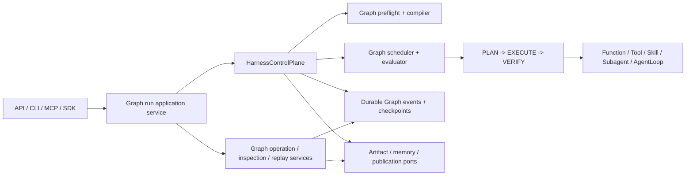

# NewsRoom Graph-only Orchestration Cutover PRD

## 1. 文档信息

| 字段 | 内容 |
|---|---|
| 产品/能力 | NewsRoom Graph-only Orchestration Cutover |
| OpenSpec Change | `graph-only-orchestration` |
| 文档状态 | Proposed / Planning only / 未进入 apply |
| 日期 | 2026-08-13 |
| 目标版本 | Harness Graph-only Orchestration v1 |
| 硬前置 | `harness-workflow-graph-runtime` 完成并归档；durable event/checkpoint/replay authority 达到删除旧 runtime 的发布条件 |
| 影响范围 | `framework/harness`、`framework/workflow`、`framework/specs`、Research、AgentLoop activity、artifact/event/storage、approval、API/CLI/MCP/SDK、历史运行数据和 canonical OpenSpec |
| 对应规划 | `proposal.md`、`design.md`、`specs/**/spec.md`、`tasks.md` |

## 2. 摘要

NewsRoom 当前已经拥有真正的 Harness Graph runtime：Research 主路径可以声明 `Sequence`、`Parallel-All`、`VerifiedAggregation` 等 Graph 结构，并由 `HarnessControlPlane`、Graph scheduler/evaluator 和 durable Graph state 执行。

但仓库仍同时保留两套外层编排契约：

1. 新的 Graph runtime；
2. 旧的 Workflow runtime、Workflow-shaped public types、legacy compiler、runner/executor、checkpoint/buffer、operation/inspection 以及兼容导出。

这使项目处于“执行已经 Graph 化，架构权威尚未 Graph-only”的状态。调用方仍可创建或恢复旧 Workflow，持久化记录仍携带 Workflow identity，canonical OpenSpec 仍有 requirement 要求保留 `WorkflowRunner`、`WorkflowExecutor`、`AgentLoopStepRunner`、`DataBuffer` 和 Workflow import compatibility。

本 PRD 定义一次明确的 breaking cutover：

- Graph 成为唯一外层 orchestration declaration、routing authority、runtime cursor、checkpoint/replay identity 和 inspection model；
- `HarnessControlPlane` 继续是唯一控制者；
- LLM、Tool、Skill、Subagent、AgentLoop 和业务 worker 只产生候选结果；
- 有用的 artifact、event、inspection、operation、approval、checkpoint 和 storage 能力先迁到明确 owner；
- 历史 Workflow 数据通过一次性、版本化、离线迁移处理；
- 不可转换历史进入只读 quarantine，不能 resume 或执行；
- 最后删除所有旧 Workflow runtime、兼容导出和要求旧 runtime 存在的 canonical requirements；
- 不保留 compatibility facade、dual executor、dual-write、feature flag fallback 或永久 legacy reader。

本 PRD 只描述产品需求、迁移策略和验收标准。本次文档交付不修改运行时代码、不删除旧模块、不迁移生产数据。

## 3. 背景与实时基线

### 3.1 当前已经具备的 Graph 能力

当前 Harness 已经实现或正在收口以下能力：

- 版本化 Graph DSL 和 `NormalizedHarnessGraph`；
- `Sequence`、`Choice`、`Parallel-All`、`Parallel-Any`、`Bounded-Loop`、`Wait` 和 `Compensation`；
- executable node 的有界 `PLAN -> EXECUTE -> VERIFY` 生命周期；
- deterministic gates、budgets、retry、replan、repair、approval wait 和 halt；
- durable Graph state、events、checkpoint、inspection 和 replay；
- 固定 outer Graph 内的 opt-in dynamic TaskPlan；
- Research static `Parallel-All + VerifiedAggregation` 路径；
- Harness-controlled side-effect、memory-write 和 publication authority。

Graph 的正确控制边界已经明确：

```text
Frozen Outer Graph
    |
    | Harness validates and advances
    v
PLAN -> EXECUTE -> VERIFY
    |
    | controlled executable activity
    v
Function / Tool / Skill / Subagent / AgentLoop
```

外层 Graph 在 run 创建前被冻结；dynamic TaskPlan 只能存在于已注册的 Graph stage 内，不能修改 outer Graph。

### 3.2 仍然存在的旧 Workflow runtime

截至 2026-08-13 的实时扫描结果：

| 指标 | 当前值 |
|---|---:|
| `framework/workflow/**` tracked files | 92 |
| 直接导入 `framework.workflow` 的外部生产模块 | 9 |
| `graph-only-orchestration` 实施任务 | 0/99 |
| `harness-workflow-graph-runtime` | 99/100 |
| `durable-event-runtime` | 52/55 |

9 个直接生产依赖分布在：

- `framework/__init__.py`
- `framework/agent/artifacts/runtime/manager.py`
- `infrastructure/research/artifact_publication.py`
- `interfaces/services/artifact_service.py`
- `interfaces/services/event_migration_service.py`
- `interfaces/services/event_projection_service.py`
- `interfaces/services/run_inspection_service.py`
- `interfaces/services/run_operation_service.py`
- `scripts/dev.py`

这些数字是规划基线，不是 apply 时可直接复用的永久事实。进入实施前必须重新生成机器可读 inventory。

### 3.3 Harness 内部的双模式问题

Graph 核心代码当前位于 `framework/harness/workflow`，公开 contract 仍包括：

- `HarnessWorkflowSpec`
- `HarnessWorkflowGraphCompiler`
- `HarnessRunSpec.workflow`
- `entry_step_id`
- `routing_rules`
- `declaration_mode`
- `LEGACY_WORKFLOW_SCHEMA`
- `compile_legacy()`

编译器可以把 `graph=None` 的旧线性声明编译成 Graph。这一机制在 `harness-workflow-graph-runtime` 的过渡阶段是合理的，但不能成为最终架构：只要 legacy declaration 仍是受支持输入，项目就仍有两套外层模型。

### 3.4 Canonical spec 冲突

当前 canonical OpenSpec 中仍有 requirement 要求或暗示以下行为：

- `WorkflowRunner` 从 approval context 恢复；
- `WorkflowExecutor` 持久化 AgentLoop artifacts；
- `AgentLoopStepRunner` 连接 AgentLoop；
- `DataBuffer` 为 Workflow attempt 提供 fencing；
- approval resume context 返回 `buffer_updates`；
- `framework.workflow.specs.SkillStepSpec` compatibility import 永久可用；
- Workflow runtime models、constructors 和 import compatibility 被保留。

因此，代码删除和 canonical spec 退役必须属于同一产品交付。只删代码、不改规范，会让后续变更再次把旧 runtime 引入仓库。

## 4. 问题陈述

### 4.1 Framework Maintainer 的问题

维护者无法回答以下问题：

- 新 orchestration 应该放在 `framework/workflow` 还是 `framework/harness/workflow`？
- 应该新增 `WorkflowRunner`、Graph node 还是 AgentLoop runner？
- routing、retry、approval、publication 到底由谁决定？
- artifact/event/inspection 中的通用能力能否离开旧 Workflow runtime 独立存在？

双模型会扩大维护面，并允许同一业务能力出现两条行为不同的执行路径。

### 4.2 Business Graph Author 的问题

业务开发者虽然可以使用 Graph DSL，但仍面对 Workflow-shaped builder、package 和 persisted identity。新业务代码容易继续复制 `*_workflow.py`、`HarnessWorkflowSpec` 和 routing rules，导致 Graph 只是旧 Workflow 的内部实现细节，而不是一等产品模型。

### 4.3 Operator / Reviewer 的问题

操作人员需要确定一个 run 的唯一事实来源：

- 当前运行的是哪一个 Graph/version/checksum？
- 哪些 node instance 已完成？
- 哪个 gate 决定了下一步？
- approval signal 恢复了哪个 Wait？
- replay 是否读取历史决定，还是重新执行旧 runner？

如果 run manifest、checkpoint、event projection 和 inspection 仍混用 Workflow identity，就无法给出单一、可审计的答案。

### 4.4 Release / Data Owner 的问题

旧数据不能因为删除代码而丢失，但也不能为了保留历史读取而永久保留旧执行器。项目需要明确区分：

- live execution compatibility；
- offline data conversion；
- read-only audit retention；
- unconvertible history quarantine。

当前缺少统一的 inventory、迁移数量守恒、checksum、切换点和回滚证据要求。

## 5. 产品愿景

让 NewsRoom 只存在一套外层编排语言和运行权威：业务作者声明版本化 Graph，Harness 确定性地解释 Graph 并控制 worker、gate、budget、wait、side effect 和 publication；所有运行状态都通过 Graph identity 和 durable evidence 被检查、恢复和重放。

目标心智模型：

```text
Graph is the orchestration model.
Harness is the control plane.
LLM / Tool / Skill / Subagent / AgentLoop are workers.
Durable history is the replay authority.
```

## 6. 产品原则

### P1. 单一外层编排权威

系统不得同时支持 Workflow 和 Graph 两个 live outer orchestration model。

### P2. Harness 控制，Worker 提案

Worker 可以输出候选内容、评分、route suggestion 或 approval request，但不能把这些值直接变成 Graph decision。

### P3. 先迁职责，再删容器

有价值的 artifact、event、inspection、operation、checkpoint 和 safety contract 必须迁到真实 owner 后再删除旧 package。

### P4. 不用兼容层掩盖迁移未完成

旧 import re-export、type alias、fallback executor、dual-write 和 silent field alias 都属于未完成状态。

### P5. 历史保留不等于执行兼容

历史只能通过离线 converter 或只读 quarantine 保存，不能触发旧 runner、LLM、Tool、memory write 或 publication。

### P6. 删除必须可证明

每一个被删除模块都必须有 replacement owner、零 production callers、数据 disposition、replacement tests 和 canonical spec disposition。

## 7. 产品目标

### G1. Graph 成为唯一 declaration contract

所有 Harness run 必须提交显式、版本化、预检通过的 Graph definition。缺 Graph、legacy routing 或双模式声明必须在任何 side effect 前失败。

### G2. Graph 成为唯一运行和持久化 identity

run manifest、event、checkpoint、replay bundle、artifact/event index、approval resume 和 inspection 都使用 Graph identity。

### G3. 删除通用 Workflow runtime

删除 `framework/workflow` 及其 runner、executor、routing、scheduler、buffer、checkpoint、inspection、operation、governance、compiler 和 spec aggregate。

### G4. 收敛 Harness Graph namespace

将真正属于 Graph 的 DSL、compiler、validation、binding authority、reader 和 runtime resolution 收敛到 `framework/harness/graph`。

### G5. 保留 AgentLoop 的正确边界

`AgentLoop` 继续作为单 Agent 内部循环，但只能由 Graph executable activity 调用，不拥有外层 routing、quality、approval、memory、tool authorization 或 publication authority。

### G6. 安全迁移历史数据

所有受管历史记录都必须被转换、quarantine 或明确证明不存在；迁移总数必须守恒，不能静默丢弃。

### G7. 退役要求旧 runtime 的规范

canonical OpenSpec、active changes、架构测试和文档不得继续要求兼容导入或旧执行行为。

## 8. 非目标

本产品不包含：

- 构建 BPMN、Petri Net、低代码编排器或可视化 Graph 编辑器；
- 允许 LLM 在运行中修改 frozen Graph；
- 用 AgentLoop 替换 Harness Graph control plane；
- 删除或弱化 `PLAN -> EXECUTE -> VERIFY`；
- 删除 deterministic gates、budgets、fencing、idempotency 或 durable replay；
- 自动猜测未知历史 schema 或缺失 evidence；
- 对任意外部系统承诺 exactly-once；
- 为保持旧调用方不变而永久保留 Workflow facade；
- 机械删除 archived OpenSpec、Git 历史或审计报告中的单词 `workflow`；
- 在本次 PRD 文档交付中实施任何代码或数据变更。

## 9. 用户、角色与核心场景

### 9.1 Framework Maintainer

维护者需要一个清晰 owner map：Graph declaration 属于 `framework/harness/graph`，Graph state transition 属于 control plane，activity 属于 worker binding，artifact/event/storage 属于各自 domain owner。

成功体验：新增 Graph construct 或 worker type 时，不需要修改或兼容第二套 Workflow runtime。

### 9.2 Business Graph Author

业务作者需要声明 Graph 结构、activity binding、input/output contract 和 deterministic gate，不需要自行实现 routing、parallel join、wait、retry 或 replay。

成功体验：Research builder 直接返回 `HarnessGraphDefinition`，模块和 public API 不再使用 Workflow identity。

### 9.3 Operator / Reviewer

操作人员需要查看 Graph ref、checksum、node status、gate evidence、wait registration、side-effect outcome、artifact refs 和 replay result。

成功体验：inspection 不需要知道旧 Workflow runner，也不会因历史缺失而猜测成功。

### 9.4 Interface Integrator

API、CLI、MCP 和 SDK 维护者需要一个版本化 Graph run/resume contract，明确旧字段和旧 endpoint 的删除时间。

成功体验：entrypoint 只调用 application service，不直接构造 scheduler、executor 或 store。

### 9.5 Release / Data Owner

发布负责人需要知道哪些 stores 必须迁移、哪些记录可以转换、何时停写、如何原子切换、失败时如何回滚。

成功体验：每个环境都有 inventory、backup、dry-run、completion report、quarantine report 和 rollback evidence。

### 9.6 场景 A：创建新的 Research Graph run

```text
API request
    -> Research application service
    -> HarnessRunSpec(graph=HarnessGraphDefinition(...))
    -> Graph preflight
    -> RUN_CREATED with graph ref/checksum
    -> PLAN -> EXECUTE -> VERIFY
```

若调用方提交 `WorkflowSpec`、`routing_rules` 或缺失 Graph，系统在创建 run 前拒绝。

### 9.7 场景 B：AgentLoop 作为 Graph activity

```text
Graph executable node
    -> Harness validates binding and budgets
    -> AgentRunner
    -> AgentLoop
    -> candidate output + diagnostics + artifact refs
    -> deterministic VERIFY
    -> Harness decides Graph transition
```

AgentLoop 返回的 `quality_passed` 或 `next_route` 不具有控制权。

### 9.8 场景 C：审批后恢复

Graph approval Wait 持久化 `graph_ref`、node instance、wait registration、approval id 和 checkpoint ref。批准后 application service 验证 identity、authorization 和 checksum，并提交 resume intent；Graph reducer 决定后继 node。

### 9.9 场景 D：迁移历史 run

离线 migrator 扫描旧 manifest/events/checkpoint/index，生成 dry-run plan，写入 staging Graph store，验证 checksum/replay 后原子切换。迁移器不调用任何 live worker。

### 9.10 场景 E：历史无法转换

缺少 schema、Graph identity、terminal evidence 或 checksum 的记录进入 quarantine。operator 可以查看原始审计信息和 reason code，但不能 resume、重新执行或发布。

### 9.11 场景 F：删除门禁阻止误删

如果某个旧 module 仍有 production caller、未迁数据或 canonical requirement，deletion gate 必须失败。不得通过删除测试、扩大 allowlist 或忽略 store 来绕过。

## 10. 术语与边界

| 术语 | 定义 |
|---|---|
| Graph Definition | 业务声明的版本化 outer orchestration contract |
| Normalized Graph | 预检和编译后的不可变、checksum-bound Graph IR |
| Control Node | Sequence/Choice/Fork/Join/Loop/Wait 等由 Harness 确定性解释的节点 |
| Executable Node | 绑定 activity 并执行 `PLAN -> EXECUTE -> VERIFY` 的 Graph leaf |
| Activity | Function、Tool、Skill、Subagent、AgentLoop 或受控 side-effect handler |
| AgentLoop | 单 Agent 内部 LLM/tool/judge 的有界循环，不是 outer orchestrator |
| Legacy Workflow Runtime | `framework/workflow` 及相关 runner/executor/spec/routing/checkpoint/buffer/compatibility surface |
| Offline Migrator | 只能在迁移窗口读取 legacy schema、不能被 production runtime 导入的一次性工具 |
| Quarantine | 对不可转换历史的只读隔离状态，禁止 resume 和 live replay execution |
| Cutover | 停止旧 writer 后，Graph writer/store/index 成为唯一 live authority 的原子切换点 |

本变更退役的是作为技术执行模型的 Workflow。普通业务语言、archived OpenSpec、Git 历史和不可变审计报告中的 `workflow` 不属于需要机械删除的运行时引用。

## 11. 目标架构与职责边界



### 11.1 Harness Graph

负责：

- Graph DSL、definition、normalized model；
- compiler、preflight、validation；
- deterministic condition 和 control-node semantics；
- activity/gate/side-effect exact binding；
- Graph identity、version 和 checksum。

不负责：

- 直接调用基础设施；
- 业务逻辑；
- 接口授权；
- artifact/event store 实现。

### 11.2 Harness Control Plane

负责：

- 唯一 Graph decision application；
- `PLAN -> EXECUTE -> VERIFY`；
- budgets、retry、replan、halt；
- wait/signal/approval；
- durable transition、checkpoint 和 recovery；
- memory/tool/publication authorization。

### 11.3 Activity Owner

Function、Tool、Skill、Subagent 和 AgentLoop 负责执行受控任务并返回候选结果。它们不得激活 Graph node、决定 gate verdict 或提交最终 publication。

### 11.4 Domain-neutral Owners

| 能力 | 最终 owner |
|---|---|
| Graph DSL/compiler/validation | `framework/harness/graph` |
| Graph scheduler/state/checkpoint | `framework/harness/control_plane` |
| artifact manifest/integrity/reader | artifact owner |
| event projection/migration primitives | `framework/events` |
| cancel/signal/approval/resume/inspect/replay | Harness Graph application services |
| artifact/event indexing | storage owner |
| node-instance outputs/fencing | Graph state/output resource owner |
| Research Graph definitions | `business/research/graphs` |

## 12. 功能需求

### FR-1：所有新运行必须显式声明 Graph

系统必须要求每个 Harness run 提供版本化 `HarnessGraphDefinition`。

验收标准：

- `HarnessRunSpec` 使用 `graph`，不使用 `workflow`；
- 缺少 Graph 返回稳定 `graph_required`；
- `graph=None`、`routing_rules`、`entry_step_id` 或 legacy constructor 返回 `legacy_orchestration_not_supported`；
- 失败发生在 `RUN_CREATED`、worker call、checkpoint、artifact 和 publication 之前；
- 一个 run 不允许同时携带 Graph 和 legacy declaration。

### FR-2：Graph public contract 必须使用 Graph identity

目标 contract 至少包含：

```text
graph_id
graph_version
graph_schema_version
compiler_version
normalized_graph_checksum
```

验收标准：

- `HarnessWorkflowSpec` 被 `HarnessGraphDefinition` 取代；
- `HarnessWorkflowGraphCompiler` 被 `HarnessGraphCompiler` 取代；
- runtime/public serialization 不再写 `workflow_id`、`workflow_version` 或 `workflow_ref`；
- Graph definition 中 activity 的声明顺序只用于 canonical serialization，不代表执行顺序；
- outer routing 只能由 Graph topology 和 deterministic policy 表达。

### FR-3：Harness 是唯一外层控制者

只有 Harness Graph control plane 可以决定：

- node readiness 和 activation；
- Choice branch、Parallel winner 和 Join；
- retry、replan、repair、wait、halt；
- gate pass/fail；
- tool authorization；
- memory write；
- approval state；
- artifact publication。

Worker 的 route suggestion、self-score 和 verdict-shaped output 只能作为候选 evidence。

### FR-4：Control Node 与 Activity 必须分离

以下构造不得注册为 worker runner：

- `Sequence`
- `Choice`
- `Parallel-All`
- `Parallel-Any`
- `Join`
- `Bounded-Loop`
- `Wait`
- deterministic gate
- compensation scheduling

Function、Tool、Skill、Subagent 和 AgentLoop 可以作为 activity binding。架构测试必须检查 registry/reflection string，而不仅是 Python import。

### FR-5：保留 executable node 的安全生命周期

每个真正调用 activity 的 node 必须继续执行：

```text
PLAN -> EXECUTE -> VERIFY
```

要求：

- VERIFY 使用 deterministic gate；
- gate 失败进入受控 retry/replan/repair/halt；
- budget 防止无限运行；
- phase transition 和 resulting decision 必须 durable；
- worker 输出不能跳过 VERIFY。

### FR-6：Graph namespace 必须反映真实模型

真正属于 Graph 的模块必须从 `framework/harness/workflow` 迁入 `framework/harness/graph`，包括：

- DSL；
- normalized graph；
- compiler；
- reader；
- versioning；
- validation；
- binding authority；
- runtime resolution。

旧 namespace 不得保留 re-export facade。

### FR-7：Legacy compiler 和 reader 不得进入 live runtime

必须删除：

- `compile_legacy()`；
- `LEGACY_WORKFLOW_SCHEMA` 的 live reader；
- Workflow routing model；
- declaration dual-mode；
- live upcaster/fallback。

历史转换由独立 offline migrator 完成。Graph runtime 不得导入 migration package。

### FR-8：AgentLoop 只能作为 Graph activity

AgentLoop 负责：

- LLM request；
- tool observation；
- action parsing；
- output judging；
- 有界内部 retry/iteration；
- diagnostics 和 candidate result。

AgentLoop 不得负责：

- outer Graph routing；
- final quality verdict；
- Graph checkpoint/resume；
- memory-write authorization；
- tool authorization policy；
- publication。

`AgentLoopStepRunner` 必须被 Graph activity binding 取代。

### FR-9：Research 必须只声明 Graph

Research 迁移必须完成：

- `business/research/workflows` -> `business/research/graphs`；
- `*_workflow.py` / workflow builder -> Graph module/builder；
- static path 继续使用 `Parallel-All + VerifiedAggregation`；
- dynamic TaskPlan 继续是 frozen Graph 内的 opt-in stage；
- Research gates、ports、output contract 和 production adapters 保持真实；
- `business/research` 不得导入旧 Workflow namespace。

### FR-10：有用的旧能力必须先迁到明确 owner

删除 `framework/workflow` 前必须迁移：

- artifact manifest/integrity/path boundary；
- event projection/migration；
- run operation；
- inspection/replay；
- approval resume；
- checkpoint/recovery；
- artifact/event indexing；
- attempt safety/fencing；
- budget/governance 中仍为单一权威的能力。

新 owner 不得反向导入旧 module，也不得通过 facade 转发。

### FR-11：共享 Workflow buffer 必须被 Graph node output 取代

`DataBuffer` 和 Workflow attempt overlay 不作为最终 Graph state model 保留。

要求：

- output 默认按 node instance 隔离；
- resource owner 发行 fencing lease；
- superseded attempt 的 late write 被拒绝；
- budget sequence、retry credit 和 Graph event sequence 不能充当 resource lease；
- parallel merge 必须显式、纯函数且确定性；
- 不支持 last-writer-wins。

### FR-12：Run operation 必须通过 Graph application service

以下操作必须由 application service 接收并提交给 Harness：

- cancel；
- signal；
- approval decision；
- resume；
- inspect；
- replay。

API、CLI、MCP 和 SDK 不得直接调用 executor、scheduler 或 store，也不得自行选择后继 node。

### FR-13：Approval resume 必须绑定 Graph Wait

Graph approval resume context 至少包含：

```text
graph_run_id
graph_ref
node_instance_id
wait_registration_id
graph_checkpoint_ref
decision_key
validated node_updates
resume_metadata
```

要求：

- 验证 tenant/identity/authorization；
- 验证 approval decision 和 Wait scope；
- 验证 checkpoint checksum；
- 只接受 Graph definition 声明的 update keys；
- Harness reducer 决定 node activation；
- 旧 `buffer_updates` 和 `WorkflowRunner.resume()` 不进入新 contract。

### FR-14：Artifact inspection 必须读取 Graph terminal manifest

要求：

- 只列出 verified Graph terminal manifest 中的 artifacts；
- 校验 run id、relative path、root containment、checksum 和 metadata；
- live inspector 不导入 Workflow inspector；
- 未迁移历史返回 typed history/quarantine diagnostic；
- interface 不返回未经校验的内容。

### FR-15：Event 和 storage indexing 必须以 Graph 为 live contract

要求：

- event store 保存 Graph/node-instance identity 和单调 stream sequence；
- artifact index 保存 Graph manifest 和 node-instance refs；
- storage owner 不反向依赖 orchestration implementation；
- unsafe identity/path 在写入前失败；
- duplicate write 遵守 exact-body idempotency 和 conflict semantics。

### FR-16：所有 durable contract 必须版本化

至少覆盖：

- Graph definition；
- normalized Graph；
- Graph event；
- state projection；
- checkpoint；
- terminal manifest；
- artifact/event index record；
- approval resume context；
- conversation cursor；
- AgentLoop iteration checkpoint；
- replay bundle；
- migration inventory/report/quarantine record。

未知、缺失、歧义或不兼容版本必须 fail closed。

### FR-17：历史迁移必须是一次性离线流程

迁移流程必须包含：

1. 全量 store inventory；
2. source schema/version/checksum 扫描；
3. dry-run 和 deterministic migration plan checksum；
4. backup；
5. maintenance/read-only window；
6. in-flight run drain；
7. staging Graph records；
8. structure/checksum/path/sequence/referential integrity 验证；
9. replay validation；
10. atomic pointer/index switch；
11. completion report 和 quarantine report；
12. 观察期结束后删除 migrator。

### FR-18：迁移器必须零 live side effect

迁移和验证期间以下调用计数必须为零：

- LLM；
- Tool/MCP；
- business worker；
- retrieval；
- memory write；
- publication；
- compensation；
- legacy executor。

迁移器只能读取结构化历史和写入 staging Graph records。

### FR-19：不可转换历史必须 quarantine

以下情况不得猜测修复：

- unknown schema；
- missing Graph mapping；
- invalid/unsafe path；
- checksum mismatch；
- event sequence gap；
- ambiguous run identity；
- missing terminal/gate/side-effect evidence；
- incompatible checkpoint。

quarantine record 必须包含 stable reason code、source ref、checksum、environment、disposition 和 owner。quarantine history 不得 resume、replay execution 或 publication。

### FR-20：对外接口采用 major cutover

需要迁移的 identity 包括：

| 旧字段/概念 | 新字段/概念 |
|---|---|
| `workflow_id` | `graph_id` |
| `workflow_version` | `graph_version` |
| `workflow_ref` | `graph_ref` |
| `workflow_checkpoint_id` | `graph_checkpoint_id` |
| Workflow manifest | Graph run manifest |
| Workflow event projection | Graph event projection |
| `resume-workflow` | versioned Graph approval-resume surface |
| shared `buffer_updates` | validated node-scoped updates |

旧字段不得在新 schema 中静默 alias。稳定的通用字段如 `run_id`、interface `status` 可以保留，但语义必须绑定 Graph run。

### FR-21：删除必须满足逐模块 gate

每个删除候选必须同时满足：

1. replacement owner 已确定；
2. production caller 为零；
3. public contract 已迁移或明确废弃；
4. persisted data 已迁移、quarantine 或确认不存在；
5. replacement tests 通过；
6. canonical spec 不再要求旧行为；
7. rollback point 和恢复方式已记录。

不允许通过删除失败测试、放宽 assertion 或全目录 allowlist 让 gate 通过。

### FR-22：最终必须删除所有旧 runtime surface

最终删除范围至少包括：

- `framework/workflow/**`；
- `framework/specs/workflow.py` 和 Workflow registry；
- `framework/harness/workflow` legacy namespace；
- `HarnessWorkflowSpec`；
- `HarnessWorkflowGraphCompiler`；
- `WorkflowRunner`；
- `WorkflowExecutor`；
- `AgentLoopStepRunner`；
- legacy root exports；
- old runner registrations/reflection names；
- old schema writers/readers；
- old API/CLI/MCP/SDK Workflow resume surface；
- only-legacy tests/fixtures。

### FR-23：Canonical OpenSpec 必须同步退役旧能力

必须处理：

- `harness-workflow-graph` -> `harness-graph`；
- `workflow-storage-indexing` -> `graph-storage-indexing`；
- `approval-workflow-resume-interfaces` -> `approval-graph-resume-interfaces`；
- `workflow-runtime-target-closure` 全量退役；
- Harness、Research、AgentLoop、artifact、attempt、interface、architecture 和 cleanup specs 的 Workflow requirements。

所有 active `workflow-*` / `*workflow*` changes 必须逐个审计。若其 requirement 已被 Graph 取代，则必须重写、标记 superseded 或使用明确的 `--skip-specs` 历史归档策略，防止旧 delta 重新同步回 canonical specs。

### FR-24：最终零引用必须由机器证明

最终 source/runtime gate 必须对以下内容零命中：

```text
framework.workflow
framework.harness.workflow
HarnessWorkflowSpec
HarnessWorkflowGraphCompiler
WorkflowRunner
WorkflowExecutor
AgentLoopStepRunner
compile_legacy
LEGACY_WORKFLOW_SCHEMA
```

扫描范围包括：

- production imports；
- package exports；
- registry/reflection strings；
- generated schemas；
- API/CLI/MCP/SDK surfaces；
- canonical active specs；
- production configuration。

archived history、migration report 和 isolated migration fixture 可以精确 allowlist，但不能对整个目录通配放行。

### FR-25：迁移窗口结束后必须删除 legacy migrator

所有受管环境完成迁移并通过约定观察期后：

- production source 不再包含 legacy reader；
- migrator 不再是可调用 CLI/service；
- migration-only dependency 被删除；
- 只保留 immutable completion/quarantine report 和必要 fixture snapshot；
- 新环境不能通过 legacy migration code 初始化。

## 13. 数据与接口契约草案

### 13.1 Graph Definition

```python
@dataclass(frozen=True)
class HarnessGraphDefinition:
    graph_id: str
    graph_version: str
    root: HarnessGraphSpec
    activities: tuple[HarnessStepSpec, ...]
    terminal_side_effect_policy: HarnessTerminalSideEffectPolicy
```

`HarnessStepSpec` 在本变更中可以继续作为 executable leaf 的生命周期 contract，但不得包含 outer routing。是否在独立 change 中改名为 `HarnessActivitySpec` 不阻塞本次 cutover。

### 13.2 Harness Run Spec

```python
@dataclass(frozen=True)
class HarnessRunSpec:
    run_id: str
    graph: HarnessGraphDefinition
    # inputs, budgets, bindings, trace context
```

### 13.3 Graph Reference

```text
graph_id
graph_version
graph_schema_version
compiler_version
normalized_graph_checksum
```

Graph ref 在 `RUN_CREATED` 前解析并固定，recovery/replay 不使用当前默认版本替换历史版本。

### 13.4 Graph Approval Resume Context

```text
schema_version
approval_id
decision_key
graph_run_id
graph_ref
node_instance_id
wait_registration_id
graph_checkpoint_ref
node_updates
resume_metadata
```

### 13.5 Migration Inventory Record

```text
environment
source_store
source_record_ref
source_schema_version
source_checksum
record_kind
conversion_status
target_ref
target_checksum
quarantine_reason
owner
```

### 13.6 Migration Completion Report

必须至少记录：

- inventory count；
- converted count；
- quarantined count；
- skipped-by-policy count；
- source/target aggregate checksum；
- staging validation result；
- replay validation result；
- pointer switch identity/time；
- backup identity；
- rollback drill result；
- approver/owner。

必须满足：

```text
inventory = converted + quarantined + explicitly skipped
```

任何无法解释的数量差异都阻止 cutover。

## 14. 非功能需求

### NFR-1：确定性

- 同一 Graph、state、accepted evidence 和 pinned versions 必须产生同一 decision checksum；
- migration plan 对同一 source snapshot 产生同一 checksum；
- replay 不依赖当前时钟、随机数、网络或 worker speed；
- collection 和 report 使用稳定排序。

### NFR-2：崩溃安全

- durable decision 不得晚于对应状态推进；
- pointer/index switch 必须原子；
- partial staging 不得成为 live authority；
- 无法确认 side effect 或 migration outcome 时 fail closed；
- crash/retry 不重复已提交的非确定性 activity。

### NFR-3：安全

- path traversal、absolute/UNC/device path 和 linked-root escape 必须在读写前拒绝；
- approval/signal/resume 必须验证 tenant、identity、scope 和 authorization；
- migration report、events 和 diagnostics 不泄露 secret/raw private content；
- quarantine 不提供 execution surface；
- interface 不直接访问 store/executor。

### NFR-4：可审计性

- 每个 migration/deletion decision 有 owner、reason、evidence 和 checksum；
- 每个 Graph transition 有 durable causal event；
- 每个 gate result 记录 exact id/version/input/result ref；
- deletion proof 可以从 commit 和报告重建。

### NFR-5：可测试性

- Graph compiler/evaluator/reducer 可以纯内存单测；
- control plane 可以注入 fake ports；
- migration 使用 snapshot fixtures，不依赖生产凭据；
- approval、artifact、replay、quarantine 和 rollback 均有 adversarial tests；
- tests 不通过时修复根因，不能跳过或削弱 assertion。

### NFR-6：性能与容量

- Graph-only path 不得因保留兼容分支增加双重 preflight 或 dual-write；
- Graph preflight、event projection、inspection 和 replay 应至少保持现有 Graph runtime 基线；
- migration 使用 bounded batch/streaming，不能把全部 artifact/event history 无界加载到内存；
- 具体延迟和吞吐阈值在 Phase 0 fixture 基线上锁定，不能以牺牲确定性或完整性换取性能。

### NFR-7：可运维性

- 每个环境都有 cutover owner 和 maintenance window；
- dry-run、migration、verification 和 rollback 输出机器可读报告；
- typed reason codes 可被 CLI/API/metrics 聚合；
- release dashboard 能区分 migration failure、quarantine、Graph runtime failure 和 history incompatibility。

## 15. 迁移与发布阶段

### Phase 0：前置条件、inventory 与冻结

交付：

- 完成并归档 `harness-workflow-graph-runtime`；
- durable event/checkpoint/replay dependency 达到删除旧 authority 的门槛；
- 重新扫描代码、public surface、schema、stores、tests、docs 和 OpenSpec；
- 建立 architecture freeze gate；
- 建立 Research Graph/replay golden fixtures；
- 审计全部 active Workflow changes。

退出条件：所有 inventory 行都有 owner、replacement、data disposition、test action 和 phase。

### Phase 1：迁出 domain-neutral 能力

交付：

- artifact manifest/integrity/reader owner；
- Graph event projection/migration primitives；
- Graph operation/inspection/replay application services；
- Graph artifact/event indexing；
- Graph node-output fencing；
- focused replacement tests。

退出条件：除旧 runtime 内部外，没有生产 caller 因这些通用职责必须导入 `framework.workflow`。

### Phase 2：Graph-only namespace 与 contract

交付：

- `framework/harness/graph`；
- `HarnessGraphDefinition`；
- `HarnessRunSpec.graph`；
- `HarnessGraphCompiler`；
- Graph-only preflight；
- 删除 legacy compiler/reader/routing schema。

退出条件：所有新 Harness run 都携带 explicit Graph，legacy declaration 在任何 side effect 前失败。

### Phase 3：Harness、Research 与 AgentLoop caller cutover

交付：

- Harness control plane/TaskPlan/waits imports 切换；
- Research Graph module/builder；
- AgentLoop Graph activity binding；
- cursor/checkpoint Graph identity；
- static/dynamic Research E2E。

退出条件：所有生产业务 composition 只构造 Graph run。

### Phase 4：External interface cutover

交付：

- API major schema；
- CLI Graph commands；
- MCP Graph tools；
- SDK Graph methods；
- Graph approval resume；
- interface boundary tests 和客户端迁移清单。

退出条件：entrypoint 不依赖 Workflow identity，不直接访问 executor/store。

### Phase 5：Offline history migration

交付：

- versioned migration-only readers；
- dry-run plan；
- backup；
- staging Graph records；
- referential/checksum/replay validation；
- atomic pointer/index switch；
- completion/quarantine/rollback reports。

退出条件：数量守恒、zero live side effects、所有环境完成或被明确阻止发布。

### Phase 6：删除旧 runtime 和 canonical requirements

交付：

- 删除 `framework/workflow`；
- 删除 Harness Workflow namespace/legacy symbols；
- 删除 root exports/registries/reflection strings；
- 删除旧接口和 only-legacy tests；
- 同步/退役 canonical capabilities；
- repository zero-reference proof。

退出条件：production source/public schemas/canonical active specs 中旧 runtime 引用为零。

### Phase 7：观察期与迁移窗口关闭

交付：

- Graph production smoke；
- approval wait/resume；
- crash recovery；
- offline replay；
- Research static/dynamic run；
- artifact inspection；
- 删除 migration-only reader/tool/dependencies；
- 更新架构与学习材料。

退出条件：所有受管环境记录 Graph-only completion，active source 无 legacy reader。

## 16. 成功指标

### 16.1 Architecture Success

| 指标 | 目标 |
|---|---:|
| Active production imports of `framework.workflow` | 0 |
| Active production imports of `framework.harness.workflow` | 0 |
| Retired public symbols/registry entries | 0 |
| 新 Harness run 使用 explicit Graph | 100% |
| Live legacy compiler/reader/fallback invocation | 0 |
| Compatibility facade / dual executor / dual-write | 0 |

### 16.2 Data Migration Success

| 指标 | 目标 |
|---|---:|
| 受管 store inventory coverage | 100% |
| Inventory count reconciliation | 100% |
| Migrated record read-back/checksum validation | 100% |
| Migration/replay live worker calls | 0 |
| Unexplained dropped records | 0 |
| Quarantine records with owner/reason/source checksum | 100% |

### 16.3 Runtime Safety Success

- missing/legacy declaration 在 worker 前 fail closed；
- Worker route suggestion 不影响 Graph decision；
- AgentLoop self-evaluation 不生成 final Harness verdict；
- approval resume 只能恢复匹配的 Graph Wait/checkpoint；
- replay 不调用 LLM/Tool/worker/publication；
- unknown/missing history evidence 不被猜测为成功；
- late/superseded node-output write 被 fencing 拒绝。

### 16.4 Product Compatibility Success

- Research static path 的业务输出和 deterministic gates 保持正确；
- opt-in dynamic TaskPlan 仍在 frozen Graph 内运行；
- artifact integrity、inspection、event query、approval 和 storage indexing 行为有 Graph replacement；
- stable generic run/report fields 在新 API major 中保持清晰语义；
- 被明确废弃的 Workflow contract 有发布说明和调用方迁移证据。

## 17. 验收矩阵

| 能力 | 必要验收 |
|---|---|
| Graph declaration | missing Graph、legacy declaration、dual declaration 均在 side effect 前失败 |
| Graph identity | run/event/checkpoint/manifest/replay 全部绑定 exact Graph ref/checksum |
| Harness authority | Worker/LLM/queue/business service 无法改变 route、gate、publication |
| AgentLoop | 作为 activity 执行；outer decision 始终由 Harness 产生 |
| Research static | `Parallel-All + VerifiedAggregation` 输出、gate 和 artifact 正确 |
| Research dynamic | TaskPlan 只在 frozen Graph stage 内，plan/replan/verify durable |
| Approval | scope/checkpoint 校验、幂等 resume、错误 identity 无状态变化 |
| Artifact | manifest/path/checksum/tamper/unknown history 全部 fail closed |
| Event/index | sequence、identity、idempotency、unsafe path 和 conflict 正确 |
| Migration | dry-run deterministic、rerun idempotent、数量守恒、atomic switch |
| Quarantine | stable reason、只读、无 resume/replay execution/publication |
| Replay | projection/decision checksum 一致，live call count 为零 |
| Deletion | caller/data/spec/test/rollback 七项 gate 全部满足 |
| OpenSpec | 旧 requirements 已迁移或删除，active Workflow changes 不会回流 |
| Repository scan | production/public/config/schema 零旧引用，历史 allowlist 精确 |

## 18. 必须覆盖的测试

### 18.1 Contract Tests

- Graph definition round-trip；
- canonical checksum；
- unknown Graph schema；
- missing Graph；
- dual declaration；
- exact activity/gate/version binding；
- no `RUN_CREATED` before preflight passes。

### 18.2 Architecture Tests

- forbidden imports；
- forbidden exports；
- registry/reflection strings；
- interface -> executor/store violation；
- control construct registered as worker；
- compatibility facade/type alias/fallback flag。

### 18.3 Harness Tests

- `PLAN -> EXECUTE -> VERIFY`；
- Choice/Parallel/Loop/Wait/Compensation；
- budget/retry/replan/halt；
- crash recovery；
- pinned gate/compiler version；
- missing terminal evidence；
- worker route/self-score adversarial cases。

### 18.4 AgentLoop Tests

- activity binding；
- output judge；
- tool policy；
- diagnostics；
- artifact refs；
- approval candidate；
- cursor/iteration checkpoint Graph identity；
- outer routing authority remains Harness。

### 18.5 Research Tests

- static Graph；
- dynamic TaskPlan；
- reader repair；
- gated failure；
- real production composition；
- artifact publication；
- offline replay；
- forbidden import boundary。

### 18.6 Migration Tests

- known schema conversion；
- unknown schema quarantine；
- checksum tamper；
- unsafe path；
- sequence gap；
- ambiguous identity；
- partial staging failure；
- idempotent rerun；
- atomic switch failure；
- rollback；
- zero live side effects。

### 18.7 External Surface Tests

- API Graph run/resume/inspect/replay；
- CLI JSON/human output 和 exit code；
- MCP tool contract；
- SDK request/response；
- old fields/endpoints rejected after major cutover；
- application-service boundary。

## 19. 发布门禁

### 19.1 Go 条件

只有同时满足以下条件才能进入 production cutover：

- `harness-workflow-graph-runtime` 已归档并完成 legacy requirement rebase；
- durable event/checkpoint/replay authority 满足删除条件；
- inventory 覆盖全部受管 source/store/environment；
- all production callers 已迁移；
- API/CLI/MCP/SDK 客户端清单已完成；
- dry-run、backup、staging、replay 和 rollback drill 通过；
- canonical OpenSpec 冲突已解除；
- focused/full tests、compile、smoke 和 strict validation 通过；
- release owner、data owner 和 interface owner 已确认报告。

### 19.2 No-Go 条件

出现以下任一情况必须阻止 cutover：

- 仍有未登记的 store 或 production caller；
- migration count 不守恒；
- unknown history 被默认当作 v1 或成功；
- event/checkpoint checksum 无法验证；
- old writer 或 in-flight Workflow run 未清零；
- Graph release 仍调用 legacy compiler/reader；
- replay 调用 live worker；
- compatibility facade 或 dual-write 被用于“临时”过渡；
- canonical spec 仍要求旧 runtime；
- rollback drill 未完成。

## 20. 回滚策略

### 20.1 Cutover 前

dry-run 或 staging 验证失败时：

- 不切换 pointer/index；
- 不删除旧代码或数据；
- 保持旧 release；
- 修复 transformer 根因；
- 从原 snapshot 重新执行，不手工修补部分 records。

### 20.2 Cutover 中

pointer/index switch 失败时：

- 恢复原 pointer；
- 旧 writer 继续保持停止；
- 验证 source checksum；
- 清理/隔离 partial staging；
- 重新评估恢复服务或再次迁移。

### 20.3 Cutover 后

一旦已经写入 Graph-only records，不允许回滚到只理解 Workflow schema 的 writer。

允许的恢复方式：

- 部署同 schema major 的上一 Graph-aware release；或
- 停止新写入、备份 Graph records，经明确数据处置审批后恢复 pre-cutover snapshot。

旧 runtime commit/tag 可以用于取证，但不能被当前 release 作为 live fallback import。

## 21. 风险与缓解

| 风险 | 影响 | 缓解 |
|---|---|---|
| 只做 rename，legacy compiler 仍存在 | 双模型继续存在 | explicit Graph-only preflight + 删除 legacy reader/compiler |
| 先删 package 导致 artifact/event 能力丢失 | 生产回归 | 先迁 owner、caller 和 tests，再删容器 |
| 历史数据不完整 | 无法 replay/resume | typed quarantine，不猜测、不调用 live worker |
| API breaking change 影响客户端 | 调用失败 | major version、客户端 inventory、发布窗口和 contract tests |
| dual-write 被当作平滑迁移 | 两个 source of truth | 单一 maintenance cutover，禁止 dual-write |
| active old change 重新同步 legacy spec | 架构债务回流 | Phase 0 审计所有 Workflow changes，superseded/skip-specs 策略 |
| Graph/output fencing 迁移错误 | late write 污染状态 | resource-owned lease、adversarial concurrency tests |
| approval resume scope 错误 | 恢复错误节点 | Graph/Wait/checkpoint/tenant identity 全量校验 |
| 迁移耗时或内存过大 | maintenance window 失控 | bounded streaming/batch、dry-run 基线和可重启 staging |
| 删除测试掩盖行为损失 | 假完成 | replacement test required before delete，full regression gate |
| 回滚到旧 writer 破坏 Graph records | 数据损坏 | cutover 后只允许 Graph-aware rollback |

## 22. 依赖与前置条件

### 22.1 `harness-workflow-graph-runtime`

必须先完成并归档。它提供 Graph runtime 基础，但当前仍有意保留 `Legacy Workflow Graph Compilation`。本变更在其后接力并删除过渡语义。

### 22.2 `durable-event-runtime`

必须提供删除旧 runtime 所需的 canonical event、stream sequence、schema catalog、checkpoint/replay 和 activity-result reuse。缺失时不得以内存降级方式宣称 Graph-only 可发布。

### 22.3 `framework-runtime-safety-hardening`

提供 attempt admission、deadline、capacity、termination confirmation、retry safety、idempotency 和 resource fencing 基础。

### 22.4 `harness-side-effect-authority-closure`

提供 Harness-controlled side-effect binding、authorization、durable outcome 和 publication boundary。

### 22.5 Interface 和 Storage Owners

API/CLI/MCP/SDK、artifact stores、event/checkpoint stores、indexes 和数据库必须有明确 owner 参与 inventory、migration 和 cutover sign-off。

## 23. 待 Phase 0 锁定的决策

以下问题不阻塞 PRD 评审，但未锁定前不能进入 apply/cutover：

1. 哪些 artifact roots、event/checkpoint stores、indexes 和数据库实例属于受管环境？
2. external interface 使用哪个具体 major version 和 endpoint/command/tool 命名？
3. maintenance window 和最大允许停写时间是多少？
4. quarantine history 的保留期、访问权限和删除 owner 是谁？
5. `HarnessStepSpec` 是否在同一 change 改名为 `HarnessActivitySpec`，还是另开纯命名 change？
6. migration completion report 由谁最终签字？
7. 所有 active Workflow changes 的归档/skip-specs 决策分别是什么？

## 24. 完成定义

本产品只有同时满足以下条件才算完成：

1. 所有新 Harness run 都要求显式 Graph；
2. Graph 是唯一 routing/runtime/persistence/replay authority；
3. `framework/workflow` 和 `framework/harness/workflow` active runtime 已删除；
4. 所有通用能力已迁到清晰 owner；
5. AgentLoop 只通过 Graph activity 运行；
6. Research static/dynamic paths 均为 Graph composition；
7. API/CLI/MCP/SDK 使用 Graph identity；
8. 所有受管历史已转换、quarantine 或明确跳过，数量守恒；
9. replay 在零 live side effects 下通过；
10. canonical specs 和 active changes 不再要求旧 runtime；
11. repository zero-reference gate 通过；
12. compile、focused tests、full tests、smoke 和 strict OpenSpec validation 通过；
13. rollback drill 和环境 completion report 完成；
14. 观察期结束后 active legacy migrator 已删除；
15. 没有 compatibility facade、fallback executor、dual-write、hidden feature flag 或永久 legacy reader。

完成不等于“旧目录被删除”。完成意味着 Graph 已经成为唯一、可运行、可恢复、可审计、可发布的外层编排产品模型，并且旧 Workflow 不再具有任何生产执行权威。

## 25. OpenSpec 追踪

本 PRD 的具体技术设计、规范和任务分别由以下文件承载：

- `proposal.md`：变更原因、breaking scope 和 capability impact；
- `design.md`：目标模块、迁移顺序、数据切换、删除门禁和回滚；
- `specs/graph-only-orchestration/spec.md`：Graph-only 核心约束；
- `specs/harness-graph/spec.md`：Graph DSL/compiler/preflight 最终能力；
- `specs/**/spec.md`：Harness、Research、AgentLoop、approval、artifact、attempt、storage 和 architecture delta；
- `tasks.md`：11 个实施阶段、99 个未执行任务。

本 PRD 与这些文件共同构成 apply 前的评审基线；任何影响 hard cutover、历史迁移、兼容策略或删除门禁的修改，都必须同步更新对应 OpenSpec artifact 并重新执行 strict validation。

## 26. Capability Traceability Matrix

| OpenSpec capability | PRD 关注点 |
|---|---|
| `graph-only-orchestration` | Graph-only 总体目标、迁移、删除门禁和零引用证明 |
| `harness-graph` | Graph DSL、compiler、preflight、identity 和 control nodes |
| `harness-workflow-graph` | 前置 capability 的 Graph requirements 迁移与 legacy compilation 删除 |
| `harness-runtime` | Harness authority、phase lifecycle、context 和 gate binding |
| `research-runtime` | Research Graph definitions、static/dynamic path 和 boundary |
| `agent-loop-runtime` | approval resume 从 WorkflowRunner 迁到 Graph Wait/control plane |
| `agent-loop-target-closure` | AgentLoop 作为 Graph activity 的 worker 边界 |
| `agent-loop-p0-output-contract-artifacts` | AgentLoop artifacts 由 Graph activity/artifact owner 持久化 |
| `agent-loop-cursor-runtime-wiring` | Graph run/node/checkpoint context 传递 |
| `agent-loop-conversation-cursor` | Graph checkpoint identity 的 cursor contract |
| `agent-loop-iteration-checkpoint` | Graph checkpoint identity 的 iteration evidence |
| `test-agent-loop-runner` | `test-agent-loop` Graph smoke 和 activity evidence |
| `approval-graph-resume-interfaces` | Graph approval resume 的 API、CLI、MCP、SDK surface |
| `approval-resume-context-interfaces` | node-scoped updates、Graph checkpoint 和 resume metadata |
| `approval-workflow-resume-interfaces` | 旧 Workflow approval surface 退役 |
| `artifact-runtime-boundary` | Graph artifact path boundary 和 migration-only legacy metadata |
| `artifact-inspection-interface` | Graph terminal manifest inspection 和 quarantine history |
| `graph-storage-indexing` | Graph artifact/event index 的 live contract |
| `workflow-storage-indexing` | 旧 Workflow index requirements 退役 |
| `attempt-execution-integrity` | node-output fencing、late write rejection 和 determinacy |
| `attempt-deadline-admission` | Graph activity/node-instance admission scope |
| `interfaces-contracts` | Graph run response 和 application-service boundary |
| `architecture-boundary-governance` | retired Workflow imports、exports、registries 和 reflection closure |
| `structure-cleanup-governance` | compatibility facade 和 root export 删除 |
| `legacy-runtime-cleanup` | 有用能力迁出后删除旧 Workflow 容器 |
| `workflow-runtime-target-closure` | Workflow models、constructors 和 import compatibility 全量退役 |

该矩阵不是新的实现范围；它是 PRD 条款到 OpenSpec delta 的追踪索引。任何新增 capability 或删除 capability 都必须同步更新本矩阵、proposal 和 tasks。
