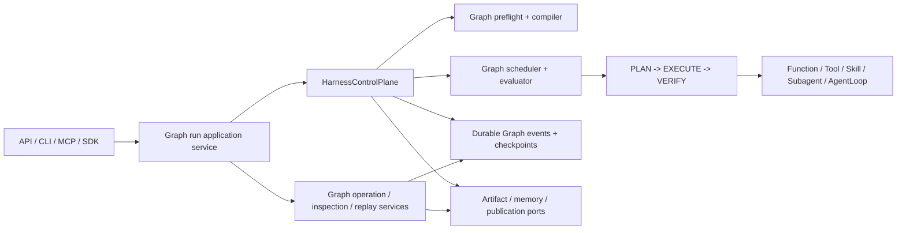

# NewsRoom Graph-only Orchestration Cutover PRD

## 1. 文档信息

| 字段 | 内容 |
|---|---|
| 产品/能力 | NewsRoom Graph-only Orchestration Cutover |
| OpenSpec Change | `graph-only-orchestration` |
| 文档状态 | Owner-authorized one-way direct cutover / repository implementation and legacy deletion in progress |
| 日期 | 2026-08-17 |
| 目标版本 | Harness Graph-only Orchestration v1 |
| 当前任务进度 | 以 `tasks.md` 当前 checklist 和 live source/test 证据为准；进度只描述代码交付，不代表保留旧 runtime 或等待外部批准 |
| 切换规则 | 当前项目 owner 已授权 repository-local source、test、evidence、commit、Graph writer/reader、run admission 和 legacy deletion；采用一次性、单向替换，不保留 rollback、dual-write、fallback、compatibility facade 或观察期门槛 |
| 影响范围 | `framework/harness`、`framework/workflow`、`framework/specs`、Research、AgentLoop activity、artifact/event/storage、approval、API/CLI/MCP/SDK、历史运行数据和 canonical OpenSpec |
| Artifact 处置 | **保留 Artifact 产品能力与独立 owner；只迁移或删除 legacy Workflow bridge/writer/reader 和 `ARTIFACT` leaf execution classification** |
| 对应规划 | `proposal.md`、`design.md`、`specs/**/spec.md`、`tasks.md` |

## 2. 摘要

NewsRoom 当前已经拥有真正的 Harness Graph runtime：Research 主路径可以声明 `Sequence`、`Parallel-All`、`VerifiedAggregation` 等 Graph 结构，并由 `HarnessControlPlane`、Graph scheduler/evaluator 和 durable Graph state 执行。

但仓库仍同时保留两套外层编排契约：

1. 新的 Graph runtime；
2. 旧的 Workflow runtime、Workflow-shaped public types、legacy compiler、runner/executor、checkpoint/buffer、operation/inspection 以及兼容导出。

这使项目处于“执行已经 Graph 化，架构权威尚未 Graph-only”的状态。调用方仍可创建或恢复旧 Workflow，持久化记录仍携带 Workflow identity，canonical OpenSpec 仍有 requirement 要求保留 `WorkflowRunner`、`WorkflowExecutor`、`AgentLoopStepRunner`、`DataBuffer` 和 Workflow import compatibility。

本 PRD 定义一次明确的 breaking cutover：

- Graph 成为唯一外层 orchestration declaration、routing authority、runtime cursor、checkpoint/replay identity 和 inspection model；
- `HarnessControlPlane` 继续是唯一控制者；
- LLM、Tool、Skill、Subagent、AgentLoop 和业务 worker 只产生候选结果；
- 有用的 artifact、event、inspection、operation、approval、checkpoint 和 storage 能力先迁到明确 owner；
- 历史 Workflow 数据只由隔离工具识别并进入只读 quarantine，不转换为可恢复的 live Graph authority；
- 不可执行或不完整历史必须稳定拒绝，不能 resume、replay execution 或产生任何 worker/side effect；
- 最后删除所有旧 Workflow runtime、兼容导出和要求旧 runtime 存在的 canonical requirements；
- 不保留 compatibility facade、dual executor、dual-write、feature flag fallback 或永久 legacy reader；历史 reader 只能位于非 production import 路径并在本 change 内删除 active 入口。

本 PRD 描述产品需求、直接替换策略和验收标准。当前 change 已进入 owner-authorized implementation：Graph run contract、writer/reader、production admission、Research composition、public surface 和 legacy deletion 都是本地交付范围。实现按职责拆分 commit，但不再因为外部环境 owner、其他 change 归档、rollback drill、pointer rollback 或观察期而暂停；每个替换都必须先有 replacement contract/test，再直接接入唯一 Graph authority 并删除旧入口。历史 Workflow record 不进入 live Graph runtime，只能由隔离工具识别并返回 typed quarantine。已完成的 owner slices 包括 Artifact owner contract 与 Research caller migration、`framework/events` projection/read model、Harness operation/inspection/replay services、Graph artifact/event index contract、Graph node-output resource contract 等；接下来必须把这些 owner 接入 live Graph path，删除旧 bridge，并用 compile、smoke、strict validation 和 zero-reference scan 证明结果。

本文后半部大量 `Current ... Gate A Evidence`、Gate B/C blocker 和固定任务计数是历史提交的 append-only 证据。它们只说明当时未完成的代码面，全部由本摘要、2.2 和第 49 节的一次性直接替换决策覆盖；不得再据此暂停 Graph writer/reader、run admission、production composition 或 legacy deletion。

### 2.1 Artifact 保留硬约束

本节是规范性 scope invariant，优先于后文的历史状态记录和迁移叙述。本文中的“删除旧 Workflow runtime”“删除 `ARTIFACT` leaf”或“删除 legacy artifact writer”均不得解释为删除 Artifact 产品能力、Artifact body store、Graph terminal manifest、catalog、governance、reporting、GC、inspection 或 publication owner。

| 对象 | 强制处置 | 最终边界 |
|---|---|---|
| `framework/harness/artifacts/**` | `KEEP` | 继续拥有 Graph terminal manifest、integrity、catalog、quota、usage、cost、GC、reporting、inspection/read ports 与 governance runtime |
| `infrastructure/storage/artifacts/**`、Research artifact port/publication/lifecycle 和 composition | `KEEP` / `ADAPT` | 继续提供真实 physical storage、ledger、lifecycle 与 production composition；调用方只消费 artifact-owned Graph contract |
| `framework/agent/artifacts/**` 中仍被使用的 raw storage、integrity、path-safety primitives | `KEEP` / 显式 owner migration | 不得因删除 Workflow package 被整包顺带删除；若后续迁移，必须逐 caller 给出 replacement 与等价测试 |
| Research `publish_artifacts` Graph activity | `ADAPT` | 作为 `FUNCTION` 只产生 checksum-bound candidate bundle 与 side-effect intent；不得直接写 terminal manifest 或返回 public ref |
| Harness controller-terminal Artifact handler | `KEEP` | 只有 deterministic VERIFY 与 publication gate 通过后才能提交 Artifact bundle、terminal manifest、catalog/usage facts 与 public refs |
| `HarnessWorkerType.ARTIFACT` 作为 Graph executable leaf、`ArtifactStepRunner` 和 legacy Workflow artifact publisher/manifest/inspection bridge | `DELETE_FROM_LIVE_RUNTIME` | 删除的是旧执行分类和容器依赖；Artifact owner、manifest、integrity、catalog、governance、GC、inspection、storage 和 publication 保持不变 |
| legacy Workflow artifact history | `MIGRATE` / `QUARANTINE` | 可转换记录离线迁为 Graph identity；不可转换记录只读隔离，不能触发旧 writer、resume、live replay 或 publication |

必须同时满足以下不变量：

- `HarnessGraphDefinition` 不接受 `HarnessWorkerType.ARTIFACT` 作为 executable leaf，只说明 Artifact 不是普通 worker，不说明 Artifact subsystem 被移除；
- worker、SubAgent、AgentLoop 和 `publish_artifacts` activity 只能产生 candidate/evidence/ref，不能拥有 manifest、catalog、GC、retention 或 publication authority；
- Artifact owner 不得被内联进 Graph evaluator/control plane，也不得被 smoke-local store、generic blob map 或 compatibility facade 替换；
- Graph terminal manifest 必须在 deterministic VERIFY 通过后由 controller-terminal authority 接受，Artifact integrity/read-back、catalog/governance/GC/cost/inspection 行为必须继续通过 owner-level 和 production-composition tests；
- 任何删除、降级、旁路或重复实现上述 Artifact owner 能力的方案均不符合本 PRD，即使 Graph/Workflow 零引用扫描可以通过。

### 2.2 Framework 全量 Graph-only 替换范围

本变更的“全部替换 Graph”不是只替换 `HarnessRunSpec` 或 Research builder。以下 framework 横切契约同样属于 live Graph authority，必须在同一 major cutover 中完成；任何保留旧 identity 分支、默认旧 schema 或把 Graph state 投影回旧平面模型的做法都不算完成。

| 横切面 | 当前残留 | 本变更最终动作 | 验收边界 |
|---|---|---|---|
| Control-plane state/result/gate/wait | `HarnessGraphState` -> flat `HarnessState` compatibility projection、`LEGACY_UNBOUND`、synthetic approval identities | 删除 compatibility projection 和 legacy branches；run result、gate context、Wait/resume、side-effect request 直接使用 Graph run/node-instance contract | production source 不再消费 flat orchestration state；Graph identity/checksum 在所有 decision 前闭合 |
| SubAgent runtime | v1/v2/v3 invocation、transcript、receipt、bundle reader/writer 并存，默认 v1 | live writer/reader/store 只保留 Graph-only major（当前 v3）；v1/v2 只允许隔离的 history-only tooling，随后删除 active migration reader | 无 live schema fallback、无 `workflow_id` authority、cross-Graph/tamper fail closed |
| Event / Trace / propagation | `BusinessContext`、`TraceContext`、carrier、tool metrics 和 Event catalog 仍带 Workflow identity；旧 Event facade/migration service 可被 production import | 发布 Graph-only major identity，catalog/current schema、carrier、projection、reader 全切 Graph；旧 facade/migrator 移出 production | active event/trace/schema registration 不再写或读 Workflow identity；历史诊断零 side effect |
| Memory / Governance / Worker / Skill / LLM | workflow scope、`workflow_run_id`、Skill/structured-output workflow metadata、tool inspection workflow labels | 统一改为 Graph run/node/stage scope；PostgreSQL、Research、worker、skill、structured-output 和 metrics caller 同步切换 | persisted/public contracts 不出现 Workflow authority；worker 只能提交 candidate/evidence |
| RAG / Context | RAG session/request 和 context pack caller 仍存在 nullable Workflow/session identity fallback | Harness RAG session、ContextEnvelope、snapshot/cache/materializer 和 Research RAG caller 统一绑定 exact Graph identity | RAG 独立 session 能力保留，但不得再形成 outer orchestration identity 或兼容 fallback |
| Checkpoint / replay runtime | flat `HarnessCheckpoint`、durable state、replay reader 仍由 root ports 导出 | 删除无生产 caller 的 flat runtime/export；保留 control-plane Graph checkpoint/replay owner | root/ports 不再暴露旧 checkpoint；Graph replay 不调用 worker 或 legacy runtime |
| Artifact bridge | `WorkflowArtifactRef`、`WorkflowArtifactPublisher`、`LocalArtifactPublisher` 与 Harness Artifact owner 并存 | 删除 legacy publisher/ref 和仅服务它们的测试；保留 `framework/harness/artifacts`、`ArtifactManager` raw storage/integrity/path-safety 和 terminal publication owner | Artifact manifest/catalog/governance/GC/inspection/storage/publication focused tests 全通过 |
| Graph namespace leftovers | legacy graph schema constants、`condition_from_legacy_dict`、flat metadata fallback | production registry 只保留 live Graph schemas；历史常量/reader 仅限离线工具，删除 fallback | unknown/moving/legacy schema 在 admission 前稳定拒绝 |

这些横切迁移与 API/CLI/MCP/SDK、Research、storage、AgentLoop、history quarantine 和旧 package 删除共享同一 Graph identity。它们不是“后续优化”或外部 Gate；只要其中任一 live caller 仍把 Workflow 当作 authority，本 change 就未完成。Artifact 行继续遵守 2.1 的保留硬约束。

### 2.3 2026-08-19 framework live cutover audit

本节把“全部替换 Graph”落到当前 live source 的真实调用链。目录删除和 Graph value contract 已经完成的部分，不等于生产执行权威已经唯一；尤其不能把 Graph activity 再投影成 flat activity 后继续沿用旧 event port。

| 优先级 | 当前 live 残留 | 必须完成的直接替换 | 完成证据 |
|---|---|---|---|
| P0 | `HarnessControlPlane._process_graph_activity()` 将 `HarnessGraphActivity` 转成 `HarnessActivity(step_id, ...)`，并经 `HarnessTransitionPort.accept_activity()` / `record_activity_result()` 写入 `newsroom.harness-worker-activity/v1` | 删除 `HarnessActivity` durable bridge、`_event_activity_from_graph()`、`_graph_activity_descriptor()` 和 flat activity port；durable input、worker candidate、node-output commit、`HarnessGraphActivityResult` 全部以同一个 Graph activity identity 贯通 | Graph event/replay 只出现 Graph activity/result schema；production source 不再出现 `step_id` activity descriptor 或 `HARNESS_ACTIVITY_*` |
| P0 | `HarnessGraphPhysicalActivityExecutor` 已有 strict input/node-output/result contract，但仍标记为 inactive；control plane 在没有 external dispatcher 时仍直接调用 worker binding | 将 physical executor 接入唯一 production dispatcher；control plane 只负责 durable decision、dispatch、VERIFY 和 state transition，不再拥有 worker `execute()` 权威；cancellation、lease、reconciliation 和 result recovery 只能由该 dispatcher/executor 链负责 | production composition 能构造并注入 executor；无 dispatcher 时 fail closed；同一 activity 不会被内置 loop 和 external executor 双重执行 |
| P1 | `GraphTerminalManifestV2` 与 `GraphExecutionVersionManifest` 只作为 inactive evidence，live Artifact port 仍以 `GraphTerminalManifest` v1 写入/读取 | 保留 Artifact owner、storage、catalog、governance、GC 和 publication authority；把 live writer/reader/inspection/read-back 切到 Graph manifest v2，v1 只留 history quarantine，之后删除 v1 live path | terminal manifest、execution-version、normalized Graph checksum 完整互相绑定；v1 输入无 worker/side-effect/publication |
| P1 | AgentLoop/Reader Repair 的 Graph binding、node-output 和 failure policy 多为 contract/smoke composition；Research production composition 尚未安装对应 authority | 以 production Graph activity binding 进入同一 physical executor，接通 `AgentRunner`、durable cursor/checkpoint、Wait registration、receipt injection、memory side-effect 和 terminal failure policy；worker 仍只能产生 candidate | Research/AgentLoop production run 经过 Graph admission -> physical activity -> node-output -> deterministic VERIFY -> terminal policy 的全链路测试 |
| P1 | approval 外部面仍有 `/api/v1/approvals/{id}/resume-context`、`buffer_updates`、`resume_metadata` 和旧 `ApprovalsClient` | 删除共享 buffer/state patch 输入，发布 versioned Graph Wait-cause/approval application service、CLI、MCP、SDK 和 OpenAPI contract；cause durable commit 后只由 Harness 自动 resume | API/CLI/MCP/SDK 只传 Graph run/node/wait identity 和 bounded cause；旧 endpoint/字段不存在 |
| P2 | `framework/harness/control_plane` 仍承载 scheduler/evaluator/state/checkpoint/durable event 实现；`context_payload()`、TaskPlan `is_graph_only` 等辅助 facade 仍存在 | 不以目录搬迁冒充架构替换：先保证这些实现只消费 Graph contract，再删除没有 caller 的 compatibility facade，收敛重复 invariant；保留 history quarantine、checksum validation 和普通业务 fallback | owner/import scan 证明没有 Workflow routing authority；删除 proof 只针对无 caller 的 facade，不误删业务 fallback |
| P2 | canonical `openspec/specs` 仍有 `workflow-*` capability requirements，旧 approval/runtime 文档和部分历史测试仍要求旧 surface | 同步 `harness-graph`、Graph storage/indexing、Graph approval-resume canonical specs；旧 requirements 标为 superseded 或直接删除；将旧 contract tests 改为 Graph contract tests 或删除 | `openspec validate --all --strict`、全量 stale-reference allowlist、Graph replacement test inventory |

这里的“framework 全量”按 authority 和调用链定义，不要求把每个 scheduler/evaluator 文件物理移动到 `framework/harness/graph`。`framework/harness/control_plane` 可以继续作为 Graph control-plane 的实现 owner；不可保留的是 Workflow identity、flat activity bridge、第二个 worker execution authority 或 v1 Graph manifest live reader。`fallback` 只有在它不提供旧 orchestration 执行权时才可保留，例如 context compaction、source reference 缺失诊断和 history quarantine。

当前验证状态也要如实区分：`.venv\\Scripts\\python.exe -m scripts.dev compile`、`scripts.dev smoke`、`openspec validate graph-only-orchestration --strict` 和 `openspec validate --all --strict` 已通过；全量 `scripts.dev test` 为 `6083 passed, 47 failed, 103 skipped, 24 deselected`。失败集中在旧 Workflow/approval/inspection compatibility tests 和旧 fixture，必须随本次 breaking cutover 重写或删除，不能通过重新加入兼容 facade“修绿”。在 P0/P1 完成并重写这些测试前，不得声称 Graph-only production cutover 已完成。

## 3. 背景与实时基线

### 3.1 当前已经具备的 Graph 能力

当前 Harness 已经实现或正在收口以下能力：

- 版本化 Graph DSL 和 `NormalizedHarnessGraph`；
- `Sequence`、`Choice`、`Parallel-All`、`Parallel-Any`、`Bounded-Loop`、`Wait` 和 `Compensation`；
- executable node 的有界 `PLAN -> EXECUTE -> VERIFY` 生命周期；
- deterministic gates、budgets、retry、replan、repair、approval wait 和 halt；
- durable Graph state、events、checkpoint、inspection 和 replay；
- 固定 outer Graph 内的 opt-in dynamic TaskPlan；
- Research static `Parallel-All + VerifiedAggregation` 路径；
- Harness-controlled side-effect、memory-write 和 publication authority。

Graph 的正确控制边界已经明确：

```text
Frozen Outer Graph
    |
    | Harness validates and advances
    v
PLAN -> EXECUTE -> VERIFY
    |
    | controlled executable activity
    v
Function / Tool / Skill / Subagent / AgentLoop

Verified terminal outputs
    |
    | Harness authorizes terminal side-effect policy
    v
Artifact owner -> manifest / catalog / storage
```

外层 Graph 在 run 创建前被冻结；dynamic TaskPlan 只能存在于已注册的 Graph stage 内，不能修改 outer Graph。Artifact 不属于要删除的第六类 worker，也不应被改名为某一种 leaf：已重写的 `framework/harness/artifacts` owner、terminal manifest、catalog、governance、physical lifecycle 和 storage 能力必须保留。Graph 只移除 legacy Workflow container/writer 依赖，并在 deterministic VERIFY 通过后由 Harness 通过 exact terminal side-effect policy 授权 Artifact publication。

### 3.2 仍然存在的旧 Workflow runtime

截至 2026-08-14、commit `30178e151837d39db765bc1a8e605bc23d1ae3b2` 的实时扫描结果：

| 指标 | 当前值 |
|---|---:|
| `framework/workflow/**` tracked files | 92 |
| 直接导入 `framework.workflow` 的外部生产模块 | 10 |
| 直接导入 `framework.harness.workflow` 的外部生产模块 | 38 |
| `graph-only-orchestration` 实施任务（该 commit 的历史规划基线） | 4/99 |
| `harness-workflow-graph-runtime` | 99/100 |
| `durable-event-runtime` | 53/55 |

上述表格是 commit `30178e151837d39db765bc1a8e605bc23d1ae3b2` 的历史规划基线，不能作为当前 apply 进度。当前进度以 `tasks.md` 和 live source scan 为准；早期 Gate A/B/C 状态已被本 PRD 的 direct-cutover 决策取代。
后续 test-only commit `8f1e4c83900ca151352d932312bbbdb3b9e04814` 仅把 Harness schema registry lock
从 ignored active OpenSpec evidence 迁到 tracked test fixture，修复 clean-checkout CI；它不改变生产调用方、
不安装 Graph-only freeze gate，也不构成 Durable Event 外部发布资格。

10 个直接生产依赖分布在：

- `framework/__init__.py`
- `framework/agent/artifacts/runtime/manager.py`
- `infrastructure/research/artifact_publication.py`
- `infrastructure/research/graph_artifact_lifecycle.py`
- `interfaces/services/artifact_service.py`
- `interfaces/services/event_migration_service.py`
- `interfaces/services/event_projection_service.py`
- `interfaces/services/run_inspection_service.py`
- `interfaces/services/run_operation_service.py`
- `scripts/dev.py`

这些数字是规划基线，不是 apply 时可直接复用的永久事实。进入实施前必须重新生成机器可读 inventory。

#### 3.2.1 Artifact 重写后的真实边界

已归档的 `graph-artifact-cost-retention` 没有移除旧 Artifact runtime 或 legacy Workflow artifact writer。该 change 明确把 production/shadow retention evidence、历史数据处置和 writer removal 留给后续显式 change。本变更也不是“去掉 Artifact”：Artifact 是必须保留的独立 owner 能力；被退役的是它对旧 Workflow manifest/inspection container 的运行依赖。

本 PRD 对 Artifact 的规范性决策如下：

- **保留**：`framework/harness/artifacts` 的 manifest、integrity、catalog、governance、reporting、quota、usage、cost、GC、physical lifecycle、inspection、storage ports 与 terminal publication owner；
- **迁移**：所有仍通过 legacy Workflow manifest、buffer、runner、inspection container 或 writer 访问 Artifact 的 caller，改为直接依赖 artifact-owned Graph contract；
- **删除**：replacement tests 到位且 production caller 清零后，直接删除旧 Workflow bridge/writer/reader；
- **禁止**：不得删除、改名为 leaf worker、内联进 Graph control plane，或用兼容 facade 替代 `framework/harness/artifacts`；任何这类实现都不符合本 PRD。

已经完成、必须保留并复用的 Graph-native 能力包括：

- `framework/harness/artifacts/catalog.py`
- `framework/harness/artifacts/governance.py`
- `framework/harness/artifacts/reporting.py`
- `framework/harness/artifacts/runtime.py`
- `infrastructure/storage/artifacts/result_sqlite.py`
- `infrastructure/research/graph_artifact_lifecycle.py`
- `interfaces/composition/research_graph_artifacts.py`

上述列表是早期 legacy bridge 基线，不代表当前运行依赖。`framework/agent/artifacts/runtime/manager.py`、Research publisher、`graph_artifact_lifecycle.py`、artifact inspection 和 composition caller 必须直接使用 `framework/harness/artifacts` 的 Graph terminal manifest/hash、strict reader 与 physical lifecycle contract；旧 Workflow manifest/inspection bridge 在 caller 清零后直接删除。

Artifact caller 的迁移还必须保持既有 canonical inspection error contract：Graph owner 内部的 checksum/size mismatch 在 `ArtifactInspectionService` 边界投影为 `ArtifactChecksumMismatchError`，Graph manifest 结构或 metadata 错误投影为 `ArtifactStoreMetadataError`，缺失成员投影为 `ArtifactNotFoundError`；legacy Workflow manifest 只返回 typed quarantine/history diagnostic，且不得读取其 artifact content。`RunInspectionService` 必须切到 Graph reader 后删除 legacy replay reader；测试和组合不得要求同一个 manifest 同时兼容两套互斥 schema。

### 3.3 Harness 内部的双模式问题

Gate A 的当前 slices 已将 Graph declaration owner 中的 DSL、condition、canonical serialization、activity model、normalized Graph model、validation、runtime binding authority、runtime resolution 和 Graph-native version constants 移入 `framework/harness/graph`，且未在 `framework/harness/workflow` 保留 import re-export；同时新增不可变 `HarnessGraphDefinition`，固定 `graph_id`、精确 `graph_version`、root Graph、activity snapshot、terminal side-effect policy 和 canonical checksum。该 definition 的 strict reader 不接受 legacy schema 或额外 Workflow 字段。

这已完成 task 2.2，并继续推进 task 2.1 与 task 3.1 的 owner/caller 迁移。`HarnessGraphRuntimeResolver` 现由 `framework/harness/graph/runtime_resolution.py` 单独拥有，旧 `framework/harness/workflow/runtime_resolution.py` 已删除且没有 import shim；`HarnessGraphPreflight` 也已由 `framework/harness/graph/validation/preflight.py` 单独拥有，旧 `framework/harness/workflow/validation` implementation/package 已删除且没有 shim。resolver 的公开输入只剩 checksum-bound `NormalizedHarnessGraph`；preflight 也只接受 exact-schema `NormalizedHarnessGraph`，不再拥有 compiler 或 `prepare(workflow)`。compiler 和 legacy reader 仍位于过渡 namespace；`HarnessControlPlane._legacy_runtime_authority()` 仍为当前 legacy-compiled Graph 从 `HarnessWorkflowSpec` 构造过渡 live bindings，`NormalizedHarnessGraph` 也仍携带 task 2.5 才会删除的 legacy Workflow identity fields，`HarnessGraphDefinition` 则刻意没有接入当前 production composition。因此 task 2.1、2.4、2.5、2.6、3.1 和 3.6 均保持开放，剩余公开 contract 仍包括：

Gate A 已完成 task 2.8 的 definition-owned repair contract slice：`HarnessStepSpec.metadata` 会递归拒绝 outer routing、node readiness 和 publication authority keys，并以稳定 `activity_outer_authority_forbidden` diagnostic fail closed；`HarnessGraphDefinition` 已升级为 strict v4，以独立、checksum-bound 的 `HarnessGraphRepairBinding` 声明显式 repair topology。每条 binding 固定唯一 `binding_id`、exact source node id、独立 repair node id、已注册 repair activity id，以及非空唯一 trigger 集合；初始 trigger 仅允许 `worker_failure_after_retry_exhaustion` 和 `verification_failure`。source 必须是 root Graph 中唯一的 executable node identity，不能退回 activity id alias；repair node 不得与 root executable/control node 或其他 repair node 冲突；同一 `(source_node_id, trigger)` 不得映射到多个 target。GraphDefinition activities 一律拒绝非空 `retry_policy.repair_step_id`，v3 reader 也不会被隐式 upcast。未来 compiler/scheduler 只能从 repair binding 生成/读取 `REPAIR` topology，不能从 leaf metadata、activity name、worker output 或 registry default 推断。当前 legacy compiler、normalized repair contract、scheduler/replay 和 production composition 尚未切换，仍会在过渡路径读取 `repair_step_id`；这些剩余工作属于 task 2.4、3.2 及 Gate B，因此 task 2.8 在接线完成前保持开放。

Task 2.1 的 preflight owner slice 已由 commit `d31fef488f72bdf7aeeba6918fa8fc0bbeda78cc`（tree `f0edf1b14ea559abbd56122ce578ec1aeb74ca20`）完成。`HarnessGraphPreflight` 现位于 `framework/harness/graph/validation/preflight.py`，只保留 exact normalized Graph schema admission 以及 structural/semantic/dataflow/registry/policy validation；它没有 compiler field、`prepare(workflow)`、`HarnessWorkflowSpec` 或 Workflow import。control plane 显式持有可替换的过渡 compiler，live admission 与 replay 复用同一 instance 后才把 `NormalizedHarnessGraph` 交给 Graph preflight。旧 `framework/harness/workflow/validation` implementation/package、Workflow package re-export 和无调用者的 `HarnessPreparedGraph` 已删除且没有 shim；subtract-only freeze generation 8 只登记 24 个删除项，没有新增 legacy dependency。只要 live `HarnessRunSpec.workflow` 和 `HarnessWorkflowGraphCompiler` 仍在 production admission 中，task 2.1、2.4、2.6 仍保持开放，这次 owner 迁移不等于 Graph-only preflight 激活。机器可读证据位于 `evidence/graph-preflight-owner-contract.json`；本切片没有删除或改变 Artifact owner/runtime/storage/publication authority。

Task 2.9 也必须按 facade 层级拆分，不能把 root API 收敛与 legacy package 删除混为一次操作。实时 AST inventory 已确认 `framework.harness` root 中的 `HarnessWorkflowSpec`、`HarnessWorkflowGraphCompiler`、`HarnessWorkflowContractReader`、`HarnessRouteKind`、`HarnessRoutingRule`、`HarnessGraphCompileResult`、`HarnessGraphSchemaRegistry` 和 `DEFAULT_HARNESS_GRAPH_SCHEMA_REGISTRY` 没有生产调用者。commit `13477267b145a7ad83123bb6bc4209f883ca8e86`（tree `de4bda86649959eddf0ef9a42332226bc4f1e60e`）已删除这 8 个 root import/`__all__` re-export，并把 21 个仍验证 legacy contract 的 test modules 改为直接从 `framework.harness.workflow.spec` 或 `.compiler` 过渡 owner 导入；root attribute、root `__all__` 和 tracked Python caller 的残留均为零。subtract-only freeze generation 9 只登记 17 个删除项，没有新增 legacy dependency。`framework.harness.workflow` package facade 仍被 `business/research/workflows/paper_analysis_workflow.py` 和 `interfaces/composition/research.py` 生产调用，因此本 slice 不删除该 package 的 `__all__`，也不搬动 production import；必须等 task 2.3-2.6、3.1 和 5.1/5.2/5.6 完成 Graph-only caller cutover 后，再删除剩余 module re-export 并勾选 2.9。新增 architecture assertion 同时锁定 `ArtifactPort`、`ArtifactReferenceVerifierPort` 和 `GraphResultArtifactReadPort` 继续由 root API 提供；该边界是 subtract-only public-surface 收敛，不激活 GraphDefinition、不改变 production runtime，也不删除或改写 Artifact owner/runtime/storage/publication authority。验证结果为 focused facade/freeze/inventory `28 passed`、受影响 modules `265 passed`、architecture `188 passed`、全量 Harness `1466 passed`、mandatory smoke `2547 passed, 23 deselected, 22 warnings` 且 source validation `true/0/0`，OpenSpec 全量严格校验 `533 passed, 0 failed`；证据见 `evidence/harness-root-facade-contract.json`，任务进度仍为 `25/102`。

GraphDefinition 的 activity topology 闭包已由 commit `83d8c8c99a5228e2a79716cc163f0a930d76e854`（tree `408fa778b32d2d8fe8adf660029dc7d8601d5d42`）补齐。Graph owner 复用同一个 DSL traversal 同时收集 root node identity 与 `StepRef.step_id`，并在已有 repair-specific validation 后验证 root、compensation、repair 三类 activity 引用的并集与声明 activities 精确闭合；未知 root/compensation activity 或未被任何 topology 使用的 activity 返回 `graph_activity_topology_coverage_mismatch`，显式 repair-only/compensation-only activity 保持合法，已有 `graph_repair_activity_unknown` 等更具体诊断不变。checksum-valid 但 topology 非法的 strict-reader payload 也会 fail closed，compiler 不再需要猜测 missing activity 或静默丢弃 unused authority。focused definition tests 为 `70 passed`，Graph owner/namespace/freeze 为 `154 passed`，architecture 为 `189 passed`，全量 Harness 为 `1471 passed`，mandatory smoke 为 `2552 passed, 23 deselected, 22 warnings` 且 source validation `true/0/0`，OpenSpec 全量严格校验 `533 passed, 0 failed`；证据见 `evidence/graph-definition-activity-topology-contract.json`。该 slice 不改变 `NormalizedHarnessGraph` 的 legacy Workflow identity，不实现或激活 `HarnessGraphCompiler`，不切 production composition，也不改变 Artifact owner/runtime/storage/publication authority，因此 task 2.1、2.4 和 2.10 继续保持开放。

本次 definition v4 repair contract slice 的实现提交为 `13a207daa45334c11a5b80cab3721831df5281b3`（tree `6a42c8987d35e8437b3d83f732ab2b07618b983e`），机器可读证据位于 `evidence/graph-definition-repair-binding-contract.json`。focused definition/namespace tests 为 `63 passed`，Graph owner tests 为 `111 passed`，全量 Harness 为 `1453 passed`，architecture 为 `184 passed`，mandatory smoke 为 `2529 passed, 23 deselected, 22 warnings` 且 source validation `is_valid=true`，OpenSpec 全量严格校验为 `533 passed, 0 failed`。这些结果只证明 inactive GraphDefinition v4 declaration、strict reader、canonical checksum 和 fail-closed topology validation；没有改变 production Graph schema、writer、runtime composition、legacy compiler 或 scheduler/replay authority，任务进度仍为 `25/102`。

Task 2.7 的实时审计必须按 gate 分层。Gate A 的两个 reader/integrity 缺口已由 commit `ea4690321cea75d6f2e6b3226d39d0e2852b365f` 关闭，并记录在 `evidence/graph-version-boundary-hardening.json`：`condition_from_dict()` 现在只接受带 exact `kind` 和 `policy_version` 的 Graph schema，legacy condition 只能通过显式 `condition_from_legacy_dict()` 进入 legacy compiler；`HarnessGraphCompileResult` 同时校验自身 supported `compiler_version` 及其与 normalized Graph pinned compiler 的一致性。该 evidence 捕获时列出的“runtime resolution 仍在 Workflow namespace”也已被后续 commit `44e223dbfb49b66e106b85fbef9c1cdbf62b4dd4` 关闭，不能继续当作当前 blocker。task 2.7 仍保持开放的真实原因是当前 legacy `HarnessWorkflowGraphCompiler` 仍会为 `step_version`、`worker_version`、未带版本的 gate 和 activity binding 推断默认版本；在 task 2.4/2.5 完成 Graph-only compiler 激活并关闭这些 inference 以前，不能用已完成的 strict reader、compile-result integrity 或 runtime-resolution owner 迁移冒充 production version pinning 已完成。

Task 2.10 也必须区分 Gate A definition-reader coverage 与最终 run-admission coverage。`HarnessGraphDefinition` 已有 round-trip、canonical checksum、order independence、tamper 和 strict schema tests，active Harness 也已有 unknown gate 在 `RUN_CREATED` / worker call 前零副作用的行为测试。commit `153de505796057a225c7f7d774d5e914772d5033` 进一步补齐 strict GraphDefinition reader 的 missing root、unknown expression kind 和显式 Graph 与全部 legacy declaration fields 并存的参数化矩阵：missing/unexpected fields 返回精确诊断，unknown node kind 不 fallback。只要 production `HarnessRunSpec` 仍只有 `workflow` 字段、`HarnessWorkflowGraphCompiler` 仍在 live preflight 中，系统就还无法真实构造并验证 final missing `graph` / dual declaration run request，也不能返回最终 `graph_required` / `legacy_orchestration_not_supported` reason；因此 task 2.10 仍保持开放，最终勾选必须等待 task 2.3-2.6 激活并补齐 run-admission/no-worker assertions。机器可读证据位于 `evidence/graph-contract-admission-test-coverage.json`；本 slice 不改变 Artifact contract 或 production runtime。

Task 3.8 的 Harness authority adversarial matrix 已在 Gate A 完成：malicious worker 即使绕过 typed result constructor，route suggestion 和 LLM self-score 仍会在 worker ingress fail closed；TaskPlan worker 只有在 `TASK_READY -> TASK_DISPATCHED -> TASK_STARTED` durable transitions 已提交后才会被调用；queue projection 不携带 dependency/readiness payload；`business/research` 全树不得导入 Graph/TaskPlan scheduler、evaluator 或 decision authority。该测试矩阵证明 candidate/queue/business surface 不能直接改变 Graph decision，但不代表 Graph-only production schema 已切换。

Task 3.3 的 live audit 发现 PRD 原先把“已有 durable phase event”和“已经绑定完整 Graph identity”混成了一个状态。当前 `HarnessControlPlane._record_graph_phase()` 确实写入 legacy `phase_recorded` event，payload 也记录 `step_id`、`node_instance_id` 和 attempt；但该 event 仍使用 `newsroom.harness-event/v1`，没有 checksum-bound `GraphRunIdentity` / `GraphEventContext`，`HarnessEventCanonicalAdapter` 也没有为这类 event 写入 `graph_context`，所以当前实现只能证明 phase transition durable 且 node-instance-bound，不能证明它 exact Graph-bound。Gate A 必须先在 `framework/events` 建立 inactive `newsroom.harness-graph-phase-transition/v1` strict contract，固定 exact Graph/node context、phase、boundary、attempt、event sequence、gate evidence refs、UTC occurrence time 和 record checksum；Gate B task 4.11 才能将 live writer 切到该 contract，并验证 record sequence 与 durable stream sequence 相同、拒绝任何 Workflow identity alias。完成 Gate A contract 后 task 3.3 仍保持开放，直到 live writer、recovery/replay reader 和 external projection 都完成 Graph-only 激活。

该 Gate A contract 已由 commit `a368baee4d13108a27705ebc3134a5e563550a0d` 落地：`framework.events.graph_phase.GraphPhaseTransitionRecord` 复用 event-owned `GraphRunIdentity` / `GraphEventContext`，强制 node scope、exact versions、封闭 phase/boundary、非负 attempt、正 event sequence、唯一 canonical-order SHA-256 gate evidence refs、timezone-aware UTC time、record checksum 与 envelope-sequence assertion；strict reader 对未知字段、Workflow alias、moving version、非 canonical refs 和完整性篡改 fail closed。architecture replacement test 同时证明 live `harness.py` / `durable_events.py` 未导入该 contract，因此 task 3.3 和 Gate B task 4.11 仍保持开放。机器可读证据位于 `evidence/graph-phase-transition-contract.json`；本 slice 没有删除或改变 Artifact owner/runtime/storage/publication authority。

Task 3.5 的 control/activity boundary 已通过跨构件测试闭合：显式 `Sequence` 只降低为 dependency edges，不产生 fake worker；Choice、Parallel-All/Any、Join、Bounded-Loop 和 Wait 均使用不暴露 `step_ref`、`worker_ref`、`activity_ref`、`gate_refs` 或 `side_effect_ref` 的 `HarnessControlNode`；signal、timer 和 approval 三种 Wait kind 均由 Harness control plane 解释；runtime binding resolution 只为 `HarnessExecutableNode` 建立 worker/activity/gate 映射。Compensation 的选取、逆序调度、budget 和 durability 仍由 evaluator/control plane 决定，但真正调用 compensation handler 的节点是一个精确版本绑定的 executable leaf；这不是把 compensation routing 交给 worker。该边界不等于 task 3.6 的全部 leaf activity 类型都已完成迁移，也不改变 Gate B/C 状态。

Task 3.6 进入本次 Gate A slice 时存在一处必须先消除的术语错位：本文图中的 Function、Tool、Skill、Subagent、AgentLoop 是目标 `leaf_activity_kind`，不是对过渡 `HarnessWorkerType` enum 或 legacy runner 完成状态的描述。slice 前的 enum 有 `SCRIPT`、`LLM`、`SKILL`、`SUBAGENT`、`MCP`、`RETRIEVAL`、`MEMORY`、`QUALITY_GATE`、`ARTIFACT`、`TASK_PLAN` 等值，但没有 `FUNCTION`、`TOOL` 或 `AGENT_LOOP`；`framework/workflow/runners/default_registry.py` 仍注册 `FunctionStepRunner`、`ToolCallStepRunner`、`SkillStepRunner`、`AgentLoopStepRunner` 等 legacy runner。Graph resolver 虽然分别解析 exact `worker_ref` 和 `activity_ref`，generic activity binding 却没有声明 leaf kind 或与 worker binding 的兼容关系，因此“存在两个 ref”还不能证明 Function/Tool/Skill/Subagent/AgentLoop 已按正确语义接线。

目标映射必须按下表执行，不能通过字符串 alias 或 transport 名称冒充完成：

| 目标 `leaf_activity_kind` | 当前过渡标识/实现 | Graph-only 处置 |
|---|---|---|
| `function` | 新增 canonical `HarnessWorkerType.FUNCTION`；legacy 仍有 `SCRIPT`、`FunctionStepRunner` | 建立显式 Function leaf binding；`SCRIPT` 不得作为最终 Graph contract 的静默 alias |
| `tool` | 新增 canonical `HarnessWorkerType.TOOL`；legacy 仍有 `MCP`、`ToolCallStepRunner`/`ToolBatchStepRunner` | 建立显式 Tool leaf binding；MCP 只表示 ToolRuntime 的一种出站 transport/adapter，不能代替 Tool activity kind |
| `skill` | `HarnessWorkerType.SKILL`、`SkillStepRunner` | 迁到 exact Skill leaf binding，并删除 legacy runner binding |
| `subagent` | `HarnessWorkerType.SUBAGENT`、现有 Subagent adapter | 迁到 exact Subagent leaf binding，保留 Harness admission/budget authority |
| `agent_loop` | 新增 canonical `HarnessWorkerType.AGENT_LOOP`；legacy 仍有 `AgentLoopStepRunner` | 建立 exact AgentLoop leaf binding；由 task 6.1 接入并在 task 6.7 删除旧 runner/registry binding |

本 Gate A slice 已新增独立 `HarnessLeafActivityKind`、五类 canonical worker type、checksum-friendly `HarnessLeafActivityBinding` snapshot，以及 composition-owned exact worker/activity pair registration；`HarnessRuntimeBindingAuthority.resolve_leaf_activity()` 会同时验证 frozen caller 期望 kind、canonical worker type、exact refs 和 activity safety capability，`SCRIPT`/`MCP` alias 与未注册 pair 均 fail closed。worker ingress 与 durable activity result reader 统一通过严格 `HarnessWorkerResult.from_dict()` 重建，typed `evidence` 和 candidate artifact refs 不再被 adapter 丢弃，未知或顶层 control-shaped 字段会在 durable result 前被拒绝。该 slice 尚未把 `leaf_activity_kind` 写入最终 frozen Graph schema/dispatch receipt，也没有把五类 live 实现全部迁离旧 registry；因此 task 3.6 继续保持开放，后续还必须完成 Graph compiler/runtime wiring、Function/Tool/Skill/Subagent composition 和 task 6.1/6.7 的 AgentLoop replacement/deletion。`HarnessWorkerType.ARTIFACT` 只是当前过渡执行标识，不能据此推断 Artifact owner 被删除或 Artifact publication 应成为普通 worker；已重写的 Artifact owner/runtime 继续保留，publication 仍由 task 3.7 的 Harness-owned gate/port authority 决定。

本 slice 的实现提交为 `4ea5de2145f7b2745406063697b30c787cde0256`（tree `47b2fe133c091946549b32178e99a29fee52b6f4`），机器可读证据位于 `evidence/leaf-activity-binding-contract.json`。focused contract tests 为 `148 passed`，全量 Harness 为 `1408 passed`，mandatory smoke 为 `2484 passed, 23 deselected` 且 source validation `is_valid=true`，OpenSpec 全量严格校验为 `533 passed, 0 failed`。这些结果只证明 Gate A binding/ingress contract，不授权 Gate B production activation，也不把 task 3.6 标为完成。

Task 3.7 必须复用已经完成的 `harness-side-effect-authority-closure`，不能在 Graph change 内再建立一套 memory、Tool、Artifact 或 external-effect decision runtime。实时 object-graph 与 caller 审计确认：Research Artifact bundle 与 terminal publication 已由 `HarnessSideEffectIntent`、exact handler binding、durable authorization/outcome 和 artifact-owned port 控制，已重写的 Artifact owner/runtime/storage 不应删除；generic `MemoryPort.commit_write(candidate)` 只有 framework fake 会真正写，production `ResearchRAGMemoryPort` 是 recall/candidate-only；legacy `MCPToolRequest.approved` 只被 fake policy 与未进入 production composition 的可选 RAG Tool port 消费，但它仍表达 caller self-authorization，属于必须收口的错误 contract。commit `a07a35d0ed9e5a673251e3a427da32f6a3cf69fa` 已按 Gate A 删除 generic memory 的直接 commit surface 和 `committed`/`rejected` candidate status，并删除 caller-supplied MCP approval；legacy MCP port 现在对所有 side-effect Tool 和 unknown Tool fail closed，即使 Tool 不需要人工 approval 或 metadata 声称 `approved=true` 也不能执行。真实 memory/external effect 必须由 exact `HarnessSideEffectHandler` 执行，Tool-specific allowlist/policy 仍只作为 deterministic input 被 Harness 消费。由于最终 Tool leaf、Graph-only compiler/dispatch receipt 和 production composition 尚未切换，task 3.7 仍保持开放，不能把“已有 Artifact publication 已受控”或“当前没有 generic memory production writer”冒充全部 side-effect cutover 已完成。

该 bypass-hardening slice 的机器证据位于 `evidence/harness-side-effect-port-boundary.json`。focused boundary tests 为 `9 passed`，Harness ports 为 `12 passed`，Harness RAG 为 `90 passed`，Research RAG 为 `419 passed`，全量 Harness 为 `1464 passed`，architecture 为 `187 passed`，mandatory smoke 为 `2543 passed, 23 deselected, 22 warnings` 且 source validation `is_valid=true`，OpenSpec 全量严格校验为 `533 passed, 0 failed`。这些结果证明的是 legacy candidate-port 不再能够自授权，并不新增 generic memory production writer，也不激活最终 Tool leaf 或 Graph-only production dispatch。

后续 Gate A definition slice 已把 activity 到 exact typed leaf registration 的选择写入 `HarnessGraphDefinition` v2：每条 checksum-bound `HarnessGraphLeafBinding` 固定 `activity_id`、`leaf_activity_kind`、exact worker ref 和 exact activity-contract ref；canonical serialization 不受输入顺序影响，缺失、重复、未知 activity、kind/worker type 不一致、moving version 和 contract kind 不一致均 fail closed。五类最终 leaf 只允许 `FUNCTION`、`TOOL`、`SKILL`、`SUBAGENT`、`AGENT_LOOP`，内部 `TASK_PLAN` stage 不伪装成五类 leaf；`SCRIPT`、`MCP`、`ARTIFACT` 和 `QUALITY_GATE` 均不能进入最终 GraphDefinition leaf contract。Artifact publication 仍只由 `HarnessTerminalSideEffectPolicy` 及 artifact-owned port 承担，不能通过把 `ARTIFACT` 改名或映射成 `AGENT_LOOP` 来绕过 Harness authority。该 v2 contract 仍由 Gate A architecture test 锁定为 inactive：`HarnessRunSpec.workflow`、legacy compiler、`NormalizedHarnessGraph`、`HarnessGraphActivity` durable receipt、live dispatch 和 Research composition 均未切换，因此 task 3.6 继续保持开放。

实时追踪 v2 contract、legacy compiler、`NormalizedHarnessGraph` 与现有 `TaskPlanStageBinding` 后确认，PRD 还遗漏了一个 Graph-only compiler 的必要输入：虽然 v2 正确禁止把内部 `TASK_PLAN` stage 伪装成第六类 leaf，却没有规定该 stage 的 exact worker ref、exact activity-contract ref、policy ref、TaskPlan schema、required output roles 和完整 support refs 从哪里进入 immutable Graph definition。当前 `HarnessWorkflowGraphCompiler` 仍会从 `HarnessStepSpec.metadata` 和默认值推断其中一部分 identity；如果直接删除 legacy compiler，dynamic stage 将无法在不推断、不 fallback 的条件下生成现有 checksum-bound `TaskPlanStageBinding`。

本 Gate A follow-up 已将 `HarnessGraphDefinition` 升级为 v3，并增加独立、checksum-bound 的 `HarnessGraphTaskPlanStageBinding` 集合。它与五类 `HarnessGraphLeafBinding` 互斥且按 activity id 完整覆盖所有 `TASK_PLAN` activities；每条声明固定 exact worker/activity refs、exact policy ref、exact TaskPlan schema、非空唯一 required output roles，以及 candidate builder、capability registry、gate registry、aggregator、checkpoint、result store 和 event schema 的完整 exact support refs。重复、缺失、未知或 unexpected coverage、wrong contract kind、moving/malformed ref、schema/support 不完整、required roles 为空或重复、TASK_PLAN 自带 side-effect handler、checksum tamper 与旧 v2 reader 均 fail closed。`step_ref` 不新增第三份 caller binding，而由未来 compiler 以 `graph_id`、exact `graph_version` 和 `activity_id` 确定性生成。未来 `HarnessGraphCompiler` 只能从该声明编译 dynamic stage，禁止再从 metadata、registry default、字符串 alias 或 moving version 推断。运行时仍可从 checksum-valid `NormalizedHarnessGraph` 构造 `TaskPlanStageBinding`，但其中所有字段必须可追溯到同一 v3 declaration/checksum。该 v3 contract 仍由 Gate A architecture test 锁定为 inactive，未切换 production compiler、persisted schema、durable dispatch receipt 或 Research composition；task 3.6 继续保持开放。

上一 definition v2 slice 的实现提交为 `93de91280538b660df861d04f6b1ec5d49151123`（tree `d63967ad650f0233088c76592a07ce0b6ce80e26`），机器可读证据位于 `evidence/graph-definition-leaf-binding-contract.json`。focused contract tests 为 `68 passed`，Graph owner tests 为 `83 passed`，全量 Harness 为 `1420 passed`，architecture 为 `184 passed`，mandatory smoke 为 `2496 passed, 23 deselected` 且 source validation `is_valid=true`，OpenSpec 全量严格校验为 `533 passed, 0 failed`。这些结果证明的是 Gate A frozen leaf definition contract 和 Artifact authority separation，不授权 Gate B production activation，也不把 task 3.6 标为完成。

本次 v3 TaskPlan stage declaration slice 的实现提交为 `53067bdd8c1412714a1b6b1df2abdb9298a7d805`（tree `c67508581814de900f5b9e7e0b489244e5384c3d`），机器可读证据位于 `evidence/graph-definition-task-plan-stage-binding-contract.json`。focused contract tests 为 `45 passed`，Graph owner tests 为 `88 passed`，现有 TaskPlan stage/contract/runtime tests 为 `42 passed`，全量 Harness 为 `1433 passed`，architecture 为 `184 passed`，mandatory smoke 为 `2509 passed, 23 deselected` 且 source validation `is_valid=true`，OpenSpec 全量严格校验为 `533 passed, 0 failed`。这些结果只证明 Gate A immutable declaration、strict reader 和 Artifact/TaskPlan authority separation；`HarnessRunSpec.workflow`、legacy compiler、normalized Graph/durable receipt、live dispatch 和 Research composition 均未切换，任务进度仍为 `25/102`，不授权 Gate B/C，也不把 task 3.6 标为完成。

本次 runtime-resolution owner slice 的实现提交为 `44e223dbfb49b66e106b85fbef9c1cdbf62b4dd4`（tree `af4b755214011d3cda84a5a92bd26397348730f2`），机器可读证据位于 `evidence/graph-runtime-resolution-owner-contract.json`。focused owner tests 为 `14 passed`，freeze/namespace tests 为 `26 passed`，Graph/preflight tests 为 `127 passed`，全量 Harness 为 `1435 passed`，architecture 为 `184 passed`，mandatory smoke 为 `2511 passed, 23 deselected` 且 source validation `is_valid=true`，OpenSpec 全量严格校验为 `533 passed, 0 failed`。这些结果证明 Graph runtime-resolution owner、frozen-Graph-only resolver input、terminal policy snapshot authority、control-node exclusion 与无 Workflow shim；它没有替换 legacy compiler/reader/preflight/live-binding construction，没有激活 typed-leaf production composition，也没有改变 Artifact owner、persisted schema、writer、pointer 或 publication authority。任务进度因此仍为 `25/102`，task 2.1、3.1 和 3.6 均保持开放。

Task 5.8 仍保持开放。当前全树 import boundary scan 已确认 `business/research` 不再直接导入 legacy `business.boards.paper_radar`、`interfaces`、`infrastructure` 或 `framework.workflow`，但 `business/research/workflows/paper_analysis_workflow.py` 仍直接导入 `framework.harness.workflow.HarnessWorkflowSpec`。因此 Research 仍有旧 Harness Workflow declaration 依赖，必须由 task 5.1、5.2 和 5.6 完成 Graph definition、package 与 composition cutover 后再重新扫描；不能因为较老的 `paper_radar` 依赖已经清零就提前勾选 5.8。

Research GraphDefinition 的 Gate A declaration slice 已由 commit `d7c2fe6e712a490a6950e4490d7734372a0e8eaf`（tree `f338be290e56951fcc74a17b9286df64a6114182`）落地。`business/research/graphs` 现在单独拥有 Graph identity、dynamic TaskPlan exact refs、Artifact terminal policy 以及 static/dynamic paper-analysis builders；新 package 不反向导入 `business.research.workflows`、`framework.harness.workflow` 或 `framework.workflow`，旧 Workflow builder 与 TaskPlan implementation 只向新 owner 消费共享 contract。static definition 固定 12 个 exact typed activities、`ParallelAll + VerifiedAggregation` 和 11 个 exact deterministic gate refs；dynamic definition 只以一个 checksum-bound `TASK_PLAN` stage 替换三路 SUBAGENT fan-out，并固定 policy/schema/required roles/完整 support refs。两份 definition 均不包含 Workflow identity 或 legacy routing fields；该提交当时由 strict v4 reader canonical round-trip，历史 checksum 分别为 `sha256:34f36a12c12f4858a464a16bdcf5fb2ecc7c73060dad7ec1efae0e2a8edb6fcd` 与 `sha256:43c811b61bb809509f4c094518ec9c2a2d15f048dd3673a8af7356b46eebed98`。后续 schema 升级不得重写这些历史提交事实，当前 checksum 以最新 strict schema evidence 为准。

本 slice 同时按本 PRD 修正了 Artifact 语义而没有删除 Artifact：`publish_artifacts` 在最终 definition 中保留为 `FUNCTION` candidate-preparation activity，输出 key 为 `artifact_candidate_bundle`，只声明 exact `research.artifact.bundle@1` handler 并产生 pending bundle/worker-origin intent；它不把候选命名为 `artifact_refs`，不持有 `ArtifactPort`，也不提交 terminal manifest。真实 publication 仍仅由继承 `ResearchQualityGate@1` 的 `HarnessTerminalSideEffectPolicy` 在 deterministic VERIFY 后以 controller-terminal authority 调用 Artifact handler。既有 integration test 继续证明所有 Research workers 均不可到达 Artifact port/store/runtime，candidate worker 返回后 `workspace.artifact_refs` 仍为空。验证结果为 focused Graph/legacy contracts `21 passed`、Research workflows/graphs `54 passed`、architecture `190 passed`、dynamic/Artifact/composition `32 passed`、Graph definition/migration goldens `71 passed`、全量 Harness `1471 passed`、mandatory smoke `2558 passed, 23 deselected, 22 warnings` 且 source validation `true/0/0`，OpenSpec 全量严格校验 `533 passed, 0 failed`；证据见 `evidence/research-graph-definition-contract.json`。由于 `HarnessRunSpec.workflow`、legacy compiler、production Research composition/runtime binding、persisted schema 与旧 package 删除均未切换，task 5.1-5.4、5.7、5.8 继续保持开放，任务进度仍为 `25/102`。

Task 5.1 的 Gate A owner-migration slice 已由 commit `4be33a0743cabc8843806bfde355325b831f0d04`（tree `b2e213b29527f0e7fc014ae97d2da88833aaf67f`）落地。`paper_analysis_gates.py` 与 `paper_analysis_task_plan.py` 及其测试已从 `business/research/workflows` 迁到 `business/research/graphs`，`business.research.graphs` 成为 gate registry、Graph definition、TaskPlan contract/worker/policy 的 canonical package；`business/research/workflows/__init__.py` 现在是空 `__all__`，没有 import re-export 或 compatibility facade，旧目录只剩 declaration-only 的 `paper_analysis_workflow.py`。architecture guard 同时锁定新 `graphs` package 对 `business.research.workflows`、`framework.harness.workflow` 和 `framework.workflow` 的零依赖，并要求 production 中任何残余 Research Workflow import 都只能显式指向待删除的 declaration module。实时 caller inventory 只剩 `business/research/application/single_paper_runtime.py` 与 `interfaces/composition/research.py` 两处 direct legacy builder import；它们没有通过 package facade 隐藏依赖。

该 owner migration 仍不是 task 5.1/5.2/5.6/5.8 的最终完成：`paper_analysis_workflow.py` 尚未删除，`HarnessRunSpec.workflow` 与 `HarnessWorkflowGraphCompiler` 仍是 production admission/composition 路径，`graphs/task_plan.py` 也仍以内部 transitional `RESEARCH_DYNAMIC_WORKFLOW_ID` 校验 `TaskPlanStageBinding.workflow_id`；该标识刻意没有从 `business.research.graphs` canonical API 导出。只有 Graph-only compiler/run admission、production composition、TaskPlan Graph identity 和旧 declaration caller 全部切换后，才能删除剩余 Workflow package 并勾选对应任务。本 slice 没有修改 Artifact 文件、owner、runtime、storage、terminal policy 或 publication 行为；`publish_artifacts` 仍只产出 `artifact_candidate_bundle`，真实 publication 仍要求 deterministic VERIFY 后的 controller-terminal authority。验证结果为 Research graphs/workflows/integration/composition `107 passed`、focused architecture guards `28 passed`、全量 Harness `1471 passed`、mandatory smoke `2559 passed, 23 deselected, 22 warnings` 且 source validation `true/0/0`，OpenSpec 全量严格校验 `533 passed, 0 failed`；证据见 `evidence/research-graph-owner-migration-contract.json`，任务进度仍为 `25/102`。

Task 5.5 的 Gate A inactive declaration slice 已由 commit `15b062b6bc6bd0457a3e7ed1e57069807b6f7425`（tree `4e7bd891e389c0ef4b1804520a4d19fac7227040`）落地。`business/research/graphs/reader_repair.py` 现在声明 `research.reader_repair.graph@1`，固定 8 个 exact typed activities、8 个 leaf bindings、8 个 deterministic gates 与 checksum `sha256:0cc430145c6bb59ed0436a1b71ecbdfc6c2f4d6a18d1dec880ed1617052d3cc7`。proposer 只能返回 localized `ReaderRepairCandidate`，verifier 只能返回无 `passed`/verdict/routing/write/publish/promote authority 的 source-backed observations；两类 SubAgent 的 output 都必须携带 exact input checksum。后续 Function/gate chain 逐级把 result、repair case、procedural strategy bundle 与 proposed `MemoryWriteCandidate` 绑定到 previously verified outputs，并通过稳定 identity、source-case refs、experience refs 和 adversarial checksum-substitution tests fail closed。旧 `business/research/reader_repair/workflow.py` 已删除且没有 shim，现有 service/package 直接从 Graph owner 读取 SubAgent declaration。

该 slice 没有激活 production reader-repair Graph。`ReaderRepairService` 仍直接调用 `commit_case()` 与 `write_strategy()`，exact `research.reader_repair.memory.commit@1` production handler、Function worker bindings 和 production composition 均尚未注册；因此 task 5.5、5.7、3.6 和 3.7 继续保持开放。Graph 的 terminal side effect 只声明 proposed memory candidate 及 Harness-owned memory policy，skill seed 强制 `publishes_skill=false` 且只能进入 Harness skill evolution；它没有 Artifact handler 或 Artifact terminal policy，也没有修改、删除或替换 Artifact owner/runtime/storage。验证结果为 focused Graph/gate contracts `17 passed`、Research Graph/Reader Repair/integration `68 passed`、Research boundary `5 passed`、全量 Harness `1471 passed`、architecture `192 passed, 4 warnings`、mandatory smoke `2577 passed, 23 deselected, 22 warnings` 且 source validation `true/0/0`，OpenSpec 全量严格校验 `533 passed, 0 failed`；证据见 `evidence/research-reader-repair-graph-contract.json`，任务进度仍为 `25/102`。

Task 3.7/5.5 的后续 Gate A memory-side-effect contract slice 已由 commit `09f6166f57919aed6426d8d54f9465f28a26206a`（tree `e76913fe87bb267b5bfde99016c27f872d84180c`）落地。`build_reader_repair_memory_worker_result()` 只构建 checksum-bound proposed `MemoryWriteCandidate` 与 worker-origin `HarnessSideEffectIntent`；Harness 绑定后的 compound candidate checksum 会在 `ReaderRepairMemorySideEffectHandler.prepare()` 再次验证，prepare 只返回无 public refs 的 durable candidate outcome，不能写 memory。只有携带 `ReaderRepairMemoryPolicyGate@1` evidence 的 controller-terminal `ACCEPTED` authority 才能调用 `commit()`。handler 不复用 legacy 逐条 `write_case()`/`write_strategy()`，而是依赖独立 `ReaderRepairMemoryCommitPort`，以深度不可变、canonical-checksummed request/receipt 约束 case 与全部 procedural strategies 的单事务提交、稳定 idempotency key 和不可变 `/versions/{n}` public refs；commit 后 outcome persistence 失败时，重试必须返回同一 receipt，不能新增 memory version。

该 handler/port 在上述 contract slice 中仍是 inactive contract，当时尚无 production atomic adapter，也没有注册到 `single_paper_runtime` 或 `interfaces/composition/research.py`；现有 `ReaderRepairService` direct memory writes 未切换，Graph-only compiler/run admission 与其余 Function/SubAgent bindings 也未激活。因此 task 3.7、5.5 和 5.7 继续开放，不能把“handler class 已存在”误报成 production memory cutover。该 slice 没有修改 Artifact owner/runtime/storage 或 Artifact publication handler。验证结果为 focused memory/Graph/architecture contracts `23 passed`、Research Reader Repair/Graph/integration `145 passed, 9 deselected`、全量 Harness `1471 passed`、完整 `infrastructure/research + architecture` `431 passed, 3 skipped, 4 warnings`、mandatory smoke `2578 passed, 23 deselected, 22 warnings` 且 source validation `true/0/0`；证据见 `evidence/research-reader-repair-memory-side-effect-contract.json`，任务进度仍为 `25/102`。

后续 durable adapter slice 已由 commit `f762e7a34bfa238c9cf6fd6aa6b3538766eef180`（tree `254a803c4a1e401f28c5147e55123318ecf2653f`）落地。migration `011_reader_repair_memory_commits.sql` 新增 append-only commit header/member ledger，以 deferred completeness trigger 保证每个 receipt 恰有一个 case member，并通过 immutable trigger 锁定 commit receipt、member 与被 versioned public ref 指向的 memory version。`PostgresReaderRepairMemoryRepository.commit_bundle()` 先按 idempotency key 获取 transaction advisory lock，再以 canonical order 获取对象锁，在同一 transaction 中分配版本、写 case/全部 strategies、commit header 与 members；任一写入失败整体 rollback，crash-window retry 从 durable ledger 重建同一 UTC timestamp、版本和 receipt，不生成新版本。`PostgresReaderRepairMemoryCommitPort` 只接受严格 `ReaderRepairMemoryCommitRequest`，映射经过验证的 projection，并在生成 checksummed `ReaderRepairMemoryCommitReceipt` 前逐字段反校验 repository record；env factory 只暴露可构造 adapter，没有创建或注册 handler。production atomic adapter 因此已存在，但仍未激活：`ReaderRepairMemorySideEffectHandler` 未进入 production composition，legacy direct writes 与 Graph-only run admission blocker 均保持。focused adapter/storage/interface/architecture contracts 为 `64 passed`，完整 Postgres 为 `98 passed`，services 为 `427 passed, 2 skipped`，`infrastructure/research` 为 `238 passed, 3 skipped`，architecture 为 `193 passed`，Reader Repair 为 `65 passed`，全量 Harness 为 `1471 passed`，mandatory smoke 为 `2578 passed, 23 deselected, 22 warnings` 且 source validation `true/0/0`，OpenSpec 全量严格校验为 `533 passed, 0 failed`。本 slice 没有修改 Artifact 文件、owner、runtime、storage、terminal policy 或 publication behavior；任务进度仍为 `25/102`。

Reader Repair Function worker 审计进一步确认，现有 8-activity declaration 仍缺少真实 repair execution boundary，不能直接注册或激活。`ReaderRepairCandidate.patch_operations` 当前是无封闭 schema 的 `dict` 列表；Graph 在 proposer 后没有 apply activity，verifier 只看到 issue/candidate 而看不到应用后的 payload，`build_repair_result` 也没有 after-payload 或 deterministic verification input。全树唯一的 after ref 生成逻辑仍是 legacy `ReaderRepairService` 的 `repaired_payload_ref or f"{payload_id}:repaired"`；这既没有真实 applier/持久化对象，也允许 result 中的 `passed` 布尔值只做自洽检查而不是由 Harness gate 重算。上述 v1 checksum `sha256:0cc430145c6bb59ed0436a1b71ecbdfc6c2f4d6a18d1dec880ed1617052d3cc7` 因此只能证明 candidate/gate/side-effect authority separation，不能作为 production-capable repair Graph，也不得据此实现一个拼接 after ref 的 Function worker。

Task 5.5 在 production Function/SubAgent binding 前必须先完成 Reader Repair execution contract 升级：定义 bounded、typed、closed patch operation；新增 `apply_repair_candidate` Function，使其只对输入 `ResearchReaderPayload` 做确定性纯变换并返回 checksum-bound `ReaderRepairApplicationCandidate`，不得写 store、memory、Artifact 或公开 ref；让 verifier 同时绑定 candidate 与 application candidate，仍只能返回 source-backed observations；新增 deterministic application verification record/gate，必须从 before/after payload、target scope、schema、navigation 与 source-lineage 重算 exact checks，worker metadata 或自然语言 finding 不能决定 pass/fail；`build_repair_result` 必须消费该 verified record 和 Harness 提供的 exact node-output identity/checksum，禁止合成 `:repaired`、接受未绑定 caller ref 或把 candidate ref 冒充 durable/public ref。quality failure 必须进入 bounded replan/retry/halt。为保留现有 failed-candidate diagnostic memory 能力，最终 retry/replan budget 耗尽并由 Harness durable halt 后必须走独立、显式、exact-version 的 controller-terminal failure policy 和 failure-diagnostic handler；成功路径的 `complete_run` memory policy/handler 不得复用，失败 gate 也不得被改写为 passed。该 failure policy 只能消费 checksum-bound terminal failure record、failed gate evidence、issue/candidate/application/observation lineage，且只能提交 `successful=false`、无 `payload_after_ref` 的 diagnostic case；不得生成 strategy promotion、skill candidate、Artifact/public ref 或普通成功 memory receipt。这里的强制 domain diagnostic 只适用于已经形成完整 issue/candidate/application/observation/verification lineage 的 failed repair candidate；若 run 在这些业务事实形成前因基础设施、admission 或 worker failure 终止，Harness 仍必须 durable 记录 Graph terminal failure，但不得为调用 domain handler 伪造 repair case 或 lineage。成功 memory commit 必须绑定已 durable commit 的 node output；Reader Repair Graph 仍不得绑定 Artifact publication handler，若 repaired payload 未来需要成为公开 Artifact，必须由独立显式 change 定义 Artifact-owned terminal publication contract。机器可读审计证据位于 `evidence/research-reader-repair-execution-gap-audit.json`。

上述 execution contract 的 Gate A domain/gate/worker slice 已由 commit `196a61be3d89511da133324c6df282856562b31c`（tree `a9f8eec50adf80112af6105120cd3fcfe6bb64ab`）落地。`ReaderRepairPatchCandidate` 现在使用最多 8 个、discriminated-union 封闭的顶层 replacement/removal operations；每个 operation 必须绑定唯一 id、唯一 target、输入 component checksum 和 exact source refs，开放 `replace_region`/JSON Patch、重复 target、stale checksum、no-op 以及 route/write/publish/promote 字段均 fail closed。`apply_reader_repair_candidate()` 只执行确定性内存变换，输出 `status=pending` 的 checksum-bound `ReaderRepairApplicationCandidate`，并保持 payload/paper/source identity，禁止引入未声明嵌套 source refs、修改既有 Artifact lineage 或返回 public ref。独立 `ReaderRepairApplicationObservationCandidate` 同时 checksum 绑定 patch/application candidate 且递归禁止 `passed`/verdict 字段；canonical verification record 固定重算 candidate/application/observation binding、before/after checksum、payload change、paper identity、target scope、schema、navigation 与完整 source lineage。四个 exact deterministic gate adapter 会重新执行 applier/verifier 并拒绝 worker substitution 或自然语言自报通过，两个 Function worker builder 仅返回 candidate output 且 `effect_intent=None`。

该 slice 仍是 inactive preparation，不是 task 5.5/5.7 的 production 完成。`research.reader_repair.graph@1` 被刻意保持为历史 8-activity declaration，尚未升级为消费新 contract 的 Graph v2；production composition 未注册新 gate registry/Function workers，`build_repair_result` 仍未取得 Harness durable node-output commit identity，legacy `ReaderRepairService` 的 synthetic `:repaired` 与 direct memory writes 也尚未删除。因此下一步必须先完成 v2 Graph declaration、node-output commit injection/result contract 和 bounded failure topology，再允许任何 production registration。该 slice 没有修改 Artifact 文件、owner、runtime、storage、handler 或 publication policy；它只在 Reader payload 内部阻止 repair candidate 篡改既有 Artifact lineage。验证结果为 focused execution contracts `20 passed`、当前 Reader Repair 集合 `63 passed`、完整 Harness `1471 passed`、`infrastructure/research` `238 passed, 3 skipped`、architecture `194 passed, 4 warnings`，mandatory smoke `2599 passed, 23 deselected, 22 warnings` 且 source validation `true/0/0`，OpenSpec 全量严格校验 `533 passed, 0 failed`；任务进度仍为 `25/102`。

后续 Gate A 通用 contract 已由 commit `2462b2e5f316755d989ba4f943990589bcdae7c2`（tree `4d5b22ad35244a0f16345092254b6e09c0e29fd7`）落地：`HarnessGraphDefinition` 升级为 strict v5，并新增 checksum-bound `HarnessGraphCommittedNodeOutputBinding`、`HarnessCommittedNodeOutputReceipt` 与 resource-backed inactive input resolver。binding 必须固定 exact producer/consumer activity、两端 root node identity、producer output key 和独立 receipt input key，并证明 producer 在所有合法路径上确定性先于 consumer；同一 `BoundedLoop` 内因缺少 iteration lineage 而 fail closed。receipt 必须绑定 v5 definition checksum、exact producer activity contract、Graph/node-instance resource identity、完整 immutable commit/candidate 与 output ref，resolver 还必须重算 payload checksum 并确认 receipt 对应当前 resource commit。该 contract 只建立 Gate A declaration/receipt/verification 边界：当前 `research.reader_repair.graph@1` 仍显式声明空 binding，尚未升级 Graph v2，Graph-only compiler 也尚未提供 definition checksum 到 normalized Graph checksum 的 lineage proof，live executor 未使用该 resolver。因此 `build_repair_result` 仍不能消费 receipt，task 2.4、2.10、3.6、4.13、5.5 和 5.7 均保持开放；Artifact owner/runtime/storage/publication authority 完全不变。验证结果为 focused contracts `98 passed`、mandatory smoke `2613 passed, 23 deselected, 22 warnings` 且 source validation `true/0/0`，OpenSpec 全量严格校验 `533 passed, 0 failed`；机器证据位于 `evidence/harness-committed-node-output-binding-contract.json` 与 `evidence/research-reader-repair-execution-gap-audit.json`。

Reader Repair Graph v2 的 Gate A declaration/result slice 已由 commit `107fa2e8eee999da3cd9428967c90fcadbb4d246`（tree `561edd064f5dd2c7eb971ba8a0c09ac396f2d3e1`）落地。`research.reader_repair.graph@2` 现在以 checksum `sha256:7522777c2a8e80e249a4fa2f2a5dad33a9f6a1164d7d34cd82464f9c5350b7a0` 冻结 10 步成功主链：issue/context 后依次执行 typed patch proposal、纯 Function application、observation-only SubAgent、deterministic Function verification、committed result、case、skill candidate 和 memory candidate。definition 以 exact `HarnessGraphCommittedNodeOutputBinding` 将 `apply_repair_candidate` 的 `reader_repair_application_candidate` 绑定到 `build_repair_result` 的独立 receipt input，并为 proposer/application/observation/verification 四个 node 各声明唯一 repair node；`worker_failure_after_retry_exhaustion` 与 `verification_failure` 只能回到 proposer，SubAgent local retry 固定为最多 2 次 attempt，所有 activity 的 `repair_step_id` 为空。`ReaderRepairCommittedResultGate@1` 会严格读取完整 `HarnessCommittedNodeOutputReceipt`，重算 application verification 和 result，成功 `ReaderRepairResult` 必须携带 typed `ReaderRepairCommittedOutputProof`，并分别绑定 application id、verification checksum、definition/resource/commit/output/receipt checksum 以及真实 after-payload checksum；它不生成 public ref，也不把 candidate ref 冒充 durable/public ref。

该 v2 slice 仍是 inactive Gate A contract，不是 production repair cutover。`HarnessCommittedNodeOutputInputResolver` 尚未接入 live physical executor，GraphDefinition checksum 到 normalized Graph checksum 的 compiler lineage、production worker/gate registry composition、Graph-only run admission、legacy `ReaderRepairService` synthetic `:repaired`/direct memory write 删除和 separate failure-terminal diagnostic policy 仍未完成；因此 task 2.4、2.10、3.6、3.7、4.13、5.5 与 5.7 继续开放，任务计数仍为 `25/102`。Reader Repair v2 没有声明 Artifact handler 或 Artifact terminal policy，未修改 Artifact owner/runtime/storage/publication authority。验证结果为 focused Reader Repair contracts `29 passed`、Reader Repair/Graph/architecture boundary `97 passed`、architecture `194 passed, 4 warnings`、mandatory smoke `2618 passed, 23 deselected, 22 warnings`、source validation `true/0/0`，OpenSpec change strict valid 且全量 strict `533 passed, 0 failed`；证据见 `evidence/research-reader-repair-graph-v2-contract.json`、`evidence/research-reader-repair-execution-gap-audit.json` 与 `evidence/harness-committed-node-output-binding-contract.json`。

后续 commit `f61fcf8f3655d17813a82b15a8abe40139befb31`（tree `e03b48c78578fb1775661224703b1ed4499192b7`）补齐了 Reader Repair v2 的 inactive exact runtime binding bundle。builder 要求 caller 为 10 个 Graph activity 提供零缺失、零多余的 implementation map，并通过既有 `HarnessRuntimeBindingAuthority` 同时解析 exact worker/version/type、leaf kind、activity contract、declared gate 和唯一 memory side-effect handler；任一 missing/extra implementation、worker version substitution 或缺少 `prepare()` 的 handler 都 fail closed。bundle 只生成 `installs_runtime_authority=false` 的候选 manifest，不调用 composition；`single_paper_runtime.py` 与 `interfaces/composition/research.py` 都没有导入或调用它。该 slice 因此关闭的是 Gate A registration-shape 缺口，不是 production registration：真实 SubAgent/activity implementations、GraphDefinition-to-normalized compiler lineage、live resource/receipt injection、Graph-only admission、authority installation、legacy synthetic ref/direct writes 删除和 separate failure-terminal policy 仍是 blocker，task 2.4、2.10、3.6、3.7、4.13、5.5 与 5.7 继续开放且任务计数仍为 `25/102`。bundle 不注册 Artifact handler，Artifact owner/runtime/storage/publication authority 保持不变。验证为 focused `9 passed`、Reader Repair/Research boundary `109 passed`、Harness Graph/node-output `143 passed`、architecture `196 passed, 4 warnings`、mandatory smoke `2627 passed, 23 deselected, 22 warnings`、source validation `true/0/0` 与 OpenSpec strict-all `533/533`；证据见 `evidence/research-reader-repair-runtime-binding-contract.json`。

随后补齐的 inactive Function implementation slice 为 Graph v2 的 8 个 `Function` leaf 提供 exact worker identity 与真实确定性实现：issue detection 使用 composition-owned run timestamp；context assembly 只消费新的 `ReaderRepairMemoryRecallPort`；application、verification 与 committed result 复用 typed execution builders；case/strategy/skill seed 由 verified inputs 和 canonical checksum 构造；memory worker 只产生 `HarnessSideEffectIntent`。`build_repair_result` 的 Graph business inputs 同步补回原始 `reader_payload`，当前 definition checksum 因此更新为 `sha256:d14a1951a8493de4366e83e28c417cf9a5c68d6bdbbe60d67fc4d411f8544560`；receipt 仍不属于普通 business input，只能经 composition-owned durable resolver 注入并验证当前 resource commit。run authority resolver 必须提供与 paper subject 一致的 identity/subject scope 和稳定 UTC run time；跨 run issue/receipt、错误 subject scope、缺失 activity attempt 或不精确 task inputs 都 fail closed。测试以真实 `InMemoryHarnessNodeOutputResource` 贯通 10 步和全部 deterministic gate，确认 worker 不写 memory、不安装 authority、不生成 Artifact/public ref。该模块仍未被 `business/research/graphs/__init__.py`、`single_paper_runtime.py` 或 `interfaces/composition/research.py` 导入，因此它关闭的是 8 个 Function implementation 缺口，不是 production activation；真实 SubAgent/activity adapter、live executor/receipt injection、Graph-only compiler/admission、production authority installation、legacy cleanup 与 failure-terminal policy 仍保持开放。证据见 `evidence/research-reader-repair-function-worker-contract.json`。

随后补齐的 inactive SubAgent implementation slice 为 Graph v2 的两个 `SubAgent` leaf 提供 exact worker identity 与真实 candidate-only implementation。`propose_repair_candidate` 和 `collect_repair_application_observation` 通过 `ResearchCandidateWorkerPort` 请求 patch/observation proposal，但不接受 `workflow_id`，也不让 LLM 生成或覆盖 candidate/operation/application identity、current component checksum、input bindings、observation source projection或 verdict。worker 用 canonical proposal 与 verified input checksum 确定性补全上述字段；existing deterministic gates 继续独立验证 patch scope/application fidelity/observation evidence，失败时仍由 Harness repair topology 决定 retry/replan/halt。跨 run context、错误 worker/step/input、controller-owned fields 与 LLM 自报 `passed` 均 fail closed。测试中的 10 步链已由 8 个真实 Function 与 2 个真实 SubAgent worker 执行，不再手工注入 SubAgent result。factory 仍未进入 Graph facade 或 production composition；在该 SubAgent 提交时，structured provider adapter 尚未支持这两个 Reader Repair candidate task，因此 provider-backed adapter、真实 activity implementation、live executor/receipt injection、Graph-only admission、production authority installation、legacy cleanup 与 failure-terminal policy 继续开放。证据见 `evidence/research-reader-repair-subagent-worker-contract.json`。

对 live runtime 的进一步审计纠正了上述历史段落中的“真实 activity implementation”表述。`HarnessActivityContractBinding.implementation.dispatch(request)` 继承自 pre-Graph `framework/harness/workflow/binding_authority.py`，当前 `HarnessGraphRuntimeResolver` 只读取其 exact identity 与 safety capabilities；内置 Graph 执行直接调用 exact worker binding，外部执行则通过全局 `HarnessGraphActivityDispatcherPort.dispatch(HarnessGraphActivity)`，两条路径都不会调用该 `dispatch(request)`。因此不得为 Reader Repair 创建十个返回输入或调用 `HarnessTransitionPort.create_activity(**request)` 的 adapter 来冒充 task 3.6/4.13/5.5 完成，也不得把 legacy `HarnessActivity` factory 包装成 Graph-only compatibility layer。

Gate A 已建立未安装的通用 `HarnessGraphPhysicalActivityExecutor` contract。它只消费 durable `HarnessGraphActivity`，通过 checksum-bound `HarnessGraphActivityExecutionInput`/resolver 重新验证 activity id、activity checksum 与 input ref，按 exact `(worker_ref, activity_ref)`、leaf kind 和 required usage/capabilities 解析 composition-owned registration；任何 binding、capability、input 或 caller-supplied Harness context mismatch 都在 physical admission 前 fail closed。admission 通过后才允许 `HarnessAdmittedGraphActivityOutputAdapter` 取得 resource-owned lease；worker 只收到 Harness 注入的完整 `harness_graph_activity` descriptor，只能返回与 declared output keys 精确闭合的 candidate output。normal output commit 后生成绑定原 activity attempt/scope 的 `HarnessGraphActivityResult`，并经显式 idempotent result commit port 提交；若 output 已 durable commit 而 result commit 中断，重试只从 exact current commit 恢复 result，不重新调用 worker。deadline rejection 不产生 lease、worker call 或 result；superseded attempt 不产生正常 output/result；indeterminate attempt 只产生 indeterminate result，不提交正常 output。executor 不调用 `implementation.dispatch(request)`，未被 `business`、`interfaces` 或 `infrastructure` 安装，也不导入、注册或替代 Artifact owner/handler/publication policy。Reader Repair memory worker 同步只接受 `harness_graph_activity` attempt context，不保留 `harness_activity` fallback。该 slice 关闭 Gate A physical executor contract/replacement-test 缺口，但 task 4.13 仍保持开放：接入 live dispatcher、受管 durable input/result ports、production node-output resource/current-commit reader、committed receipt injection、cancellation/reconciliation authority 与 production binding installation 仍属于 Gate B。

该 Gate A slice 已由 commit `b0756dd8b9683c3eb0d0b19b4dc9e283a71ebde8`（tree `a0b46eece9ab8cd48f25308c77f8e74c7f00a900`）落地；验证结果为 executor/owner focused `15 passed`、Harness runtime/Reader Repair Graph/architecture broader `258 passed`、mandatory smoke `2662 passed, 23 deselected, 22 warnings`、source validation `true/0/0`、OpenSpec change strict valid 与 strict-all `533 passed, 0 failed`。机器可读证据见 `evidence/harness-graph-physical-activity-executor-contract.json`。这些结果只证明未安装 contract 和 replacement tests，不构成 Artifact 删除、Reader Repair production activation 或 task 4.13 完成。

后续 AgentLoop Artifact Gate A slice 将旧 `AgentLoopStepRunner` 中“把 `LLMCallArtifact` 当作 Workflow buffer output”的责任拆成独立 Harness integration owner。`framework/harness/agent_loop/artifacts.py` 定义 checksum-bound `AgentLoopGraphArtifactContext`、artifact record、batch receipt 和 typed worker evidence；context 只携带 Graph run/version/checksum、node/node-instance、activity attempt、Graph checkpoint、agent/conversation 与 scope identity，不暴露 Workflow identity。recorder 通过 `RunBoundArtifactPort` 为每次 LLM call 写稳定、幂等的 artifact key，对 request/response/metadata 再次脱敏，验证 artifact ref metadata/checksum 并执行 exact read-back；返回的 `artifact_refs` 和 evidence 都只是 candidate channel。写入 metadata 固定 `required_for_replay=true`、`required_for_publication=false`，recorder 不导入或调用 terminal manifest/publication API。

该 slice 刻意位于 `framework/harness/agent_loop`，避免 `framework/agent` 反向依赖 Harness；architecture gate 同时阻止 `business`、`interfaces` 或 `infrastructure` 在 Gate A 激活 recorder。它证明 Artifact subsystem 被保留并成为 AgentLoop Graph activity 的独立 owner port，但该提交本身不代表 task 6.1/6.2/6.3/6.4 已完成。commit `4a5a4ce57d0e601dbff6879af106215f1dc93de1` 捕获时，Harness-owned checkpoint task context、production input resolver/live composition、Graph activity binding/`AgentRunner` target-path、Graph cursor/iteration-checkpoint schema、Wait registration 和 node outcome/terminal manifest acceptance 均未完成；当时 `AgentLoopStepRunner`、legacy cursor fields 和 Workflow smoke fixture 继续保留到 Gate B/C，任务计数为 `25/102`。后续增量状态由下方段落覆盖。Artifact subsystem 保留且未被移除；focused contract/architecture 为 `10 passed`，扩大 AgentLoop/Artifact/physical-executor 回归为 `105 passed`，mandatory smoke 为 `2672 passed, 23 deselected, 22 warnings`，source validation 为 `true/0/0`，OpenSpec strict-all 为 `533/533`。证据见 `evidence/agent-loop-graph-artifact-contract.json`。

Graph physical activity 到 AgentLoop Artifact 的 checkpoint 上游 Gate A contract 已由 commit `273e9fe87886651abd7c130785d63cf7aca47a38`（tree `52d3e79911c5941e152211074c1e39731262be0f`）补齐。`HarnessGraphActivityExecutionInput` 升级为 strict v2，把 resolver 提供的必需 `graph_checkpoint_ref` 纳入 `binding_checksum`；physical executor 只注入 checksum-bound `HarnessGraphActivityTaskContext` v1，不再暴露可由 worker 拼装的扁平 activity 字段。`HarnessGraphActivity.from_dict()` 成为 durable event 与 worker context 共用的 strict hydration owner；Reader Repair Function worker 只接受该 typed context，并校验 task `run_id`、固定 Reader Repair `graph_id` 与 `node_id`，不保留旧扁平 context fallback。AgentLoop Artifact context 可直接从同一 task context 派生 checkpoint 与 activity identity，Artifact owner/runtime/storage/publication contract 继续保留，recorder 仍无 manifest/publication authority。该提交捕获时，execution input resolver 尚未在 production 实现或组合，`AgentRunner` target path、Graph cursor/iteration checkpoint、Wait registration、node outcome/terminal manifest acceptance 与 live dispatcher 安装仍开放，因此当时 task 4.13 和 6.1-6.4 不勾选，任务计数为 `25/102`；后续状态由下一段覆盖。验证为 focused `24 passed`、durable/replay `65 passed`、Harness runtime/AgentLoop `137 passed`、architecture `200 passed, 4 warnings`、mandatory smoke `2674 passed, 23 deselected, 22 warnings`、source validation `true/0/0`、OpenSpec strict-all `533/533`；证据见 `evidence/harness-graph-activity-task-context-contract.json`。

AgentLoop Graph conversation state cutover 已由 commit `1307e76e9e3a20c598f222a1a08f5e1d9e9d31fb`（tree `97c63f8f8712315c340fd614f227a8c6ab69a2fe`）完成 contract/store/runner 层闭环。live cursor 与 iteration checkpoint 分别固定为 `newsroom.graph-conversation-cursor/v2` 和 `newsroom.graph-agent-iteration-checkpoint/v2`；outer identity 只能使用 `run_id`、`node_instance_id`、`graph_checkpoint_ref`，三者必须全有或全无，显式 resume 时还必须与 caller Graph context exact match。unversioned legacy payload 与 history-only migration v1 payload 不可进入 live reader，metadata 中的 identity aliases 被拒绝；Local JSON/PostgreSQL state JSON round-trip、redaction、offline legacy migration separation 和 replacement architecture tests 已覆盖，因此 task 6.3 已完成。该切换没有删除 Artifact：AgentLoop LLM call payload 仍由 Artifact owner port 接管，publication authority 仍只属于 deterministic controller terminal。当前未完成的是 production Graph AgentLoop activity binding、durable Wait registration、worker refs 到 node outcome/terminal manifest 的 acceptance、live execution-input resolver/composition，以及 PostgreSQL `agent_conversations` parent-table 从 legacy Workflow run identity 到 Graph run identity 的迁移；`AgentLoopStepRunner` 仍待 Gate C 删除。验证为 focused `50 passed`、扩大 Agent/conversation/migration/architecture `310 passed, 4 warnings`、mandatory smoke `2677 passed, 23 deselected, 22 warnings`、source validation `true/0/0`、OpenSpec strict-all `533/533`。任务进度更新为 `26/102`，证据见 `evidence/agent-loop-graph-conversation-state-contract.json`。

Reader Repair 的独立 failure-terminal Gate A contract 已由 commit `faec9fa7d4be80a05df5428452c3ac0791fbb663`（tree `ee6ee83d86cc1d40eaababf99a03a6b2dc42a397`）落地。`HarnessGraphDefinition` strict schema 升级为 v6，并可声明与成功 policy/handler 均不相同的 `HarnessTerminalFailureSideEffectPolicy`；`research.reader_repair.graph@2` 当前 checksum 为 `sha256:fadbddd1dfb4e0880745f23e0be136a449ae23cd92d2b855c43be17f1a5d9307`，failure policy 固定 `research.reader_repair.memory.failure_diagnostic@1`、handler `research.reader_repair.memory.failure_diagnostic.commit@1`、`quarantine` disposition 和 `newsroom.harness-graph-terminal-failure-record/v1`。terminal record 从相邻 durable decision/projection commit 构造，分别支持 worker retry exhaustion 的失败 `COMPLETE_RUN(graph_terminal_failure)` 与 VERIFY replan exhaustion 的 `HALT_RUN(verification_failed_replans_exhausted)`，并 checksum 绑定 Graph/run、decision/projection sequence、failed node state、attempt/replan 和 gate evidence。Reader Repair candidate 进一步锁定 terminal decision/reason 组合、完整 issue/candidate/application/observation/verification lineage、failed gate evidence 与 `successful=false` case；handler 要求 controller-terminal causation、exact handler/kind/scope/idempotency、gate pairs、approval/budget evidence，只能通过独立 Postgres port 以 `harness_failure_diagnostic` operation 原子提交一条 case，返回 `quarantine` outcome 与零 public refs。runtime bundle 现在精确校验 success memory handler 和 failure diagnostic handler 两条不同 registration，且 manifest 继续声明 `installs_runtime_authority=false`；production composition 未导入 handler/factory，controller 也尚未自动从 durable terminal state 生成 candidate/intent/authorization。因此该 slice 关闭 separate failure policy/record/handler/durable adapter 的 Gate A 缺口，但不完成 task 3.7/5.5/5.7，也不允许为早期失败合成 domain lineage。commit 未修改 Artifact owner/runtime/storage/publication 文件，Reader Repair 仍不注册 Artifact handler 或 terminal publication policy。验证为 focused failure contract `8 passed`、focused architecture/inventory `14 passed`、mandatory smoke `2651 passed, 23 deselected, 22 warnings`、source validation `true/0/0` 与 OpenSpec strict-all `533/533`；证据见 `evidence/research-reader-repair-failure-diagnostic-contract.json`。

Task 3.4 的 Gate A stage-local authority 缺口已经关闭。`TaskPlanStageBinding` 只能从 immutable、checksum-valid 的 `NormalizedHarnessGraph` 解析一个唯一的 `TASK_PLAN` executable node，并验证 `dynamic_stage=True`、exact policy/schema、完整 exact support refs、required output roles 和无 side-effect binding。binding schema 必须由 normalized Graph schema 唯一判定：legacy normalized v1 继续派生历史 `workflow_ref`，Graph-only normalized v2 只派生 exact `graph_ref`、`graph_version`、condition-policy version 与 Graph checksum，wire payload 不得包含 `workflow_id`、`workflow_ref` 或任何 Graph-to-Workflow alias。两种 schema 的 stage、node、worker、activity 和 policy identity 都必须来自同一冻结 Graph，且不能交叉读取或替换 schema。`PlanBuildRequest`、`TaskPlanValidationContext`、`TaskPlanStageRequest`、`TaskPlanStageRunner` 和 Research composition 已改用该 binding，旧的 `dynamic_stage_declared` caller boolean 与 validator fallback 已删除；policy ref、stage 和 Graph-declared required roles 必须一致，既有 plan 与 patch 也不能跨 Graph checksum 复用。TaskPlan candidate 仍只能声明 capability，worker exact ref 只能由 pinned capability registry 解析；candidate metadata 会递归拒绝 `graph_patch`、`outer_graph`、node/edge/routing authority，`PlanPatch` 的严格 schema 也不能携带 outer Graph patch。当前 durable candidate/plan/event/checkpoint/store/replay 链仍使用 legacy `workflow_id`，因此 Graph-only stage binding 只能作为 Gate A target contract，不能冒充 task 5.4 或 production cutover 完成。这里“由冻结 Graph 派生”描述的是运行时消费边界；definition-owned `HarnessGraphTaskPlanStageBinding` 负责 Graph-only compiler 的上游声明来源，二者不能合并为 caller metadata fallback。该完成不激活 Graph-only run admission、受管环境 writer/reader 或 Gate B/C cutover。

- `HarnessWorkflowSpec`
- `HarnessWorkflowGraphCompiler`
- `HarnessRunSpec.workflow`
- `entry_step_id`
- `routing_rules`
- `declaration_mode`
- `LEGACY_WORKFLOW_SCHEMA`
- `compile_legacy()`

编译器可以把 `graph=None` 的旧线性声明编译成 Graph。这一机制在 `harness-workflow-graph-runtime` 的过渡阶段是合理的，但不能成为最终架构：只要 legacy declaration 仍是受支持输入，项目就仍有两套外层模型。

### 3.4 Canonical spec 冲突

当前 canonical OpenSpec 中仍有 requirement 要求或暗示以下行为：

- `WorkflowRunner` 从 approval context 恢复；
- `WorkflowExecutor` 持久化 AgentLoop artifacts；
- `AgentLoopStepRunner` 连接 AgentLoop；
- `DataBuffer` 为 Workflow attempt 提供 fencing；
- approval resume context 返回 `buffer_updates`；
- `framework.workflow.specs.SkillStepSpec` compatibility import 永久可用；
- Workflow runtime models、constructors 和 import compatibility 被保留。

因此，代码删除和 canonical spec 退役必须属于同一产品交付。只删代码、不改规范，会让后续变更再次把旧 runtime 引入仓库。

### 3.5 当前决定：取消外部门禁，执行一次性替换

之前的 PRD 把 repository preparation、production cutover 和 legacy deletion 拆成 Gate A/B/C，并把受管环境 owner、rollback point、rollback drill、观察期和其他 change 归档当成硬前置。项目 owner 已明确选择直接替换，这些条件不再阻止本 change 的实现或删除。

当前唯一有效的顺序是：先建立真实 replacement owner 和 focused tests，再把 production caller、writer/reader、public contract 和 persisted authority 直接切到 Graph，随后删除已无 caller 的旧 runtime。不能用 inactive adapter、文档 sign-off、feature flag、dual-write 或 compatibility facade 伪造完成。

Artifact 重写没有被移除。`framework/harness/artifacts` 下的 catalog、governance、reporting、runtime、manifest、integrity、inspection、storage 和 publication 是必须保留的唯一 owner；本次只删除 legacy Workflow artifact bridge/writer/reader 与 `ARTIFACT` leaf classification。历史 Workflow record 不迁入 live Graph，统一 typed quarantine，重新执行必须创建新的 Graph run。

Event projection 重写已收敛到 `framework/events`；Graph writer/reader 直接使用该 owner 的 contract，旧 `framework.workflow.runtime.event_projection` 只允许在隔离 history fixture 中出现，随后删除。`event_projection_service.py`、`run_inspection_service.py` 与 Harness durable Graph writer 必须在本 change 内切到 Graph application port，不能继续等待外部 activation。

Artifact/event indexing 与 node-output fencing 直接接入 Graph owner。`infrastructure/storage/indexing` 的 checksum-bound Graph index contract、Graph terminal manifest hash、连续 sequence、幂等和冲突保护必须成为 live writer/reader；node-output resource 的原子 lease、staged commit、stale-owner rejection 必须接入 physical executor。调用方清零后直接删除旧 pointer adapter、`DataBuffer`/Workflow attempt overlay 和 legacy index bridge，不保留双 store。

Run operation 已由 `HarnessGraphApplicationService` 和 `HarnessWaitApplicationService` 承接。API/CLI/MCP/SDK 必须直接调用这些 application services；`resume` 不是可指定后继 node 的 routing command。旧 `RunOperationApplicationService`、Workflow inspection/operation reader 和旧 persisted authority 在 caller 迁移后直接删除。

## 4. 问题陈述

### 4.1 Framework Maintainer 的问题

维护者无法回答以下问题：

- 新 orchestration 应该放在 `framework/workflow` 还是 `framework/harness/workflow`？
- 应该新增 `WorkflowRunner`、Graph node 还是 AgentLoop runner？
- routing、retry、approval、publication 到底由谁决定？
- artifact/event/inspection 中的通用能力能否离开旧 Workflow runtime 独立存在？

双模型会扩大维护面，并允许同一业务能力出现两条行为不同的执行路径。

### 4.2 Business Graph Author 的问题

业务开发者虽然可以使用 Graph DSL，但仍面对 Workflow-shaped builder、package 和 persisted identity。新业务代码容易继续复制 `*_workflow.py`、`HarnessWorkflowSpec` 和 routing rules，导致 Graph 只是旧 Workflow 的内部实现细节，而不是一等产品模型。

### 4.3 Operator / Reviewer 的问题

操作人员需要确定一个 run 的唯一事实来源：

- 当前运行的是哪一个 Graph/version/checksum？
- 哪些 node instance 已完成？
- 哪个 gate 决定了下一步？
- approval signal 恢复了哪个 Wait？
- replay 是否读取历史决定，还是重新执行旧 runner？

如果 run manifest、checkpoint、event projection 和 inspection 仍混用 Workflow identity，就无法给出单一、可审计的答案。

### 4.4 Release / Data Owner 的问题

旧数据不能因为删除代码而丢失，但也不能为了保留历史读取而永久保留旧执行器。项目需要明确区分：

- live execution compatibility；
- offline data conversion；
- read-only audit retention；
- unconvertible history quarantine。

当前缺少统一的 inventory、迁移数量守恒、checksum、切换点和回滚证据要求。

## 5. 产品愿景

让 NewsRoom 只存在一套外层编排语言和运行权威：业务作者声明版本化 Graph，Harness 确定性地解释 Graph 并控制 worker、gate、budget、wait、side effect 和 publication；所有运行状态都通过 Graph identity 和 durable evidence 被检查、恢复和重放。

目标心智模型：

```text
Graph is the orchestration model.
Harness is the control plane.
LLM / Tool / Skill / Subagent / AgentLoop are workers.
Durable history is the replay authority.
```

## 6. 产品原则

### P1. 单一外层编排权威

系统不得同时支持 Workflow 和 Graph 两个 live outer orchestration model。

### P2. Harness 控制，Worker 提案

Worker 可以输出候选内容、评分、route suggestion 或 approval request，但不能把这些值直接变成 Graph decision。

### P3. 先迁职责，再删容器

有价值的 artifact、event、inspection、operation、checkpoint 和 safety contract 必须迁到真实 owner 后再删除旧 package。

### P4. 不用兼容层掩盖迁移未完成

旧 import re-export、type alias、fallback executor、dual-write 和 silent field alias 都属于未完成状态。

### P5. 历史保留不等于执行兼容

历史只能通过离线 converter 或只读 quarantine 保存，不能触发旧 runner、LLM、Tool、memory write 或 publication。

### P6. 删除必须可证明

每一个被删除模块都必须有 replacement owner、零 production callers、数据 disposition、replacement tests 和 canonical spec disposition。

### P7. 一次性、单向、无回滚替换

repository implementation、production caller cutover 和 legacy deletion 属于同一 change 的连续交付。replacement owner 和验证到位后直接切换并删除旧实现，不等待受管环境 sign-off、其他 change 归档、rollback drill 或观察期；任何阶段都不得引入 compatibility facade、dual execution、dual-write、hidden feature flag 或 alternate executor。

## 7. 产品目标

### G1. Graph 成为唯一 declaration contract

所有 Harness run 必须提交显式、版本化、预检通过的 Graph definition。缺 Graph、legacy routing 或双模式声明必须在任何 side effect 前失败。

### G2. Graph 成为唯一运行和持久化 identity

run manifest、event、checkpoint、replay bundle、artifact/event index、approval resume 和 inspection 都使用 Graph identity。

### G3. 删除通用 Workflow runtime

删除 `framework/workflow` 及其 runner、executor、routing、scheduler、buffer、checkpoint、inspection、operation、governance、compiler 和 spec aggregate。

### G4. 收敛 Harness Graph namespace

将真正属于 Graph 的 DSL、compiler、validation、binding authority、reader 和 runtime resolution 收敛到 `framework/harness/graph`。

### G5. 保留 AgentLoop 的正确边界

`AgentLoop` 继续作为单 Agent 内部循环，但只能由 Graph executable activity 调用，不拥有外层 routing、quality、approval、memory、tool authorization 或 publication authority。

### G6. 隔离历史 Workflow 数据

所有 legacy Workflow record 都必须被识别为 history-only 并返回 typed quarantine；它们不得转换为可恢复的 live Graph authority。需要重新执行业务时创建新的 Graph run，不能静默丢弃或调用旧 executor。

### G7. 退役要求旧 runtime 的规范

canonical OpenSpec、active changes、架构测试和文档不得继续要求兼容导入或旧执行行为。

### G8. 保留并收敛 Artifact 产品能力

`framework/harness/artifacts` 及其 storage/lifecycle/composition adapters 必须继续作为独立产品能力运行。Graph-only cutover 只移除 legacy Workflow artifact container、writer/reader bridge 和 `ARTIFACT` leaf execution classification；不得删除 Artifact owner、弱化 integrity/governance，或把 publication authority交给 worker。

## 8. 非目标

本产品不包含：

- 构建 BPMN、Petri Net、低代码编排器或可视化 Graph 编辑器；
- 允许 LLM 在运行中修改 frozen Graph；
- 用 AgentLoop 替换 Harness Graph control plane；
- 删除或弱化 `PLAN -> EXECUTE -> VERIFY`；
- 删除 deterministic gates、budgets、fencing、idempotency 或 durable replay；
- 自动猜测未知历史 schema 或缺失 evidence；
- 对任意外部系统承诺 exactly-once；
- 为保持旧调用方不变而永久保留 Workflow facade；
- 删除、弱化、内联或另起一套替代 `framework/harness/artifacts` 的 Artifact subsystem；
- 机械删除 archived OpenSpec、Git 历史或审计报告中的单词 `workflow`；
- 在本次 PRD 文档交付中实施任何代码或数据变更。

## 9. 用户、角色与核心场景

### 9.1 Framework Maintainer

维护者需要一个清晰 owner map：Graph declaration 属于 `framework/harness/graph`，Graph state transition 属于 control plane，activity 属于 worker binding，artifact/event/storage 属于各自 domain owner。

成功体验：新增 Graph construct 或 worker type 时，不需要修改或兼容第二套 Workflow runtime。

### 9.2 Business Graph Author

业务作者需要声明 Graph 结构、activity binding、input/output contract 和 deterministic gate，不需要自行实现 routing、parallel join、wait、retry 或 replay。

成功体验：Research builder 直接返回 `HarnessGraphDefinition`，模块和 public API 不再使用 Workflow identity。

### 9.3 Operator / Reviewer

操作人员需要查看 Graph ref、checksum、node status、gate evidence、wait registration、side-effect outcome、artifact refs 和 replay result。

成功体验：inspection 不需要知道旧 Workflow runner，也不会因历史缺失而猜测成功。

### 9.4 Interface Integrator

API、CLI、MCP 和 SDK 维护者需要一个版本化 Graph run/resume contract，明确旧字段和旧 endpoint 的删除时间。

成功体验：entrypoint 只调用 application service，不直接构造 scheduler、executor 或 store。

### 9.5 Release / Data Owner

发布负责人需要知道哪些 stores 已切到 Graph、哪些 legacy record 被隔离、旧 writer/reader 是否已经删除，以及 Artifact owner 是否保持完整。

成功体验：repository evidence 能证明 Graph 是唯一 writer/reader/runtime authority，legacy input 只产生 typed quarantine，且不存在 fallback 或 rollback path。

### 9.6 场景 A：创建新的 Research Graph run

```text
API request
    -> Research application service
    -> HarnessRunSpec(graph=HarnessGraphDefinition(...))
    -> Graph preflight
    -> RUN_CREATED with graph ref/checksum
    -> PLAN -> EXECUTE -> VERIFY
```

若调用方提交 `WorkflowSpec`、`routing_rules` 或缺失 Graph，系统在创建 run 前拒绝。

### 9.7 场景 B：AgentLoop 作为 Graph activity

```text
Graph executable node
    -> Harness validates binding and budgets
    -> AgentRunner
    -> AgentLoop
    -> candidate output + diagnostics + artifact refs
    -> deterministic VERIFY
    -> Harness decides Graph transition
```

AgentLoop 返回的 `quality_passed` 或 `next_route` 不具有控制权。

### 9.8 场景 C：审批后恢复

Graph approval Wait 持久化 `graph_ref`、node instance、wait registration、approval id、correlation 和 scope。批准后 application service 验证 durable approval evidence、actor identity 与当前 Wait scope，并提交 typed approval cause；cause durable commit 后由 Harness 自动继续，Graph reducer 决定后继 node。interface 不提交独立 resume/routing intent。

### 9.9 场景 D：读取历史 run

隔离的 history reader 扫描旧 manifest/events/checkpoint/index，只生成 checksum-bound quarantine/audit record。它不写 live Graph store、不提供 resume/replay execution，也不调用任何 live worker。

### 9.10 场景 E：历史无法转换

缺少 schema、Graph identity、terminal evidence 或 checksum 的记录进入 quarantine。operator 可以查看原始审计信息和 reason code，但不能 resume、重新执行或发布。

### 9.11 场景 F：删除门禁阻止误删

如果某个旧 module 仍有 production caller、未迁数据或 canonical requirement，deletion gate 必须失败。不得通过删除测试、扩大 allowlist 或忽略 store 来绕过。

## 10. 术语与边界

| 术语 | 定义 |
|---|---|
| Graph Definition | 业务声明的版本化 outer orchestration contract |
| Normalized Graph | 预检和编译后的不可变、checksum-bound Graph IR |
| Control Node | Sequence/Choice/Fork/Join/Loop/Wait 等由 Harness 确定性解释的节点 |
| Executable Node | 绑定 activity 并执行 `PLAN -> EXECUTE -> VERIFY` 的 Graph leaf |
| Leaf Activity Kind | `function`、`tool`、`skill`、`subagent`、`agent_loop`；表示 Graph executable leaf 的语义类别，不等同于 transport 或 legacy runner 名称 |
| Activity Binding | 将 exact leaf kind、worker ref/type、activity contract ref 和 dispatch capability 绑定在一起的 fail-closed runtime contract |
| Worker Type | worker implementation 的执行分类；不得用 `SCRIPT`、`MCP` 等过渡值静默冒充最终 leaf activity kind |
| AgentLoop | 单 Agent 内部 LLM/tool/judge 的有界循环，不是 outer orchestrator |
| Legacy Workflow Runtime | `framework/workflow` 及相关 runner/executor/spec/routing/checkpoint/buffer/compatibility surface |
| History Quarantine Reader | 只能在隔离审计路径读取 legacy schema、不能被 production runtime 导入的只读工具 |
| Quarantine | 对不可转换历史的只读隔离状态，禁止 resume 和 live replay execution |
| Cutover | 停止旧 writer 后，Graph writer/store/index 成为唯一 live authority 的原子切换点 |

本变更退役的是作为技术执行模型的 Workflow。普通业务语言、archived OpenSpec、Git 历史和不可变审计报告中的 `workflow` 不属于需要机械删除的运行时引用。

## 11. 目标架构与职责边界



### 11.1 Harness Graph

负责：

- Graph DSL、definition、normalized model；
- compiler、preflight、validation；
- deterministic condition 和 control-node semantics；
- activity/gate/side-effect exact binding；
- Graph identity、version 和 checksum。

不负责：

- 直接调用基础设施；
- 业务逻辑；
- 接口授权；
- artifact/event store 实现。

### 11.2 Harness Control Plane

负责：

- 唯一 Graph decision application；
- `PLAN -> EXECUTE -> VERIFY`；
- budgets、retry、replan、halt；
- wait/signal/approval；
- durable transition、checkpoint 和 recovery；
- memory/tool/publication authorization。

### 11.3 Activity Owner

Function、Tool、Skill、Subagent 和 AgentLoop 负责执行受控任务并返回候选结果。它们必须通过声明 exact `leaf_activity_kind` 的 Graph activity binding 接线，worker/activity kind 不兼容时在 dispatch 前 fail closed；它们不得激活 Graph node、决定 gate verdict 或提交最终 publication。MCP 是 Tool 的出站 transport/adapter，不是独立的 Tool 替代类别；Artifact owner 是独立 domain owner，不属于这五类 worker leaf。

### 11.4 Domain-neutral Owners

| 能力 | 最终 owner |
|---|---|
| Graph DSL/compiler/validation | `framework/harness/graph` |
| Graph scheduler/state/checkpoint | `framework/harness/control_plane` |
| Graph artifact catalog/quota/usage/GC/cost/alerts | `framework/harness/artifacts` + storage/lifecycle adapters |
| Graph terminal manifest/integrity/reader | artifact-owned Graph manifest service |
| event projection/migration primitives | `framework/events` |
| cancel/signal/approval/resume/inspect/replay | Harness Graph application services |
| artifact/event indexing | storage owner |
| node-instance outputs/fencing | Graph state/output resource owner |
| Research Graph definitions | `business/research/graphs` |

## 12. 功能需求

### FR-1：所有新运行必须显式声明 Graph

系统必须要求每个 Harness run 提供版本化 `HarnessGraphDefinition`。

验收标准：

- `HarnessRunSpec` 使用 `graph`，不使用 `workflow`；
- 缺少 Graph 返回稳定 `graph_required`；
- `graph=None`、`routing_rules`、`entry_step_id` 或 legacy constructor 返回 `legacy_orchestration_not_supported`；
- 失败发生在 `RUN_CREATED`、worker call、checkpoint、artifact 和 publication 之前；
- 一个 run 不允许同时携带 Graph 和 legacy declaration。

### FR-2：Graph public contract 必须使用 Graph identity

目标 contract 至少包含：

```text
graph_id
graph_version
graph_schema_version
compiler_version
normalized_graph_checksum
```

验收标准：

- `HarnessWorkflowSpec` 被 `HarnessGraphDefinition` 取代；
- `HarnessWorkflowGraphCompiler` 被 `HarnessGraphCompiler` 取代；
- runtime/public serialization 不再写 `workflow_id`、`workflow_version` 或 `workflow_ref`；
- Graph definition 中 activity 的声明顺序只用于 canonical serialization，不代表执行顺序；
- outer routing 只能由 Graph topology 和 deterministic policy 表达。

### FR-3：Harness 是唯一外层控制者

只有 Harness Graph control plane 可以决定：

- node readiness 和 activation；
- Choice branch、Parallel winner 和 Join；
- retry、replan、repair、wait、halt；
- gate pass/fail；
- tool authorization；
- memory write；
- approval state；
- artifact publication。

Worker 的 route suggestion、self-score 和 verdict-shaped output 只能作为候选 evidence。

### FR-4：Control Node 与 Activity 必须分离

以下构造不得注册为 worker runner：

- `Sequence`
- `Choice`
- `Parallel-All`
- `Parallel-Any`
- `Join`
- `Bounded-Loop`
- `Wait`
- deterministic gate
- compensation scheduling

Function、Tool、Skill、Subagent 和 AgentLoop 可以作为 activity binding。每个 executable leaf 必须固定 exact `leaf_activity_kind`、worker ref/type 和 activity contract ref；runtime authority 必须验证三者兼容，不能用 `SCRIPT` 代替 Function、用 `MCP` 代替 Tool，或用 generic activity ref 掩盖缺失的 AgentLoop binding。架构测试必须检查 registry/reflection string，而不仅是 Python import；worker ingress tests 还必须证明 typed `evidence` 与 candidate artifact refs 被完整保留，所有 control-shaped 字段均被拒绝。

### FR-5：保留 executable node 的安全生命周期

每个真正调用 activity 的 node 必须继续执行：

```text
PLAN -> EXECUTE -> VERIFY
```

要求：

- VERIFY 使用 deterministic gate；
- gate 失败进入受控 retry/replan/repair/halt；
- budget 防止无限运行；
- phase transition 和 resulting decision 必须 durable；每条 executable-node phase record 必须 checksum-bind exact `GraphRunIdentity`、`node_id`、`node_instance_id`、attempt 和 strictly monotonic event sequence；
- `PLAN`、`EXECUTE`、`VERIFY`、`REPLAN`、`HALT` 及其 `ENTRY` / `EXIT` boundary 必须使用 strict versioned schema，拒绝 moving version、未知字段、Workflow identity alias、checksum tamper 和 record/envelope sequence mismatch；
- deterministic gate evidence 只能作为 checksum ref 写入 phase record，VERIFY verdict 与后继 route 仍由 Harness authority 决定；
- worker 输出不能跳过 VERIFY。

### FR-6：Graph namespace 必须反映真实模型

真正属于 Graph 的模块必须从 `framework/harness/workflow` 迁入 `framework/harness/graph`，包括：

- DSL；
- normalized graph；
- compiler；
- reader；
- versioning；
- validation；
- binding authority；
- runtime resolution。

旧 namespace 不得保留 re-export facade。

### FR-7：Legacy compiler 和 reader 不得进入 live runtime

必须删除：

- `compile_legacy()`；
- `LEGACY_WORKFLOW_SCHEMA` 的 live reader；
- Workflow routing model；
- declaration dual-mode；
- live upcaster/fallback。

历史 Workflow input 由隔离的 history reader 识别并 quarantine，不转换为 live Graph authority。Graph runtime 不得导入 history/migration package。

### FR-8：AgentLoop 只能作为 Graph activity

AgentLoop 负责：

- LLM request；
- tool observation；
- action parsing；
- output judging；
- 有界内部 retry/iteration；
- diagnostics 和 candidate result。

AgentLoop 不得负责：

- outer Graph routing；
- final quality verdict；
- Graph checkpoint/resume；
- memory-write authorization；
- tool authorization policy；
- publication。

`AgentLoopStepRunner` 必须被 Graph activity binding 取代。

### FR-9：Research 必须只声明 Graph

Research 迁移必须完成：

- `business/research/workflows` -> `business/research/graphs`；
- `*_workflow.py` / workflow builder -> Graph module/builder；
- static path 继续使用 `Parallel-All + VerifiedAggregation`；
- dynamic TaskPlan 继续是 frozen Graph 内的 opt-in stage；
- Research gates、ports、output contract 和 production adapters 保持真实；
- `business/research` 不得导入旧 Workflow namespace。

### FR-10：Artifact 必须保留，其他有用的旧能力必须先迁到明确 owner

删除 `framework/workflow` 前必须迁移：

- Artifact 不是待删除的“旧能力”；必须保留并复用已落地的 Graph terminal manifest、catalog、quota、usage ledger、GC、cost reporting、alerts、context loading、inspection 和 governance runtime；
- artifact manifest/integrity/path boundary；
- event projection/migration；
- run operation；
- inspection/replay；
- approval resume；
- checkpoint/recovery；
- artifact/event indexing；
- attempt safety/fencing；
- budget/governance 中仍为单一权威的能力。

新 owner 不得反向导入旧 module，也不得通过 facade 转发。

Artifact 验收还必须证明 `framework/agent/artifacts/runtime/manager.py`、Research publisher、`infrastructure/research/graph_artifact_lifecycle.py`、artifact inspection/composition caller 已切到 artifact-owned Graph terminal manifest/hash contract，并且现有 governance 行为没有因移除旧 bridge 而回归。

Artifact scope 的完成判据还包括：

- GraphDefinition 拒绝 `HarnessWorkerType.ARTIFACT` leaf，但 Research static/dynamic path 仍能通过 `HarnessTerminalSideEffectPolicy` 到达 exact Artifact handler；
- `publish_artifacts` 的 worker output 只能是 `artifact_candidate_bundle` 与 worker-origin intent，VERIFY 前后都不能自行形成 public ref 或 terminal manifest；
- terminal manifest 只接受 verified artifact refs，并继续执行 path containment、checksum、size、metadata、scope 和 exact read-back 校验；
- catalog、quota、usage、cost、GC、retention、context loading、inspection 与 lifecycle owner tests 继续通过；
- Artifact owner/caller 对 `framework.workflow` 的 live import 为零；legacy `ArtifactStepRunner`/publisher/reader 在 replacement tests 与 caller-count gate 通过后直接删除。

### FR-11：共享 Workflow buffer 必须被 Graph node output 取代

`DataBuffer` 和 Workflow attempt overlay 不作为最终 Graph state model 保留。

要求：

- output 默认按 node instance 隔离；
- resource owner 发行 fencing lease；
- superseded attempt 的 late write 被拒绝；
- budget sequence、retry credit 和 Graph event sequence 不能充当 resource lease；
- parallel merge 必须显式、纯函数且确定性；
- 不支持 last-writer-wins；
- `HarnessGraphDefinition` 必须为跨 activity 消费的已提交输出固定 exact producer/consumer activity、两端 root node identity、producer output key 与独立 receipt input key，并拒绝 producer 不确定先于 consumer 的 topology；
- receipt input 是 Harness 注入的 system input，不属于普通 business `input_keys`，不得由 root/caller input、worker metadata 或兼容 fallback 提供，其 key 必须与全部 business input/output/terminal key 隔离；
- receipt 必须 checksum 绑定 exact Graph definition、producer activity contract、Graph/node-instance resource identity、完整 node-output commit/candidate、output key/ref 与 payload checksum；
- resolver 必须从 durable `HarnessNodeOutputResourcePort` 读取当前 commit，重算 payload checksum，并对 missing commit、definition/binding/node/activity/output mismatch、非当前 commit 或 payload tamper fail closed；
- Gate B 激活前必须补齐 `HarnessGraphDefinition.definition_checksum -> NormalizedHarnessGraph.normalized_graph_checksum` 的 compiler lineage，并让 live physical admission/executor 使用同一 durable node-output resource；仅有 Gate A binding、receipt class 或 inactive resolver 不得宣称 production injection 已完成。

### FR-12：Run operation 必须通过 Graph application service

以下操作必须由 application service 接收并提交给 Harness：

- run-level cancel：提交 typed、checksum-bound、idempotent run-operation record；
- signal：提交匹配 durable Wait scope/schema/correlation 的 cause；
- approval decision：提交绑定 approval evidence、actor identity 和 Wait scope 的 cause；
- resume：由 Harness 在 durable signal/approval/cancellation/timer cause 被接受后自动推进，不接受 interface 指定 route 或 node 的独立 resume decision；
- inspect：只返回 bounded safe Graph projection，不泄露 raw Worker payload、prompt、tenant/identity metadata；
- replay：调用 pinned Graph history verifier，成功返回 reference-only summary，失败返回 typed quarantine diagnostic。

API、CLI、MCP 和 SDK 不得直接调用 executor、scheduler 或 store，也不得自行选择后继 node。

同一 run-operation identity 的完全相同重试必须返回同一 durable record；复用 identity 提交不同 actor scope、reason 或 operation content 必须在状态变更前 fail closed。存在 active activity 时，cancel 只能先提交 cooperative cancellation request；未取得 termination confirmation 时不得把 run 标记为 `cancelled`。

### FR-13：Approval decision 必须绑定 durable Graph Wait cause

Graph approval cause 至少包含：

```text
schema_version
approval_id
graph_run_id
node_instance_id
wait_id
tenant_scope_ref
identity_scope_ref
correlation_ref
signal_schema_ref
approval_event_ref
actor_identity_scope_ref
approved
```

要求：

- application service 从当前 durable Graph state 解析 Wait scope，验证 tenant、identity、authorization、approval decision 和 actor identity；
- Harness 为 cause 分配单调 event sequence，并在任何 activity dispatch 或 node activation 前 durable commit；
- cause commit 后由 Harness 自动恢复 evaluation，reducer 独占 node activation 和 routing 决策；
- interface 不接受 `node_updates`、`buffer_updates`、`resume_metadata`、checkpoint override、route 或 target node；
- checkpoint checksum 由 Harness recovery/replay owner 验证，不作为 caller 驱动状态变更的输入；
- 同一 approval/cause identity 的相同重试幂等返回，冲突内容在状态变更前 fail closed；
- `WorkflowRunner.resume()` 不进入新 contract。

### FR-14：Artifact inspection 必须读取 Graph terminal manifest

要求：

- 只列出 verified Graph terminal manifest 中的 artifacts；
- 校验 run id、relative path、root containment、checksum 和 metadata；
- live inspector 不导入 Workflow inspector；
- 未迁移历史返回 typed history/quarantine diagnostic；
- interface 不返回未经校验的内容。

### FR-15：Event 和 storage indexing 必须以 Graph 为 live contract

要求：

- event store 保存 Graph/node-instance identity 和单调 stream sequence；
- artifact index 保存 Graph manifest 和 node-instance refs；
- storage owner 不反向依赖 orchestration implementation；
- unsafe identity/path 在写入前失败；
- duplicate write 遵守 exact-body idempotency 和 conflict semantics。

### FR-16：所有 durable contract 必须版本化

至少覆盖：

- Graph definition；
- normalized Graph；
- Graph event；
- state projection；
- checkpoint；
- terminal manifest；
- artifact/event index record；
- approval resume context；
- conversation cursor；
- AgentLoop iteration checkpoint；
- replay bundle；
- migration inventory/report/quarantine record。

未知、缺失、歧义或不兼容版本必须 fail closed。

### FR-17：历史 Workflow 必须隔离，不得转换为 live authority

历史处置流程必须包含：

1. source schema/version/checksum 扫描；
2. typed quarantine reason 和 source provenance；
3. unsafe path、identity、sequence、terminal evidence 和 checksum 验证；
4. history-only audit record；
5. `resume_allowed=false`、`replay_execution_allowed=false` 和 `publication_allowed=false`；
6. zero live worker/side-effect call 证明；
7. 需要重新执行时创建全新的 Graph run。

Gate A 的 dry-run 可以把结构完整、identity/checksum/boundary 可验证的旧 checkpoint 转成独立的 `history-only` staging evidence，用于审计、artifact containment 校验和离线 replay decision 等价性检查；该记录必须显式声明 `resume_allowed=false`、`replay_execution_allowed=false` 和 `publication_allowed=false`，不得冒充 live `HarnessGraphCheckpoint` 或 durable recovery authority。只有从完整 Graph history 重建出 `HarnessGraphState`，并通过最终 Graph checkpoint owner 的 schema、projection checksum、graph ref 和 history evidence 校验后，checkpoint 才能获得 resume 资格。旧 shared buffer、step result 或 path 不得被猜测映射成可执行 Graph state。

任何 history-only schema 都必须有明确 owner、严格 reader 和版本化处置规则；记录只能留在隔离 audit namespace，不能被 production reader、pointer、index 或 terminal publication 当作 live authority。

### FR-18：迁移器必须零 live side effect

迁移和验证期间以下调用计数必须为零：

- LLM；
- Tool/MCP；
- business worker；
- retrieval；
- memory write；
- publication；
- compensation；
- legacy executor。

history reader 只能读取结构化历史并写入隔离的 quarantine/audit records，不能写入 live Graph stores。

### FR-19：不可转换历史必须 quarantine

以下情况不得猜测修复：

- unknown schema；
- missing Graph mapping；
- invalid/unsafe path；
- checksum mismatch；
- event sequence gap；
- ambiguous run identity；
- missing terminal/gate/side-effect evidence；
- incompatible checkpoint。

quarantine record 必须包含 stable reason code、source ref、checksum、environment、disposition 和 owner。quarantine history 不得 resume、replay execution 或 publication。

若 checkpoint 的 source checksum、durable event boundary 和 Graph mapping 可验证，但缺少足以重建最终 `HarnessGraphState` 的 Graph transition history，它可以作为不可执行的 `history-only` staging evidence 保留，而不能生成 resumable checkpoint；若连审计边界也不完整、冲突或不兼容，则必须以 `incompatible_checkpoint` quarantine。两者都不得触发 live recovery、worker、side effect 或 publication。

### FR-20：对外接口采用 major cutover

需要迁移的 identity 包括：

| 旧字段/概念 | 新字段/概念 |
|---|---|
| `workflow_id` | `graph_id` |
| `workflow_version` | `graph_version` |
| `workflow_ref` | `graph_ref` |
| `workflow_checkpoint_id` | `graph_checkpoint_id` |
| Workflow manifest | Graph run manifest |
| Workflow event projection | Graph event projection |
| `resume-workflow` | versioned Graph approval-decision / Wait-cause surface |
| shared `buffer_updates` | removed；caller 不得提交 Graph state patch |

旧字段不得在新 schema 中静默 alias。稳定的通用字段如 `run_id`、interface `status` 可以保留，但语义必须绑定 Graph run。

### FR-21：删除必须满足逐模块 replacement gate

每个删除候选必须同时满足：

1. replacement owner 已确定；
2. production caller 为零；
3. public contract 已迁移或明确废弃；
4. persisted data 已迁移、quarantine 或确认不存在；
5. replacement tests 通过；
6. canonical spec 不再要求旧行为；
7. legacy input 的 quarantine/rejection 行为已记录。

不允许通过删除失败测试、放宽 assertion 或全目录 allowlist 让 gate 通过。

### FR-22：最终必须删除所有旧 runtime surface

最终删除范围至少包括：

- `framework/workflow/**`；
- `framework/specs/workflow.py` 和 Workflow registry；
- `framework/harness/workflow` legacy namespace；
- `HarnessWorkflowSpec`；
- `HarnessWorkflowGraphCompiler`；
- `WorkflowRunner`；
- `WorkflowExecutor`；
- `AgentLoopStepRunner`；
- legacy root exports；
- old runner registrations/reflection names；
- old schema writers/readers；
- old API/CLI/MCP/SDK Workflow resume surface；
- only-legacy tests/fixtures。

### FR-23：Canonical OpenSpec 必须同步退役旧能力

必须处理：

- `harness-workflow-graph` -> `harness-graph`；
- `workflow-storage-indexing` -> `graph-storage-indexing`；
- `approval-workflow-resume-interfaces` -> `approval-graph-resume-interfaces`；
- `workflow-runtime-target-closure` 全量退役；
- Harness、Research、AgentLoop、artifact、attempt、interface、architecture 和 cleanup specs 的 Workflow requirements。

所有 active `workflow-*` / `*workflow*` changes 必须逐个审计。若其 requirement 已被 Graph 取代，则必须重写、标记 superseded 或使用明确的 `--skip-specs` 历史归档策略，防止旧 delta 重新同步回 canonical specs。

### FR-24：最终零引用必须由机器证明

最终 source/runtime gate 必须对以下内容零命中：

```text
framework.workflow
framework.harness.workflow
HarnessWorkflowSpec
HarnessWorkflowGraphCompiler
WorkflowRunner
WorkflowExecutor
AgentLoopStepRunner
compile_legacy
LEGACY_WORKFLOW_SCHEMA
```

扫描范围包括：

- production imports；
- package exports；
- registry/reflection strings；
- generated schemas；
- API/CLI/MCP/SDK surfaces；
- canonical active specs；
- production configuration。

archived history、migration report 和 isolated migration fixture 可以精确 allowlist，但不能对整个目录通配放行。

### FR-25：active production source 必须删除 legacy migrator/reader

直接替换完成时：

- production runtime 不得包含 legacy reader；
- migrator 不得是可调用 CLI/service；
- migration-only dependency 被删除；
- 只保留 immutable quarantine report 和必要的 non-production fixture snapshot；
- 新环境不能通过 legacy migration code 初始化。

### FR-26：实施采用单向 direct-cutover gate

每个职责 slice 按以下顺序执行：

1. 确定 replacement owner 和 public contract；
2. 增加 owner-level contract/rejection tests；
3. 将全部 production callers、writer/reader 和 persisted authority 直接切到 Graph；
4. 验证 legacy input 在 worker/side effect 前 typed quarantine；
5. 删除旧 implementation、export、registry、schema 和 only-legacy tests；
6. 运行 zero-reference scan、focused tests、compile、mandatory smoke 和 strict OpenSpec validation。

外部环境 owner、其他 change 归档、rollback point、rollback drill、pointer rollback、maintenance window 和 observation period 均不是该 gate 的前置条件。禁止用 compatibility facade、feature flag、dual writer/reader 或 alternate executor 替代删除。

## 13. 数据与接口契约草案

### 13.1 Graph Definition

```python
@dataclass(frozen=True)
class HarnessGraphLeafBinding:
    activity_id: str
    leaf_activity_kind: HarnessLeafActivityKind
    worker_ref: HarnessContractReference
    activity_ref: HarnessContractReference

@dataclass(frozen=True)
class HarnessGraphTaskPlanStageBinding:
    activity_id: str
    worker_ref: HarnessContractReference
    activity_ref: HarnessContractReference
    policy_ref: str
    task_plan_schema: str
    required_output_roles: tuple[str, ...]
    support_refs: Mapping[str, str]

class HarnessGraphRepairTrigger(StrEnum):
    WORKER_FAILURE_AFTER_RETRY_EXHAUSTION = "worker_failure_after_retry_exhaustion"
    VERIFICATION_FAILURE = "verification_failure"

@dataclass(frozen=True)
class HarnessGraphRepairBinding:
    binding_id: str
    source_node_id: str
    repair_node_id: str
    repair_activity_id: str
    triggers: tuple[HarnessGraphRepairTrigger, ...]

@dataclass(frozen=True)
class HarnessGraphDefinition:
    graph_id: str
    graph_version: str
    root: HarnessGraphSpec
    activities: tuple[HarnessStepSpec, ...]
    leaf_activity_bindings: tuple[HarnessGraphLeafBinding, ...]
    task_plan_stage_bindings: tuple[HarnessGraphTaskPlanStageBinding, ...]
    repair_bindings: tuple[HarnessGraphRepairBinding, ...]
    terminal_side_effect_policy: HarnessTerminalSideEffectPolicy
```

`HarnessStepSpec` 在本变更中继续作为 executable activity 的生命周期 contract；任意层级 metadata 均不得表达 outer routing、node readiness、TaskPlan binding authority 或 publication decision，且 GraphDefinition activity 的 `HarnessRetryPolicy.repair_step_id` 必须为空。显式 Graph repair topology 由 definition-owned `HarnessGraphRepairBinding` 声明：source 使用 root Graph exact node id，repair target 使用独立 exact node id 和已注册 repair activity id，trigger 只允许 worker failure 在 retry exhaustion 后或 deterministic verification failure；binding、target 和 `(source, trigger)` 均不得歧义。`leaf_activity_bindings` 是 Graph 对 composition-owned registration 的 exact、checksum-bound 选择，不创建可信 registration，也不授予 worker publication authority。`task_plan_stage_bindings` 是内部 dynamic stage 的独立精确声明，不是第六类 leaf registration；它必须与 `TASK_PLAN` activities 完整一一对应，并成为 Graph-only compiler 生成运行时 stage binding 的唯一上游来源。GraphDefinition 在接受 checksum 前还必须验证 activity topology 闭包：root 中每个 `StepRef.step_id`、每个 compensation activity 和每个 repair activity 都必须解析到唯一声明的 activity，且每个声明 activity 至少被 root、compensation 或 repair topology 之一使用；repair-only 和 compensation-only activity 合法，未知引用或未使用 activity 必须以稳定 diagnostic fail closed，不能留给 compiler 推断或静默丢弃。Artifact owner 不出现在两类 worker binding 中，publication 只由 `terminal_side_effect_policy` 授权。Research 的 `publish_artifacts` activity 保留，但其最终 Graph leaf kind 必须是 `FUNCTION`：它只能确定性组装 checksum-bound candidate bundle、保存 run-local pending requests 并返回 `HarnessSideEffectIntent`，不得调用 `ArtifactPort`、提交 manifest 或返回已发布 ref。Harness 先以 worker-origin authority prepare candidate，只有全部 deterministic VERIFY 与 inherited publication gate 通过后，才可由 controller-terminal authority 调用 exact Artifact handler 原子提交 bundle、trace、transcript 和 terminal manifest；失败、halt、retry 或 replay 不得把 candidate ref 当成 public artifact ref。是否在独立 change 中把 `HarnessStepSpec` 改名为 `HarnessActivitySpec` 不阻塞本次 cutover。

### 13.2 Harness Run Spec

```python
@dataclass(frozen=True)
class HarnessRunSpec:
    run_id: str
    graph: HarnessGraphDefinition
    # inputs, budgets, bindings, trace context
```

### 13.3 Graph Reference

```text
graph_id
graph_version
graph_schema_version
compiler_version
normalized_graph_checksum
```

Graph ref 在 `RUN_CREATED` 前解析并固定，recovery/replay 不使用当前默认版本替换历史版本。

### 13.4 Graph Phase Transition

```text
schema = newsroom.harness-graph-phase-transition/v1
context = GraphEventContext(
    GraphRunIdentity(
        run_id,
        graph_id,
        graph_version,
        graph_schema_version,
        compiler_version,
        normalized_graph_checksum,
    ),
    node_id,
    node_instance_id,
)
phase = plan | execute | verify | replan | halt
boundary = entry | exit
attempt
event_sequence
gate_evidence_refs[]
occurred_at
record_checksum
```

`context` 必须同时包含 `node_id` 和 `node_instance_id`；phase record 不接受 run-only context。`event_sequence` 是对应 durable Graph run stream 的正整数序号，Gate B writer 激活后必须与 stored event envelope 的 `stream_sequence` 相同。`gate_evidence_refs` 只接受唯一、canonical-order 的 SHA-256 refs；record checksum 覆盖完整 schema、context、phase/boundary、attempt、sequence、evidence refs 和 UTC time。Gate A 只落地 strict record/reader 与 replacement tests，不得让 legacy `phase_recorded` writer、reader 或 external projection 偷跑切换。

### 13.5 Graph Approval Cause

```text
schema_version
approval_id
graph_run_id
node_instance_id
wait_id
tenant_scope_ref
identity_scope_ref
correlation_ref
signal_schema_ref
approval_event_ref
actor_identity_scope_ref
approved
recorded_sequence
```

### 13.6 Migration Inventory Record

```text
environment
source_store
source_record_ref
source_schema_version
source_checksum
record_kind
conversion_status
target_ref
target_checksum
quarantine_reason
owner
```

### 13.7 Migration Completion Report

必须至少记录：

- inventory count；
- converted count；
- quarantined count；
- skipped-by-policy count；
- source/target aggregate checksum；
- staging validation result；
- replay validation result；
- pointer switch identity/time；
- backup identity；
- rollback drill result；
- approver/owner。

必须满足：

```text
inventory = converted + quarantined + explicitly skipped
```

任何无法解释的数量差异都阻止 cutover。

## 14. 非功能需求

### NFR-1：确定性

- 同一 Graph、state、accepted evidence 和 pinned versions 必须产生同一 decision checksum；
- migration plan 对同一 source snapshot 产生同一 checksum；
- replay 不依赖当前时钟、随机数、网络或 worker speed；
- collection 和 report 使用稳定排序。

### NFR-2：崩溃安全

- durable decision 不得晚于对应状态推进；
- pointer/index switch 必须原子；
- partial staging 不得成为 live authority；
- 无法确认 side effect 或 migration outcome 时 fail closed；
- crash/retry 不重复已提交的非确定性 activity。

### NFR-3：安全

- path traversal、absolute/UNC/device path 和 linked-root escape 必须在读写前拒绝；
- approval/signal/resume 必须验证 tenant、identity、scope 和 authorization；
- migration report、events 和 diagnostics 不泄露 secret/raw private content；
- quarantine 不提供 execution surface；
- interface 不直接访问 store/executor。

### NFR-4：可审计性

- 每个 migration/deletion decision 有 owner、reason、evidence 和 checksum；
- 每个 Graph transition 有 durable causal event；
- 每个 gate result 记录 exact id/version/input/result ref；
- deletion proof 可以从 commit 和报告重建。

### NFR-5：可测试性

- Graph compiler/evaluator/reducer 可以纯内存单测；
- control plane 可以注入 fake ports；
- migration 使用 snapshot fixtures，不依赖生产凭据；
- approval、artifact、replay、quarantine 和 rollback 均有 adversarial tests；
- tests 不通过时修复根因，不能跳过或削弱 assertion。

### NFR-6：性能与容量

- Graph-only path 不得因保留兼容分支增加双重 preflight 或 dual-write；
- Graph preflight、event projection、inspection 和 replay 应至少保持现有 Graph runtime 基线；
- migration 使用 bounded batch/streaming，不能把全部 artifact/event history 无界加载到内存；
- 具体延迟和吞吐阈值在 Phase 0 fixture 基线上锁定，不能以牺牲确定性或完整性换取性能。

### NFR-7：可运维性

- 每个环境都有 cutover owner 和 maintenance window；
- dry-run、migration、verification 和 rollback 输出机器可读报告；
- typed reason codes 可被 CLI/API/metrics 聚合；
- release dashboard 能区分 migration failure、quarantine、Graph runtime failure 和 history incompatibility。

## 15. 迁移与发布阶段

本 change 使用以下单向交付阶段。阶段是实现顺序，不构成等待外部批准的门禁；每阶段完成 replacement verification 后立即切换并删除对应旧入口。

| 阶段 | 交付内容 | 退出证据 |
|---|---|---|---|
| Phase 0：inventory/freeze | inventory、subtract-only freeze、owner map、replacement tests | 基线和 owner/replacement/disposition 机器记录 |
| Phase 1：owner cutover | Artifact/event/inspection/operation/index/output owner 接入 Graph | focused owner tests、caller scan、Artifact retention tests |
| Phase 2：Graph contract | `HarnessRunSpec.graph`、Graph compiler/preflight、strict versioning | run-admission/no-side-effect tests |
| Phase 3：runtime cutover | Harness、Research、TaskPlan、AgentLoop、durable writer/reader 接入 Graph | Graph E2E、replay、zero legacy runtime caller |
| Phase 4：external surface | API/CLI/MCP/SDK Graph major contract | external contract and boundary tests |
| Phase 5：history quarantine | legacy input strict reader/quarantine，删除 live migrator | quarantine reason/checksum/zero-side-effect tests |
| Phase 6：legacy deletion | 删除旧 runtime、exports、schemas、canonical requirements | zero-reference、compile、smoke、strict validation |

### Phase 0：repository inventory 与冻结

交付：

- 重新扫描代码、public surface、schema、stores、tests、docs 和 OpenSpec；
- 优先建立 subtract-only architecture freeze gate，阻止新增 `framework.workflow` 和 `framework.harness.workflow` production dependency；
- 建立 Research Graph/replay golden fixtures；
- 审计全部 active Workflow changes；
- 为每个 legacy caller、writer/reader、schema 和 Artifact bridge 建立直接替换项，不建立外部 blocker。

退出条件：所有 inventory 行都有 owner、replacement、history disposition、test action 和 phase，freeze gate 通过 focused verification。

### Phase 1：迁出 domain-neutral 能力

本阶段必须把 owner contract 直接接入 production caller、writer/reader 和 index；inactive adapter 只能作为测试构件，不能代替 live path。

交付：

- 保留现有 `framework/harness/artifacts` catalog、quota、usage、GC、cost、alert 和 governance runtime；
- artifact-owned Graph terminal manifest/hash、integrity/reader owner，并迁移 manager、publisher、physical lifecycle、inspection 和 composition caller；
- Graph event projection/migration application ports、inactive Graph adapters 与 typed legacy-history diagnostics；
- Graph operation/inspection/replay application services；
- Graph artifact/event index consumer contracts、inactive adapters 与 dry-run/read-back tests；
- Graph node-output resource owner、原子 lease、staged commit contract 与 inactive admitted-activity adapter；
- focused replacement tests。

退出条件：Graph owner 不导入 `framework.workflow`，production caller 已切换，replacement tests 通过，Artifact owner/runtime/storage/publication 保持完整。

### Phase 2：Graph-only namespace 与 contract

Graph owner namespace、versioned contract、production admission 和 legacy compiler/reader/routing schema 删除在本阶段一次完成。

交付：

- `framework/harness/graph`；
- `HarnessGraphDefinition`；
- `HarnessRunSpec.graph`；
- `HarnessGraphCompiler`；
- Graph-only preflight；
- 删除 legacy compiler/reader/routing schema。

退出条件：所有新 Harness run 都携带 explicit Graph，legacy declaration 在任何 side effect 前失败，旧 compiler/reader 不再可导入。

### Phase 3：Harness、Research 与 AgentLoop caller cutover

交付：

- Harness control plane/TaskPlan/waits imports 切换；
- Research Graph module/builder；
- AgentLoop Graph activity binding；
- cursor/checkpoint Graph identity；
- static/dynamic Research E2E。

退出条件：所有生产业务 composition 只构造 Graph run。

### Phase 4：External interface cutover

交付：

- API major schema；
- CLI Graph commands；
- MCP Graph tools；
- SDK Graph methods；
- Graph approval resume；
- interface boundary tests 和客户端迁移清单。

退出条件：entrypoint 不依赖 Workflow identity，不直接访问 executor/store。

### Phase 5：History quarantine

交付：

- versioned history-only readers；
- source checksum 与 stable reason code；
- unsafe path/identity/sequence validation；
- quarantine/audit records；
- zero live side-effect proof；
- 删除 active migrator/CLI/service。

退出条件：所有 legacy input 都被 live Graph path 拒绝，history-only reader 与 fixture 不在 production import path，zero live side effects。

### Phase 6：删除旧 runtime 和 canonical requirements

交付：

- 删除 `framework/workflow`；
- 删除 Harness Workflow namespace/legacy symbols；
- 删除 root exports/registries/reflection strings；
- 删除旧接口和 only-legacy tests；
- 同步/退役 canonical capabilities；
- repository zero-reference proof。

退出条件：production source/public schemas/canonical active specs 中旧 runtime 引用为零。

### Phase 7：最终验证与文档收口

交付：

- Graph production smoke；
- approval wait/resume；
- crash recovery；
- offline replay；
- Research static/dynamic run；
- artifact inspection；
- 删除 active migration reader/tool/dependencies；
- 更新架构与学习材料。

退出条件：active source 无 legacy reader/runtime/export，Artifact retention、full smoke 和 strict validation 全部通过。

## 16. 成功指标

### 16.1 Architecture Success

| 指标 | 目标 |
|---|---:|
| Active production imports of `framework.workflow` | 0 |
| Active production imports of `framework.harness.workflow` | 0 |
| Retired public symbols/registry entries | 0 |
| 新 Harness run 使用 explicit Graph | 100% |
| Live legacy compiler/reader/fallback invocation | 0 |
| Compatibility facade / dual executor / dual-write | 0 |

### 16.2 History Quarantine Success

| 指标 | 目标 |
|---|---:|
| Legacy fixture/source inventory coverage | 100% |
| Quarantine record checksum validation | 100% |
| History inspection live worker calls | 0 |
| Live Graph records produced from legacy input | 0 |
| Quarantine records with owner/reason/source checksum | 100% |

### 16.3 Runtime Safety Success

- missing/legacy declaration 在 worker 前 fail closed；
- Worker route suggestion 不影响 Graph decision；
- AgentLoop self-evaluation 不生成 final Harness verdict；
- approval resume 只能恢复匹配的 Graph Wait/checkpoint；
- replay 不调用 LLM/Tool/worker/publication；
- unknown/missing history evidence 不被猜测为成功；
- late/superseded node-output write 被 fencing 拒绝。

### 16.4 Product Compatibility Success

- Research static path 的业务输出和 deterministic gates 保持正确；
- opt-in dynamic TaskPlan 仍在 frozen Graph 内运行；
- artifact integrity、inspection、event query、approval 和 storage indexing 行为有 Graph replacement；
- stable generic run/report fields 在新 API major 中保持清晰语义；
- 被明确废弃的 Workflow contract 有发布说明和调用方迁移证据。

## 17. 验收矩阵

| 能力 | 必要验收 |
|---|---|
| Graph declaration | missing Graph、legacy declaration、dual declaration 均在 side effect 前失败 |
| Graph identity | run/event/checkpoint/manifest/replay 全部绑定 exact Graph ref/checksum |
| Harness authority | Worker/LLM/queue/business service 无法改变 route、gate、publication |
| AgentLoop | 作为 activity 执行；outer decision 始终由 Harness 产生 |
| Research static | `Parallel-All + VerifiedAggregation` 输出、gate 和 artifact 正确 |
| Research dynamic | TaskPlan 只在 frozen Graph stage 内，plan/replan/verify durable |
| Approval | scope/checkpoint 校验、幂等 resume、错误 identity 无状态变化 |
| Artifact owner retention | terminal manifest、catalog、quota、usage、cost、GC、context loading、inspection 与 physical lifecycle 均保留并通过 owner/composition tests |
| Artifact control boundary | `ARTIFACT` leaf/legacy bridge 被退役，但 worker 只产 candidate，只有 Harness controller-terminal policy 可发布；manifest/path/checksum/tamper/unknown history 全部 fail closed |
| Event/index | sequence、identity、idempotency、unsafe path 和 conflict 正确 |
| History quarantine | strict detection、stable reason、source checksum、zero live Graph write |
| Quarantine | stable reason、只读、无 resume/replay execution/publication |
| Replay | projection/decision checksum 一致，live call count 为零 |
| Deletion | replacement/caller/contract/history/test/spec 七项 gate 全部满足 |
| OpenSpec | 旧 requirements 已迁移或删除，active Workflow changes 不会回流 |
| Repository scan | production/public/config/schema 零旧引用，历史 allowlist 精确 |

## 18. 必须覆盖的测试

### 18.1 Contract Tests

- Graph definition round-trip；
- canonical checksum；
- unknown Graph schema；
- missing Graph；
- dual declaration；
- exact activity/gate/version binding；
- no `RUN_CREATED` before preflight passes。

### 18.2 Architecture Tests

- forbidden imports；
- forbidden exports；
- registry/reflection strings；
- interface -> executor/store violation；
- control construct registered as worker；
- compatibility facade/type alias/fallback flag。

### 18.3 Harness Tests

- `PLAN -> EXECUTE -> VERIFY`；
- Choice/Parallel/Loop/Wait/Compensation；
- budget/retry/replan/halt；
- crash recovery；
- pinned gate/compiler version；
- missing terminal evidence；
- worker route/self-score adversarial cases。

### 18.4 AgentLoop Tests

- activity binding；
- output judge；
- tool policy；
- diagnostics；
- artifact refs；
- approval candidate；
- cursor/iteration checkpoint Graph identity；
- outer routing authority remains Harness。

### 18.5 Research Tests

- static Graph；
- dynamic TaskPlan；
- reader repair；
- gated failure；
- real production composition；
- artifact publication；
- offline replay；
- forbidden import boundary。

### 18.6 Migration Tests

- known schema conversion；
- unknown schema quarantine；
- checksum tamper；
- unsafe path；
- sequence gap；
- ambiguous identity；
- partial staging failure；
- idempotent rerun；
- atomic switch failure；
- rollback；
- zero live side effects。

### 18.7 External Surface Tests

- API Graph run/resume/inspect/replay；
- CLI JSON/human output 和 exit code；
- MCP tool contract；
- SDK request/response；
- old fields/endpoints rejected after major cutover；
- application-service boundary。

## 19. Direct cutover 与 legacy deletion 验收门槛

本节取代早期 Gate B/Gate C 和 rollback 章节。项目 owner 已授权一次性、单向替换；不存在等待外部 qualification、rollback point、rollback drill 或 observation window 的发布门槛。

### 19.1 允许切换的条件

每个职责 slice 必须同时具备：

- 明确的 Graph/domain replacement owner；
- production caller、writer/reader 和 public contract 已切换；
- legacy input 在 `RUN_CREATED`、worker、checkpoint、artifact 和 publication side effect 前稳定拒绝或 quarantine；
- replacement contract、adversarial rejection test 和 Artifact retention test 通过；
- 旧 implementation、export、registry、schema 和 only-legacy test 已无 caller；
- `python -m scripts.dev compile`、`python -m scripts.dev smoke`、strict OpenSpec validation 和 zero-reference scan 通过。

### 19.2 直接替换 No-Go 条件

以下情况必须先修复，不能靠兼容层绕过：

- Graph admission 仍接受 `workflow`、`graph=None`、legacy routing 或双声明；
- production caller 仍导入/实例化/反射查找旧 Workflow runtime；
- writer/reader/index 仍存在双权威或 fallback；
- history reader 能 resume、replay execution、dispatch worker、写 memory 或 publication；
- Artifact subsystem 被删除、内联、降级或把 publication authority 交给 worker；
- canonical active spec 仍要求旧 runtime；
- focused/full/smoke/strict validation 失败。

### 19.3 删除完成条件

replacement owner 接管且 caller 清零后，直接删除：`framework/workflow/**`、legacy Harness Workflow namespace、旧 root exports、Workflow schema writer/reader、old API/CLI/MCP/SDK surface、active migrator 和 only-legacy tests。保留的只有明确标记的 history-only fixture、quarantine/audit report、archived OpenSpec 和 Git provenance；它们不得进入 production imports。

## 20. 故障处理（无回滚）

直接替换失败时，系统必须停止当前 Graph run、写入 checksum-bound diagnostic/quarantine record，并修复根因后以新的 Graph run 重试。不得恢复旧 writer、旧 reader、旧 executor、旧 pointer 或旧 release 作为 live fallback。已写入的 Graph record 只能由同一 Graph schema 的修复版本读取；无法读取的记录进入 typed quarantine。

## 21. 风险与缓解

| 风险 | 影响 | 缓解 |
|---|---|---|
| 只做 rename，legacy compiler 仍存在 | 双模型继续存在 | explicit Graph-only preflight + 删除 legacy reader/compiler |
| 先删 package 导致 artifact/event 能力丢失 | 生产回归 | 先迁 owner、caller 和 tests，再删容器 |
| 把 `ARTIFACT` worker type/runner 的退役误读为删除 Artifact subsystem | manifest、governance、GC、inspection 和 publication 能力丢失 | 以 2.1 disposition 为硬约束；owner/composition replacement tests 未通过时 deletion gate 必须失败 |
| 历史数据不完整 | 无法 replay/resume | typed quarantine，不猜测、不调用 live worker |
| API breaking change 影响客户端 | 调用失败 | major version、客户端 inventory、发布窗口和 contract tests |
| dual-write 被当作平滑迁移 | 两个 source of truth | 单一 maintenance cutover，禁止 dual-write |
| active old change 重新同步 legacy spec | 架构债务回流 | Phase 0 审计所有 Workflow changes，superseded/skip-specs 策略 |
| Graph/output fencing 迁移错误 | late write 污染状态 | resource-owned lease、adversarial concurrency tests |
| approval resume scope 错误 | 恢复错误节点 | Graph/Wait/checkpoint/tenant identity 全量校验 |
| 历史输入量过大 | quarantine 审计压力 | bounded streaming/batch、source checksum 与可重放 audit record |
| 删除测试掩盖行为损失 | 假完成 | replacement test required before delete，full regression gate |
| 试图恢复旧 writer/reader | 重建双权威 | architecture freeze 和 zero-reference gate 阻止旧 runtime 回流 |

## 22. 依赖与前置条件

### 22.1 `harness-workflow-graph-runtime`

它提供 Graph runtime 基础，但其 `Legacy Workflow Graph Compilation` 不再是本 change 的前置或可保留能力。本 change 直接实现 Graph-only compiler/admission，并同步 canonical capability；不得等待该 change 归档。

### 22.2 `durable-event-runtime`

它提供 event/checkpoint/replay contract。缺失的外部 qualification 不阻止直接切换；本 change 必须在 repository 中接入 Graph writer/reader，并通过 strict schema、replay、zero-side-effect 和 smoke evidence 验证。不得以内存降级、legacy fallback 或 dual writer 替代真实 Graph owner。

### 22.3 `framework-runtime-safety-hardening`

提供 attempt admission、deadline、capacity、termination confirmation、retry safety、idempotency 和 resource fencing 基础。

### 22.4 `harness-side-effect-authority-closure`

提供 Harness-controlled side-effect binding、authorization、durable outcome 和 publication boundary。

### 22.5 `graph-artifact-cost-retention`

该 change 已于 2026-08-14 归档，提供 Graph artifact catalog、quota、usage ledger、GC lifecycle、cost report、alerts、Research production composition 和 operator surface。它明确没有删除 legacy Workflow artifact writer；本 change 必须保留这些 Graph-native owner，并直接迁移 production caller/writer/reader 后删除 legacy bridge。

### 22.6 Interface 和 Storage Owners

API/CLI/MCP/SDK、artifact stores、event/checkpoint stores、indexes 和数据库必须有明确代码 owner。缺少外部 sign-off 不阻止本 change 的 repository replacement；每个 owner 的 contract、caller migration 和 focused test 必须可在本地验证。

## 23. 已锁定的直接替换决策

以下决策已由项目 owner 锁定，直接用于实现：

1. legacy persisted Workflow data 只 quarantine，不迁为 live Graph authority；
2. external interface 采用 Graph major schema，旧 Workflow fields/endpoints 直接拒绝；
3. 不设 maintenance window、rollback point、rollback drill 或 observation period；
4. history-only fixture/raw record 必须脱离 production import path，并保留 source checksum/reason code；
5. `HarnessStepSpec` 是否改名为 `HarnessActivitySpec` 不阻止功能 cutover，命名可在本 change 的无行为 slice 完成；
6. OpenSpec 和 source 以 repository-local strict validation、smoke、zero-reference proof 作为完成证据；
7. active Workflow changes 必须重写为 Graph contract、superseded 或按历史 provenance 归档，不能继续授权 runtime compatibility。

## 24. 完成定义

本产品只有同时满足以下条件才算完成：

1. 所有新 Harness run 都要求显式 Graph；
2. Graph 是唯一 routing/runtime/persistence/replay authority；
3. `framework/workflow` 和 `framework/harness/workflow` active runtime 已删除；
4. 所有通用能力已迁到清晰 owner；
5. AgentLoop 只通过 Graph activity 运行；
6. Research static/dynamic paths 均为 Graph composition；
7. API/CLI/MCP/SDK 使用 Graph identity；
8. 所有 legacy input 都在 live path typed quarantine，不能转换为可恢复 Graph authority；
9. replay 在零 live side effects 下通过；
10. canonical specs 和 active changes 不再要求旧 runtime；
11. repository zero-reference gate 通过；
12. compile、focused tests、full tests、smoke 和 strict OpenSpec validation 通过；
13. active legacy migrator/reader 已删除，history-only fixtures 与 production imports 隔离；
14. 不存在 rollback、dual writer/reader、pointer fallback 或 alternate executor；
15. 没有 compatibility facade、fallback executor、dual-write、hidden feature flag 或永久 legacy reader。
16. `framework/harness/artifacts` 及其真实 storage/lifecycle/composition 能力仍是唯一 Artifact owner，`ARTIFACT` leaf 与 legacy Workflow bridge 的退役没有造成 manifest、integrity、catalog、governance、GC、cost、inspection 或 publication 回归。

完成不等于“旧目录被删除”。完成意味着 Graph 已经成为唯一、可运行、可恢复、可审计、可发布的外层编排产品模型，并且旧 Workflow 不再具有任何生产执行权威。

## 25. OpenSpec 追踪

本 PRD 的具体技术设计、规范和任务分别由以下文件承载：

- `proposal.md`：变更原因、breaking scope 和 capability impact；
- `design.md`：目标模块、直接替换顺序、history quarantine 和删除门禁；
- `specs/graph-only-orchestration/spec.md`：Graph-only 核心约束；
- `specs/harness-graph/spec.md`：Graph DSL/compiler/preflight 最终能力；
- `specs/**/spec.md`：Harness、Research、AgentLoop、approval、artifact、attempt、storage 和 architecture delta；
- `tasks.md`：11 个实施阶段、102 个任务；进度以当前 checklist 为准。

以下第 25-48 节的 commit/evidence 描述属于历史快照。它们可用于 provenance，但其中 Gate A/B/C、受管环境、rollback 和旧的“当前 blocker”表述不再是规范性要求；第 49 节和 live repository evidence 优先。

本次已完成 PRD 的 gate 层级与 owner 边界修正，并落地 Gate A 的 architecture freeze、Artifact owner/caller、event owner/application-port/inactive-adapter、Graph phase transition record/strict reader、Graph artifact/event index owner/inactive-candidate、Harness Graph run-operation/application-service、node-output resource owner/inactive-adapter、未安装的 Graph-native physical executor/input/result-commit contract、Graph declaration owner/`HarnessGraphDefinition` v5 typed leaf、TaskPlan stage、repair binding 与 committed node-output binding/receipt contract、Graph-owned validation/preflight/runtime resolution、root Workflow facade subtract-only retirement、GraphDefinition admission/activity-topology replacement-test matrix、Research GraphDefinition 与 gate/TaskPlan owner migration、side-effect candidate-port bypass hardening、`HarnessStepSpec` metadata authority guard、Harness authority adversarial matrix、deterministic control/activity boundary，以及 frozen Graph-derived `TaskPlanStageBinding` slices。v4 repair-binding 提交仍是不可变历史事实，v5 在其上增加 committed-output identity，不把旧 checksum 冒充当前 checksum。Artifact 独立能力被保留；event projection、phase record、indexing、node-output fencing、physical execution contract、Graph definition、preflight、runtime resolution 和 Research graph-support owner 的 preparation 与 production activation 已拆清。Research 当前 composition 已绑定 legacy compiler 输出的 frozen Graph dynamic stage，但仍未切换到 `HarnessGraphDefinition`/Graph-only compiler；typed leaf、repair selection 与 committed-output binding 也尚未进入 normalized Graph、durable dispatch receipt 或 live Graph activity executor。受管环境 writer/reader、persisted pointer 和旧 API/CLI/MCP/SDK run-operation surface 同样未切换；legacy `phase_recorded` 仍未绑定完整 Graph context。task 2.1/2.4/2.6 仍等待 Graph-only compiler 与 final run-admission contract，task 2.8 仍等待 legacy `repair_step_id` inference、normalized repair contract、scheduler/replay 与 production composition 全部切换，task 2.10 仍等待 final run-admission contract，task 3.3 仍等待 Gate B writer/recovery/replay/projection activation，task 3.7 仍等待最终 Tool leaf、Graph-only dispatch receipt 与 production handler composition，task 4.13 仍等待 live dispatcher、durable input/result/resource、receipt/cancellation/reconciliation authority 与 production binding 接线。后续不得用旧 artifact/runtime 绕过本 PRD，也不得把“Gate A contract 已完成”误报为 production cutover、完整 task 2.1、完整 task 2.8、完整 task 2.10、完整 task 3.1、完整 task 3.3、完整 task 3.6、完整 task 3.7、完整 task 4.13 或 legacy deletion 已解除阻塞。

Reader Repair 当前已完成历史 v1 inactive declaration，并已由 `research.reader_repair.graph@2` 取代为新的 inactive Gate A definition：v2 固定 10 步 typed candidate/application/observation/deterministic verification/result/case/skill-candidate/memory-candidate 主链、exact worker/gate/leaf binding、application committed node-output binding 与 receipt、checksum-bound committed result，以及 definition-owned bounded repair topology。candidate-only memory worker、未注册的 atomic success-memory handler contract、durable Postgres atomic/idempotent commit adapter、8 个真实确定性 Function worker、2 个真实 candidate-only SubAgent worker implementations、provider-backed structured candidate adapter、独立的 failure-terminal policy/record/candidate/handler/durable diagnostic adapter，以及通用未安装的 Graph-native physical executor/input/result-commit contract 均已完成；strict GraphDefinition 当前为 v6，未安装的 runtime bundle 会校验完整 worker/activity/gate、success memory handler 与不同的 failure diagnostic handler registration shape，但不会安装 production authority。当前 Graph checksum 为 `sha256:fadbddd1dfb4e0880745f23e0be136a449ae23cd92d2b855c43be17f1a5d9307`，`build_repair_result` 显式消费原始 `reader_payload` 并经独立 resolver 验证 committed receipt；failure contract 区分失败 `COMPLETE_RUN(graph_terminal_failure)` 与 `HALT_RUN(verification_failed_replans_exhausted)`，且只有完整 issue/candidate/application/observation/verification lineage 才能提交一条 quarantined failed case。structured candidate schema 由 business port 持有并排除 controller-owned fields，prompt 采用 bounded/redacted projection，source scope 只能来自实际投影，动态 map 只能经 strict entries contract 输入并由确定性 worker 还原。剩余明确 blocker 是 definition-to-normalized compiler lineage、live dispatcher 与受管 durable input/result/node-output resource installation、committed receipt injection、cancellation/reconciliation authority、controller 从 durable terminal state 自动生成 failure candidate/intent/authorization、production authority/handler installation、Graph-only run admission，以及 legacy `ReaderRepairService` synthetic `:repaired`/direct memory write 移除；这些 blocker 继续禁止 production activation，但不再把 Graph v2、result receipt contract、bounded failure topology、Gate A registration shape、Function、SubAgent、provider adapter、separate failure-terminal 或 physical executor contract 缺口误报为未完成，也不得用不会被 Graph runtime 调用的 `dispatch(request)` adapter 冒充 executor。Reader Repair Graph v2 没有声明 Artifact publication handler 或 Artifact terminal publication policy，且 Artifact owner/runtime/storage/publication authority 继续保留。

本次 Function worker slice 的实现提交为 `ce95db5ce9127aac9ad4eb151acc4d204823debd`（tree `7268a0ca7fe3b5b283a01635701aa81daea7ed97`）。focused Function/Graph/runtime tests 为 `19 passed`，Reader Repair full surface 为 `125 passed`，architecture 为 `196 passed, 4 warnings`，mandatory smoke 为 `2632 passed, 23 deselected, 22 warnings` 且 source validation `true/0/0`，OpenSpec 全量严格校验为 `533 passed, 0 failed`；机器可读证据位于 `evidence/research-reader-repair-function-worker-contract.json`。这些结果只证明 inactive deterministic Function implementations、durable receipt boundary 与 Artifact authority separation，不授权 production activation，也不把 task 3.6、3.7、5.5 或 5.7 标为完成。

本次 SubAgent worker slice 的实现提交为 `c9f4b3f6f7e9fc3b36cac28f9b24412fa073e53b`（tree `fb44a8192161a250fa8363367c1ff771d5460630`）。focused SubAgent/Function/runtime tests 为 `20 passed`，Reader Repair/Research Graph surface 为 `131 passed`，architecture 为 `196 passed, 4 warnings`，mandatory smoke 为 `2640 passed, 23 deselected, 22 warnings` 且 source validation `true/0/0`，OpenSpec 全量严格校验为 `533 passed, 0 failed`；机器可读证据位于 `evidence/research-reader-repair-subagent-worker-contract.json`。这些结果只证明 inactive candidate-only SubAgent implementations、deterministic enrichment 和 Artifact authority separation，不授权 provider/production activation，也不把 task 3.6、5.5 或 5.7 标为完成。

本次 structured candidate adapter slice 的实现提交为 `9e41c7e714254bf3119e9a918ffc748763088eb3`（tree `7216849e974b3cc88d1fb9d735f21c34eae2f4ea`）。两个 schema digest 分别为 patch `sha256:7165448cdfad311741c75eb16f2767f01d88951346ca016f38556d9cec6480d9` 与 observation `sha256:8f0d29ee5ed937145cefda99575eb32154685d133b405f84abee3ba98d347489`；focused contract tests 为 `50 passed`，Reader Repair/Research surface 为 `380 passed, 3 skipped`，architecture 为 `196 passed, 4 warnings`，mandatory smoke 为 `2643 passed, 23 deselected, 22 warnings` 且 source validation `true/0/0`，OpenSpec 全量严格校验为 `533 passed, 0 failed`。机器可读证据位于 `evidence/research-reader-repair-structured-candidate-contract.json`。这些结果只关闭 provider adapter 的 Gate A 准备缺口，不安装 production runtime authority，不引入 Reader Repair Artifact handler/public ref，也不把 task 3.6、5.5 或 5.7 标为完成。

本 PRD 与这些文件共同构成实施前的评审基线；任何影响 production cutover、历史迁移、兼容策略或删除门禁的修改，都必须同步更新对应 OpenSpec artifact 并重新执行 strict validation。

## 26. Capability Traceability Matrix

| OpenSpec capability | PRD 关注点 |
|---|---|
| `graph-only-orchestration` | Graph-only 总体目标、迁移、删除门禁和零引用证明 |
| `harness-graph` | Graph DSL、compiler、preflight、identity 和 control nodes |
| `harness-workflow-graph` | 前置 capability 的 Graph requirements 迁移与 legacy compilation 删除 |
| `harness-runtime` | Harness authority、phase lifecycle、context 和 gate binding |
| `research-runtime` | Research Graph definitions、static/dynamic path 和 boundary |
| `agent-loop-runtime` | approval resume 从 WorkflowRunner 迁到 Graph Wait/control plane |
| `agent-loop-target-closure` | AgentLoop 作为 Graph activity 的 worker 边界 |
| `agent-loop-p0-output-contract-artifacts` | AgentLoop artifacts 由 Graph activity/artifact owner 持久化 |
| `agent-loop-cursor-runtime-wiring` | Graph run/node/checkpoint context 传递 |
| `agent-loop-conversation-cursor` | Graph checkpoint identity 的 cursor contract |
| `agent-loop-iteration-checkpoint` | Graph checkpoint identity 的 iteration evidence |
| `test-agent-loop-runner` | `test-agent-loop` Graph smoke 和 activity evidence |
| `approval-graph-resume-interfaces` | Graph approval decision/Wait-cause 的 API、CLI、MCP、SDK surface；durable commit 后由 Harness 自动 resume |
| `approval-resume-context-interfaces` | 只读 Graph Wait/approval context；不承载 caller-supplied state patch 或 routing intent |
| `approval-workflow-resume-interfaces` | 旧 Workflow approval surface 退役 |
| `artifact-runtime-boundary` | Graph artifact path boundary 和 migration-only legacy metadata |
| `artifact-inspection-interface` | Graph terminal manifest inspection 和 quarantine history |
| `graph-artifact-catalog-dedup` | 保留 Graph catalog/dedup/lifecycle claim owner，迁移时不得退回 Workflow container |
| `graph-artifact-cost-governance` | 保留 quota、usage ledger、cost report 和 alerts 的 artifact-owned authority |
| `graph-artifact-gc-execution` | 保留 controlled GC 与 physical lifecycle，并移除其 legacy manifest/hash dependency |
| `graph-artifact-context-loading` | 保留 approved context loading 和 usage accounting，随 Graph namespace owner 一起迁移 |
| `graph-storage-indexing` | Graph artifact/event index 的 live contract |
| `workflow-storage-indexing` | 旧 Workflow index requirements 退役 |
| `attempt-execution-integrity` | node-output fencing、late write rejection 和 determinacy |
| `attempt-deadline-admission` | Graph activity/node-instance admission scope |
| `interfaces-contracts` | Graph run response 和 application-service boundary |
| `architecture-boundary-governance` | retired Workflow imports、exports、registries 和 reflection closure |
| `structure-cleanup-governance` | compatibility facade 和 root export 删除 |
| `legacy-runtime-cleanup` | 有用能力迁出后删除旧 Workflow 容器 |
| `workflow-runtime-target-closure` | Workflow models、constructors 和 import compatibility 全量退役 |

该矩阵不是新的实现范围；它是 PRD 条款到 OpenSpec delta 的追踪索引。任何新增 capability 或删除 capability 都必须同步更新本矩阵、proposal 和 tasks。

## 27. Current AgentLoop Graph Binding Evidence

commit `afc25cc2b8d737b375e9c95b98c9ab6a1c0768b8`（tree `0e99da95a9ddfc9569cbb3057d6fe2b47cc165cb`）在 `framework/harness/agent_loop/activity.py` 建立 exact、candidate-only 的 Graph AgentLoop activity binding。task ingress 采用 `newsroom.agent-loop-graph-activity-task/v1` strict schema，Graph identity 只能来自 Harness 注入且 checksum-bound 的 `HarnessGraphActivityTaskContext`；worker 固定 exact `worker_ref`、`activity_ref` 和一个 `AgentSpec`，不再从 task metadata 选择 agent，并把 `run_id`、`node_instance_id`、`graph_checkpoint_ref` 直接传给 `AgentRunner`。真实离线 `FakeLLMClient -> AgentRunner -> AgentLoop -> Graph worker -> Artifact owner -> Graph cursor/checkpoint store` 测试证明了不经过 `AgentLoopStepRunner` 的目标调用链。AgentLoop result 被投影为 `newsroom.agent-loop-graph-activity-output/v1`：只保留二次脱敏的业务 output、deterministic diagnostics/metrics、计数、trace refs、Artifact refs 和 receipt checksum，raw LLM events/trace/trajectory/tool calls 不进入 node candidate；publication-shaped output 在 Artifact 写入前 fail closed。LLM calls 仍由保留的 Artifact owner 写入，recorder 和 worker 都没有 manifest/publication API。

approval waiting 结果只转换为 `newsroom.agent-loop-graph-wait-candidate/v1` typed evidence，checksum 绑定完整 Graph activity task context、agent/conversation 与 approval identity；worker 不注册 Wait、不恢复 Graph、不决定 route。binding bundle 显式声明 `installs_runtime_authority=false`、`registers_graph_wait=false`、`publishes_terminal_manifest=false`，且由于 conversation append/cursor 与 Artifact commit 的跨 store 幂等恢复尚未闭合，activity contract 只允许 serial usage，不声明 stable idempotency、fencing、termination confirmation 或 reconciliation。production execution-input resolver/live physical-executor composition、durable worker result/node outcome 到 terminal manifest 的 acceptance、Graph Wait registration、PostgreSQL conversation parent-table Graph cutover 与 Gate C legacy runner 删除仍是 blocker；因此该提交捕获时 task 6.1、6.2、6.4-6.7 不勾选，进度为 `26/102`，后续状态由第 29 节覆盖。Artifact subsystem 保留，只有旧 Workflow container/writer dependency 会在 Gate C 删除。验证为 focused `22 passed`、扩大 AgentLoop/Graph/conversation/architecture `318 passed, 4 warnings`、mandatory smoke `2688 passed, 23 deselected, 22 warnings`、source validation `true/0/0`。证据见 `evidence/agent-loop-graph-activity-binding-contract.json`。

## 28. Current AgentLoop Graph Wait Evidence

commit `ae977438a8c4711ebba39045a4c3dae57a89356d`（tree `be7f1622c929a25ba76f7b69450c197ac2ea0329`）将 waiting candidate 到 Harness Graph Wait 的 Gate A contract 收口。`newsroom.agent-loop-graph-wait-candidate/v2` 除完整 task-context checksum 外，显式绑定 `graph_id`、`graph_version`、Graph checksum、node/node-instance、activity attempt、checkpoint、tenant/identity scope、agent/conversation 与 canonical approval request；`newsroom.agent-loop-graph-approval-wait-fact/v1` 要求恰好一个 approval request，并把 request checksum、candidate checksum、checkpoint 与 scope 投影为 typed control fact。`newsroom.agent-loop-graph-activity-output/v2` 只暴露 strict `waiting` boolean 与 `approval_wait` fact；waiting AgentLoop result 被映射为 successful activity candidate，而不是让 worker 直接设置 outer `WAITING_APPROVAL`。

`agent_loop_wait_candidate@1` deterministic gate 在 outer state 改变前重建并校验 output/evidence checksum、result status、run、Graph id/version/checksum、step/node instance、attempt、agent/conversation 和 authoritative Graph input scopes，同时要求 checkpoint/task-context checksum lineage 在 candidate、fact 与 output 之间内部一致。`AgentLoopGraphApprovalWaitBinding` 分别声明 Choice-local `node.outputs.<output_key>.waiting` 条件与 Wait-global `node.outputs.<source_node_id>.<output_key>.approval_wait` correlation，避免把两个上下文错误混用。只有显式 `Choice` 选择 `Wait(kind=approval)` 后，现有 Graph evaluator 才产生 `REGISTER_WAIT`，Graph application/reducer 才创建 durable registration；typed approval evidence durable commit 后仍只由 Harness 自动 resume。legacy `approval_required=true` metadata、缺失 deterministic gate、跨 run/Graph/scope/node-instance/attempt 候选、checksum tamper 和多 approval request 均 fail closed。

该实现没有删除或替换 Artifact。AgentLoop LLM call request/response 仍由 `framework/harness/agent_loop/artifacts.py` 经 `framework/harness/artifacts` owner 持久化；worker 与 Wait binding 都没有 manifest/publication API，测试中的 manifest call count 保持零。bundle 仍声明 `installs_runtime_authority=false`、`registers_graph_wait=false`、`publishes_terminal_manifest=false` 和 serial-only；production execution-input resolver/dispatcher composition、durable node outcome/terminal manifest acceptance、conversation/Artifact 跨 store recovery、PostgreSQL parent identity cutover 与 Gate C legacy runner 删除仍是 blocker。因此 task 6.4 继续未勾选；该提交捕获时进度为 `26/102`，后续状态由第 29 节覆盖。验证为 focused contract/inventory `20 passed`、mandatory smoke `2693 passed, 23 deselected, 22 warnings`、source validation `is_valid=true / error_count=0 / warning_count=0`、change strict valid 与 strict-all `533/533`；机器可读证据见 `evidence/agent-loop-graph-wait-contract.json`。

## 29. Current AgentLoop Graph Smoke and Control Evidence

本轮关闭 task 6.5 与 6.6。`AgentLoopGraphWorker` 的 bounded diagnostics 现在显式汇总已解析 action、tool-call record 与 approval/policy diagnostic issue 中的 `requested_tools`；该字段只是 worker observation，`ToolAllowlistGate` 仍由 Harness 在 outer VERIFY 边界读取并作出确定性 verdict。测试证明：未在 Graph step `tool_allowlist` 中声明 `report.publish` 时，approval waiting candidate 会被 Harness halt；显式允许后，candidate 才能进入 `Choice -> Wait(kind=approval)`。累计 LLM budget 继续只接受 durable verified budget fact，worker 自报 decision 不能覆盖；managed structured output 的 provider validation、repair budget 与 acceptance 继续由独立 Harness/LLM contract tests覆盖，工具调用 smoke 不伪装 provider-managed terminal object。VERIFY 对缺失 `agent_loop_result` 或非数组 `requested_tools` 的 worker candidate 必须返回带 reason code 的 deterministic rejection，不得以 `KeyError`/`TypeError` 逃离有界状态机。

`news dev run-test-agent-loop` 现在通过 `AgentLoopGraphSmokeApplicationService` 与 composition-owned binding assembly 运行单节点 `test-agent-loop.graph@1`。路径执行 Graph preflight、真实 `HarnessGraphPhysicalActivityExecutor`、`FakeLLMClient -> AgentRunner -> AgentLoop -> ToolExecutor -> OutputJudge`、node-output commit、Graph activity result commit、deterministic VERIFY 和 terminal manifest acceptance；CLI 不直接构造 executor/store。fixture 固定产生 3 次 fake LLM call、1 次本地 `memory.search`、1 次 judge retry、60 simulated tokens、完整 16-event sequence和 `network_calls=0`，并输出 run id、Graph ref、node-instance、preflight/activity/VERIFY refs 与 manifest path。

Artifact 没有被移除或重写成 smoke-local store。此前 AgentLoop LLM call artifact type 与真实 `FilesystemHarnessArtifactPort` 的 internal Graph acceptance contract 不兼容，fake port 测试未暴露这一点；现已改为 checksum-bound `graph-result-<64hex>`，并带 `graph_result_ref_only=true`、matching `identity_checksum` 与 `artifact_role=agent_loop_llm_call`。真实 Artifact owner round-trip 和 terminal manifest 测试证明三个 LLM call artifacts 与一个 smoke outcome artifact 均被 owner 接纳；只有 application service 在 deterministic VERIFY 通过后写 `GraphTerminalManifest(publication=None)`，worker/AgentLoop 仍无 manifest/publication authority。该 dev-only physical executor 激活仅允许精确路径 `interfaces/services/agent_loop_smoke_service.py`，architecture gate 继续拒绝其他 business/interface/infrastructure caller。

实现提交为 `b857688633e30e259fd4950ae77a20087906a378`（tree `54764bee9c5ab94c520c7412fd62c935a24d9a94`）。验证结果为 final changed-surface `55 passed`、focused AgentLoop/Harness gate/budget/managed structured-output `151 passed`、architecture classification repair `10 passed`、mandatory smoke `2695 passed, 23 deselected, 22 warnings`、内置 Graph smoke `status=succeeded / llm_calls=3 / tool_calls=1 / total_tokens=60 / network_calls=0`、source validation `is_valid=true / error_count=0 / warning_count=0`、change strict valid 与 strict-all `533 passed, 0 failed`。机器可读证据见 `evidence/agent-loop-graph-smoke-contract.json`。task 6.5 与 6.6 已完成，当前进度为 `28/102`；task 6.1、6.2、6.4 与 6.7 仍受 production binding、durable cross-store recovery、PostgreSQL parent identity 与 Gate C legacy deletion 阻塞。

## 30. Current Graph-only Compiler Gate A Evidence

实现提交 `1f9e20e938fe92fac78e90c8ea2e774f390697fe`（tree `130fc388b9f26c0ce0aed72cdd6209c6ca3720d4`）新增 inactive `HarnessGraphCompiler`。该 compiler 只接受完整且 checksum-valid 的 `HarnessGraphDefinition`；`HarnessWorkflowSpec` 输入直接类型拒绝，不读取 legacy reader、registry default 或 metadata version fallback。输出固定为 `newsroom.harness-normalized-graph/v2` 与 `newsroom.harness-graph-compiler/v2`，wire payload 只携带 `graph_id`、`graph_version`、exact Graph ref、definition schema/checksum、nodes、edges 和 owner lineage，不再序列化 `workflow_id`、`workflow_version`、`workflow_ref` 或 `declaration_mode`。现有 normalized v1 checksum、wire shape 和 legacy compiler tests 保持不变。

compiler 从 definition-owned `HarnessGraphLeafBinding` 和 `HarnessGraphTaskPlanStageBinding` 选择 exact worker/activity contract；TaskPlan authority 不得来自 activity metadata，gate、merge、compensation 与 terminal handler 都要求 exact version。Reader Repair v2 的 committed-output binding、四条 bounded repair route、成功 terminal policy 与独立 failure-terminal policy 被投影为 typed normalized refs。v2 preflight 按 schema 强制 Graph-owned repair semantics，不允许空 `repair_refs` 触发 legacy leaf fallback；committed-output producer/consumer node、activity ref、output/business input、receipt namespace和重复 identity 均由 deterministic semantic validation 检查；terminal policy ref 不能脱离 immutable snapshot。runtime resolver 以 `graph_ref` 生成 exact registry snapshot，并解析独立 failure-terminal handler；legacy v1 仍按现有 ref 工作。

该 slice 没有把 v2 compiler 安装到 production control plane，没有修改 `HarnessRunSpec.workflow`、production run admission、writer/reader、persisted pointer、external surface 或真实环境数据。mandatory smoke 的 `test-agent-loop.graph` 明确仍报告 `newsroom.harness-normalized-graph/v1` 与 legacy compiler v1，这是一条防止误报 Gate B cutover 的运行证据，而不是遗留目标状态。Artifact subsystem 没有被删除、替换或降级：`framework/harness/artifacts` 仍是 terminal manifest、catalog、governance、storage 和 publication owner。

验证结果为 focused compiler/model/runtime-resolution `28 passed`、完整 `tests/framework/harness/graph` `152 passed`、关键 architecture/freeze `33 passed`、compile 通过、mandatory smoke `2709 passed, 23 deselected, 22 warnings`、内置 Graph smoke `status=succeeded / llm_calls=3 / tool_calls=1 / total_tokens=60 / network_calls=0`、source validation `is_valid=true / error_count=0 / warning_count=0`、change strict valid 与 strict-all `533 passed, 0 failed`。机器可读证据见 `evidence/graph-only-compiler-contract.json`。由于 `HarnessRunSpec.graph`、production compiler/admission、durable recovery/replay 和 legacy deletion 尚未完成，task 2.1、2.4、2.7、2.8 与 2.10 均继续开放，当前进度保持 `28/102`；Gate B/C blocker 不变。

## 31. Current Graph Reference Owner Gate A Evidence

`HarnessGraphReference` 的唯一 concrete owner 已从 `framework/harness/control_plane/graph_state.py` 迁入 `framework/harness/graph/reference.py`。`framework.harness.graph` 与允许保留的 root facade `framework.harness` 暴露同一个 Graph-owned class；`framework.harness.control_plane`、`framework.harness.control_plane.graph_state` 不再 export 或反射暴露该 symbol，production 与 tests 对旧 concrete import 的静态扫描计数为零。state、checkpoint、decision、evaluator、scheduler、durable event、terminal failure、node-output runtime 与 AgentLoop smoke caller 均改为从 Graph namespace 导入，不保留 compatibility shim。

本 slice 只迁移 owner，不改变已经版本化的 wire contract。legacy normalized v1 仍只携带 `workflow_ref`，既有 payload 可以 exact round-trip；normalized v2 仍只携带 Graph-kind `graph_ref`，mixed identity、unknown schema/compiler/condition version、checksum 非 canonical 或 Graph identity mismatch 均 fail closed。错误 reason code 也保持不变，避免把 owner 迁移伪装成 persisted schema migration。production smoke 继续使用 normalized v1，因此这里没有激活 `HarnessRunSpec.graph`、Graph-only compiler/admission、writer/reader 或 Research production composition。

实现提交为 `0b3c873945c32e12c199d77846ec692f1ae2b2a2`（tree `09869149f74e96fbf475d88d8daf2c1725590aab`）。验证结果为 focused owner `16 passed`、完整 Graph/control-plane `751 passed`、受影响 runtime/AgentLoop/Reader Repair consumers `60 passed`、architecture `16 passed`、compile 通过、mandatory smoke `2722 passed, 23 deselected, 22 warnings`、内置 Graph smoke `status=succeeded / llm_calls=3 / tool_calls=1 / total_tokens=60 / network_calls=0`、source validation `is_valid=true / error_count=0 / warning_count=0`、change strict valid 与 strict-all `533 passed, 0 failed`。由于 scheduler/evaluator/state/checkpoint/durable events 等 module owner 仍位于 `control_plane`，TaskPlan durable identity 仍使用 Workflow 字段，production run admission 尚未切换，所以 task 2.1、2.7 与 3.1 均保持开放，当前进度仍为 `29/102`。机器可读证据见 `evidence/graph-reference-owner-contract.json`。

Artifact subsystem 完整保留：`framework/harness/artifacts` 仍是 manifest、integrity、catalog、governance、GC、inspection、storage 与 publication authority 的 owner。本 owner slice 没有修改 Artifact owner implementation、schema、writer、reader、pointer 或 publication path；`test_graph_artifacts.py` 仅把共享 Graph reference 的 import 指向新 owner。退役 `ARTIFACT` leaf/legacy Workflow bridge 不能被解释为删除 Artifact 能力。

## 32. Current TaskPlan Stage Identity Gate A Evidence

durable TaskPlan Graph identity 的共同前置 contract 已建立为 `TaskPlanStageIdentity`，schema 分别为 `newsroom.harness-task-plan-stage-identity/v1` 与 `newsroom.harness-task-plan-stage-identity/v2`。identity 只能由 `run_id + TaskPlanStageBinding` 派生，固定 normalized Graph schema、compiler、Graph id/version/checksum、stage、stage-binding checksum；v2 额外固定 condition-policy version 与 exact Graph ref，wire 中不存在 `workflow_id` / `workflow_ref`，访问 legacy identity 会 fail closed。v1 则只携带原 legacy Workflow identity，并继续作为 schema registry writer；v1/v2 均由 strict discriminator 读取，mixed schema、额外 alias、checksum tamper 和跨 Graph restore 均被拒绝。

`PlanBuildRequest`、`TaskPlanValidationContext` 与 `TaskPlanStageRequest` 现在从同一个 frozen binding 创建相同的 stage identity。legacy `PlanBuildRequest.to_dict()` 的字段集合和值保持不变；Graph-only projection 才输出 `stage_identity_schema`、identity checksum、Graph schema/compiler/condition、Graph id/version/ref、Graph checksum 与 stage-binding ref。由于 `PlanCandidate`、`ValidatedTaskPlan`、`TaskResultRecord`、`TaskPlanEvent`、`TaskPlanCheckpoint`、queue/store/replay 仍是 legacy identity schema，本 slice 明确拒绝把 legacy candidate 放入 Graph-only request/context，不会将仅完成 ingress identity 的状态误报为 durable Graph-only TaskPlan 已可执行。

实现提交为 `0ece8f00438ec472d57d10611f00e2ec832c75c4`（tree `319a9c927a2335e3b5c21229d5db2c81d7118836`）。验证结果为 identity contract `6 passed`、stage identity/binding `20 passed`、完整 TaskPlan 与 Research dynamic Graph/builder `84 passed`、关键 architecture `34 passed`、compile 通过、mandatory smoke `2728 passed, 23 deselected, 22 warnings`、内置 Graph smoke `status=succeeded / llm_calls=3 / tool_calls=1 / total_tokens=60 / network_calls=0`、source validation `is_valid=true / error_count=0 / warning_count=0`、change strict valid 与 strict-all `533 passed, 0 failed`。该提交捕获时，Graph-only candidate/plan/result/event/checkpoint/store/replay schema、production Research composition、run admission 与 Gate B/C 切换仍是 blocker，因此 task 2.7 与 5.4 保持开放，任务进度仍为 `29/102`；candidate/validated plan 的后续状态由第 33 节覆盖。机器可读证据见 `evidence/graph-only-task-plan-stage-identity-contract.json`。

Artifact subsystem 未参与本次修改：`framework/harness/artifacts` 继续独占 manifest、integrity、catalog、governance、GC、inspection、storage 和 publication authority；TaskPlan identity 不得携带 Artifact publication authority，也没有修改 Artifact writer、reader、pointer 或 public ref。

## 33. Current Graph-only TaskPlan Candidate and Validated Plan Gate A Evidence

commit `6412fb1107515dd7a2f923aab0ceac1158dfd26c`（tree `4432245c032fc535276a08e3d38208b7836d0def`）将共享 `TaskPlanStageIdentity` 贯通到 PLAN phase 的两个 immutable contract。`PlanCandidate` 现在严格区分 `newsroom.harness-task-plan-candidate/v1` 与 `/v2`，`ValidatedTaskPlan` 严格区分 `newsroom.harness-task-plan/v1` 与 `/v2`；schema registry 继续保留 v1 writer，并显式允许 v2 readable/executable contract。v2 wire 固定 `run_id`、Graph id/version/exact ref、normalized Graph schema、compiler/condition-policy version、stage、Graph checksum、stage-binding checksum、stage-identity schema/checksum，顶层不输出也不接受 `workflow_id` / `workflow_ref`。strict reader 会拒绝 unknown/mixed schema、Workflow alias、Graph ref/version mismatch、stage-identity checksum tamper、candidate/plan checksum tamper 和跨 Graph stage 注入；v1 payload、writer schema 与既有 checksum contract 保持不变。

Research dynamic GraphDefinition 的 TaskPlan 声明已从 `newsroom.harness-task-plan/v1` 升级为 `/v2`，`TaskPlanStageBinding` 会按 normalized Graph schema 强制 legacy v1 Graph 只能绑定 plan v1、Graph-only normalized v2 只能绑定 plan v2，避免“Graph identity + legacy plan schema”的混合权威。`ResearchAnalysisPlanCandidateBuilder` 只从 `PlanBuildRequest.stage_identity` 生成 candidate；generic builder、stage request 与 validator 均以 `matches_stage_identity()` 校验同一 frozen binding。validator 接受 v2 candidate 后通过 `ValidatedTaskPlan.from_candidate()` 保留完整 Graph lineage，受控 plan patch 也用 immutable replace 保留该 identity，不再重建 Workflow 字段。真实 Research Graph 的当前 checksum 因 TaskPlan schema pin 更新为 `sha256:1ac0a5604271d9e58a90aec14221ee2ce27afd3ea208d1608f11ee6642d4f546`；第 32 节和更早 evidence 中的 checksum 仍是各自提交的历史事实，不得回写冒充当前值。

本 slice 只迁移 PLAN contract，不激活 durable TaskPlan runtime。现有 `TaskPlanEvent` 仍是 v1 Workflow identity，因此 in-memory 与 durable store 会在写入任何 candidate artifact/event/state 之前，以 `graph_task_plan_event_schema_unavailable` 显式拒绝 Graph-only candidate/plan；这不是 compatibility fallback，而是防止 v2 数据落入 v1 event stream 的 fail-closed activation gate。`TaskResultRecord`、event、checkpoint、queue/task request、projection、durable store/recovery/replay、Research production composition 与 run admission 仍待后续同一 identity contract 的 major-schema 迁移，所以 task 2.7 与 5.4 继续开放，任务进度保持 `29/102`，Gate B/C blocker 不变。

验证结果为 focused candidate/plan/binding/identity `34 passed`、完整 TaskPlan 与 Research Graph `154 passed`、Graph + TaskPlan + Research Graph `308 passed`、architecture `205 passed, 4 warnings`、compile 通过、mandatory smoke `2732 passed, 23 deselected, 22 warnings`、内置 Graph smoke `status=succeeded / llm_calls=3 / tool_calls=1 / total_tokens=60 / network_calls=0`、source validation `is_valid=true / error_count=0 / warning_count=0`、change strict valid 与 strict-all `533 passed, 0 failed`。机器可读证据见 `evidence/graph-only-task-plan-candidate-plan-contract.json`。

Artifact subsystem 完整保留且不在本 slice 的修改面：`framework/harness/artifacts` 继续拥有 manifest、integrity、catalog、governance、GC、inspection、storage 与 publication authority；PLAN candidate/validated plan 不携带 Artifact publication decision，本提交没有修改 Artifact writer、reader、pointer、terminal manifest 或 public ref。退役 legacy Workflow artifact bridge、writer/reader 或 `ARTIFACT` leaf classification 不能被解释为删除 Artifact 能力。

## 34. Current Graph-only TaskPlan Event and Candidate/Plan Store Gate A Evidence

第 33 节是 commit `6412fb1107515dd7a2f923aab0ceac1158dfd26c` 捕获时的历史状态；本节覆盖其中“Graph-only candidate/plan 尚不能写 store”的旧结论。commit `7c7f648eca28b2af4989ecd8414279fcf49b9197`（tree `18ffdf7ac460f37533beb85639f736bdf17ec06d`）新增 `newsroom.harness-task-plan-event/v2`。v2 event 从 candidate 或 validated plan 的同一 immutable stage identity 派生，固定 run、Graph id/version/exact ref、normalized schema、compiler/condition-policy version、stage、Graph checksum、stage-binding checksum 与 stage-identity schema/checksum；wire 顶层不输出也不接受 `workflow_id` / `workflow_ref`。v1 event 字段集合和 checksum oracle 保持不变，并继续是 default catalog writer；Graph-only stage binding 才能显式选择 v2，legacy normalized v1 与 event v2、Graph-only normalized v2 与 event v1 的混合绑定均 fail closed。

`DurableTaskPlanStore` 现在可为 Graph-only `PLAN_CANDIDATE_*`、`PLAN_VALIDATION_FAILED` 与 `PLAN_ACCEPTED` 写入并读取 v2。canonical envelope 复用 `graph_context` extension，`BusinessContext` 只保留 `run_id` / optional `task_id`，不得携带 legacy `workflow_id` 或 `step_id`；domain event、payload schema、envelope Graph identity 与 immutable document identity 必须一致。reader 同时读取 v1/v2，并在 reopen 时从 canonical event 加既有 `TaskPlanArtifactStorePort` documents 恢复 candidate/plan/projection；即使篡改者重算底层 canonical event checksum，只要 extension 与 payload 的 Graph identity 不一致仍会 fail closed。in-memory store 使用同一 schema-aware event factory。真实 Research dynamic Graph 因 event schema pin 更新为 `sha256:aec8944f7ecca55b23d566a334b21c800164e0074e3ea33c77bac3e0dd5deee0`，binding/identity 分别为 `sha256:72179535e6c37bf12c9b3d7108da552b2cfc73eb8a562b282c9093d5d7944c1d` 与 `sha256:db64fdf82a4edfe1d7316e123a958c438f568bb26bd271a88b314599dc27cfac`；更早 checksum 仍只代表各自历史提交。

本 slice 只完成 PLAN candidate/accepted-plan 的 event 与 store contract，不激活 TaskPlan EXECUTE/VERIFY。`TaskResultRecord`、task lifecycle event、checkpoint、queue/task request、projection identity、recovery/replay 与 Research production composition 仍使用 legacy identity 或尚无 Graph-only major schema；production smoke 继续报告 normalized Graph v1。因此 task 2.7 与 5.4 保持开放，进度仍为 `29/102`，Gate B/C blocker 不变。Artifact subsystem 不但没有删除，durable store 仍通过既有 Artifact port 保存 immutable candidate、plan 与 projection document；该 port 不获得 publication decision，`framework/harness/artifacts` 继续独占 manifest、integrity、catalog、governance、GC、inspection、storage 与 publication authority。

验证结果为 focused schema/store/binding `132 passed`、TaskPlan + Graph + Research `311 passed`、events `593 passed`、architecture `205 passed, 4 warnings`、compile 通过、mandatory smoke `2735 passed, 23 deselected, 22 warnings`、内置 Graph smoke `status=succeeded / llm_calls=3 / tool_calls=1 / total_tokens=60 / network_calls=0`、source validation `is_valid=true / error_count=0 / warning_count=0`、change strict valid 与 strict-all `533 passed, 0 failed`。机器可读证据见 `evidence/graph-only-task-plan-event-store-contract.json`。

## 35. Current Graph-only TaskPlan Result Contract Gate A Evidence

第 34 节是 commit `7c7f648eca28b2af4989ecd8414279fcf49b9197` 捕获时的历史状态；本节只覆盖其中“`TaskResultRecord` 尚无 Graph-only major schema”的旧结论。commit `e7ec9d9c00ec63cd76883d31719a64415d39d215`（tree `85c581dc66edaf2ca67af15fdd9a859cef3d6e4a`）新增 `newsroom.harness-task-plan-result/v3`。v3 result 从 accepted `ValidatedTaskPlan` 与其中的 exact task definition 派生 run、Graph id/version/ref、normalized schema、compiler/condition-policy version、stage、Graph checksum、stage-binding/stage-identity checksum、plan id/version、worker ref、task-definition checksum 与 binding checksum；wire 不输出也不接受 `workflow_id` / `workflow_ref`。strict reader 拒绝额外 alias、identity/checksum 篡改与跨 Graph substitution。legacy v1 schema-less wire 与 v2 Workflow wire/checksum 均保持不变，固定 oracle 分别为 `sha256:22f425ce8940654b1851d244802444427e884b698321d5341c8e328855fc89bc` 和 `sha256:14cd4a750e5f9cc97a40fc4116c1611630721c4632b0e028fb192668aaa3978f`。

该 slice 只冻结 result envelope，不激活 TaskPlan EXECUTE/VERIFY。现有 `TaskPlanResultVerifier` 与 SubAgent durable transcript identity 仍要求 legacy `workflow_id`；若单独把 v3 result 接入 store，会形成 Graph result 与 Workflow transcript/verifier 的混合权威。因此 in-memory 与 durable store 都在读取 event、写 result document、投影或事件之前，以 `graph_task_plan_result_runtime_unavailable` 明确拒绝 v3，并由测试证明 event、result state 与 Artifact documents 零变化。后续必须把 verifier 与 transcript identity 作为同一独立 schema slice 迁移，之后才能迁移 task lifecycle event/store，再继续 checkpoint、queue、recovery/replay 与 production Research composition。task 2.7 与 5.4 继续开放，进度仍为 `29/102`，Gate B/C blocker 不变。

Artifact subsystem 完整保留。v3 result 只携带 checksum-bound result/output/transcript/evidence refs；它不写 manifest、不决定 publication、不替换 `TaskPlanArtifactStorePort`，也没有把 publication authority 迁入 TaskPlan。`framework/harness/artifacts` 继续独占 manifest、integrity、catalog、governance、GC、inspection、storage 与 publication authority。

验证结果为 focused result/event/store `18 passed`、完整 TaskPlan `89 passed`、TaskPlan + Graph + Research `323 passed`、events + TaskPlan `674 passed`、architecture `205 passed, 4 warnings`、compile 通过、mandatory smoke `2738 passed, 23 deselected, 22 warnings`、内置 Graph smoke `status=succeeded / llm_calls=3 / tool_calls=1 / total_tokens=60 / network_calls=0`、source validation `is_valid=true / error_count=0 / warning_count=0`、change strict valid 与 strict-all `533 passed, 0 failed`。机器可读证据见 `evidence/graph-only-task-plan-result-contract.json`。

## 36. Current Graph-only TaskPlan Verifier and Durable Transcript Gate A Evidence

第 35 节是 commit `e7ec9d9c00ec63cd76883d31719a64415d39d215` 捕获时的历史状态；本节覆盖其中“`TaskPlanResultVerifier` 与 SubAgent durable transcript identity 仍要求 legacy `workflow_id`”的旧结论。commit `2497774265449566f3ef9fe482f9835e04892033`（tree `0dd80ac90eb0fd028f7df291e277a92ca42dcfe6`）新增 `newsroom.subagent-attempt-identity/v2`，并为 context、output、transcript、receipt 与 bundle 建立对应 `/v2` strict schema。v2 identity 从 accepted `ValidatedTaskPlan`、确定性 `TaskInstance` 与 frozen stage identity 派生，固定 run、Graph id/version/exact ref、normalized schema、compiler/condition-policy version、Graph checksum、stage-binding/stage-identity checksum、plan/task/attempt 与 exact SubAgent identity；wire 不输出也不接受 `workflow_id` / `workflow_ref`。receipt 额外绑定完整 identity checksum，outer bundle schema 必须与全部 embedded document schema 一致；mixed version、unknown field、checksum tamper、cross-Graph substitution 与 durable reopen tamper 均 fail closed。v1 schema-less identity、ref shape、wire 与固定 checksum oracle 保持不变。

`TaskPlanResultVerificationRequest` 不再接受 caller 提供的 `workflow_id` fallback，而是必须携带 accepted plan、plan 内 exact task、由该 plan 确定性派生的 `TaskInstance` 与 worker result。verifier 会重建 attempt instance，拒绝 forged task/attempt identity；再逐字段比较 transcript identity 与 accepted plan，只有 candidate、output、transcript 与 evidence checksum 全部闭合后才通过 `TaskResultRecord.for_plan()` 写出 result。legacy plan 仍产生 v2 Workflow result，Graph-only plan 产生 v3 Graph result；失败记录同样保留 exact accepted-plan lineage。Research materializer 与 stage runtime 已改用该 typed request，worker/LLM 不能通过 transcript 自报 Graph authority。

该 slice 仍不激活 Graph-only TaskPlan production runtime。`SubAgentInvocation`、`ResolvedSubAgentTaskAdapter` 与 production runtime result adapter 仍是 v1/Workflow invocation contract；task lifecycle event、result store activation、checkpoint、queue、projection、recovery/replay、Research production composition 与 run admission 也尚未迁移。因此 store 继续以 `graph_task_plan_result_runtime_unavailable` 拒绝 Graph-only result，task 2.7 与 5.4 保持开放，任务进度仍为 `29/102`，Gate B/C blocker 不变。下一独立 slice 必须先迁移 invocation/runtime adapter，再允许 lifecycle/store 接受 v3 result。

Artifact subsystem 完整保留且未被 verifier/transcript 替换。transcript 与 result 只携带 checksum-bound refs；它们不写 terminal manifest、不决定 publication、不取得 content storage/lifecycle authority。`TaskPlanArtifactStorePort` 仍只保存 TaskPlan immutable documents，`framework/harness/artifacts` 继续独占 manifest、integrity、catalog、governance、GC、inspection、storage 与 publication authority。退役 legacy Workflow Artifact bridge/writer/reader 或 `ARTIFACT` leaf classification 仍不得解释为删除 Artifact 能力。

验证结果为 v1 transcript compatibility `13 passed`、infrastructure durable transcript `15 passed`、focused verifier/transcript `29 passed`、完整 TaskPlan `81 passed`、TaskPlan + transcript + Research materializer `104 passed`、SubAgent/runtime/materialization/Research dynamic `87 passed`、architecture `205 passed, 4 warnings`、compile 通过、扩大 Graph/TaskPlan/SubAgent/runtime/Research `526 passed`、mandatory smoke `2742 passed, 23 deselected, 22 warnings`、内置 Graph smoke `status=succeeded / llm_calls=3 / tool_calls=1 / total_tokens=60 / network_calls=0`、source validation `is_valid=true / error_count=0 / warning_count=0`。机器可读证据见 `evidence/graph-only-task-plan-verifier-transcript-contract.json`。

## 37. Current Graph-only SubAgent Invocation and Runtime Adapter Gate A Evidence

第 36 节是 commit `2497774265449566f3ef9fe482f9835e04892033` 捕获时的历史状态；本节覆盖其中“`SubAgentInvocation`、`ResolvedSubAgentTaskAdapter` 与 runtime result adapter 仍是 v1/Workflow contract”的旧结论。commit `b0bff64ac38601304865aee05b0e48b8518acbe7`（tree `9093198c0eda21da4457aeef587b99e81189d6a6`）新增 `newsroom.subagent-invocation/v2`。Graph-only invocation 只能从 accepted `ValidatedTaskPlan`、plan 内 exact `ResolvedTaskSpec`、pinned capability binding 与确定性 `TaskInstance` 构造；run/stage/attempt/timestamp、child run、invocation id 和完整 `SubAgentAttemptIdentity` 都由 plan 派生，caller 不再分别传入这些身份字段。v2 顶层 wire 与 embedded attempt identity 不包含 `workflow_id` / `workflow_ref`，任何非空 top-level 或 context-pack `workflow_id` 都以 `subagent_invocation_identity_schema_mismatch` fail closed。共享 `ContextEnvelope` 尚未迁移为 Graph-only major schema，因此其通用 nested projection 仍可保留值为 `null` 的 nullable `workflow_id` key；该 key 不具备 authority，最终 context contract 迁移仍归入后续 2.7/5.4 工作。legacy schema-less invocation 的字段集合与固定 checksum `sha256:e1ab8dff2fd0f5b4d3362ed246100af164d4e8233d2a5a28d08dcb7933008082` 保持不变。

`SubAgentRuntime` 现在按 invocation identity 选择 v1/v2 context、output、transcript、receipt 与 attempt-bundle schema，并使用版本化 context ref；Graph-only recovery 从 durable transcript 读取结果，测试证明 worker call count 保持为 1。`HarnessSubAgentResultAdapter` 同步选择 `newsroom.subagent-node-result@2`、`newsroom.subagent-materialized-bundle@2` 与 `harness-subagent-result-adapter@2`，output schema digest 固定绑定全部 embedded schema；v2 identity 配 v1 materialized bundle 会以 `subagent_result_schema_unsupported` 拒绝。`ResearchTaskPlanResultMaterializer` 对 Graph-only plan 只采用 accepted plan 的 `graph_id` / exact `graph_ref`，拒绝 caller 提供 legacy Graph identity；legacy plan 仍要求 composition 显式提供完整 legacy Graph identity pair。production Research caller 已迁到 accepted-plan invocation API，但其 compiler/plan 仍是 v1，因此没有发生 Graph-only production activation。

该 slice 关闭 invocation/runtime-adapter 前置 blocker，但不启用 Graph-only task lifecycle/store。`TaskPlanEvent` 的 lifecycle transitions、v3 result store、checkpoint、queue、projection、recovery/replay、production Research Graph-only composition 与 run admission 仍待后续迁移；store 继续在 mutation 前返回 `graph_task_plan_result_runtime_unavailable`。mandatory smoke 明确报告 `newsroom.harness-normalized-graph/v1` 与 compiler v1，证明 Gate B authority 未切换。task 2.7 与 5.4 继续未勾选，进度仍为 `29/102`，Gate B/C blocker 不变。

Artifact subsystem 完整保留。Graph-only materialization test 通过真实 common materializer 的 Artifact port 写入并 strict read-back `newsroom.subagent-materialized-bundle@2`；SubAgent adapter 只产生 checksum-bound transcript/result Artifact candidate，不决定 terminal publication。`framework/harness/artifacts` 继续独占 manifest、integrity、catalog、governance、quota、usage、GC、cost、inspection、storage 与 publication authority。退役 legacy Workflow Artifact bridge/writer/reader 或 `ARTIFACT` leaf classification 仍不得解释为删除 Artifact 能力。

验证结果为新增 contract `3 passed`、focused lineage/result-adapter/Research dynamic `33 passed`、完整 SubAgent + TaskPlan 及相关 Research runtime `143 passed`、architecture `205 passed, 4 warnings`、compile 通过、mandatory smoke `2745 passed, 23 deselected, 22 warnings`、内置 Graph smoke `status=succeeded / llm_calls=3 / tool_calls=1 / total_tokens=60 / network_calls=0`、source validation `is_valid=true / error_count=0 / warning_count=0`、change strict valid 与 strict-all `533 passed, 0 failed`。机器可读证据见 `evidence/graph-only-task-plan-invocation-runtime-contract.json`。

## 38. Current Graph-only TaskPlan Lifecycle and Result Store Gate A Evidence

第 37 节是 commit `b0bff64ac38601304865aee05b0e48b8518acbe7` 捕获时的历史状态；本节覆盖其中“Graph-only task lifecycle/result store 尚未启用”以及 `graph_task_plan_result_runtime_unavailable` 仍是当前 blocker 的旧结论。commit `c933d67f5e50082cdd184fdd8b284a09b249be9f`（tree `6d7847981d4c6902666e2c138254b29b182fb8f3`）新增 strict `newsroom.harness-task-instance/v2`、`newsroom.harness-task-projection/v2` 与 `newsroom.harness-task-plan-projection/v2`。v2 instance/projection 只能从 accepted plan 的 frozen stage identity 与 exact task 派生，固定 run、Graph id/version/exact ref、normalized schema、compiler/condition-policy version、Graph checksum、stage-binding/stage-identity checksum、plan/task/worker/binding identity；wire 不输出也不接受 `workflow_id` / `workflow_ref`。nested TaskPlan projection 必须完整使用 v2 TaskProjection，unknown/mixed schema、额外 alias、checksum tamper 与 cross-Graph substitution 均 fail closed。legacy v1 writer、wire 与 checksum oracle 保持不变；TaskInstance、TaskPlanProjection 的固定 legacy checksum 分别为 `sha256:d1980b09e86a86fffe0bb6d55991832a80ee3586b554ffdd8193509113e2e273` 与 `sha256:cf09ae4d8e830c2cc8a630fc1f4c9653826ebcfd4eb04c79b68532a620d20035`，Graph-only TaskInstance oracle 为 `sha256:a7e59839179dec5e37323ed8f82a93104a0f3a8c2c401113c76c807de187cdb3`。

`TaskPlanEvent.for_plan()` 现在从 accepted plan 派生 event identity；stage runner、patch、READY/DISPATCHED/STARTED、retry、aggregation、verification、halt、result 与 terminal transition 都使用同一 plan-owned Graph identity，Graph pre-plan halt 也从 exact `TaskPlanStageIdentity` 写入 v2 event。in-memory 与 durable store 已移除 `graph_task_plan_result_runtime_unavailable` activation guard：Graph task 在完成合法 reservation 后可以持久化 v3 result，并原子推进 `TASK_RESULT_ACCEPTED` 与 `TASK_COMPLETED`。durable reopen 会 strict read-back event、projection、accepted plan 与 immutable result document，并校验四者的 exact Graph/stage/plan/task identity；Graph projection 中注入 legacy event 会在 mutation 前拒绝。现有 `TaskPlanArtifactStorePort` 继续保存 immutable candidate、plan、projection 与 result documents，TaskPlan store 没有取得 publication decision。

本 slice 仍只是 Gate A contract/runtime-store preparation，不是 Gate B production activation。Graph queue、checkpoint 与 replay 分别继续以 `graph_task_plan_queue_contract_unavailable`、`graph_task_plan_checkpoint_contract_unavailable` 与 `graph_task_plan_replay_contract_unavailable` fail closed；crash recovery、offline replay、Graph-only `ContextEnvelope` major schema、Research production Graph-only composition、`HarnessRunSpec.graph` 与 run admission 仍未切换。mandatory smoke 继续报告 `newsroom.harness-normalized-graph/v1` 与 compiler v1。因此 task 2.7 与 5.4 继续未勾选，任务进度保持 `29/102`，Gate B/C blocker 不变。

Artifact subsystem 完整保留。`framework/harness/artifacts` 继续独占 terminal manifest、integrity、catalog、governance、quota、usage、GC、cost、inspection、storage 与 publication authority；本 slice 只通过既有 Artifact port 持久化 TaskPlan immutable documents，没有删除、替换或降级 Artifact runtime。后续退役范围仍仅是 legacy Workflow Artifact bridge/writer/reader 与 `ARTIFACT` leaf classification，绝不等同于删除 Artifact 能力。

验证结果为完整 TaskPlan `90 passed`、focused Research + TaskPlan + SubAgent `164 passed`、architecture `205 passed, 4 warnings`、compile 通过、mandatory smoke `2748 passed, 23 deselected, 22 warnings`、内置 Graph smoke `status=succeeded / llm_calls=3 / tool_calls=1 / total_tokens=60 / network_calls=0`、source validation `is_valid=true / error_count=0 / warning_count=0`、change strict valid 与 strict-all `533 passed, 0 failed`。机器可读证据见 `evidence/graph-only-task-plan-lifecycle-result-store-contract.json`。

## 39. Current Graph-only TaskPlan Checkpoint, Replay and Replan Gate A Evidence

第 38 节是 commit `c933d67f5e50082cdd184fdd8b284a09b249be9f` 捕获时的历史状态；本节覆盖其中“Graph-only checkpoint/replay 仍不可用”的旧结论。commit `026ae84f21d061b6ca32ec7152bfc43b2addf70d`（tree `e204af705528768336f59f10d42ce28c4cd3486c`）新增 `newsroom.harness-task-plan-checkpoint/v2` 与 `newsroom.harness-task-plan-replay/v2`。v2 checkpoint 固定 run、Graph id/version/exact ref、normalized schema、compiler/condition policy、Graph checksum、stage binding/stage identity、plan、projection、active attempt、pending result、budget、event-history 与 replay checksum，wire 不包含也不接受 `workflow_id`；unknown/mixed schema、Workflow alias、tamper、cross-Graph instance/result/projection 与 reducer version mismatch 均 fail closed。legacy checkpoint/replay v1 writer、wire 和固定 checksum oracle 保持不变。

`TaskPlanReplayReducer` 现在可以从 accepted Graph-only plan history、v2 events、v3 results 与 v2 SubAgent transcript evidence 离线重建 projection，逐 plan version 校验 exact Graph/stage identity，并要求 result 与 recorded terminal event 闭合。缺少 terminal event 时不会根据 result 推断成功；显式请求应用 unterminated result 会返回 `task_plan_replay_terminal_event_missing`。replay 不调用 worker、不写 publication、不执行 memory/tool/external side effect。Graph-only replan 同时新增 `newsroom.harness-task-plan-patch/v2`：patch 只能通过 accepted base plan 派生，完整 Graph/stage identity 进入 wire/checksum，validator、in-memory/durable store 与 replay 都校验 exact base identity；`accept_patched_plan()` 还会拒绝新 plan 的跨 run/stage/Graph/policy 替换。legacy patch v1 wire/checksum 保持不变。

本 slice 仍是 Gate A durable contract preparation，不是完整 recovery 或 Gate B production activation。Graph-only queue 继续以 `graph_task_plan_queue_contract_unavailable` fail closed；在 identity-only queue projection、durable queue read-back、stale lease reclaim 和 continuation contract 完成前，`TaskPlanRecoveryService` 对 PENDING、READY、DISPATCHED、RUNNING、pending-result 与 terminal Graph-only history 都在 replay/queue 动作前统一返回 `graph_task_plan_recovery_contract_unavailable`，避免出现 terminal 能恢复而 READY 到 queue 才失败的半激活状态。Graph-only `ContextEnvelope` major schema、Research production composition、`HarnessRunSpec.graph` 与 run admission 仍未切换；mandatory smoke 继续报告 normalized Graph/compiler v1。因此 task 2.7 与 5.4 继续未勾选，任务进度保持 `29/102`，Gate B/C blocker 不变。

Artifact subsystem 完整保留。checkpoint/replay/replan 只读取或校验既有 checksum-bound TaskPlan/Artifact refs，不取得 manifest、catalog、governance、GC、inspection、physical storage 或 publication authority；`framework/harness/artifacts` 仍是这些能力的唯一 owner。后续退役范围仍仅是 legacy Workflow Artifact bridge/writer/reader 与 `ARTIFACT` leaf classification，绝不等同于删除 Artifact 能力。

验证结果为完整 TaskPlan `95 passed`、Research TaskPlan `17 passed`、architecture `205 passed, 4 warnings`、compile 通过、mandatory smoke `2753 passed, 23 deselected, 22 warnings`、内置 Graph smoke `status=succeeded / llm_calls=3 / tool_calls=1 / total_tokens=60 / network_calls=0` 且 normalized Graph/compiler 仍为 v1、source validation `is_valid=true / error_count=0 / warning_count=0`、change strict valid 与 strict-all `533 passed, 0 failed`。机器可读证据见 `evidence/graph-only-task-plan-replay-checkpoint-contract.json`。

## 40. Current Graph-only TaskPlan Queue and Recovery Gate A Evidence

第 39 节是 commit `026ae84f21d061b6ca32ec7152bfc43b2addf70d` 捕获时的历史状态；本节覆盖其中“Graph-only queue/recovery 仍统一 fail closed”的旧结论。commit `0ae73855bf647c4f37c36cec958b85e06931ad03`（tree `1ea90ef6ddcaa5b883fd1202fe136b5530a3d4ce`）新增 identity-only `newsroom.harness-task-plan-queue-projection/v2`、durable `newsroom.harness-task-plan-queue-readback/v2` 与纯 handoff `newsroom.harness-task-plan-queue-reclaim/v2`。Graph-only generic queue task 固定 `task_type=harness_task_plan`、empty payload、`max_attempts=1`，metadata 只携带 checksum-bound exact `TaskInstance`/queue identity；wire 不输出或接受 `workflow_id`。为避免现有 Redis secret-key redactor 破坏身份字段，queue wire 将 `fencing_token` 和 `max_output_tokens` 分别映射为 `attempt_fence_ref` 与 `max_output_units`，strict reader 会还原并重算原始 instance checksum。legacy queue materialization 仍要求显式 legacy orchestration identity，既有 wire 不变。

`TaskPlanRecoveryService` 不再接收调用方构造的 Graph-only readback。Graph plan 必须在构造时注入 `TaskPlanQueueReadPort`，否则统一以 `graph_task_plan_queue_read_port_unavailable` fail closed；旧的 bare `queued_instance_ids` 不能成为 readback 的替代证据，传入即以 `graph_task_plan_queue_readback_required` 拒绝。replay 后 service 仅向该 port 查询 exact active READY attempt ids：已确认的 strict durable readback 才会 suppress 补投递，缺失 readback 则返回 identity-only projection。DISPATCHED/RUNNING 只返回 `await_stale_reclaim` continuation；它不是 Redis reclaim command，不取得 message id、lease owner、idle/stale proof 或 fencing authority，后续 queue owner 必须独立核验 PEL/lease/fence 后才能执行任何 Gate B reclaim。

`RedisTaskPlanQueueReadAdapter` 以一次只读 Lua `EVAL` 原子读取 `XINFO GROUPS`、`XPENDING` 与 bounded `XRANGE` snapshots。仅 last-delivered cursor 之后的未投递 strict Graph task 能形成 readback；expected attempt 已在 PEL 中或已越过 cursor 且不在 PEL 中，均以 `task_plan_queue_delivery_state_mismatch` 拒绝，避免 recovery 将已领取或已确认任务误判为可补投递。任一 snapshot 超过 `max_scan` 则以 `task_plan_queue_readback_scan_incomplete` fail closed。adapter 不 enqueue、不 lease、不 reclaim、不注册 worker，也没有 production composition caller。

这是 Gate A queue/recovery contract，不是 Gate B queue activation。真实 Redis integration 覆盖已写入，当前环境未设置 `NEWS_TEST_REDIS_URL`，因此该可选用例本次显示为 skipped；fake transport contract 已覆盖未投递、pending、acknowledged、scan bound 与 redaction round-trip。Graph-only `ContextEnvelope` major schema、Research production Graph-only composition、`HarnessRunSpec.graph`/run admission、生产 queue reader/worker/lease/reclaim installation 和 Gate C legacy identity 删除仍是 blocker，task 2.7/5.4 均不勾选，任务进度保持 `29/102`。

Artifact subsystem 完整保留。queue projection/recovery 只携带 TaskPlan identity 与 checksum-bound Artifact refs，不取得 terminal manifest、integrity、catalog、governance、GC、cost、inspection、physical storage 或 publication authority；`framework/harness/artifacts` 继续是这些能力的唯一 owner。退役范围仍仅为 legacy Workflow Artifact bridge/writer/reader 与 `ARTIFACT` leaf classification，绝不等同于删除 Artifact 能力。

验证结果为 Graph-only queue/recovery focused `7 passed`、完整 TaskPlan `101 passed`、TaskPlan + Redis worker changed surface `109 passed, 2 skipped`、Research dynamic TaskPlan `19 passed`、architecture `205 passed, 4 warnings`、compile 通过、mandatory smoke `2759 passed, 23 deselected, 22 warnings`、内置 Graph smoke `status=succeeded / llm_calls=3 / tool_calls=1 / total_tokens=60 / network_calls=0`、source validation `is_valid=true / error_count=0 / warning_count=0`、change strict valid 与 strict-all `533 passed, 0 failed`。机器可读证据见 `evidence/graph-only-task-plan-queue-recovery-contract.json`。

## 41. Current Graph-only ContextEnvelope and SubAgent Authority Gate A Evidence

第 40 节之后，commit `4908b1f4d62c187a475d5516efdadf2c2d38fabc`（tree `606f8019a9a0b2c6e5903999cc397095181e8fa4`）补齐了 Graph-only ContextEnvelope 与 SubAgent attempt 的 Gate A contract，但没有激活 Gate B production run admission。`ContextEnvelope` 现在有严格的 `newsroom.context-envelope/v2` wire；Graph identity 与可选但在 SubAgent execute 时必需的 TaskPlan execution identity 都是 nested typed identity，wire 不输出 `workflow_id`、`workflow_ref` 或 Workflow fallback。`ContextSnapshot` 使用 `newsroom.context-snapshot/v2`，保存前绑定实际 envelope checksum，replay 要求 snapshot/envelope 的 Graph-only mode、Graph identity、TaskPlan attempt、phase 与 checksum 全部一致；legacy `ContextSnapshotReplayReader` 对 v2 明确 fail closed。Graph cache key 只由完整 Graph identity、worker contract、stable context segments 与 schema 组成，retry attempt 不会改变可复用 cache；legacy cache projection 与 checksum oracle 保持不变。

`ResolvedSubAgentTaskAdapter` 的 Graph dispatch 现在只构造 `newsroom.subagent-invocation/v3`。v3 `SubAgentAttemptIdentity` 固定 accepted plan id/version/checksum、task definition checksum，以及实际 `ContextEnvelope.envelope_id` 与 canonical checksum；`SubAgentInvocation` 在任何 worker call 前同时校验 Graph/TaskPlan identity、严格 `EXECUTE` context、envelope id 和 envelope checksum，因此修改 `dynamic_tail`、segments 或 worker field 不能复用同一 attempt。v2 SubAgent invocation 仍可由 transcript/filesystem reader 读取为历史 durable evidence，但新的 invocation 构造会以 `subagent_invocation_identity_schema_mismatch` 拒绝，不能进入 runtime dispatch/recover。TaskPlan verifier 与 offline replay 保留对既有 Graph v2 transcript/output/receipt/bundle 的读取兼容；v3 是新的 writer/dispatch 格式。

本 slice 仍是 Gate A contract，不勾选 task 2.7 或 5.4，任务进度保持 `29/102`。Graph-only queue/recovery 的 production reader/worker/lease/reclaim installation、Research production Graph-only composition、`HarnessRunSpec.graph`/run admission、完整 Graph lifecycle activation 与 Gate C legacy Workflow identity/runtime deletion 仍是 blocker；ContextEnvelope v2 目前是严格可验证的 inactive major contract，而不是 production cutover。Artifact subsystem 没有被删除、替换或降级：`framework/harness/artifacts` 继续拥有 manifest、integrity、catalog、governance、GC、inspection、storage 与 publication authority；本 slice 只退役 legacy Workflow Artifact bridge/writer/reader 与 `ARTIFACT` leaf classification 的使用路径。

验证结果为 Context/SubAgent/TaskPlan focused `23 passed`、相关 SubAgent/transcript/materialization surface `80 passed`、完整 `tests/framework/harness` `1606 passed`、完整 `tests/business/research` `926 passed, 23 deselected`、完整 `tests/infrastructure/storage/harness` `32 passed`、compile 通过、mandatory smoke `2778 passed, 23 deselected, 22 warnings`、内置 Graph smoke `status=succeeded / llm_calls=3 / tool_calls=1 / total_tokens=60 / network_calls=0`、source validation `is_valid=true / error_count=0 / warning_count=0`、change strict valid 与 strict-all `533 passed, 0 failed`。机器可读证据见 `evidence/graph-only-context-envelope-contract.json`。

## 42. Current Graph-only Terminal Execution Version Pinning Gate A Evidence

第 41 节之后，commit `10d4552090c38e456b134112a3846e0f2aa5d3d0`（tree `8905ebab4e0c52a47e673a1bd6771f53984eec8a`）补齐 task 2.7 的 Gate A execution-version manifest contract，但没有把它接入 production writer/reader 或 run admission。新增的 `GraphExecutionVersionManifest` 固定绑定 Graph definition schema/checksum、normalized Graph-only schema/checksum、Graph-only compiler version、condition policy、state/decision/checkpoint schema、完整 event schema registry、terminal node ids、每个 executable node 的 exact `step_ref`/`worker_ref`/`activity_ref`/gate/side-effect refs、TaskPlan policy/schema/support refs，以及 success/failure terminal policy 与 failure record schema；manifest 和嵌套 terminal manifest 都使用 canonical SHA-256 checksum。moving version、unknown schema/event、unknown field、duplicate/missing reference、oversized identifier、Workflow identity alias 和 malformed checksum 均 fail closed。

`GraphTerminalManifestV2` 是独立的 inactive evidence type。其 strict reader 必须接收外部冻结的 `NormalizedHarnessGraph` witness，并逐字段比较 execution-version manifest 与该 Graph；跨 Graph、legacy normalized Graph、checksum 篡改和缺少 checksum 均返回 typed rejection。现有 `GraphTerminalManifest` v1、`parse_graph_terminal_manifest()`、`GraphTerminalManifestPort`、生产 writer/reader、persisted pointer 与 publication path 保持不变；v2 builder/parser 没有任何 production caller，architecture boundary test 会拒绝 business、infrastructure、interfaces 和 control-plane 对 v2 symbol 的激活。因此本 slice 是 version-pinning contract，不是 Gate B cutover，也不勾选 task 2.7。

本 slice 的验证覆盖 static/dynamic Research Graph、v1 checksum oracle、v2 round-trip、state/decision/checkpoint/event pinning、dynamic TaskPlan support refs、v1-only reader、unknown/moving/workflow alias、null/tampered outer/nested checksum、cross-Graph substitution、legacy Graph witness、immutable support refs 和 bounded input。结果为 terminal-manifest focused `57 passed`、Graph + Artifact focused `245 passed`、Artifact/architecture owner boundary `61 passed`、完整 `tests/framework/harness` `1621 passed`、完整 architecture `206 passed, 4 warnings`、compile 通过、mandatory smoke 通过、change strict valid 与 strict-all `533 passed, 0 failed`。machine-readable evidence 见 `evidence/graph-only-terminal-execution-version-contract.json`。

本次核对的根因不是 Artifact subsystem 被删除，而是“legacy Workflow Artifact bridge/writer/reader 与 `ARTIFACT` leaf execution classification 退役”和“Artifact owner/runtime/storage/catalog/governance/GC/inspection/publication 能力保留”在历史描述中容易被混读。后续实现必须继续遵守本 PRD 的 scope invariant：`framework/harness/artifacts` 仍是唯一 Artifact owner；只有 Harness deterministic VERIFY 后的 controller-terminal policy 才能通过 artifact-owned port 发布。该提交当时尚未完成 legacy compiler、Research Graph composition、Graph run admission、writer/reader/recovery/replay 和 legacy deletion；这些现已全部是本 change 的直接实施项，不是外部 Gate blocker。

## 43. Historical Production Authority Audit (superseded)

本节记录 2026-08-17 之前的历史审计快照，不再是当前 production authority 或实现门禁。其 Gate A/B/C、external qualification、rollback 和“不得激活”结论均被第 49 节 direct-cutover 决策取代；当前状态必须以 live source、`tasks.md`、focused tests 和 mandatory smoke 为准。

当前 production Research 调用链仍是：

```text
Research request
  -> build_research_harness_run_spec()
  -> HarnessRunSpec.workflow: HarnessWorkflowSpec
  -> HarnessControlPlane._prepare_run_spec()
  -> HarnessWorkflowGraphCompiler.compile(workflow)
  -> normalized graph v1
  -> preflight / runtime resolution / RUN_CREATED / worker / artifact
```

live source audit 的确认证据如下：

- `business/research/application/single_paper_runtime.py` 仍以 `build_paper_analysis_workflow_spec()` 或 `build_dynamic_paper_analysis_workflow_spec()` 构造 `HarnessRunSpec(workflow=...)`；
- `framework/harness/control_plane/state.py` 的 `HarnessRunSpec` wire 仍只声明 `workflow`，而 state initialization 直接读取 `workflow.step_ids` 和 `workflow.entry_step_id`；
- `framework/harness/control_plane/harness.py` 在 `RUN_CREATED` 前从 `run_spec.workflow` 读取 step、route 和 terminal policy，调用 `_legacy_runtime_authority()` 推导 worker/activity binding，并固定使用 `HarnessWorkflowGraphCompiler`；
- `framework/harness/workflow/compiler.py` 仍保留 `workflow.graph is None -> compile_legacy()`；
- `interfaces/composition/research.py` 的 dynamic TaskPlan stage binding 仍以 `HarnessWorkflowGraphCompiler` 编译 legacy Research workflow；
- `business/research/graphs/paper_analysis.py` 和 `framework/harness/graph/compiler.py` 已有 v2 `HarnessGraphDefinition`/`HarnessGraphCompiler`，但当前没有 production composition caller。

因此，直接把 Research builder 替换成 v2 Graph builder 并不是安全的 rename：v1 workflow 的 leaf type、terminal output 和 `_legacy_runtime_authority()` 的隐式 binding 推导与 v2 exact Graph leaf/binding authority 不同。这样的局部替换会在没有 explicit `HarnessRuntimeBindingAuthority`、durable input/result authority、checkpoint/replay 以及 rollback proof 的情况下改变 production worker/side-effect/Artifact authority，违反 Gate B。

Gate B live production activation 当前有两个独立的资格前置，不得通过本地 fake、文档声明或 inactive adapter 伪造完成；这些资格前置不构成 repository-local source implementation 的阻塞：

1. `harness-workflow-graph-runtime` 当前为 `99/100`；其 task 1.1 尚未记录并验证 `durable-event-runtime`、`framework-runtime-safety-hardening` 和 `harness-side-effect-authority-closure` 的 exact dependency versions，且要求阻断 unsafe fallback。
2. `durable-event-runtime` 当前为 `53/55`；其 task 9.5 尚缺真实受管环境的 rollback/qualification chain，task 10.5 必须在全部 Definition of Done 满足后才可更新最终 PRD/evidence。该 change 未完成并归档前，Graph-only 不得把 durable event/replay authority 当作可发布前置。

两个前置 change 的 strict validation 可以通过，`isComplete: true` 也只表示 OpenSpec artifact 齐备；两者都不等同于 task 清零、可归档或可发布。当前 Durable Event external governance audit 的 `trust_epoch` 与三方 root 仍为空，D/A/B/deploy/C 与 rollback qualification 记录均为零。历史字段 `graph_only_code_apply_allowed=false` 的命名把 source implementation 与 live activation 混为一谈；从本节起，它只能解释为 `live_graph_only_activation_allowed=false`，不得再用来阻止 owner-authorized repository code、test、local evidence 或 commit。当前项目 owner 已完成 change authorization，不需要另一名代码负责人再次批准。真实环境事实到位前，仓库内仍不得伪造 sign-off、勾选要求受管环境事实的任务或 archive change；资格证据到位后还必须重新运行 release validation、完成 Durable Event 收口与归档、关闭 Graph Runtime dependency task 并归档，再对本 change 做 canonical rebase。

在这些前置与受管环境 production authority、replay、rollback evidence 满足前，本 change 可以继续完成全部 owner-authorized repository implementation，包括 Graph-only contracts、runtime wiring、Research composition、durable writer/reader code、legacy fallback removal 和相应 tests；这些代码可以在范围匹配的检查通过后提交。此授权不执行真实 production deploy、environment migration、writer/reader/pointer activation 或 rollback drill，也不允许把本地测试结果声明为 production qualification。没有一个局部代码提交可以单独证明 production authority 已切换；真实生产激活仍必须作为同一 Gate B release boundary 完成 task 2.3-2.6 及其环境验收：

1. 将 `HarnessRunSpec.workflow` 替换为唯一的 `HarnessRunSpec.graph: HarnessGraphDefinition`，并让 state、serialization、transition、checkpoint 与 replay 从 Graph identity 派生；legacy payload、缺失 Graph 和 dual declaration 必须在 `RUN_CREATED` 前 fail closed。
2. 将 control plane 改为只经 `HarnessGraphCompiler` 进行 compile/preflight，并删除 legacy compiler injection 与 `_legacy_runtime_authority()`；runtime binding 必须由 composition 显式安装且 exact-match。
3. 将 static/dynamic Research run builder 和 dynamic TaskPlan stage binding 迁移到 v2 Graph definition/compiler，并以真实 binding 做 static/dynamic run、recovery、zero-side-effect rejection tests。
4. 只在 worker、checkpoint、Artifact、publication 都尚未调用时拒绝无 binding/legacy/dual admission；并在同一 release boundary 完成 durable input/result、receipt、cancellation、reconciliation、rollback 与 production writer/reader evidence。

### 43.1 Owner authorization 与 Gate B 语义

本节是规范性 gate clarification，并覆盖本文更早章节中任何把 Gate B qualification 解释成“不得修改仓库代码”的表述：

- **Gate B-Implementation**：当前项目 owner 已授权本 change 范围内的 source、test、local fixture/evidence 和 commit。实现可以改变未来 production release 中将启用的 Graph-only code path，但本地开发、测试和提交本身不构成 live production activation，也不需要额外 external approver。
- **Gate B-Release**：只约束真实 deployment、managed-environment migration、durable writer/reader/pointer switch、external major surface activation 和 production release claim。D/A/B/deploy/C、post-deploy observation 与 rollback qualification 在这里是必须真实发生并可验证的环境事实，不是第二套代码审批流程。
- 标记为 `[Gate B]` 的任务可以先完成其 repository implementation 和自动化测试；只有当该任务的 Definition of Done 明确要求受管环境 inventory、backup、drain、deploy、pointer switch、observation 或 rollback evidence 时，checkbox 才继续保持未完成，直至这些事实真实存在。
- 缺少 release evidence 时必须报告“live activation 尚未 qualification”，不得报告“代码实现被另一位负责人阻塞”。不得伪造环境证据，也不得用 fake、fixture、inactive adapter 或 owner 口头同意代替真实部署事实。
- 此澄清只改变授权与任务解释，不宣称当前 production authority 已从 Workflow 切到 Graph，不自动归档任何前置 change，也不改变 Gate C 的删除门禁。

Artifact 范围在该 Gate B slice 中保持不变：`framework/harness/artifacts` 继续是 manifest、integrity、catalog、governance、GC、inspection、storage 与 publication 的唯一 owner。未来 Gate C 仅可删除 legacy Workflow Artifact bridge/writer/reader 和 `ARTIFACT` leaf execution classification，且必须先满足 owner/caller/contract/data/test/spec/rollback deletion gates；这绝不授权删除 Artifact subsystem 或绕过 Harness deterministic VERIFY。

## 44. Current Workflow Facade Retirement Gate A Evidence

commit `4f557f74402042c89cf45c7338c02ed3a9f4373d`（tree `2adb2f79198d047a75d720f482a0b4fcd2064db8`）完成 task 2.9 的可独立收口：root 与 control-plane public API 不再 re-export `WorkflowGraphEvaluator`，实现已无 compatibility alias 并更名为 `HarnessGraphEvaluator`；`framework.harness.workflow` 仍作为 legacy implementation namespace 存在，但其 `__all__` 为空，不再作为 facade。所有现有调用方改为直导入唯一具体 owner：`HarnessWorkflowSpec -> framework.harness.workflow.spec`，`HarnessWorkflowGraphCompiler -> framework.harness.workflow.compiler`。

architecture freeze 通过 generation 11 记录这次 subtract-only 退役；它只允许上面两个已登记 symbol 的 legacy facade import 精确收敛到对应 concrete owner，并以独立测试拒绝错误 concrete owner。生产模块中 legacy facade import 与 `WorkflowGraphEvaluator` 均为零；测试中的两处 facade 文本仅是 freeze adversarial fixture，不属于执行 import。

该提交不改变 `HarnessRunSpec.workflow`、legacy compiler、production execution/persistence、Artifact owner/writer/reader/pointer 或 Gate B admission。`framework/harness/artifacts` 继续独占 manifest、integrity、catalog、governance、GC、inspection、storage 与 publication authority。验证包括 focused facade/caller `127 passed`、`tests/framework/harness` `1621 passed`、`tests/business/research` `926 passed, 23 deselected`、Research composition `102 passed, 1 deselected`、architecture `211 passed`、mandatory smoke `2799 passed, 23 deselected`、change strict valid 与 strict-all `533 passed, 0 failed`。当前任务进度为 `30/102`；Gate B external qualification blocker 不变，详细机器可读记录见 `evidence/harness-workflow-facade-retirement-contract.json`。

## 45. Current Graph Result Lineage Owner Relocation Gate A Evidence

commit `98c3a97d47860340de6f46599de686e81642a791`（tree `c0b23b7b61fc5c47a284d93f8e71d3919cec969b`）将 immutable、checksum-bound `HarnessGraphResultLineage` 及其 summary/artifact/cache projection contract 从 `framework.harness.control_plane.graph_result_lineage` 物理迁至 `framework.harness.graph.result_lineage`。旧文件不存在且没有 compatibility shim；所有 production/test caller 改为直导入 Graph owner。`framework.harness.graph` 公开该 contract，root API 保持同一 public contract 但直接从 Graph owner 导入；control-plane `__all__` 不再 re-export 这些 symbol。architecture tests 同时断言唯一 Graph owner、control-plane 无 facade、旧路径不存在，以及 lineage 不反向导入 runtime envelope。

该 relocation 只推进 task 2.1/3.1 的 owner/import 收敛，不代表其顶层任务完成：scheduler、evaluator、state、checkpoint、durable events、compensation 与 TaskPlan 仍有不可拆的 live authority 依赖，`HarnessRunSpec.workflow`、legacy compiler、production execution/persistence、Artifact owner/writer/reader/pointer、Gate B admission 均未改动。验证包括 focused architecture `17 passed`、runtime/durable-event/Research artifact `87 passed`、完整 architecture `213 passed`、compile、mandatory smoke `2801 passed, 23 deselected`、change strict valid 与 strict-all `533 passed, 0 failed`。详细机器可读记录见 `evidence/graph-result-lineage-owner-relocation-contract.json`。

## 46. Current Graph Decision Owner Relocation Gate A Evidence

commit `452626dbff266ae58271f81cac7b39b035e0fc56`（tree `7600fc92ae4fe75e333df9384af284cc3be9fdb4`）将 immutable、checksum-bound `HarnessGraphDecision` / `HarnessGraphDecisionType` 从 `framework.harness.control_plane.graph_decision` 物理迁至 `framework.harness.graph.decision`，并将其纯 contract test 迁入 `tests/framework/harness/graph/test_decision.py`。所有 control-plane caller 直导入 Graph owner；control-plane `__all__` 删除两个 facade，Graph/root public API 保持唯一 owner；旧路径不存在且无 shim。business authority boundary 同步禁止直接导入新的 Graph decision authority。

该 slice 只推进 task 2.1/3.1 的 Graph contract ownership，不改变 scheduler/evaluator/state/checkpoint/durable events、`HarnessRunSpec.workflow`、legacy compiler、production execution/persistence、Artifact owner/writer/reader/pointer 或 Gate B admission，因此 2.1/3.1 仍保持未完成。验证包括 focused `191 passed`、architecture `214 passed`、compile、mandatory smoke `2802 passed, 23 deselected`、change strict valid 与 strict-all `533 passed, 0 failed`。详细机器可读记录见 `evidence/graph-decision-owner-relocation-contract.json`。

## 47. Current Graph Run Operation Owner Relocation Gate A Evidence

commit `b299beedd979eda4c80a8c47e4ab1170770862c2`（tree `15c487dea26fe246c67885027e37b4c41624228f`）将 immutable、checksum-bound `HarnessGraphRunOperation` / `HarnessGraphRunOperationType` 及 schema constants 从 `framework.harness.control_plane.graph_operations` 物理迁至 `framework.harness.graph.operations`，删除 control-plane re-export 且不留 shim。`HarnessControlPlane` 的 cancel durable writer/recovery、evaluator observation、scheduler pending-operation reference 与 interface application service 仅改为导入 Graph owner，operation checksum/idempotency/sequence 语义未改动；旧路径扫描为零，root/Graph public owner 唯一。

该 slice 仍只是 task 2.1/3.1 的 owner/import 收敛，不改变 `HarnessRunSpec.workflow`、legacy compiler、scheduler/state/checkpoint authority、Artifact owner/writer/reader/pointer 或 Gate B admission，因此顶层任务保持开放。验证包括 focused `124 passed`、architecture `214 passed`、compile、mandatory smoke `2802 passed, 23 deselected`、change strict valid 与 strict-all `533 passed, 0 failed`。详细机器可读记录见 `evidence/graph-run-operation-owner-relocation-contract.json`。

## 48. Current Graph Observability Value Owner Relocation Gate A Evidence

commit `16e0542ebecff5e437ee16843bad8ac891c2a409`（tree `49de2a30c5af64129fffb858232e6b322a65dfbe`）将五个 immutable Graph observability value contract 物理迁至 `framework/harness/graph/observability.py`：`HarnessGraphHealthStatus`、`HarnessGraphDiagnosticSeverity`、`HarnessGraphMetricSample`、`HarnessGraphOperatorDiagnostic` 和 `HarnessGraphHealthReport`。root/Graph public API 现在只从 Graph owner 导出；`control_plane` 不再 re-export 或定义这些 value，保留的 `graph_metric_samples()` 与 `graph_health_report()` 仅负责读取 `HarnessGraphState` 并构造 Graph-owned values。新增 contract tests 覆盖低基数 labels、checksum-only evidence、不可变 labels 和诊断排序。

该 slice 只推进 task 2.1/3.1 的 pure value owner/import 收敛，不删除 `framework/harness/control_plane/graph_observability.py`，因为其中的 state-derived projection adapter 仍属于 control-plane；也不改变 `HarnessRunSpec.workflow`、legacy compiler、scheduler/state/checkpoint/durable event authority、production execution/persistence、Artifact owner/writer/reader/pointer 或 Gate B admission。task 2.1/3.1 继续保持未完成，任务计数不变。验证包括 focused observability/caller `35 passed`、完整 architecture `215 passed, 4 warnings`、compile、mandatory smoke `2806 passed, 23 deselected, 22 warnings`、AgentLoop smoke、source validation `is_valid=true / error_count=0 / warning_count=0`、change strict valid 与 strict-all `533 passed, 0 failed`。详细机器可读记录见 `evidence/graph-observability-value-owner-contract.json`。

## 49. Owner-Authorized One-Way Direct Cutover (2026-08-18)

本节是当前有效的规范性决策，覆盖第 43、43.1 及更早章节中所有把 external Gate B/C、managed-environment qualification、prerequisite archive、rollback point、rollback drill、pointer rollback、observation window 或 release sign-off 设为实现/删除前置的表述。

### 49.1 直接替换授权

项目 owner 已明确要求直接替换，不考虑回滚。自本节生效后：

1. `HarnessRunSpec.graph`、Graph v2 compiler、Graph v2 production writer/reader、Graph run admission、Research Graph composition、Graph public major surface 和 legacy runtime deletion 都是本 change 的 repository-local implementation scope；不等待外部 owner 或其他 change 归档。
2. 不保留 `GraphDefinition | WorkflowSpec` union、`graph=None` fallback、legacy compiler/reader、dual writer/reader、feature flag、forwarding facade 或 alternate executor。Graph 是唯一 live outer authority。
3. 历史 Workflow manifests、events、checkpoints、replay bundles、indexes 和 cursor refs 不进入 live Graph execution。live reader 必须返回稳定的 `legacy_orchestration_not_supported` 或 typed quarantine diagnostic；不得 resume、replay execution、dispatch worker、写 memory 或 publication。
4. 需要重新执行历史业务时创建新的 Graph run，不把旧 record 转换为可恢复的 live authority。history-only fixture/raw record 只能保留在非 production import 路径并绑定 source checksum/reason code。
5. `framework/harness/artifacts` 继续是 Artifact manifest、integrity、catalog、governance、GC、inspection、storage 和 publication 的唯一 owner。删除范围只包括 legacy Workflow Artifact bridge/writer/reader 与 `ARTIFACT` leaf classification，不包括 Artifact subsystem。

### 49.2 直接替换的完成条件

本 change 的完成判断改为以下本地可验证条件，不再要求 rollback 或环境报告：

- Graph run admission 在 `RUN_CREATED`、checkpoint、worker、artifact 或 publication side effect 前拒绝缺失 Graph、legacy declaration、dual declaration 和缺失 exact binding；
- production Research static/dynamic/reader-repair composition 只构造 `HarnessGraphDefinition`，control plane 只调用 `HarnessGraphCompiler`，runtime binding 不得从 `worker_registry` 或 legacy metadata 推断；
- Graph durable writer/reader、state/checkpoint/replay、artifact/event index 和 public interface 使用 Graph identity/version/checksum；旧 Workflow writer/reader/runtime/export 为零；
- legacy persisted input 的 rejection/quarantine、unknown schema、checksum tamper、unsafe path 和 zero-side-effect tests 通过；
- Artifact owner contract、Graph terminal manifest、deterministic VERIFY、publication port 和现有治理能力继续通过 focused tests；
- `python -m scripts.dev compile`、`python -m scripts.dev smoke`、`openspec validate graph-only-orchestration --strict` 和 `openspec validate --all --strict` 通过。

机器可读授权记录见 `evidence/direct-cutover-authority-decision.json`。本节不声称已完成真实 production deploy；它只取消仓库实现和 legacy 删除对外部 rollback/qualification 链路的依赖，并要求实现代码按上述条件直接切换。
