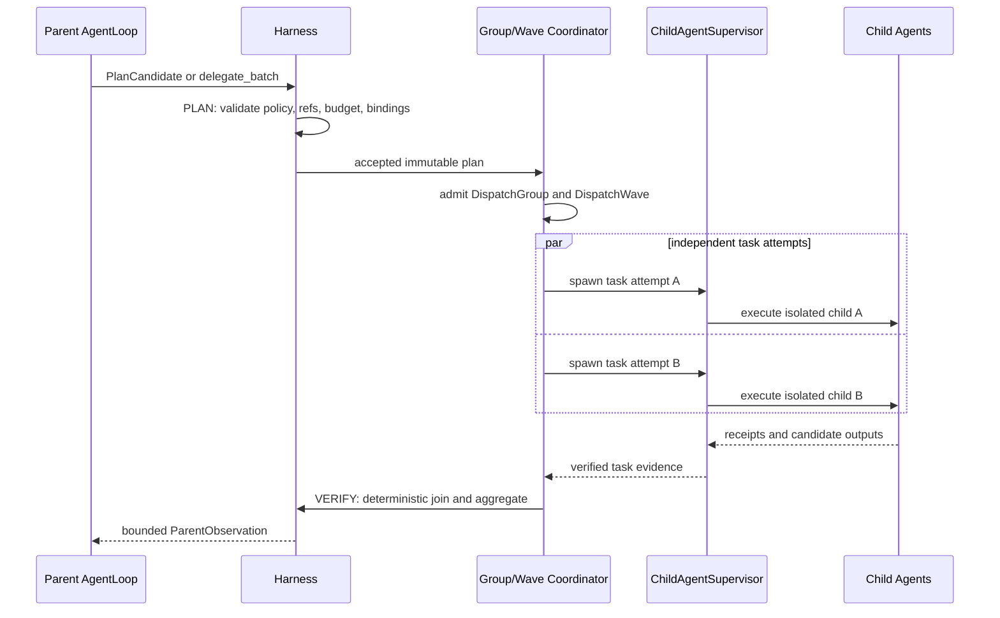

# PRD: Codex 式动态规划与并行子 Agent 编排

| 项目 | 内容 |
| --- | --- |
| OpenSpec change | `harness-codex-style-parallel-agent-orchestration` |
| 文档状态 | Proposed，作为该 change 的产品需求入口 |
| 适用范围 | 通用 `AgentLoop` 编排能力，以及首个业务 opt-in：Research dynamic analysis |
| 事实边界 | 当前已存在动态 `TaskPlan`、子 Agent 生命周期和 Research dynamic stage；本 PRD 规划的是将它们接成真实并行、可汇聚的生产路径 |
| 规范关系 | 本文定义产品需求；`proposal.md` 定义变更意图，`design.md` 定义架构决策，`specs/` 定义可验证行为，`tasks.md` 定义实施工作 |

## 1. 背景与问题

NewsRoom 已具备动态 `TaskPlan`、子 Agent 运行时、工具执行器和可回放事件流，但这些能力尚未组成一条统一的多 Agent 编排路径：

- `TaskPlanStageRunner` 虽能找出多个 ready task，当前仍可能在同步循环中逐个调用 worker。
- `AgentLoop` 的既有 `delegate` action 一次只委派一个 child，主 Agent 无法在同一轮规划中拆分并并行推进多个独立子任务。
- 子 Agent 的工具、预算、结果验证、重试、取消和恢复缺少以“一个逻辑委派组”为单位的统一 join 语义。

因此，主 Agent 不能以 Codex 式方式完成“提出受限计划 -> Harness 验证 -> 并行委派多个子 Agent -> 汇总可验证结果 -> 继续下一轮推理”的闭环。

### 1.1 已验证的当前基线与目标态

本 PRD 必须区分已在仓库中存在的能力与本变更新增的能力，避免把规划中的并行编排描述成既有事实。

| 领域 | 当前基线 | 本变更的目标态 |
| --- | --- | --- |
| 动态计划 | `TaskPlan` 已能校验候选、冻结 `ValidatedTaskPlan`、按 DAG readiness 调度并持久化事件/检查点 | accepted plan 形成一个可追踪的 `DispatchGroup`，ready task 以一个或多个 `DispatchWave` 实际并发执行 |
| 任务执行 | `TaskPlanStageRunner` 通过单个 `worker_executor`/binding 调用任务 | 引入 Harness-owned coordinator，统一管理并行 admission、波次、join、预算和恢复 |
| 子 Agent | `ChildAgentSupervisor` 已提供 child lifecycle、lease、heartbeat、cancel、receipt 与 recovery 语义 | 每个 admitted task 使用该真实生命周期，不再单独实现第二套并发 worker 管理器 |
| 主 Agent | `AgentLoop` 已能提交受控 action，旧 `delegate` 为单 child 路径 | 新增受限 `delegate_batch` 候选和一个生产 `AgentOrchestrationPort`，一次返回 joined observation |
| Research | `dynamic_analysis_stage` 已是显式 opt-in，固定使用动态分析角色；static 路径仍是默认 | 该 stage 成为首个真实并行的业务验证点，但不能改变 evidence、quality 或 publication 边界 |

现有动态计划的确定性校验、durable event、replay 和 Research 质量链属于本变更必须复用的前提，不是可以被并行实现绕过的历史兼容逻辑。

## 2. 产品目标

在不改变 Harness 控制权边界的前提下，为 NewsRoom 提供受控、可观测、可恢复的动态 fan-out/fan-in 能力。

1. 主 Agent 可在一次 parent turn 中提出多个逻辑子任务候选，并获得一次安全投影后的 joined observation。
2. 当多个任务满足并发条件时，Harness 必须实际并行启动多个 child，而非仅返回多个 ready task 后串行执行。
3. 所有 child 的 worker 绑定、工具权限、预算、生命周期、结果验证、重试与恢复仍由 Harness 决定和记录。
4. 动态 Research analysis 作为首个业务 opt-in，在既有 evidence、quality 和 publication 边界内验证该能力。
5. 运行可以离线 replay，且 replay 不重新调用 live LLM、工具、worker、队列或 publication adapter。

### 2.1 成功定义

本项目的成功不是“可以一次创建多个任务”，而是以下五个性质同时成立：

| 成功维度 | 可观察定义 | 不满足时的判定 |
| --- | --- | --- |
| 真实并发 | 符合资格的两个以上 child 的开始/运行区间存在重叠，并且对应 wave 有 durable admission/dispatch 证据 | ready task 虽多但逐个同步调用，视为未交付 |
| 控制权不外泄 | worker、工具、预算、质量、路由和发布均由 Harness 解析与决定 | child/candidate 可以扩大权限或直接改变控制状态，视为设计失败 |
| 结果可用 | parent 获得一个经过聚合、校验、限流和脱敏的 observation，而非散乱 child 文本 | parent 只能猜测 child 状态，或收到私有上下文，视为未完成 |
| 可恢复 | 崩溃后能通过事件、receipt 和 checkpoint 重建正确 projection，不重复确认过的工作或副作用 | 只能重新跑全部 child，或无法判断副作用状态，视为不可上线 |
| 渐进上线 | 通用 `AgentLoop` 与 Research opt-in 均有真实生产组合、feature flag、观测和回滚路径 | 只有测试 fake 路径，或直接替换 static Research 默认链路，视为不可上线 |

## 3. 非目标

- 不允许 LLM 或 child Agent 直接决定 workflow routing、quality pass/fail、memory promotion、tool authorization 或 artifact publication。
- 不实现跨进程分布式 scheduler、自动扩缩容或 exactly-once transport。
- 不引入第二套 workflow engine、queue 或 child lifecycle。
- 不把动态 Research stage 变成可任意改写外层 Graph 的 agent。
- 不改变 static Research workflow 作为默认路径的事实。

## 4. 目标用户与使用场景

| 用户/系统 | 需求 | 预期结果 |
| --- | --- | --- |
| 主 Agent | 将一个复杂目标拆为独立子目标 | 提交受限候选，收到一次汇总后的 observation |
| Harness | 控制并行执行与风险边界 | 验证、授权、派发、验证和汇聚均可审计 |
| Research dynamic stage | 并行产出结构、贡献、实验分析 | 在角色齐全且通过既有 gate 后得到 `analysis_branch_refs` |
| 运维与审计 | 追踪并恢复异常运行 | 按 group/wave/attempt 查看事件、预算、结果和恢复证据 |

### 4.1 关键用户旅程

#### 旅程 A：主 Agent 拆分独立任务并继续推理

1. parent `AgentLoop` 针对当前目标生成一个 `delegate_batch` candidate，例如“分析论文结构、贡献和实验”。
2. Harness 先验证 candidate 的 schema、依赖、输入 refs、角色、capability、预算和权限，拒绝任何控制字段。
3. Harness 创建 immutable plan 与 `DispatchGroup`，并为当前 ready 且可并发的任务创建首个 `DispatchWave`。
4. 多个 child 在各自隔离的 context、工具和 memory boundary 内运行；每项结果先走确定性验证。
5. coordinator 按稳定 task order join 结果，生成 aggregate ref/checksum，并把受限 observation 回传给 parent。
6. parent 只能基于该 observation 生成下一轮候选；不能把 child 输出直接视为路由、质量或发布指令。

#### 旅程 B：容量受限时分多 wave 完成同一逻辑委派

1. plan 有三个互相独立的 ready task，但 policy 或 supervisor 只允许同时运行两个。
2. Harness 在同一个 group 中为前两个任务创建 wave 1；第三项保持 durable READY，不创建 child。
3. wave 1 的 terminal receipt 和 reservation 结算完成后，coordinator 为第三项创建 wave 2。
4. group 只在所有 required task 按 join policy 到达终态后汇聚；wave 数量变化不得改变 parent 的逻辑 join 范围。

#### 旅程 C：规划前需要一个外部只读事实

1. planner 不能直接调用工具，而是请求一个 policy allowlisted 的 planning observation。
2. Harness 为观察请求绑定 `run_id`、`stage_id`、`planner_turn_id`、policy checksum、预算和超时，执行只读工具并持久化 receipt。
3. planner 只能从 receipt 的 immutable refs 引用事实来生成 `PlanCandidate`。
4. receipt 缺失、超时、超预算、返回结构不合法或工具不在 allowlist 时，Harness 给出稳定诊断；不允许 planner 用猜测结果绕过验证。

#### 旅程 D：一个 required child 最终失败

1. Harness 按 task policy 进行有界 retry，并保持每次 attempt 的独立 receipt。
2. retry 耗尽后，只有 policy 明确允许时才能创建受限 `PlanPatch`；replan 必须产生新 plan version 和新 group。
3. 若 Research 的 required role 在 `wait_all` 下仍失败，则返回 typed partial-failure outcome，不生成 `analysis_branch_refs`，也不进入 quality 或 publication。
4. 已完成 sibling 的结果仅可作为诊断或 policy 明确允许的复用证据，不能因为某一项失败而被静默发布。

## 5. 核心产品概念

### 5.1 `PlanCandidate` 与 `delegate_batch`

主 Agent 只能生成候选，而不能直接生成已授权的执行请求。候选中的每个子任务必须包含稳定 task identity、逻辑目标、capability hint、输入 refs、输出角色和依赖 refs。候选中的并发提示只表达意图，不得扩大 policy 上限或授予权限。

`AgentLoop` 支持版本化 `delegate_batch`，但只负责解析和提交候选；它不得创建线程、选择具体 worker、授予工具、改变工作流状态或判断结果质量。

### 5.2 `DispatchGroup` 与 `DispatchWave`

| 概念 | 定义 | 生命周期职责 |
| --- | --- | --- |
| `DispatchGroup` | 一个 accepted plan version 的完整逻辑 join 范围 | 固定成员、required roles、总预算 envelope、join policy、aggregate 和 parent continuation |
| `DispatchWave` | 在当前 readiness 与 capacity 下实际启动的一批 task | 保存本轮 task、capacity/budget reservation、wave ordinal 和派发证据 |

一个 group 可以包含尚未 ready 的依赖任务。因依赖或容量不能立即执行的任务必须留在同一 group，后续以新的 wave 派发；不得隐式创建新的 join 范围。

### 5.3 `TaskAttempt`、receipt 与结果证据

`TaskAttempt` 是同一 logical task 的一次物理执行，必须带有 plan version、group id、wave id、task instance id、attempt number、worker binding、预算快照和 correlation id。subagent attempt 还必须持有一个可读、可校验、唯一的 durable receipt，其中包含 transcript ref/checksum、candidate output ref/checksum 与终态证据。

任务“返回了文本”不等于任务成功。只有结果 identity、binding、receipt、输出 schema、工具/内存使用和所需 deterministic gates 都通过后，Harness 才能提交 accepted `TaskResultRecord`。

### 5.4 `ParentObservation`

`ParentObservation` 是 group 完成或失败后唯一允许交给 parent 的结果投影。它必须包含可继续推理所需的稳定摘要和 ref，而不包含 child 的原始隐藏提示、私有 transcript、secret、未授权工具 payload 或控制字段。它不是新的控制通道，不能让 parent 绕过下一轮候选验证。



## 6. 功能需求

### FR-1：受控动态规划

- Harness 必须验证 `PlanCandidate` 或 `delegate_batch`，包括依赖闭包、输入 refs、角色冲突、capability binding、工具/内存 allowlist、预算和 policy checksum。
- 候选不得包含或扩大 routing、quality、publication、memory promotion、worker implementation 或 tool authorization 等控制权。
- Planner 如需外部事实，只能走 `PlanningObservationRequest -> PlanningObservationReceipt -> PlanCandidate(source_observation_refs) -> candidate validation` 链路。
- Planning observation 默认拒绝；只有 policy 显式允许的只读工具可调用，并受工具次数、超时和预算限制。

#### FR-1a：候选输入与禁止字段

| 对象 | Harness 必须接受并验证的字段 | 候选不得拥有的字段或权限 |
| --- | --- | --- |
| `delegate_batch` | action version、action correlation id、逻辑子任务列表、依赖、输出角色和可选并发意图 | concrete worker ref、queue/thread 选择、policy 修改、tool grant、budget 上调、quality/publication 决定 |
| logical child task | stable logical task id、objective、capability hint、authorized input refs、output roles、dependency refs | sibling 私有 history、隐藏提示、任意 memory namespace、未声明 side effect、直接写入 parent state |
| planning observation request | tool purpose、allowlisted tool name、结构化输入、planning correlation id | side-effect tool、发布、审批、route 变更、memory promotion、以工具返回值直接宣告质量通过 |
| `PlanPatch` | patch version、原因、受影响的 task、policy 允许的 patch operation | 修改 outer Graph、已接受 policy/gate、已完成 task 的 identity 或历史 evidence |

Harness 对每个候选必须产生一个明确的结果：`accepted`、`rejected`、`deferred` 或 `halted`。拒绝和暂停必须带稳定、可投影的 reason code；不得因 JSON 结构、capability 或权限不完整而猜测默认行为。

#### FR-1b：规划观察的因果完整性

planning observation receipt 必须先于使用它的 candidate durable 落盘。receipt 的最小关联维度为 `run_id`、`stage_id`、`planner_turn_id`、policy checksum 和 planning correlation id。candidate 只保存 immutable `source_observation_refs`，不内联未受控的原始工具 payload。

如果某个 candidate 引用了不存在、过期、属于其他 run/stage，或 checksum 不匹配的 observation ref，Harness 必须在 plan acceptance 前拒绝该 candidate。replay 只能读取已经记录的 receipt，不得再次请求工具。

### FR-2：真实并行委派

- 当两个或以上 ready task 独立、并发安全、完成 reservation、`effective_parallelism >= 2` 且未选择 `serial_fallback` 时，Harness 必须并发启动 child attempts。
- `effective_parallelism` 必须取 stage policy、capability capacity、`ChildAgentSupervisor` capacity 和可用 concurrency reservation 的最小值。
- 不得把 token 或 cost 数值直接当作 worker 数量。
- 只有 side-effect fence、有效 capacity 为 1，或 policy 明确启用 `serial_fallback` 时才能串行；每次串行降级必须记录 `DEGRADED_SERIAL` 和稳定原因。

#### FR-2a：并发资格判定表

任何一个条件不满足，task 都不得进入当前 parallel wave。Harness 必须保留判定证据，而不是只保存一个布尔结果。

| 判定维度 | 必须满足的条件 | 不满足时的行为 |
| --- | --- | --- |
| 依赖 | 所有 required predecessor 都已有 durable accepted result；input refs 可解析 | 保持 `PENDING` 或 `READY`，不得抢跑 |
| 计划与绑定 | task 属于 accepted plan/group，capability binding 唯一、pinned 且仍有效 | 在 admission 前 reject/halt；不得选择任意 fallback worker |
| 预算 | group envelope 未超限，task 的标准化预算可原子 reservation | 不创建 child；按预算耗尽策略处理 |
| 容量 | stage、capability、supervisor 和 concurrency reservation 都给出有效容量 | 缺少容量信息 fail closed；容量不足时留到后续 wave |
| 副作用 | side-effect class 和 `resource_conflict_key` 允许与本 wave 其他 task 共存 | 串行、使用 deterministic fence，或拒绝本次并发 admission |
| 运行环境 | production wave adapter、supervisor、durable store 与 verifier 可用 | 仅当 policy 明确允许时走 observable `serial_fallback`，否则返回 unavailable/halted |

`effective_parallelism` 的计算为：

```text
min(stage.max_parallelism,
    capability_capacity,
    child_supervisor_capacity,
    available_concurrency_reservations)
```

这个值是当前 wave 的硬上限。候选提示、child 自报、队列容量或 token 预算都不得把它提高。

#### FR-2b：副作用分类

| side-effect class | 默认并发规则 | 例外要求 |
| --- | --- | --- |
| `READ_ONLY` | 可以与其他无冲突只读 task 并发 | 仍需通过输入、容量、预算和工具 allowlist 检查 |
| `EXTERNAL_IDEMPOTENT` | 可由 policy 允许并发 | 必须有可验证 idempotency/receipt，并按 resource conflict key 隔离 |
| `MUTATING_SERIAL` | 不得与冲突写入并发 | 只能按稳定顺序串行派发 |
| `FENCED_MUTATION` | 只有持有 policy 指定 deterministic fence 时可执行 | fence 缺失、失效或不能恢复时必须 fail closed |

### FR-3：group/wave admission 与预算

- Harness 必须在 child 启动前完成 durable group admission；admission 固定 group 成员、join scope、policy checksum 和总预算 envelope。
- Group admission 只锁定总预算上限，不重复消费逐任务预算。
- 每个 wave admission 必须原子预留 task identity、capacity 和标准化预算，并以 `RESERVED -> CONSUMED | RELEASED` 结算。
- 重试、取消、失败和恢复必须幂等地释放或消费 reservation，不能重复扣费或重复占用 capacity。

#### FR-3a：admission 顺序与不可变性

1. Harness 从 immutable plan 计算完整 dependency closure、required roles、稳定 task order 和总预算 envelope。
2. coordinator 创建 `DispatchGroup`，并通过 durable `TASK_GROUP_ADMITTED` 固化 group membership、join policy、policy checksum、deadline 与 correlation id。
3. 只有当前 ready、并发资格通过且资源可预留的 task 才能进入新的 `DispatchWave`。
4. `TASK_WAVE_ADMITTED` 必须先于任何 child spawn；wave 中每个 task 的 capacity/budget reservation 都使用可重试的幂等 key。
5. 已 admission 的 group membership 不得被 child 输出、队列顺序或后续 LLM 文本修改。允许的 replan 必须创建新 plan version/new group，而不是改写旧 group。

#### FR-3b：预算与 reservation 规则

| 状态 | 含义 | 允许的后继 |
| --- | --- | --- |
| `RESERVED` | 已占用 task 的预算和 capacity，但 child 未必已完成 | `CONSUMED` 或 `RELEASED` |
| `CONSUMED` | 已确认应由该 attempt 消费的资源 | 不得再次扣除 |
| `RELEASED` | 因取消、失败、回收或未派发而释放 | 不得被同一 reservation key 再次消费 |

group admission 锁定总 envelope，wave admission 才消耗逐 task reservation。恢复时必须先读取 reservation ledger 和已有 receipt，防止在“已扣资源但缺事件”或“事件存在但未启动 child”两种情况下重复扣费或重复调度。

### FR-4：子 Agent 执行与工具边界

- 每个 admitted task 必须通过已有 `ChildAgentSupervisor` 创建独立 child attempt，并复用 lease、heartbeat、cancel、close 和 reclaim 语义。
- 每个 child 的 context、tool allowlist、memory namespace、预算、transcript 和 attempt identity 必须隔离。
- Child 工具调用复用 `ToolExecutor`/`ToolBatchExecutor`，并持久化归属于对应 child attempt 的 receipt 和 checksum。
- Child 输出只是候选证据，必须通过输出 schema、确定性 gate、工具/内存使用和 receipt 验证后才可成为 accepted result。

#### FR-4a：child 输入、输出与证据边界

| 阶段 | child 可以接收或产生的内容 | Harness 必须执行的控制 |
| --- | --- | --- |
| spawn | policy-approved input refs、任务 objective、绑定后的 capability、允许的工具/内存 namespace、预算和 attempt identity | 不复制 parent 隐藏提示或 sibling 私有 history；拒绝未授权 refs |
| execute | 受 allowlist 控制的工具调用和 candidate output | 每次工具调用归属当前 attempt，持久化 receipt，受预算与 idempotency 约束 |
| return | structured candidate output、transcript/output refs、terminal receipt | 验证 group/wave/task/attempt identity、worker binding、schema、gate、receipt 与 checksum |
| accepted result | 经过验证的 `TaskResultRecord` 和可读 result ref | 只有 Harness 才能提交成功/失败/停止终态，并解锁 downstream readiness |

非 subagent task 不必伪造 transcript evidence；但任何已声明为 subagent 的成功或失败结果，都必须有对应的 durable receipt。缺失、损坏、归属不匹配或重复的 receipt 必须导致受控拒绝或 indeterminate，而不是被当作成功。

### FR-5：确定性 fan-in 与 parent observation

- Group join 和聚合必须依据 plan 中稳定 task order，而不能依赖 child 完成时间、线程顺序或队列顺序。
- 聚合必须验证 required roles、输出冲突、schema 和既有确定性 gate；所有 child terminal 不等于 group 成功。
- Parent 只能收到一个安全投影后的 joined observation，其中包括 group 状态、wave 摘要、稳定 task summaries、refs/checksums、gate diagnostics 和预算/恢复信息。
- `ParentObservationLimits` 必须限制 summaries 数量、summary 字节数、diagnostics、refs 和 observation 总字节数；超限内容只能提供 checksum-bound artifact ref。
- 禁止把 hidden prompt、sibling 私有 transcript、secret 或未经授权的原始工具 payload 返回给 parent。

#### FR-5a：group join 与聚合规则

1. coordinator 只在 group 的 join policy 条件满足、deadline 到达或 group 已关闭时进入 `JOINING`。
2. 聚合器从所有 wave 的 accepted task results 中按 plan 的稳定 task order 读取结果，而不是按 receipt 到达顺序读取。
3. 聚合器验证 required output roles、角色唯一性/声明的 merge contract、输出 schema、gate evidence 和 aggregate checksum。
4. 所有条件通过后才写入一个 aggregate ref/checksum 并发布 `SUCCEEDED`；任一 required role 缺失、冲突或证据损坏时产生 typed failure outcome。
5. 子任务的完成顺序变化不得改变 aggregate 内容或 checksum。若输入证据相同，replay 必须产生同一投影。

#### FR-5b：`ParentObservation` 的字段与投影规则

| 分类 | 必须可见给 parent 的受限信息 | 必须隐藏或仅以 ref 表示的信息 |
| --- | --- | --- |
| 运行身份 | `run_id`、stage id、plan version、group id、join status、correlation id | sibling 内部 queue/thread 实现细节 |
| 任务摘要 | 稳定 task id、受控状态、approved output role、受限 summary、result/aggregate refs 与 checksums | child 原始推理、hidden prompt、完整私有 transcript |
| 诊断 | stable reason code、gate/recovery 摘要、retry/replan/cancel 事实 | secrets、原始工具响应、敏感 provider exception payload |
| 资源事实 | requested/effective parallelism、预算使用/释放摘要、降级原因 | 未授权的其他 run、其他 tenant 或 sibling 私有资源信息 |

默认 `ParentObservationLimits` 为：`max_task_summaries=8`、`max_summary_bytes=2048`、`max_diagnostics=16`、`max_refs=16`、`max_observation_bytes=16384`。超限时，Harness 必须保持核心状态与 checksum 可见，将详细内容收敛为 checksum-bound artifact ref；不得截断成可能误导 parent 的半条控制信息。

#### FR-5c：parent continuation 规则

parent 收到 observation 后可以提出下一轮候选，但不能视 observation 为对外部副作用、质量通过或路由跳转的直接授权。所有后续动作仍经过 `AgentLoop` action parser、Harness policy、预算和 deterministic gate。group 成功只说明该逻辑委派成功，不自动等价于外层 Graph 或 Research run 成功。

### FR-6：失败、重试、replan 与恢复

- 每个 group 必须固定 `wait_all` 或 policy 注册的 `fail_fast` join policy，以及 group deadline、join wait 上限和 wave 上限。
- `wait_all` 必须等待所有必要任务到达终态后再聚合；Research dynamic 固定使用该策略。
- `fail_fast` 必须按“记录失败 -> 关闭 admission -> 取消 sibling -> 等待取消 receipt 或 lease expiry -> 隔离迟到 receipt -> 记录单一终态”执行。
- 达到 `max_task_attempts` 后只能进行 policy 明确允许的 replan。`ADD_REPLACEMENT_TASK` 只能替换 terminal failed task；`SKIP_PENDING_TASK` 和 `UPDATE_PENDING_DEPENDENCY` 只能作用于尚未进入任何 wave 的 task。
- 每次 replan 必须产生新的 plan version、`DispatchGroup` 和 correlation id；旧 group 的迟到结果不得写入新 projection。
- 缺少或损坏关键证据时必须 fail closed，不能猜测结果、静默切回 static workflow 或发布部分产物。

#### FR-6a：join policy 的产品语义

| policy | 适用场景 | 成功条件 | 不可恢复失败时的行为 |
| --- | --- | --- |
| `wait_all` | 需要完整角色集合的 Research dynamic analysis | 所有 required task 已终态，且 required roles/gates/aggregation 完整 | 保留完成 sibling 的诊断证据，等待必要终态后返回 typed partial failure；不发布 aggregate success |
| `fail_fast` | policy 明确允许且后续等待无业务价值的通用委派 | 所有必需结果通过并聚合 | 关闭 group admission、请求取消 pending/running sibling、等待 cancel receipt 或 lease expiry，并以单一 group outcome 结束 |

`fail_fast` 不是 LLM 可以自由选择的候选字段。它必须由 registry/policy 固定；Research dynamic 不得使用它。

#### FR-6b：异常与恢复矩阵

| 事件 | Harness 行为 | parent 可见结果 | 明确禁止 |
| --- | --- | --- | --- |
| candidate schema/权限/依赖无效 | 在 group admission 前 reject，并持久化稳定 reason | rejected diagnostic | 创建 child、隐式修复候选、选择任意 worker |
| 无可用 capacity 或 reservation | 不创建 child；保留 READY 或按 policy 返回资源不足 | waiting/deferred 或 typed exhaustion | 把资源不足伪装成并发成功 |
| wave adapter/supervisor 缺失 | fail closed；只有显式 `serial_fallback` 才可降级 | unavailable 或 `DEGRADED_SERIAL` | 静默串行执行 |
| child retryable failure | 在 `max_task_attempts` 内按 task policy 创建新 attempt | retrying/最终 outcome 摘要 | 无界重试 |
| retry 耗尽且 replan 被允许 | 校验受限 patch，创建新 plan version/new group | superseded old group 与新 group correlation | 在旧 group 中追加替换 task 或改写完成 evidence |
| receipt 缺失/不匹配 | 读取 durable store，必要时按 lease 标记 indeterminate/reclaim | sanitized indeterminate/recovery diagnostic | 把无证据结果视为 accepted |
| cancel 未确认或 lease 到期 | 保留审计证据，按 pinned recovery policy 回收或标记 indeterminate | cancel/reclaim diagnostic | 立即重派可能仍在运行的 non-idempotent task |
| replay 证据损坏 | 以 typed history diagnostic fail closed | halted/replay failure | 调用 live LLM、工具、worker 或发布 adapter 填补历史 |

#### FR-6c：副作用的 at-least-once 边界

本变更不承诺跨进程 exactly-once。它要求：已确认的副作用 receipt 不得重放；不确定的非幂等副作用必须 fail closed；只有 policy、idempotency key 与 durable evidence 都允许时才可 reclaim/retry。任何“不知道上次是否已经写入”的情况都不能被自动当作安全重试。

### FR-7：持久化、检查与 replay

- 运行必须记录 candidate、validation、group/wave admission、dispatch、child lifecycle、retry、join、aggregation、verification、cancel、reclaim 和 halt 等规范事件。
- Checkpoint 必须包含 plan/group/wave identity、policy checksum、task projection、reservation、attempt evidence、aggregate checksum 和 event sequence。
- 重启恢复应优先读取并校验已有 receipt、result artifact 和 projection，只补写缺失 transition；不得因为事件缺失重新执行已确认的 child 或外部副作用。
- Offline replay 必须只使用持久化的候选、计划、tool receipt、child receipt 和 aggregate evidence，不得调用 live dependencies。

#### FR-7a：规范事件与 ownership

| 转换/事实 | 规范事件 | 唯一 owner | 幂等与恢复要求 |
| --- | --- | --- | --- |
| group 被接纳 | `TASK_GROUP_ADMITTED` | `TaskPlanBatchCoordinator` | 以 group id + plan version + correlation id 去重；事件缺失时可由已持久 plan 补写 |
| wave 被接纳/派发 | `TASK_WAVE_ADMITTED`、`TASK_WAVE_DISPATCHED` | `TaskPlanBatchCoordinator` | 以 group id + wave ordinal 去重；不得生成第二个同 ordinal wave |
| child 生命周期 | spawn/start/receipt/result/terminal/cancel/retry/reclaim events | `ChildAgentSupervisor` 与对应 runtime | 每个事件可回溯至 group/wave/task/attempt，receipt 必须可读可验 |
| group 等待/完成 | `TASK_GROUP_JOIN_WAITING`、`TASK_GROUP_JOINED` | coordinator 与 deterministic aggregator | join 前不得发布 aggregate success；aggregate 可由相同 evidence 重建 |
| replan/终态 | `TASK_GROUP_REPLAN_PENDING`、`TASK_GROUP_SUPERSEDED`、failure/cancel/halt events | replan coordinator / coordinator | 新 group accepted 后旧 group 才能 `SUPERSEDED`；迟到 receipt 进入 quarantine/audit |

每个事件 payload 至少关联 `run_id`、`stage_id`、`plan_id`、`plan_version`、`group_id`、适用时的 `wave_id`、`task_instance_id`、attempt、correlation id 与 idempotency key。缺少这些关联信息的事件不得作为 replay 的控制事实。

#### FR-7b：检查点、重放和人工检查

运行检查界面或诊断投影必须能按 group/wave/attempt 回答四个问题：当前是否已 admission、哪些 task 正在运行/等待、每个资源 reservation 是否已正确结算、当前 outcome 由哪些 receipts/gates 支撑。检查投影不得暴露 private prompt 或原始敏感工具 payload。

replay 必须可证明没有 live dependency 调用。测试应使用会失败的 fake LLM/tool/worker/queue adapter，确保一旦有 live 调用便立即暴露；仅比较最终状态不足以证明 replay 安全。

### FR-8：生产组合、开关与兼容性

- 通用 `AgentLoop` 的 `delegate_batch` 必须通过真实 `AgentOrchestrationPort` 连接 Harness；缺少绑定时返回稳定 unavailable/deferred 结果，不得创建 ad hoc executor。
- production composition 必须解析真实 group/wave coordinator、worker registry、`ChildAgentSupervisor`、durable event/run store、artifact verifier 和 authorized tool ports；fake worker、fake LLM 和 in-memory store 仅限显式测试 composition。
- feature flag 必须独立可观测，并区分“功能未启用”“所需依赖不可用”“明确策略降级为串行”三种情况。
- 旧单 child `delegate` 必须经 one-task group/wave compatibility adapter 保持语义兼容；这不代表旧 executor 自动获得多 child 并行权限。
- 任何默认切换前，static Research 仍是默认路径，且动态路径必须有测试、telemetry、replay evidence 与明确 rollback 方案。

## 7. 状态与责任边界

`DispatchGroup` 状态为：`PLANNED -> ADMITTED -> DISPATCHING -> RUNNING -> JOINING -> SUCCEEDED | FAILED | CANCELLED | INDETERMINATE | HALTED | SUPERSEDED`。`REPLAN_PENDING` 仅是 coordinator 内部非终态诊断，不得作为 parent 最终结果。

`DispatchWave` 状态为：`PLANNED -> ADMITTED -> DISPATCHING -> RUNNING -> TERMINAL`。

每个状态转换必须具有唯一 owner、规范事件名、幂等 key、允许后继状态和恢复行为。Harness 是唯一的 fan-out/fan-in coordinator；LLM 和 child Agent 只产生候选或受限结果。

## 8. Research 动态分析接入

Research dynamic analysis 是首个生产 opt-in，必须遵守以下边界：

- 仅消费已通过 gate 的 `document` 和 `evidence_pack` refs。
- 仅允许 policy 批准的 `analysis.structure`、`analysis.contribution`、`analysis.experiments` 及受控辅助角色。
- 每项结果仍须通过现有 Research deterministic gates。
- 只有 group join 后角色完整，才能确定性生成 `analysis_branch_refs`。
- 后续固定路径保持为 `verify_claims -> ResearchQualityGate@1 -> reader/card -> publication`。
- 不允许动态任务创建 publication、quality verdict、memory promotion 或 outer-Graph routing task。

## 9. 非功能需求

| 类别 | 要求 |
| --- | --- |
| 安全 | 默认拒绝未授权 capability、工具、内存、控制字段和 planning tool；隔离 sibling 私有上下文 |
| 一致性 | 聚合顺序稳定；结果 checksum 不受 child 完成顺序影响 |
| 可观测性 | 记录 requested/effective parallelism、queue/wait/run/join duration、预算、retry/replan、recovery 和 `DEGRADED_SERIAL` |
| 有界性 | 默认限制 task 数、wave 数、并行度、attempt、replan、group runtime、join wait、planning 工具次数和 observation 大小 |
| 兼容性 | 旧单 child `delegate` 经单 task group/wave compatibility adapter 继续可用 |
| 生产性 | 通用 `AgentLoop` orchestration port 必须走真实 composition；fake worker、fake LLM 和 in-memory store 仅限测试 |

### 9.1 性能与容量口径

本变更优化的目标是受控降低 wall-clock latency，而不是无限增加并发。性能比较必须在相同输入、provider、模型、预算、工具集合和 gate 配置下进行，并同时报告以下指标：

| 指标 | 计算口径 | 解释 |
| --- | --- | --- |
| requested parallelism | candidate/plan 请求的并行意图或 task 数 | 仅表示需求，不是授权值 |
| effective parallelism | 本 wave 实际可用上限的最小值 | 由 policy、capability、supervisor 和 reservation 共同决定 |
| overlap ratio | 并行 eligible child 的运行区间重叠比例 | 证明是否发生真实并发；不能用 task 数替代 |
| queue/wait duration | 从 ready/admission 到 child start 的时间 | 识别容量或 reservation 瓶颈 |
| run duration | child start 到 terminal receipt 的时间 | 观察 worker/runtime 执行成本 |
| join duration | 最后一个必要 child terminal 到 aggregate outcome 的时间 | 识别 join/验证/聚合开销 |
| group duration | group admission 到最终 group outcome 的时间 | 用于 `max_group_runtime_seconds` 与 SLO 评估 |
| budget utilization | reserved、consumed、released 与未结算余额 | 识别重复扣费、泄漏和过度 reservation |

PRD 不预设脱离实际 workload 的绝对加速倍数。上线门槛是：并发场景证明 overlap，串行/降级场景有原因，预算和错误率不因并发路径失控。

### 9.2 安全、隐私与租户隔离

- 每个 child 的 context、memory namespace、tool allowlist、artifact refs 和 transcript 必须以 run/stage/task/attempt 维度隔离。
- parent observation 只能暴露当前 parent 被授权查看的 projection；不得因 group join 把 sibling 私有上下文汇总进来。
- 日志、metrics、diagnostics 和 replay artifact 必须遵守现有 redaction 与 secret policy；reason code 可见不等于原始 exception 可见。
- 任何跨 run、stage、tenant 或 parent 的 ref 解析失败都必须 fail closed，并留下可审计但脱敏的诊断。

### 9.3 可用性与运营要求

- coordinator、supervisor、durable store、artifact verifier 和 tool ports 的缺失或异常必须能在入口处被探测，返回稳定 unavailable/deferred/halted 分类。
- metrics 至少按 `run_id`、stage、group、wave、capability 和 outcome 维度可关联，但不记录 raw prompt。
- 运维应能区分：尚未 ready、等待 capacity、child 执行中、等待 join、重试中、replan 中、取消等待、indeterminate、已降级串行和最终失败。
- 任何自动回收、quarantine 或 recovery 都必须保留原始 group/attempt 关联，支持事后审计。

## 10. 验收标准

1. 通用 `AgentLoop` 能在一个 parent turn 提交至少两个独立 child proposals，并经 production `AgentOrchestrationPort` 获得一个 joined observation。
2. 在满足并发条件时，集成测试能证明至少两个 child 的执行时间真实重叠，而非串行调用。
3. capacity 不足时，任务以稳定 READY 顺序分入后续 wave，并在同一 `DispatchGroup` 内完成 join。
4. 子 Agent 无法选择 worker、扩大工具权限、修改路由、发布产物、提升 memory 或影响 sibling 私有上下文。
5. partial failure、retry exhaustion、replan、cancel、lease expiry 和 crash recovery 都产生受控、可审计的 group outcome。
6. replay 可重建相同 plan/group/wave/task/aggregate projection，并证明没有 live LLM、工具、worker、队列或 publication 调用。
7. Research dynamic 在所有 required role 和既有 gate 成功后才生成 `analysis_branch_refs`；失败时不进入 quality 或 publication。
8. static Research workflow 仍保持默认路径，dynamic Research 仅在 feature flag 和生产依赖校验全部通过后 opt-in。

### 10.1 验收证据矩阵

| 验收项 | 必须提供的证据 | 通过条件 |
| --- | --- | --- |
| 候选约束 | parser/validator 测试、拒绝 reason code、禁止字段案例 | 非法字段、越权 refs、重复 task、依赖环和 output collision 全部被拒绝 |
| 真实并发 | fake supervisor/worker 时间戳或 barrier 证据、wave 事件 | 两个 eligible child 的运行区间真实重叠；上限不被突破 |
| 多 wave | capacity=2、3 tasks fixture 的 group/wave event history | wave 2 复用同一 group，READY 顺序稳定，join 只发生一次 |
| 结果完整性 | task result、receipt、gate 和 aggregate checksum fixture | 缺角色、冲突角色、stale/mismatch receipt 均不产生成功 aggregate |
| parent 脱敏 | observation schema/size/redaction 测试 | summary、diagnostics、refs 受限；hidden/private/raw payload 不泄漏 |
| 工具边界 | planning 与 child tool allowlist、预算和 receipt 测试 | 未授权工具在执行前拒绝；工具结果不能改变 routing/quality/publication |
| 失败恢复 | retry、cancel、lease expiry、crash reconciliation fixture | 不重复已确认副作用；不确定副作用 fail closed；状态可重建 |
| replay 安全 | 禁止 live dependency 的 spy/fake adapter、golden event history | replay 只读 durable evidence，projection/checksum 与原运行一致 |
| Research 回归 | dynamic/static workflow integration 与 publication regression | required roles/gates 全通过才继续；static 默认不变 |
| 生产接线 | real composition smoke、missing dependency matrix、feature flag telemetry | fake 仅存在于测试；缺依赖分类稳定；回滚不改写已接受 plan |

### 10.2 必测场景清单

至少需要以下自动化场景，且每项都应断言状态、事件、结果 refs/checksums 与 side-effect 计数，而不仅断言返回字符串：

1. 两个独立只读 child 并发成功。
2. 三个独立 child 在 `max_parallelism=2` 下跨两个 wave 成功。
3. 存在依赖边时，后继 task 只能在 predecessor accepted result durable 后启动。
4. 一个 task 的 `resource_conflict_key` 冲突，验证串行或拒绝，而不是并行写入。
5. 一个 child 失败、另一个 child 成功，`wait_all` 返回 typed partial failure。
6. `fail_fast` 关闭 admission 并等待 sibling cancel/lease evidence。
7. retry 达到上限，合法 replacement replan 创建新 group，非法 patch 被拒绝。
8. group admission、receipt commit、result event 或 join event 之后发生 crash，恢复不重复 spawn/工具/副作用。
9. parent observation 超过 summary、diagnostic、ref 或总字节上限，详细内容仅以 ref 表示。
10. planning tool 返回过期、损坏、越权或超预算 receipt，candidate acceptance fail closed。
11. replay 使用会报错的 live LLM/tool/worker/queue/publication adapter，仍然成功重建历史。
12. Research dynamic 缺任意 required role、gate 或生产 binding，均不得进入 quality/publication。

## 11. 交付与上线顺序

1. 先完成 group/wave schema、policy、状态机、validator、reservation 和 replay 合同。
2. 接入 Harness coordinator 与真实 `ChildAgentSupervisor`，验证 multi-wave join。
3. 完成通用 `AgentLoop` 的 `delegate_batch`、生产端口、parent observation、feature flag 和兼容 adapter。
4. 在 Research dynamic 中接入并行角色任务，运行 publication regression 与 offline replay 验证。
5. 仅在通用 AgentLoop smoke、Research parity、telemetry 和 replay evidence 全部通过后启用动态 Research opt-in；static 路径继续保留为默认。

### 11.1 分阶段发布门禁

| 阶段 | 范围 | 开启条件 | 退出/回滚条件 |
| --- | --- | --- | --- |
| P0 合同 | schema、validator、event、reservation、replay fixture | strict OpenSpec、契约测试通过 | 发现 identity/checksum 不一致则停止后续接入 |
| P1 Harness 内部 | coordinator + fake supervisor，多 wave | 并发重叠、容量上限、join 和 recovery 测试通过 | 任意重复 spawn、预算泄漏或错误 join 立即关闭 flag |
| P2 AgentLoop shadow | `delegate_batch` 解析、观测投影、旧 delegate compatibility | production composition smoke、redaction、observation limits 通过 | 缺 binding 或观测泄漏则回退旧单 child |
| P3 Research opt-in | dynamic analysis 真实 worker/supervisor | publication parity、quality boundary、replay 和 telemetry 通过 | dynamic 运行异常只关闭 opt-in，不改写 static 默认 |
| P4 扩大范围 | 更多 capability 或更高并行度 | 按 workload 的 latency/error/budget 数据达标，且有 rollback rehearsal | 任意 side-effect、数据隔离或恢复风险回退至已验证配置 |

### 11.2 Rollback 规则

- 优先关闭 feature flag 或切换显式 `SerialTaskExecutorAdapter`，不删除已写入的 group/wave/receipt/event 证据。
- 已在运行的 group 按其 pinned policy 完成恢复、取消或 typed halt；不得中途静默切换 join policy。
- 回滚后新请求可回到 legacy single-child path，但旧 group 的历史 projection 仍必须可 inspection/replay。
- 回滚原因、影响的 capability/stage、最后一个 accepted plan version 和未结算 reservation 必须进入运营记录。

## 12. 产品范围与优先级

### 12.1 P0 交付范围

P0 是能够被称为 Codex 式并行编排的完整闭环。以下能力缺一不可：

| 能力 | 完成定义 | 不接受的替代 |
| --- | --- | --- |
| 批量规划 | 一个 parent turn 提交两个以上逻辑子任务候选 | 服务端预写固定任务，或每次只接受一个 `delegate` |
| 计划验证 | child 启动前完成 schema、DAG、角色、权限、预算、并发安全和输入 refs 校验 | 先启动再异步补验证 |
| 真实并发 | 并发条件满足时，两个以上 child attempt 的执行区间存在真实重叠 | 只返回多个 ready task 后仍逐个串行调用 |
| 结果汇聚 | 一个 group 产生一个有 checksum 的 aggregate 和一次 parent observation | parent 直接消费 child 原始文本 |
| 失败恢复 | retry、cancel、lease expiry、crash recovery、bounded replan 均有明确终态 | 无限重试、静默跳过或猜测结果 |
| 可回放 | 仅用 durable evidence 重建 projection，禁止触发 live 依赖 | replay 重新调用 LLM、工具或 worker |

### 12.2 P1/P2 后续范围

- P1：跨 run 配额看板、人工暂停/恢复、按 capability 的调度公平性和更丰富的诊断 artifact。
- P2：跨进程或跨机器 transport、持久队列、worker autoscaling、exactly-once 外部副作用协议。
- P1/P2 不得改变本变更的 group/wave identity、状态机、receipt、join 和 replay 语义。

## 13. 角色、权限与责任矩阵

| 角色 | 允许动作 | 禁止动作 | 产生事实 |
| --- | --- | --- | --- |
| Parent `AgentLoop` | 生成 `PlanCandidate`、引用 planning receipt、基于 observation 继续推理 | 选择具体 worker、授予权限、修改 group 状态、发布 artifact | candidate、turn correlation |
| Planner observation adapter | 调用 allowlisted 只读工具并返回 receipt | 执行副作用工具、创建 child、写 quality verdict | observation receipt、checksum |
| Harness validator | 校验候选、绑定 capability、冻结 plan、计算并发度 | 生成业务结论或替 child 改写内容 | validation result、diagnostics |
| Group/wave coordinator | admission、reservation、dispatch、join、retry、reclaim、terminal transition | 绕过 gate 或改变已接受 plan | group/wave events |
| `ChildAgentSupervisor` | 管理 spawn、lease、heartbeat、cancel、close、reclaim | 改变外层 routing、quality、publication、memory promotion | attempt receipt、lifecycle events |
| Child Agent/worker | 在隔离上下文中产生候选分析和 evidence refs | 访问 sibling 私有上下文、扩权、宣布成功或发布 | candidate output、tool receipts |
| Deterministic gate/aggregator | 验证 schema、证据边界、角色完整性并生成 aggregate | 采纳未验证文本或按完成时间覆盖冲突 | accepted result、aggregate checksum |
| 运维/审计 | 查看安全投影、暂停 feature flag、导出 replay bundle | 直接修改运行中的 plan 或 receipt | inspection record、change audit |

责任原则：LLM/worker 只产生候选，Harness 是唯一控制平面；模型输出的 routing、quality、authorization、memory、publication 字段必须被拒绝或忽略。

## 14. 端到端产品流程

### 14.1 正常路径

1. Parent 读取当前 stage 输入和已有 observation，生成带 `plan_id`、`plan_version`、`parent_turn_id` 的 `delegate_batch`。
2. Harness 检查任务数量、字段边界、依赖闭包、输入 refs、输出 roles、capability binding、side-effect class 和 budget hint。
3. 校验通过后冻结 `ValidatedTaskPlan`，创建不可变 `DispatchGroup`，写入 `TASK_GROUP_ADMITTED`。
4. Coordinator 从 READY 集合按稳定顺序选择 wave，原子预留 capacity、并发 slot 和预算。
5. 通过 `ChildAgentSupervisor` 启动允许的 child attempts；每个 attempt 拥有独立 context、memory namespace、tool allowlist、transcript 和 lease。
6. Child 返回候选输出和 receipt。Harness 校验 identity、schema、证据 refs、工具/内存使用及 deterministic gate，然后标记 accepted 或 typed failure。
7. required tasks 达到终态后，aggregator 按 plan task order join，检查角色完整性、冲突和 aggregate gate，生成 aggregate ref/checksum。
8. Parent 只收到一次 `ParentObservation`，其中包含安全摘要、refs、diagnostics、预算和恢复事实。
9. Parent 可继续生成下一轮 candidate，但不得把 observation 中的诊断字段直接当成 routing 或 quality 指令。

### 14.2 容量不足路径

READY 集合大于有效并发度时，未入当前 wave 的任务保持 durable READY。当前 wave 的 attempt 完成、取消、回收或进入明确终态并结算 reservation 后，才能创建下一 wave。所有 wave 共用同一 group join scope，不能提前汇聚或重新定义 required roles。

### 14.3 失败与恢复路径

失败必须先落事件再做控制动作。`fail_fast` 的取消顺序、`wait_all` 的等待规则、retry 次数、replan patch 类型和 lease expiry reclaim 行为必须从 pinned policy 读取，并且每一步都有 idempotency key。无法确认 child 是否产生外部副作用时，状态必须是 `INDETERMINATE` 或 `HALTED`，不得自动重放。

## 15. 产品数据契约

### 15.1 `delegate_batch` 输入契约

每个 logical task 至少包含以下字段：

| 字段 | 说明 | 校验规则 |
| --- | --- | --- |
| `logical_task_id` | 计划内稳定 identity | 同一 plan 内唯一，不得由执行时间生成 |
| `objective` | 子任务目标 | 非空、长度受 policy 限制，不得携带控制指令 |
| `capability_hint` | 能力提示 | 只能映射到已注册且 allowlisted 的 binding |
| `input_refs` | artifact/evidence refs | 必须可解析，且属于当前 run 或允许的共享范围 |
| `output_role` | 输出角色 | 必须属于 stage role registry；重复 role 要有合并策略 |
| `depends_on` | logical task 依赖 | 必须形成 DAG，不能引用未来 plan 或 sibling 私有 ref |
| `side_effect_class` | 并发安全分类 | 由 Harness/policy 解析，candidate 不能升权 |
| `correlation_id` | 因果追踪标识 | 与 parent turn、group 关联，重放保持不变 |

Candidate 可携带 token/cost 估算作为调度参考，但不得将估算值当作 worker 数量、授权或质量结论。

### 15.2 `ParentObservation` 输出契约

Parent observation 必须是版本化、可校验、可脱敏的结构，至少包含 `run_id`、`stage_id`、`plan_version`、`group_id`、`group_state`；每个 wave 的 id、ordinal、状态和安全摘要；按稳定 task order 的 summary、result ref、checksum、terminal reason；required role 覆盖、aggregate ref/checksum、gate diagnostics；requested/effective parallelism、预算、retry/replan/recovery 计数；以及 `ParentObservationLimits` 的截断信息。

不得包含 hidden prompt、secret、sibling 原始 transcript、未经授权的 tool payload、authorization token 或可直接驱动 Harness 的控制字段。

### 15.3 稳定错误分类

对 parent、运维和 replay 使用稳定 typed reason code，而不是依赖异常文本：

| reason code | 触发条件 | 产品行为 |
| --- | --- | --- |
| `PLAN_SCHEMA_INVALID` | 字段缺失、类型错误、未知控制字段 | 不 admission，不创建 child |
| `PLAN_DEPENDENCY_INVALID` | 环依赖、未来引用、不可解析 ref | 返回诊断，允许 parent 重新规划 |
| `CAPABILITY_UNAVAILABLE` | binding 未注册、版本不兼容、容量不可用 | fail closed，不回退任意 worker |
| `CONCURRENCY_NOT_SAFE` | side effect/resource conflict 不允许并行 | 串行或按 policy halt |
| `BUDGET_EXCEEDED` | group/wave/task reservation 超限 | 保持 READY、拒绝 admission 或 halt |
| `CHILD_TIMEOUT` | attempt 超过 lease/deadline | retry/reclaim 或 `INDETERMINATE` |
| `RESULT_SCHEMA_INVALID` | child 输出不符合 schema | 任务失败，不进入 aggregate |
| `REQUIRED_ROLE_MISSING` | join 缺少必需角色 | group 不成功，不进入 Research 后续 gate |
| `OUTPUT_CONFLICT` | 同一 role/ref 有不可合并输出 | fail closed，保留冲突证据 |
| `REPLAY_LIVE_DEPENDENCY` | replay 试图访问 live 依赖 | 立即拒绝并记录审计事件 |
| `DEGRADED_SERIAL` | policy 明确允许串行降级 | 执行并暴露稳定降级原因 |

## 16. 并发与资源策略

### 16.1 并发判定

Harness 根据依赖、side-effect class 和 `resource_conflict_key` 计算 ready 集合，再计算 `effective_parallelism = min(stage_limit, capability_capacity, supervisor_capacity, available_concurrency_reservation)`。当 ready 至少两个、有效并发度至少 2、每个任务 reservation 成功且未启用 `serial_fallback` 时，必须真实并发启动。并发度不能由 token/cost 估算直接推导，也不能由 child 在运行时提高。

### 16.2 预算 reservation

Group admission 锁定总预算 envelope，wave admission 锁定物理执行 reservation，attempt 结束后以 `CONSUMED` 或 `RELEASED` 结算。重试创建新 attempt reservation；取消、崩溃恢复和 lease reclaim 必须幂等结算。已启动但没有 reservation 记录的 child 视为协议违规并触发 halt。

### 16.3 公平性与背压

本期只保证单 run 内确定性 READY 顺序和 hard capacity 上限，不承诺跨 run 公平调度。超过上限的任务留在同一 group 等待，不得创建隐式 group、绕过 admission 或无限增加 wave。

## 17. 可观测性、审计与数据保留

每个 group/wave/attempt 至少记录 requested/effective parallelism、实际 overlap 证据、queue/admission/wait/run/join/recovery duration、child 状态计数、budget reserved/consumed/released、retry/replan、`DEGRADED_SERIAL`、capacity unavailable、gate failure、replay rejection、aggregate checksum、event sequence 和 projection version。

所有 admission、dispatch、cancel、retry、replan、reclaim、join、halt 和 feature flag 变更都必须可由 `run_id + group_id + correlation_id + idempotency_key` 追溯，且不得包含 secret 或完整私有 prompt。保留期满只能清理 payload，不得留下无法解释的 projection；删除或脱敏必须产生审计事件。

## 18. 安全与隔离要求

- 每个 child 使用最小权限 capability binding、独立 memory namespace 和明确 tool allowlist。
- Parent observation 只允许安全投影摘要和 refs；原始 prompt、secret、sibling transcript 和未授权 payload 永不跨边界。
- Planning observation 默认关闭；打开时只允许只读、可审计、有超时和预算的工具。
- tool receipt 必须绑定 attempt、policy checksum 和 idempotency key；缺失或 checksum 不匹配不得采纳。
- 外部副作用按 `EXTERNAL_IDEMPOTENT`、`MUTATING_SERIAL`、`FENCED_MUTATION` 分类，本期并行默认只覆盖 `READ_ONLY` 和 policy 明确批准类别。
- feature flag、policy registry、worker binding 必须版本化；运行中的 group 使用 pinned 版本。

## 19. 验收测试矩阵

| 场景 | 必须证明 | 证据 |
| --- | --- | --- |
| 两个独立 read-only task | 两个 attempt 时间区间重叠且只产生一次 group join | supervisor 时间戳、dispatch events、aggregate checksum |
| 依赖链 A→B | B 在 A accepted 前不启动 | lifecycle sequence、dependency diagnostics |
| 三任务、并发度二 | wave 1 两任务、wave 2 一任务、group 只 join 一次 | wave ordinal、READY projection、group outcome |
| role 冲突 | 拒绝冲突，不采用 last-writer-wins | `OUTPUT_CONFLICT`、冲突 refs |
| required task 失败 | wait-all 不生成不完整 aggregate | typed failure、缺失 role、无 downstream ref |
| fail-fast 取消 | 关 admission 后取消 sibling，迟到 receipt 被隔离 | cancel/reclaim/quarantine events |
| retry exhaustion + replan | 新 plan version/group，旧结果不写新 projection | plan/group ids、superseded event |
| lease expiry | child 进入 indeterminate 或 bounded reclaim | lease event、recovery outcome |
| crash recovery | 不重复已有 receipt 对应的 child/tool/副作用 | recovery log、调用计数 |
| planning observation | 只读 receipt 可引用，工具失败不能猜测规划 | observation receipt、candidate refs、reason code |
| offline replay | projection 一致且 live dependency 调用为零 | replay checksum、spy counters |
| legacy single delegate | 兼容 adapter 保留旧 `AgentLoopResult` 语义 | compatibility test、旧字段断言 |
| Research dynamic | 三个 required role 通过原有 gates 后才写 `analysis_branch_refs` | gate evidence、publication regression |
| serial fallback | 仅 policy 允许时串行且暴露原因 | inspection/metrics、reason code |

## 20. 上线门禁与回滚

### 20.1 上线前门禁

必须同时满足：strict OpenSpec validation 通过；所有 P0 task 有测试证据；generic `AgentLoop` 使用真实 supervisor、worker registry、event store、artifact verifier；并发 overlap、multi-wave join、failure、replay、legacy compatibility 通过；Research publication parity 和 static regression 通过；指标、审计、告警可查询；feature flag 关闭、serial adapter 和运行中 group recovery 已演练。

### 20.2 分阶段发布

- 阶段 0：schema 和代码默认关闭，只运行 validator/replay。
- 阶段 1：generic AgentLoop 仅在受控测试 run 开启。
- 阶段 2：Research dynamic 只对 allowlisted run opt-in，static 仍是默认。
- 阶段 3：根据稳定性、预算、失败率和 replay evidence 扩大范围，不自动切换默认路径。

### 20.3 回滚

只允许关闭 feature flag 或切换显式 serial adapter。运行中的 group 使用创建时 pinned policy 完成恢复、取消或 halt；不得改写同一 run、重新生成 candidate 或清除证据。

## 21. 固定决策与参数确认

- Research dynamic 固定 `wait_all`，不使用 `fail_fast`。
- 一个逻辑 join 永远对应一个 `DispatchGroup`；capacity 只影响 wave。
- Planning observation 默认拒绝，只有 stage policy 显式 allowlist 才能使用。
- Parent 只接收一次安全投影 observation；child 之间不共享私有上下文。
- Replay 是离线确定性过程，禁止 live LLM、tool、worker、queue 和 publication adapter。
- 跨进程 transport、autoscaling、exactly-once 外部副作用和跨 run 公平性不属于本期。

实现前需由产品/架构负责人确认 stage-specific policy 数值，例如 `max_tasks_per_group`、`max_parallelism`、`max_group_runtime_seconds`、`ParentObservationLimits` 和 capability capacity。没有显式配置时使用 design 中的 bounded defaults，并在 inspection 中显示使用了默认值。

## 22. 关联 OpenSpec 工件（索引）

- `proposal.md`：变更动机、影响面与完成定义。
- `design.md`：架构决策、状态机、预算/容量合同、恢复与上线策略。
- `specs/`：Harness、TaskPlan、AgentLoop 和 Research 的可验证行为要求。
- `tasks.md`：实施任务与验证清单。
